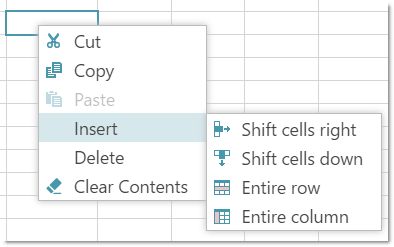
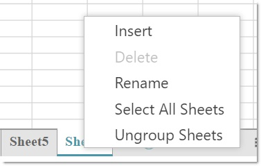

import ApiLink from 'docs-template/components/mdx/ApiLink.astro';

# igSpreadsheet のコンテキスト メニュー
## トピックの概要
### 目的
このトピックでは、コントロールの視覚要素についての概要を紹介します。

### 前提条件
このトピックを理解するために [Infragistics JavaScript Excel Library](../../../09_JavaScript Excel Library/~JavaScript_Excel_Library.mdx) の概念とトピックは前提条件です。

## コンテキスト メニューの概要
`igSpreadsheet` コントロールが提供するコンテキスト メニューは、コントロール要素を右クリックすると表示されます。コンテキスト メニューにより、ユーザーは、右クリックした要素に応じて、異なる操作を実行できます。

以下の `igSpreadsheet` 要素に独自のコンテキスト メニューがあります。

- ワークシートの列または行

- ワークシートのセル

- ワークシートのシート

>**注**: ユーザーが複数のワークシートを選択し、アクティブなワークシートのセルでクリップボード操作を実行した場合、選択されたすべてのワークシートに影響します。切り取り操作は、選択されたすべてのワークシートからクリップボードにセルのコンテンツを移動します。コピー操作は、選択されたすべてのワークシートからセルのコンテンツを複製します。貼り付け操作は選択されたすべてのワークシートの指定されたセルにクリップボードのコンテンツをコピーします。

## ワークシートの列または行のコンテキスト メニュー

ワークシートの列または行のコンテキスト メニューにより以下の操作ができます。

- 選択した列または行でのクリップボード操作を実行

- 行または列またはそのコンテンツの挿入/削除

- 列と行の非表示/非表示解除および自動サイズ設定

以下のスクリーンショットは、ワークシートの列または行のコンテキスト メニューを示しています。

## ワークシートのセルのコンテキスト メニュー

ワークシートのセルのコンテキスト メニューによりユーザーは以下のことができます。

- セルに対するクリップボード操作を実行

- 新しい空のセルを挿入

- セルを削除またはセルのコンテンツのみを削除

>**注:** コンテキスト メニューの読み込みで項目を正しく描画するために jQuery UI バージョン 1.12.0 以後が必要です。

## ワークシートのコンテキスト メニュー

ワークシートのタブ領域のコンテキスト メニューにより、ユーザーは以下を実行できます。

- 新しいワークシートの挿入

- 既存のワークシートの削除

- 既存のワークシートの名前の変更

- すべてのワークシートを選択

- すべてのワークシートを選択解除 (「グループ化解除」メニュー項目)

以下のスクリーンショットは、1 つのワークシートが選択されている場合のワークシートのタブ バー領域のコンテキスト メニューを示しています。

以下のスクリーンショットは、複数のワークシートが選択されている場合のワークシートのタブ バー領域のコンテキスト メニューを示しています。

## 関連リンク

 -   [igSpreadsheet の概要](/igspreadsheet-overview)
 -   [igSpreadsheet のアクティベーションとナビゲーションのインタラクション](/igspreadsheet-activation-and-navigation-interactions)
 -   [igSpreadsheet の選択](/igspreadsheet-selection)
 -   <ApiLink type="igspreadsheet" label="igSpreadsheet API" />
