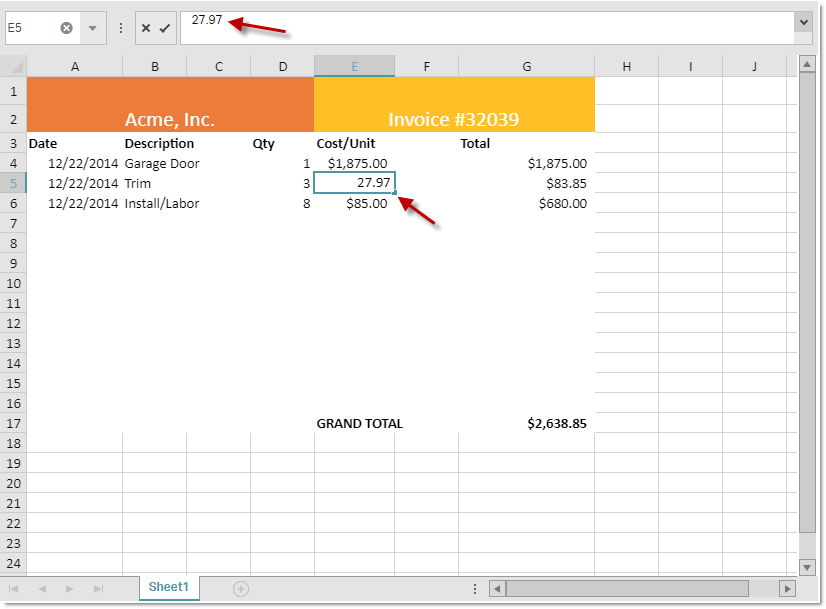
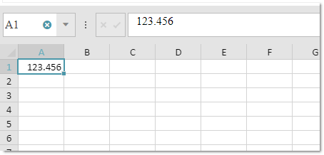

import ApiLink from 'docs-template/components/mdx/ApiLink.astro';

# 編集 API (igSpreadsheet)

## トピックの概要

### 目的

このトピックでは、スプレッドシートの編集に関連するコントロール API の概要を説明します。

### 前提条件

このトピックを理解するために [Infragistics JavaScript Excel Library](../../../09_JavaScript Excel Library/~JavaScript_Excel_Library.mdx) の概念とトピックは前提条件です。

### このトピックの内容

このトピックは、以下のセクションで構成されます。

-   [概要](#introduction)
-   [イベント](#events)
-   [メソッド](#methods)
-   [オプション](#navigation)
- 	[関連リンク](#related_link)


## 概要

スプレッドシートのコンテンツを編集しているセル上に配置されるエディターを使用して「インプレース」で編集または数式エディターで編集できます。コントロールはセルについての情報または入力した書式設定データを取得、あるは編集をキャンセルする API を公開します。以下の画像は、セルが編集モードにある Excel ワークブックを表示します。



## イベント

以下の表はセル編集機能に関連するイベントについて示します。以下はこのイベントを使用するシナリオについて示します。

| イベント		| 説明																|
| ------------- 	|:-------------:																	|
| <ApiLink type="igspreadsheet" member="editModeEntering" section="events" label="editModeEntering" />  | Spreadsheet が <ApiLink type="igspreadsheet" member="activeCell" section="options" label="activeCell" /> のインプレース編集を開始しようとするときに呼び出されます。    |
| <ApiLink type="igspreadsheet" member="editModeEntered" section="events" label="editModeEntered" />    | Spreadsheet が <ApiLink type="igspreadsheet" member="activeCell" section="options" label="activeCell" /> のインプレース編集を開始したときに呼び出されます。 	|
| <ApiLink type="igspreadsheet" member="editModeExiting" section="events" label="editModeExiting" />    | Spreadsheet が <ApiLink type="igspreadsheet" member="activeCell" section="options" label="activeCell" /> のインプレース編集を終了しようとするときに呼び出されます。 	|
| <ApiLink type="igspreadsheet" member="editModeExited" section="events" label="editModeExited" />      | Spreadsheet が <ApiLink type="igspreadsheet" member="activeCell" section="options" label="activeCell" /> のインプレース編集を終了したときに呼び出されます。 	|
| <ApiLink type="igspreadsheet" member="editModeValidationError" section="events" label="editModeValidationError" />    |  Spreadsheet が編集モードを終了し、<ApiLink type="igspreadsheet" member="activeCell" section="options" label="activeCell" /> の新しい値がセルの <ApiLink pkg="ig" type="excel.DataValidationRule" label="ig.excel.DataValidationRule" /> の条件に基づいて有効ではない場合に発生されます。 	|

すべてのセルの編集をキャンセルするには、<ApiLink type="igspreadsheet" member="editModeEntering" section="events" label="editModeEntering" /> イベントをキャンセルします。

```
$("#spreadsheet1").igSpreadsheet({
    height: "600",
    width: "100%",
    editModeEntering: function(evt, ui) {
        return false;
    }
});
```

セルの編集が完了してスプレッドシートの更新時に通知を表示するには、<ApiLink type="igspreadsheet" member="editModeExited" section="events" label="editModeExited" /> イベントを使用できます。

```
$("#spreadsheet1").igSpreadsheet({
    height: "600",
    width: "100%",
    editModeExited: function(evt, ui) {
        $("$notification").html("Cell " + ui.cell + " has been update");
    }
});
```

## メソッド

以下の表は、スプレッドシートの現在の編集状態を取得するために公開されたメソッドを説明します。

| メソッド			| 説明     																	|
| ------------- 	|:-------------:																	|
| <ApiLink type="igspreadsheet" member="getIsInEditMode" section="methods" label="getIsInEditMode" />  | コントロールが現在 <ApiLink type="igspreadsheet" member="activeCell" section="options" label="activeCell" /> の値を編集しているかどうかを示します。    |
| <ApiLink type="igspreadsheet" member="getCellEditMode" section="methods" label="getCellEditMode" />    | 現在の編集モード状態を示すために使用する列挙体を返します。 	|


## オプション

スプレッドシートに小数位を持つ数値を多数入力する場合、以下の表のオプションを使用してすばやく入力できます。これは、入力した数値を定義された小数位で自動的に書式設定することを許可します。

| オプション			| 説明     																	|
| ------------- 	|:-------------:																	|
| <ApiLink type="igspreadsheet" member="isFixedDecimalEnabled" section="options" label="isFixedDecimalEnabled" />  | 編集モードで整数が入力されたときに固定小数位が自動的に追加されるかどうかを示します。   |
| <ApiLink type="igspreadsheet" member="fixedDecimalPlaceCount" section="options" label="fixedDecimalPlaceCount" />    | 編集モードで入力された整数に使用される小数位。 	|

この機能を有効化して小数位を 3 に設定した場合、123456 の値をスプレッドシート セルに入力にすると、セルの編集モード終了後に 123.456 になります。

```
$("#spreadsheet1").igSpreadsheet({
    height: "600",
    width: "100%",
    isFixedDecimalEnabled: true,
    fixedDecimalPlaceCount: 3
});
```



## 関連リンク

-	[igSpreadsheet の概要](/igspreadsheet-overview)
-   [igSpreadsheet の構成](configuring-igspreadsheet.html)
-   <ApiLink type="igspreadsheet" label="igSpreadsheet API" />
