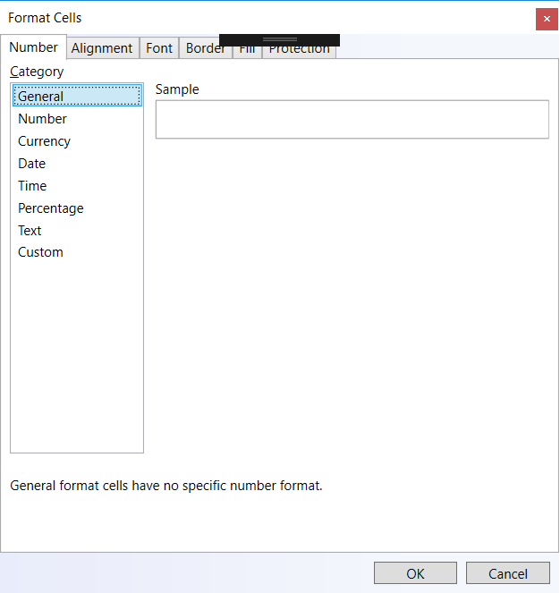
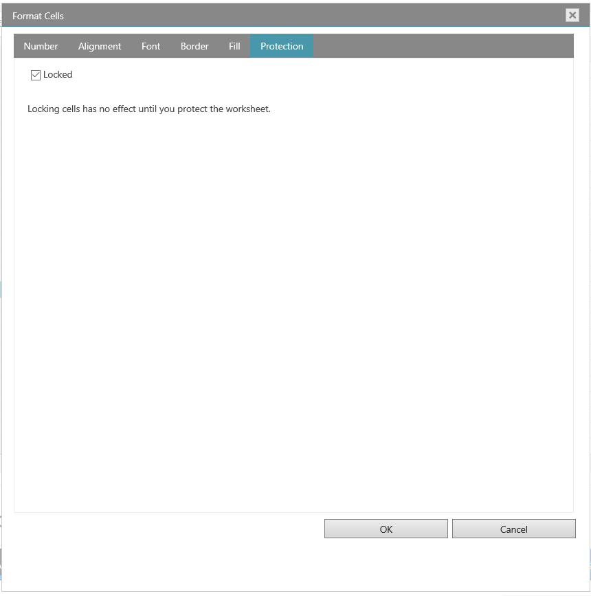

import ApiLink from 'docs-template/components/mdx/ApiLink.astro';

# igSpreadsheet FormatCell ダイアログ

### 目的

FormatCellsDialog を使用すると、スプレッドシート セルのデータの表示方法を変更できます。たとえば、小数点の右にある桁数を指定、あるいはセルにパターンおよび境界線を追加できます。この設定を「セルの書式設定」ダイアログ ボックスでアクセスして変更できます。このトピックは、FormatCellsDialog のさまざまな設定、セル データの表示方法への影響について説明します。

### 前提条件

このトピックを有効に使用するために [Infragistics JavaScript Excel Library](../../../09_JavaScript Excel Library/~JavaScript_Excel_Library.mdx) および [igSpreadsheet](/igspreadsheet-feature-overview) の概念とその関連トピックの理解が前提条件となります。

### このトピックの内容

「セルの書式設定」ダイアログにセル データの変更を設定する 6 つのタブがあります。

-   [数値](#number)
- 	[配置](#alignment)
- 	[フォント](#font)
- 	[罫線](#border)
- 	[塗りつぶし](#fill)
- 	[保護](#protection)

## 表示形式タブ

Excel には多数の定義済み数値書式の設定があります。定義済み書式設定を使用するには、「一般」の下にあるカテゴリを選択し、書式設定のためのオプションを選択します。書式設定をリストから選択するとき、Excel は「数値」タブの「サンプル」ボックスに出力の例を自動的に表示します。たとえば、セルに 1.23 を入力し、カテゴリ リストで数値を選択し、3 小数位を選択する場合、1.230 の数値がセルに表示されます。

以下の表はすべての定義済みの数値書式設定を示します。

数値書式 |メモ
---|---
数値| オプション: 小数点の桁数、桁区切り記号の使用、負の数値に使用される書式設定。
通貨| オプション: 小数点の桁数、通貨に使用する記号、負の数値に使用される書式設定。この書式設定は一般的に通貨値に使用されます。
日付| 日付のスタイルを「タイプ」リスト ボックスから選択します。
時刻| 時間のスタイルを「タイプ」リスト ボックスから選択します。
パーセンテージ| 既存のセル値に 100 を掛けてパーセント記号を付けて表示します。
テキスト| テキストとして書式設定されるセルはセルに入力された文字 (数値含む) をテキストとして表示します。

## 配置タブ

テキストおよび数値を配置するには、「セルの書式設定」ダイアログの「配置」タブを使用します。

- テキスト配置 : この設定を使用すると、テキストの水平方向、垂直方向、およびインデントを制御できます。
- テキスト コントロール : 「配置」タブの「テキスト コントロール」セクションでその他のテキスト配置オプションがあります。テキスト折り返し、縮小して全体を表示、セルの結合です。

## フォント タブ
「セルの書式設定」ダイアログの「フォント」タブでフォントを設定し、ポイント サイズ、フォント スタイル、下線、色、エフェクトなどの属性を制御できます。

## 罫線タブ
このタブでセルの境界線をカスタマイズするために線のスタイル、線の太さ、または線の色を変更できます。

## 塗りつぶしタブ

このタブで選択したセルの背景色を設定できます。「パターン カラー」または「パターン スタイル」を使用すると、セルの背景に色パターンまたはその他のパターン スタイルに適用できます。

## 保護タブ
「保持」タブでワークシートのデータおよび数式を保持するオプションを公開します。

- ロック

ただし、このオプションはワークシートを保持する場合のみ効果があります。

## 関連リンク
-   [igSpreadsheet の概要](/igspreadsheet-overview)
-   [igSpreadsheet の機能の概要](/igspreadsheet-feature-overview)
-   <ApiLink type="igspreadsheet" label="igSpreadsheet API" />