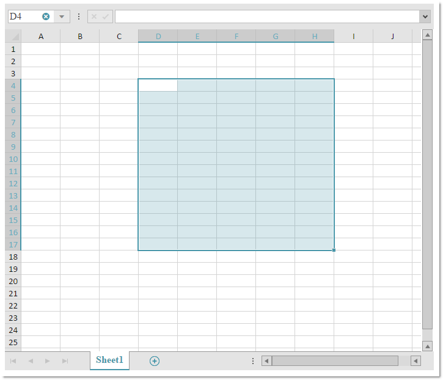
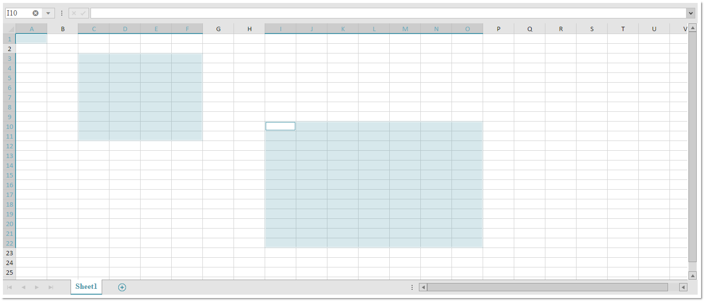

---
title: "igSpreadsheet の選択操作"
slug: igspreadsheet-selection
---

# igSpreadsheet の選択操作

## トピックの概要
### 目的
このトピックでは、ワークシートのセルを選択する場合にユーザーが実行できる操作を説明します。

### 前提条件
このトピックを理解するために [Infragistics JavaScript Excel Library](../../../09_JavaScript Excel Library/~JavaScript_Excel_Library.mdx) の概念とトピックは前提条件です。

## 選択

`igSpreadsheet` コントロールは normal、extendSelection、および addToSelection の選択モードをサポートします。このトピックでは、そのモードを説明し、比較します。

### normal

`selectionMode` のデフォルト値は normal です。選択モードが normal に設定されている場合、マウスをドラッグしてセルまたはセルの範囲を選択します。このモードで、新しい選択は以前の選択を置き換えます。同様に、キーボード ナビゲーションを使用してセルまたはセルの範囲を選択すると、新しい選択が生成されます。選択を置き換える代わりに既存の選択に新しい選択を追加するには、<kbd>Ctrl</kbd> キーを押して、マウスで新しい範囲を選択します。アクティブ セルを含む選択した範囲を変更するには、<kbd>Shift</kbd> キーを押して、マウスをクリックするか、キーボードで矢印キーで移動します。



```js
$("#spreadsheet").igSpreadsheet({
    height: "600",
    width: "75%",
    selectionMode: "normal"
});
```

### extendSelection

選択モードが extendSelection に設定されている場合、選択範囲は 1 つのみで、アクティブなセルとマウスまたはキーボードによるナビゲートで選択されたセルに囲まれます。アクティブ セルを移動するには、<kbd>Ctrl</kbd> キーを押してマウスを使用します。

```js
$("#spreadsheet").igSpreadsheet({
    height: "600",
    width: "75%",
    selectionMode: "extendSelection"
});
```

### addToSelection

このモードは、<kbd>Ctrl</kbd> キーを押さないで新しいセル範囲の追加を許可します。セルをクリックすると、現在の選択に追加されます。



```js
$("#spreadsheet").igSpreadsheet({
    height: "600",
    width: "75%",
    selectionMode: "addToSelection"
});
```


## ユーザー相互作用と操作性

以下の表では、`igSpreadsheet` コントロールのユーザー インタラクション機能を簡単に説明します。

目的|方法|詳細
---|---|---
1 つのセルを選択する|クリックするか、<kbd>Shift</kbd> + <kbd>Arrow</kbd> を押します。|1 つのセルが選択されます (これが、アクティブなセルになります)。
セルの範囲を選択する|開始セルをクリックし、ドラッグするか、<kbd>Shift</kbd> キーを押して矢印キーでセルを選択します。|セルの範囲が選択されます。ユーザーが選択を開始するセルが、アクティブなセルとなります。
複数のセル / セル範囲を選択する|<kbd>Ctrl</kbd> キーを押しながら、セル / セル範囲を選択します。|前述の表の 2 つの行で説明されている手順を使用して、現在の選択に、1 つのセルまたは複数のセル範囲を追加します。
**extendSelection** モードに入る、または終了します|<kbd>F8</kbd> を押す|このキーの組み合わせによって、**normal**　モードと **extendSelection** モードが切り替わります。
**addToSelection** モードに入る、または終了します|<kbd>Shift</kbd> + <kbd>F8</kbd> を押す|このキーの組み合わせによって、normal モードと addToSelection モードが切り替わります。

>**注**: ユーザーが 2 つ以上のワークシートを選択した場合、アクティブ ワークシートで選択を実行すると、その他の選択されたワークシートに同じ選択がすべて設定され、以後の操作はすべての選択されたワークシートで実行されます。

## 関連リンク
-   [igSpreadsheet の概要](/controls/igspreadsheet/igspreadsheet-overview/overview)
-   [igSpreadsheet のアクティベーションとナビゲーションのインタラクション](/controls/igspreadsheet/igspreadsheet-overview/activation-and-navigation-interactions)
-   [igSpreadsheet の機能の概要](/controls/igspreadsheet/igspreadsheet-overview/feature-overview)
-   [igSpreadsheet API](&#123;environment:jQueryApiUrl&#125;/ui.igspreadsheet)
