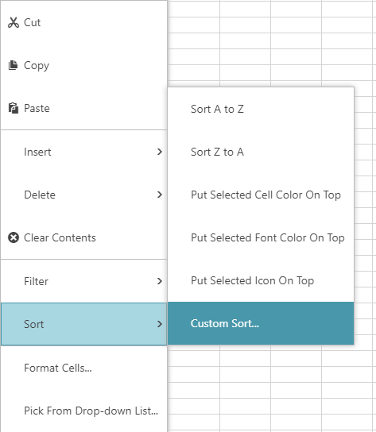
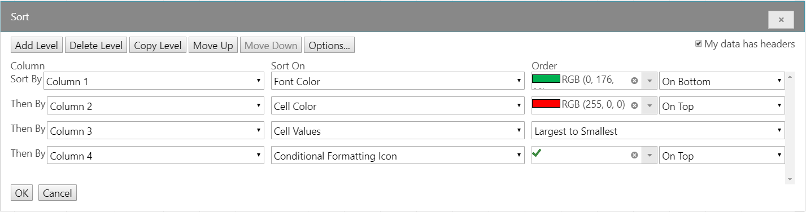

---
title: "igSpreadsheet カスタム並べ替えダイアログ"
slug: images/igspreadsheet-sort-dialog
---

# igSpreadsheet カスタム並べ替えダイアログ

## トピックの概要
### 目的
このトピックは、コントロールの並べ替えダイアログで実行可能な操作について説明します。テーブル、ワークシート、またはフィルター領域で列または行の複数の並べ替え条件を作成できます。

### 前提条件
このトピックの理解をより深めるために以下のトピックとそのコンセプトをご確認ください。 
-  [Infragistics JavaScript Excel ライブラリ](../../../09_JavaScript Excel Library/~JavaScript_Excel_Library.mdx)
- [igSpreadsheet 概要](igSpreadsheet_Feature_Overview.html)

### 並べ替えダイアログの概要
igSpreadsheet コントロールは、指定した順序で複数の列を並べ替えるためにユーザー定義の並べ替えダイアログを提供します。

ダイアログを開くには、igSpreadsheet のコンテキスト メニューを表示します。コンテキスト メニューを表示するには、ワークシート、フィルター領域、またはテーブルにあるセルに右クリックするか、Alt + Shift + F10 を押します。以下の画像のように「並べ替え」>「ユーザー設定の並べ替え」オプションを選択してダイアログを開きます。

最初の並べ替え条件を作成するには、3 つのカテゴリを設定する必要があります。*注: ダイアログのデフォルト設定は列の並べ替えです。行の並べ替えに変更するには、ダイアログの上部の [オプション] ボタンを使用します。

* *列や行* - 列または行 - 並べ替え条件の最小要件です。デフォルト値は「並べ替えのキー」および「順序」フィールドに設定されます。
* *並べ替えのキー* - 「フォントの色」、「セルの色」、「セルの値」、および「条件付き書式のアイコン」の 4 つの並べ替えオプションがあります。詳細については、以下の画像を参照してください。
* *順序* - 「フォントの色」が並べ替えのキー フィールドに選択される場合、セルの前景の色が「順序」のオプションになります。「セルの色」を並べ替えのキー フィールドで選択した場合、セルの背景の一意の色が「順序」のオプションになります。「セルの値」を並べ替えのキー フィールドで選択した場合、「昇順」または「降順」が「順序」のオプションになります。
値が数値を含む場合、「順序」は「小さい順」または「大きい順」になります。「条件付き書式のアイコン」を並べ替えのキー フィールドで選択した場合、行の順序はアイコンに基づいて決定されます。

以下の画像は 4 つの*並べ替え*オプションの例です。

## 関連リンク
-   [igSpreadsheet の概要](/controls/igspreadsheet/igspreadsheet-overview/overview)
-   [igSpreadsheet のアクティベーションとナビゲーションのインタラクション](/controls/igspreadsheet/igspreadsheet-overview/activation-and-navigation-interactions)
-   [igSpreadsheet の機能の概要](/controls/igspreadsheet/igspreadsheet-overview/feature-overview)
-   [igSpreadsheet API](&#123;environment:jQueryApiUrl&#125;/ui.igspreadsheet)