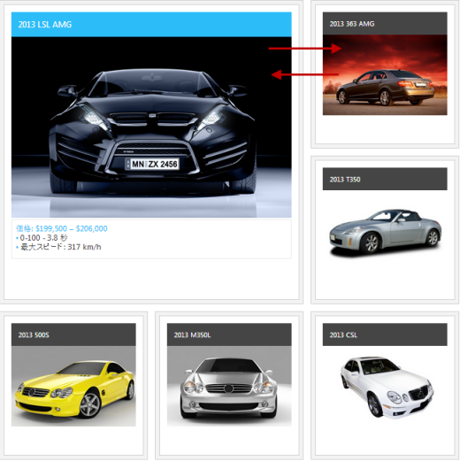
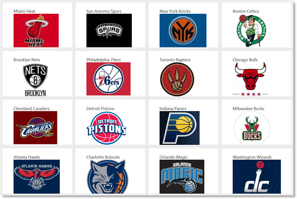

---
title: "igTileManager の概要"
slug: igtilemanager-overview
---

# igTileManager の概要

## トピックの概要
### 目的

このトピックでは、主要機能、最小要件およびユーザー機能性など、`igTileManager`™ コントロールの概念的な情報を提供します。

### 前提条件

このトピックを理解するために、以下のトピックを参照することをお勧めします。

- [igLayoutManager の概要、グリッド レイアウト セクション](/igbulletgraph-overview): このセクションでは、`igLayoutManager`™ コントロールのグリッド レイアウトの概要を説明します。

- [igSplitter の概要](/igbulletgraph-overview): このトピックでは、機能、ユーザー機能性など、`igSplitter`™ コントロールに関する概念的な情報を提供します。

### このトピックの内容

このトピックは、以下のセクションで構成されます。

-   [**概要**](#introduction)
    -   [igTileManager の概要](#summary)
    -   [igTileManager のタイルの状態](#tile-states)
    -   [igTileManager の動作モード](#operational-modes)
-   [**ユーザー インタラクションと操作性**](#user-interaction)
    -   [ユーザー インタラクションの概要](#user-interaction-summary)
    -   [ユーザー インタラクションの概要表](#user-interaction-summary-chart)
-   [**主要機能**](#main-features)
    -   [主要機能の概要](#main-features-summary)
    -   [igLayoutManager のグリッド レイアウトを基本にした機能](#igLayourManager-grid-layout)
    -   [igSplitter を基本にした機能](#based-on-igsplitter)
    -   [igTileManager の特有な機能](#specific-features)
-   [**タッチ サポート**](#touch-support)
-   [**デフォルトの構成**](#default-configuration)
-   [**要件**](#requirements)
-   [**igTileManager 構成の概要**](#config-overview)
    -   [igTileManager 構成の概要](#config-summary)
    -   [igTileManager 構成の概要表](#config-summary-chart)
-   [**関連コンテンツ**](#related-content)
    -   [トピック](#topics)
    -   [サンプル](#samples)

## 概要
### igTileManager の概要

`igTileManager` のグリッド レイアウトは、[igLayoutManager のグリッド レイアウト](#igLayourManager-grid-layout) を基本にしています。このコントロールは、位置 (行スパンと列スパン) およびディメンション (行位置と列位置) に対して、対応するレイアウト構成を提供します。各タイルは、最小化または最大化など、コンテンツの状態に応じた表示が構成できます。`igTileManager` は `igSplitter` コントロールに統合されます。その結果、それぞれのタイルは (デフォルト設定で) 2 つのパネル、最大化されたタイル パネルと最小化されたタイル パネルに分けられます。最大化されたタイル パネルは、一度に 1 つのタイル (最大化されたもの) を表示します。また最小化されたタイル パネルは、最小化されたタイルを表示します。最小化されたタイル パネルの場合は、デフォルトでスクロールバーが有効で、最小化されたタイルをスクロールすることができます。

最大化させるタイルを選択し、最小化されたタイル パネルをスクロールして、コントロールを使用できます。また、スプリッター バーを使用して、互いのパネルのサイズ変更もできます。(詳細は、[ユーザー インタラクションと操作性](#user-interaction)を参照。)

&#123;environment:ProductName&#125;® コントロールは、それらのタイルの内部に配置できます。そのため、タイルの移動やサイズ変更が可能で、また実行時にタイルの状態を変更できます。

### igTileManager のタイルの状態

`igTileManager` タイルには、最小化と最大化の 2 つの状態があります。タイルには、各状態でさまざまなコンテンツがあります。

-   最小化 - これはタイルの「レギュラー」な状態です。通常この状態のタイルは、情報をサマリーの形で表示します。この状態のタイルから、最大化の状態に移行できます。
-   最大化 - これはタイルに焦点を合わせ、タイルが表すコンテンツ全体を表示する状態です。この状態のタイルから、最小化の状態に戻すことができます。

### igTileManager の動作モード

このモードは、最大化されたタイルの表示方法を指定します。最初に、`igTileManager` はすべてのタイルを最小化タイルとして描画し、それらを 1 つのコンテナーに配置します。タイルを選択すると、コントロールに対して設定された動作モードに従って、最大化が実行されます。以下の動作モードがサポートされています。

-   デュアル パネル モード (デフォルト設定) - 前述したように、コンテナーは 2 つのパネルに分割され、[igTileManager の概要](#summary)に表示されます。
-   シングル パネル モード - コンテナーは 1 つのパネルを表示します。内部グリッドの中の、事前に定義されたインデックスの位置で、タイルは最大化されて表示されます。その他のタイルはすべて最小表示になります。(最大化されたタイルは、最大化された内容を表示するために、複数の行と列にまたがってることができます。)最大化するタイルを選択すると、前回最大化されたタイルと位置が入れ替わり、最大化の状態で内容が表示されます。

動作モードは、[maximizedTileIndex](&#123;environment:jQueryApiUrl&#125;/ui.igtilemanager) プロパティで管理されます。このプロパティの有効な設定内容は、タイルに対して存在する位置インデックスです。`maximizedTileIndex` プロパティを設定しなかった場合、`igTileManager` はタイルをデュアル パネル モードで最大化します。`maximizedTileIndex` プロパティを設定した場合、`igTileManager` は、最大化されたタイルを表示する位置で、指定されたインデックス位置のタイルを使用して、タイルをシングル パネル モードで最大化します。

## ユーザー インタラクションと操作性
### ユーザー インタラクションの概要

最小化されたタイルをクリックしてタップすると、最大化されて、コンテンツ全体が表示されます。最大化されたタイルは、最大化されたタイル パネルに送信されます。入れ替わった前回の最大化タイルは最小化され、最小化されたタイル パネルに送られます。スプリッター バーは相互のパネルでタイルのサイズ変更ができます。最大化されたタイルの拡大、画面から隠れてしまった最小化されたタイルの表示もできます。また、スクロールバーを使用して最小化されたタイルをナビゲートできます。

### ユーザー インタラクションの概要表

以下の表で、`igTileManager` コントロールのユーザー インタラクション機能を簡単に説明します。

目的|方法|詳細|クライアント/サーバー設定
---|---|---|---
タイルの最大化|最小化されたタイルをマウスでクリックします。|最大化は、[preventMaximizingSelector](&#123;environment:jQueryApiUrl&#125;/ui.igtilemanager#options:preventMaximizingSelector) プロパティで有効 (デフォルト) または無効にできます。|
最大化されたタイルの最小化|最小化ボタン ()|最小化ボタンは、最大化されたタイルの右上隅に描画されます。|
パネルのサイズ変更|スプリッター バー|スプリッターは、[showSplitter](&#123;environment:jQueryApiUrl&#125;/ui.igtilemanager#options:showSplitter) オプションを false に設定してビューを無効にし、非表示にできます。|
最小化されたタイル パネルのスクロール|スクロールバー|スクロールバーは、[showRightPanelScroll](&#123;environment:jQueryApiUrl&#125;/ui.igtilemanager#options:showRightPanelScroll) オプションを false に設定して、非表示にできます。|

## 主要機能
### 主要機能の概要

`igTileManager` コントロールの機能は制御機能の集合で、次を包括的しています。`igLayoutManager` のグリッド レイアウト、 および `igSplitter` の特有の機能、さらに `igTileManager` のみの特有な 2～3 の機能。`igTileManager` の主な機能は、以下のカテゴリにグループ化されます (詳細はリンクを参照)。

-   [igLayoutManager のグリッド レイアウトを基本にした機能](#igLayourManager-grid-layout)
-   [igSplitter を基本にした機能](#based-on-igsplitter)
-   [igTileManager の特有な機能](#specific-features)

### igLayoutManager のグリッド レイアウトを基本にした機能

`igTileManager` は、`igLayoutManager` グリッド アルゴリズム、行と列のマージが可能な複合的絶対位置に配置されたタイルの一番上にビルドされます。以下の図は、コンテナー内の既存のマークアップでインスタンス作成された `igTileManager` を示します。

`igTileManager` コントロールがデュアル パネル動作モードの場合、最大化されたタイル パネルに応じて、複数列を明示的に確保する必要があります。詳細は、[最小化されたタイル パネル内の構成可能な行数と列数](/igtilemanager-configuring#config-rows-columns)を参照してください。

### igSplitter を基本にした機能

`igTileManager` が デュアル パネル動作モードで表示する 2 パネル レイアウト、および完全に`igSplitter` コントロールのみに基づいた、レイアウト関連の機能です。以下の表で、`igTileManager` コントロールの特有な `igSplitter` 機能を簡単に説明します。基本的なコントロールの詳細は、`igSplitter` のトピック グループを参照してください。

機能|説明
---|---
2 パネル レイアウト|`igSplitter` コントロールは、`igTileManager` に対して 2 パネル レイアウト - 1 つは最大化された (選択された) タイル、もう 1 つは最小化されたタイル - を提供します。 
サイズ変更可能なパネル|パネルは、スプリッター コントロール内でスプリッターを移動することで互いのサイズに対応してサイズ変更できます。スプリッターがどちらかのパネルの方向に移動されると、そのパネルのサイズは小さくなり、もう一方のパネルのサイズは大きくなります。デフォルトで、パネルはサイズ変更できます。パネルがサイズ変更されると、最小化されたタイル パネル内の最小化されたタイルは、パネル全体に広がるように、再配置されます。最大化されたタイル パネル内の最大化されたタイルは、サイズ変更に応じて拡大または縮小されます。パネルのサイズ変更は、[showSplitter](&#123;environment:jQueryApiUrl&#125;/ui.igtilemanager) オプションを false に設定しると、無効にできます。 
パネルのサイズ変更のためのドラッグのサポート|デフォルトでは、`igSplitter` コントロールはパネルをサイズ変更するためにマウスのドラッグをサポートします。パネルのサイズは、スプリッターをドラッグしても変更できます。ドラッグを移動した後にマウス ボタンをリリースすると、スプリッターの新しい位置に応じてパネルのサイズが変更されます。

### igTileManager の特有な機能

以下の表で、`igTileManager` コントロールの主な機能を簡単に説明します。

####データ バインディング

`igTileManager` をデータ ソースに接続すると、自動的にデータ ソースを一連のタイルに表示します。

####状態

各タイルは、最小化または最大化の状態によって、表示するコンテンツの内容が異なります。このため、この 2 つの状態はそれぞれ、[minimizedState](&#123;environment:jQueryApiUrl&#125;/ui.igtilemanager#options:minimizedState) と `maximizedState` プロパティを使用して個別に構成されます。プロパティは、その値としてセレクターを使用使用します。またタイルは該当する状態の時に、対応する要素のコンテンツを表示します。

-   最小化された状態とは、タイルが最小化され、最小化されたタイル パネル内にある状態を言います。
-   最大化された状態では、選択されたタイルのコンテンツ全体とタイル全体のコンテンツを表示します。

最小化された状態のビューポート (すべてのタイルが最小化された状態です。)

最大化された状態のビューポート (タイルの 1 つが最大化され、その他のすべてのタイルは最小化された状態です。)

####リキット デザイン

グリッドの列の幅がパーセント値で定義されている場合、`igTileManager` コントロールを使用したリキット デザインが表示できます。この場合、画面の解像度で表示できるスペースに合わせて、各タイルがサイズ変更されます。従って、コンテナーのサイズに関係なく、各タイルはその位置に保持されます。

####レスポンシブ Web デザイン

グリッドの列の幅がピクセル数で定義されている場合、`igTileManager` コントロールを使用したレスポンシブ Web デザインが表示できます。この場合、コンテナーがスペース内に応じてサイズ変更されると、各タイルが再配置されます。再配置は、タイルが最大化された場合、パネルがスプリッター バーを使用してサイズ変更された場合、またはデバイスの向きが変更された場合に実行されます。

####アニメーション化されたトランジション

タイルが 1 つの状態から他の状態にトランジションすると、スワップ効果によってアニメーション表示されます:タイルが最大化され、最小化されていた任意のタイルクリックすると、クリックの対象のタイルと最大化されたタイルが、互いにスワップされたように見えます。

アニメーションは、[animationDuration](&#123;environment:jQueryApiUrl&#125;/ui.igtilemanager#options:animationDuration) オプションを 0 に設定すると、無効にできます。この場合、クリックした最小化されたタイルは最大化され、最大化されたタイル パネルに表示されます。

**関連トピック:**

-   [igTileManager の構成](/igtilemanager-configuring)

スクロール可能な最小化されたタイル パネル

最小化されたタイル パネルのスクロールバーを使用して、隠れている最小化されたタイルにナビゲートできます。このスクロールは、[showRightPanelScroll](&#123;environment:jQueryApiUrl&#125;/ui.igtilemanager#options:showRightPanelScroll) オプションを false に設定すると、無効にできます。スクロールバーが無効の場合は、現状のサイズで最小化されたタイル パネルに表示できる、最大数の最小化されたタイルのみを見ることができます。最小化されたタイルを表示する唯一の方法は、スプリッターを使用して最小化されたタイル パネルを拡大します。

####構成可能なタイルのサイズと位置

タイルを含む内部グリッドは、[cols](&#123;environment:jQueryApiUrl&#125;/ui.igtilemanager#options:cols) と [rows](&#123;environment:jQueryApiUrl&#125;/ui.igtilemanager#options:rows) オプションを使用して、所定の数の行と列を持つように構成できます。この方法により、タイルのサイズと位置は任意の行数と列列に配置しても、自動的に算出されます。

**関連トピック:**

-   [***igTileManager* の構成**](/igtilemanager-configuring)

構成可能な、最初に最大化されたタイル

`igTileManager` コントロールの描画時に、最初に最大化するタイルを指定できます。そのためには、最大化するタイルのインデックス番号を、[maximizedTileIndex](&#123;environment:jQueryApiUrl&#125;/ui.igtilemanager#options:maximizedTileIndex) オプションの値で指定します。

>**注:** 最初に最大化させるタイルを指定した場合、最小化されたタイル パネルは最小化されたタイルをホスティングせずに、コントロールはシングル パネル モードで動作します。

####最小化されたタイル パネルで構成可能な行数と列数

最小化されたタイル パネル内の内部グリッドの行と列は、[rightPanelCols](&#123;environment:jQueryApiUrl&#125;/ui.igtilemanager#options:rightPanelCols) オプションを使用して、事前に定義できます。このオプションは、デュアル パネル モードのみで有効です。

**関連トピック:**

-   [igTileManager の構成](/igtilemanager-configuring)

####構成可能なタイルの余白

最小化されたタイルの余白は、グリッドの各タイルの周囲のスペースを定義します。最小化されたタイルの上と左の余白を構成し、タイル間のアウトセットを形成できます。タイルの余白は、[marginTop](&#123;environment:jQueryApiUrl&#125;/ui.igtilemanager#options:marginTop) オプションと [marginLeft](&#123;environment:jQueryApiUrl&#125;/ui.igtilemanager#options:marginLeft) オプションで構成されます。

## タッチ サポート

タッチ対応デバイスの場合、特別なクラスがタイル マネージャーに追加され、タッチ イベントが処理されます。タッチ対応デバイスでは、スプリッターは標準のデバイス (幅 6 ピクセル) より少し広め (幅 16 ピクセル) になっており、タッチ環境でのユーザーのスプリッター バーの操作を簡単にしています。詳細は、[&#123;environment:ProductName&#125; コントロールのタッチ サポート](/touch-support-for-igniteui-for-jquery-controls)を参照してください。

## デフォルトの構成

デフォルト設定では、`igTileManager` コントロールは、マークアップされた項目のタイルを左と上の余白なしで描画します。すべてのタイルは、タイルの数に応じて行数と列数が同じになるようにコンテナーに収められます。デフォルトの構成には、余白は含まれていません。

## 要件

`igTileManager` コントロールは jQuery UI ウィジェットであるため、jQuery ライブラリと jQuery UI ライブラリに依存します。`igSplitter` は Modernizr ライブラリに依存するため、このライブラリも必要です。これらのリソースへの参照は、実際の jQuery または &#123;environment:ProductNameMVC&#125; が使用されているとしても必要となります。コントロールが ASP.NET MVC のコンテクスト内で使用されている場合、Infragistics.Web.Mvc の組立が必要になります。

`igTileManager`、`igLayoutManager`、`igSplitter` 用の CSS ファイルは、コントロールの正しい描画のページを参照する必要があります。

幅と高さは、コントロールを含む `
` 要素に対して定義します。

データを表示する `igTileManager` の場合、コントロールに対して複数のデータを提示する、またはデータ ソースにデータをバインドする必要があります。

完全な要件の一覧については、[igTileManager の追加](/igtilemanager-adding)のトピックを参照してください。

## igTileManager 構成の概要
### igTileManager 構成の概要

`igTileManager` コントロールの構成可能な主な項目:

-   行数と列数
-   各列
-   項目の位置とスパン
-   タイルの状態
-   最小化されたタイル パネル
-   アニメーション化されたトランジションの期間
-   ユーザー操作

各要素については、[**igTileManager**](#config-overview) の構成で説明します。

### igTileManager 構成の概要表

以下の表は、`igTileManager` コントロールを構成できる要素を示します。各要素の詳細は、この概要表の後のセクションを参照してください。

<table class="table table-bordered">
	<thead>
		<tr>
            <th colspan="2">構成可能な項目</th>
            <th>詳細</th>
            <th>JavaScript プロパティ</th>
            <th>ASP.NET MVC プロパティ</th>
</tr>
	</thead>
	<tbody>
        <tr>
            <td rowspan="2">[行数と列数](/igtilemanager-configuring#config-rows-columns)</td>
            <td>行数</td>
            <td>タイル グリッドに描画する行数と列数を構成できます。</td>
            <td><ul> <li> [rows](&#123;environment:jQueryApiUrl&#125;/ui.igtilemanager#options:rows) </li> </ul></td>
            <td><ul> <li> [Row()](Infragistics.Web.Mvc~Infragistics.Web.Mvc.TileManagerModel~Rows.html) </li> </ul></td>
</tr>

        <tr>
            <td>列の数</td>
            <td></td>
            <td><ul> <li> [cols](&#123;environment:jQueryApiUrl&#125;/ui.igtilemanager#options:cols) </li> </ul></td>
            <td><ul> <li> [Coll()](Infragistics.Web.Mvc~Infragistics.Web.Mvc.TileManagerModel~Cols.html) </li> </ul></td>
</tr>

        <tr>
            <td rowspan="4">[各列](/igtilemanager-configuring#column-dimentions)</td>
            <td>列の高さ</td>
            <td>タイル グリッドの各列の幅と高さを構成できます。</td>
            <td><ul> <li> [columnHeight](&#123;environment:jQueryApiUrl&#125;/ui.igtilemanager#options:columnHeight) </li> </ul></td>
            <td><ul> <li> [ColumnHeight()](Infragistics.Web.Mvc~Infragistics.Web.Mvc.TileManagerModel~ColumnHeight.html) </li> </ul></td>
</tr>

        <tr>
            <td>列の幅</td>
            <td></td>
            <td><ul> <li> [columnWidth](&#123;environment:jQueryApiUrl&#125;/ui.igtilemanager#options:columnWidth) </li> </ul></td>
            <td><ul> <li> [ColumnWidth()](Infragistics.Web.Mvc~Infragistics.Web.Mvc.TileManagerModel~ColumnWidth.html) </li> </ul></td>
</tr>

        <tr>
            <td>タイルの左の余白</td>
            <td>タイル グリッドの各タイルの上と左の余白を構成できます。</td>
            <td><ul> <li> [marginLeft](&#123;environment:jQueryApiUrl&#125;/ui.igtilemanager#options:marginLeft) </li> </ul></td>
            <td><ul> <li> [MarginLeft()](Infragistics.Web.Mvc~Infragistics.Web.Mvc.TileManagerModel~MarginLeft.html) </li> </ul></td>
</tr>

        <tr>
            <td>タイルの上の余白</td>
            <td></td>
            <td><ul> <li> [marginTop](&#123;environment:jQueryApiUrl&#125;/ui.igtilemanager#options:marginTop) </li> </ul></td>
            <td><ul> <li> [MarginTop()](Infragistics.Web.Mvc~Infragistics.Web.Mvc.TileManagerModel~MarginTop.html) </li> </ul></td>
</tr>

        <tr>
            <td>\*\*操作モード\*\*</td>
            <td>最大化されたタイルのパネル数と配置</td>
            <td>最大化されたタイルを最小化されたタイルと別のパネルに表示する、または同じパネルに同時に表示するか指定できます。後者の場合、最大化されたタイルの位置をパネル内に構成できます。</td>
            <td><ul> <li> [maximizedTileIndex](&#123;environment:jQueryApiUrl&#125;/ui.igtilemanager#options:maximizedTileIndex) </li> </ul></td>
            <td><ul> <li> [MaximizedTileIndex()](Infragistics.Web.Mvc~Infragistics.Web.Mvc.TileManagerModel~MaximizedTileIndex.html) </li> </ul></td>
</tr>

        <tr>
            <td rowspan="2">[項目の位置とスパン](/igtilemanager-configuring#config-positions-span)</td>
            <td>項目の位置</td>
            <td>タイル グリッドでの項目の位置は、任意の位置の行とインデックスを指定して構成できます。</td>
            <td><ul> <li> [rowIndex](&#123;environment:jQueryApiUrl&#125;/ui.igtilemanager#options:rowIndex) </li> <li> [colIndex](&#123;environment:jQueryApiUrl&#125;/ui.igtilemanager#options:colIndex) </li> </ul></td>
            <td><ul> <li> [RowIndex()](Infragistics.Web.Mvc~Infragistics.Web.Mvc.TileManagerModel~Items.html) </li> <li> [ColIndex()](Infragistics.Web.Mvc~Infragistics.Web.Mvc.TileManagerModel~Items.html) </li> </ul></td>
</tr>

        <tr>
            <td>項目のサイズ</td>
            <td>長い項目が使用できるように、項目は複数の行と列にまたがって構成できます。</td>
            <td><ul> <li> [rowSpan](&#123;environment:jQueryApiUrl&#125;/ui.igtilemanager#options:rowSpan) </li> <li> [colSpan](&#123;environment:jQueryApiUrl&#125;/ui.igtilemanager#options:colSpan) </li> </ul></td>
            <td><ul> <li> [RowSpan()](Infragistics.Web.Mvc~Infragistics.Web.Mvc.TileManagerModel~Items.html) </li> <li> [ColSpan()](Infragistics.Web.Mvc~Infragistics.Web.Mvc.TileManagerModel~Items.html) </li> </ul></td>
</tr>

        <tr>
            <td rowspan="2">[タイルの状態](#tile-states)</td>
            <td>最小化された状態</td>
            <td>タイルの状態は、各状態で個別に設定します。</td>
            <td><ul> <li> [minimizedState](&#123;environment:jQueryApiUrl&#125;/ui.igtilemanager#options:minimizedState) </li> </ul></td>
            <td><ul> <li> [MinimizedState()](Infragistics.Web.Mvc~Infragistics.Web.Mvc.TileManagerModel~MinimizedState.html) </li> </ul></td>
</tr>

        <tr>
            <td>最大化された状態</td>
            <td></td>
            <td><ul> <li> [maximizedState](&#123;environment:jQueryApiUrl&#125;/ui.igtilemanager#options:maximizedState) </li> </ul></td>
            <td><ul> <li> [MaximizedState()](Infragistics.Web.Mvc~Infragistics.Web.Mvc.TileManagerModel~MaximizedState.html) </li> </ul></td>
</tr>

        <tr>
            <td rowspan="2">[タイルの余白](/igtilemanager-configuring#config-tiles-margin)</td>
            <td>上の余白</td>
            <td>最小化されたタイルの上と左の余白を構成し、タイル間のアウトセットを形成できます。</td>
            <td><ul> <li> [marginTop](&#123;environment:jQueryApiUrl&#125;/ui.igtilemanager#options:marginTop) </li> </ul></td>
            <td><ul> <li> [MarginTop()](Infragistics.Web.Mvc~Infragistics.Web.Mvc.TileManagerModel~MarginTop.html) </li> </ul></td>
</tr>

        <tr>
            <td>左の余白</td>
            <td></td>
            <td><ul> <li> [marginLeft](&#123;environment:jQueryApiUrl&#125;/ui.igtilemanager#options:marginLeft) </li> </ul></td>
            <td><ul> <li> [MarginLeft()](Infragistics.Web.Mvc~Infragistics.Web.Mvc.TileManagerModel~MarginLeft.html) </li> </ul></td>
</tr>

        <tr>
            <td rowspan="5">[最小化されたタイル パネル](/igtilemanager-configuring#config-minimized-tile-panel)</td>
            <td>列の数</td>
            <td>最小化されたタイル パネルに描画する列数を構成できます。</td>
            <td><ul> <li> [rightPanelCols](&#123;environment:jQueryApiUrl&#125;/ui.igtilemanager#options:rightPanelCols) </li> </ul></td>
            <td><ul> <li> [RightPanelCols()](Infragistics.Web.Mvc~Infragistics.Web.Mvc.TileManagerModel~RightPanelCols.html) </li> </ul></td>
</tr>

        <tr>
            <td>最小化されたタイルの幅</td>
            <td>最小化されたタイル パネルのタイルの幅を構成できます。</td>
            <td><ul> <li> [rightPanelTilesWidth](&#123;environment:jQueryApiUrl&#125;/ui.igtilemanager#options:rightPanelTilesWidth) </li> </ul></td>
            <td><ul> <li> [RightPanelTilesWidth()](Infragistics.Web.Mvc~Infragistics.Web.Mvc.TileManagerModel~RightPanelTilesWidth.html) </li> </ul></td>
</tr>

        <tr>
            <td>最小化されたタイルの高さ</td>
            <td>最小化されたタイル パネルのタイルの高さを構成できます。</td>
            <td><ul> <li> [rightPanelTilesHeight](&#123;environment:jQueryApiUrl&#125;/ui.igtilemanager#options:rightPanelTilesHeight) </li> </ul></td>
            <td><ul> <li> [RightPanelTilesHeight()](Infragistics.Web.Mvc~Infragistics.Web.Mvc.TileManagerModel~RightPanelTilesHeight.html) </li> </ul></td>
</tr>

        <tr>
            <td>スクロールバー</td>
            <td>タイルがオーバーフローした場合に、最小化されたタイル パネルがスクロールバーで表示できるように指定できます。スクロールバーが無効の場合は、隠れたタイルを表示するためにスプリッターを移動する必要があります。</td>
            <td><ul> <li> [showRightPanelScroll](&#123;environment:jQueryApiUrl&#125;/ui.igtilemanager#options:showRightPanelScroll) </li> </ul></td>
            <td><ul> <li> [ShowRightPanelScroll()](Infragistics.Web.Mvc~Infragistics.Web.Mvc.TileManagerModel~ShowRightPanelScroll.html) </li> </ul></td>
</tr>

        <tr>
            <td>スプリッター バーの表示</td>
            <td>スプリッターの表示を指定できます。デフォルトで、スプリッターは表示されます。</td>
            <td><ul> <li> [showSplitter](&#123;environment:jQueryApiUrl&#125;/ui.igtilemanager#options:showSplitter) </li> </ul></td>
            <td><ul> <li> [ShowSplitter()](Infragistics.Web.Mvc~Infragistics.Web.Mvc.TileManagerModel~ShowSplitter.html) </li> </ul></td>
</tr>

        <tr>
            <td rowspan="2">[アニメーション化されたトランジションの期間](/igtilemanager-configuring#config-animation-duration)</td>
            <td>コンテナーのサイズ変更時のトランジションの期間</td>
            <td>コンテナーのサイズとタイル状態（最小化または最大化）の変更時のアニメーション化されたトランジションの期間は、animationDuration オプションで構成されるため、常に同じ期間です。</td>
            <td><ul> <li> [animationDuration](&#123;environment:jQueryApiUrl&#125;/ui.igtilemanager#options:animationDuration) </li> </ul></td>
            <td><ul> <li> [AnimationDuration()](Infragistics.Web.Mvc~Infragistics.Web.Mvc.TileManagerModel~AnimationDuration.html) </li> </ul></td>
</tr>

        <tr>
            <td>最小化または最大化時のトランジションの期間</td>
            <td></td>
            <td></td>
            <td></td>
</tr>

        <tr>
            <td>\*\*ユーザー操作\*\*</td>
            <td>最大化トリガー</td>
            <td>最大化をトリガーしない最小化されたタイルの要素を指定できます。デフォルトで、`<a>` タグと `<input>` タグをクリックしても最大化はトリガーされません。</td>
            <td><ul> <li> [preventMaximizingSelector](&#123;environment:jQueryApiUrl&#125;/ui.igtilemanager#options:preventMaximizingSelector) </li> </ul></td>
            <td><ul> <li> [PreventMaximizingSelector()](Infragistics.Web.Mvc~Infragistics.Web.Mvc.TileManagerModel~PreventMaximizingSelector.html) </li> </ul></td>
</tr>
    </tbody>
</table>

## 関連コンテンツ
### トピック

このトピックの追加情報については、以下のトピックも合わせてご参照ください。

- [igTileManager の追加](/igtilemanager-adding): このトピックでは、コード例を使用して、JavaScript または ASP.NET MVC のいずれかで `igTileManager` コントロールを HTML ページに追加する方法を説明します。このトピックは、HTML マークアップでの `igTileManager` の初期化について説明します。

- [igTileManager とデータのバインド](/igtilemanager-binding): このトピックでは、`igTileManager` コントロールをJavaScript 配列、XML データ、厳密に型指定された MVC ビュー、およびリモート サービスからの JSON レスポンスにバインドする方法を説明します。

- [igTileManager の構成](/igtilemanager-configuring): このトピックでは、`igTileManager` コントロールの機能およびビヘイビアーを構成する方法を説明します。

- [イベントの処理 (igTileManager)](/igtilemanager-handling-events): このトピックではコード例を使用して、イベント ハンドラーを `igTileManager` に添付する方法を説明します。

- [アクセシビリティの遵守 (igTileManager)](/igtilemanager-accessibility-compliance): このトピックでは、`igTileManager` コントロールのアクセシビリティ機能を説明し、このコントロールを含むページのアクセシビリティ遵守を実現する方法を説明します。

- [既知の問題と制限 (igTileManager)](/igtilemanager-known-issues-and-limitations): このトピックでは、`igTileManager` コントロールの既知の問題と制限、その回避策に関する情報を提供します。

-  [jQuery および MVC API リファレンス リンク (igTileManager)](/igtilemanager-jquery-and-asp.net-mvc-helper-api-links): このトピックでは、`igTileManager` コントロールの jQuery および ASP.NET MVC ヘルパー クラスの API 参照ドキュメントへのリンクを提供します。

### サンプル

このトピックについては、以下のサンプルも参照してください。

- [ASP.NET MVC の基本的な使用方法](&#123;environment:SamplesUrl&#125;/tile-manager/aspnet-mvc-helper): このサンプルは、`igTileManager` コントロールの ASP.NET MVC ヘルパーを使用する方法を紹介します。

- [タイル マネージャーの JSON バインド](&#123;environment:SamplesUrl&#125;/tile-manager/bind-json): このサンプルは、`igTileManager` コントロールを JSON データ ソースにバインドする方法を紹介します。

- [タイル マネージャーの項目構成](&#123;environment:SamplesUrl&#125;/tile-manager/item-configurations): このサンプルは、`igTileManager` 内部にタイルの位置とサイズを設定する方法を紹介します。

- [タイル マネージャーでリード タイルを構成](&#123;environment:SamplesUrl&#125;/tile-manager/leading-tile): このサンプルでは、既存のマークアップでコンテナーに対して、`igTileManager` をインスタンス化して、リード タイルを定義 / 構成する方法を紹介します。リード タイルは展開した際に、残りのタイルと切り替わります。

 

 

