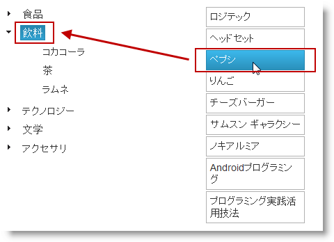
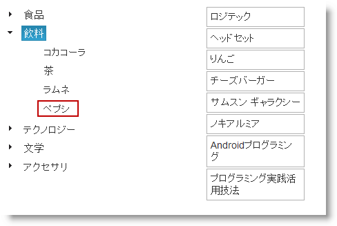
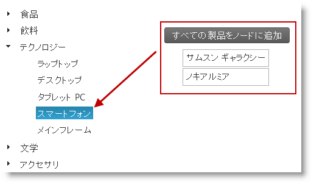
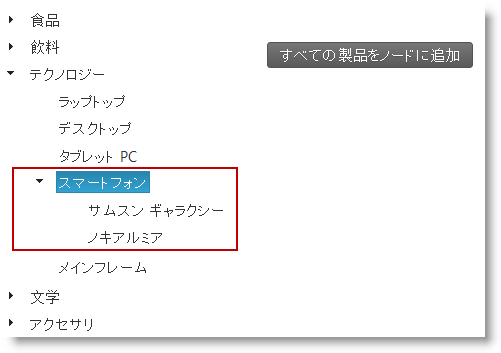
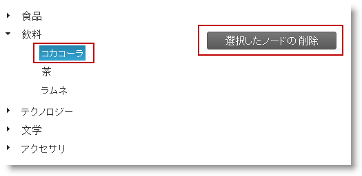
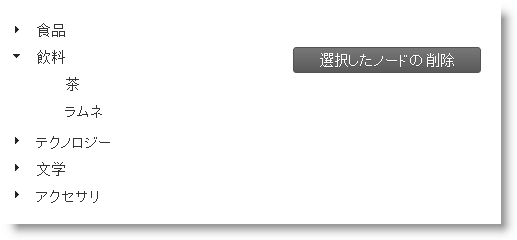
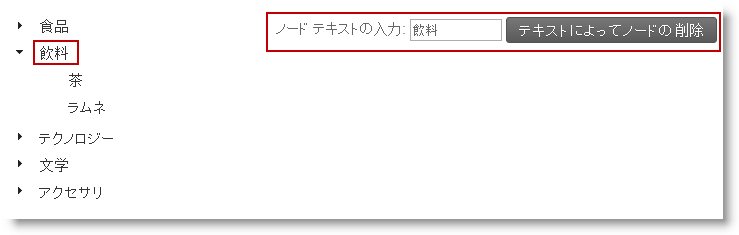
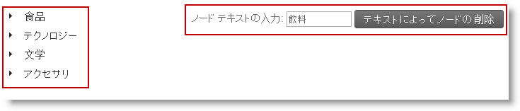

---
title: "ノード追加/削除の概要と例 (igTree)"
slug: igtree-adding-removing-nodes-overview-examples
---

# ノード追加/削除の概要と例 (igTree)

## トピックの概要
### 目的

ここでは、コード例とともに、`igTree`™ コントロールのノードをプログラム的に追加/削除する方法を説明します。

### 前提条件

このトピックを理解するために、以下のトピックを参照することをお勧めします。

- [igTree の概要](/igtree-overview): このトピックでは、機能、データ ソースとのバインド、要件、テンプレートなど、`igTree` コントロール関連の概念について説明します。


### このトピックの内容

このトピックは、以下のセクションで構成されます。

-   [概要](#introduction)
-   [コード例](#code-example)
-   [コード例: ツリーに新しいノードを追加](#add-new-node)
   -   [説明](#new-node-description)
    -   [コード](#new-node-code)
-   [コード例: ツリーに複数のノードを追加](#add-multiple-nodes)
-   -   [説明](#multiple-nodes-description)
    -   [コード](#multiple-nodes-code)
-   [コード例: 選択したノードをツリーから削除](#remove-selected-node)
   -   [説明](#selected-node-description)
    -   [コード](#selected-node-code)
-   [コード例: ツリーから値別にノードを削除](#remove-node-by-value)
   -   [説明](#node-by-value-description)
    -   [コード](#node-by-value-code)
-   [関連コンテンツ](#related-content)


## <a id="introduction"></a>概要
### ノードの追加と削除 (概要)

`igTree`™ コントロールでは、ノードの追加と削除をサポートしています。

ノードの追加

ノードに追加できる要素は、以下のとおりです。

-   ノード オブジェクト
-   配列オブジェクト
-   階層ノード

ノードの追加は、[addNode](/igtree-adding-removing-node-method-api-reference) メソッドで行います。

ノードの解除

ノードは以下のいずれかの方法で削除できます。

-   パス - ノードは [removeAt](/igtree-adding-removing-node-method-api-reference) で削除します。
-   値 - ノードは [removeNodesByValue](/igtree-adding-removing-node-method-api-reference) で削除します。


## <a id="code-example"></a>コード例

以下の表は、このトピックで使用したコード例をまとめたものです。

例|説明
---|---
[コード例: ツリーに新しいノードを作成](#add-new-node)|この例では、`igTree` コントロールのツリーに新しいノードを追加する方法を紹介します。
[コード例: ツリーに複数のノードを追加](#add-multiple-nodes)|この例では、選択したノードを取得して、ノードの配列をそのノードに追加する方法を紹介します。
[コード例: 選択したノードをツリーから削除](#remove-selected-node)|この例では、選択したノードを取得して、それを `igTree` から削除します。 
[コード例: ツリーから値別にノードを削除](#remove-node-by-value)|この例では、`igTree` から値別にノードを削除する方法を紹介します。


## <a id="add-new-node"></a>コード例: ツリーに新しいノードを追加
### <a id="new-node-description"></a>説明

この例では、`igTree` コントロールのツリーに新しいノードを追加する方法を紹介します。この例では、ノード Pepsi を取得し、選択したノードの下の HTML プレースから追加します。そのためには、`igTree` で選択したノードまでの参照を取得し、HTML リストから選択したノードに HTML リスト項目を追加します。

### プレビュー



 
### <a id="new-node-code"></a>コード

**JavaScript の場合:**

```js
var selectedNode = $("#tree").igTree("selectedNode").element;
// This returns a JSON object with the following structure:
// var newNode = {
//                  Text: "Pepsi",
//                  Value: 5
//               };
var newNode = clickedElement();
if (selectedNode != null) {
    // Adding the node to the tree
    $("#tree").igTree("addNode", newNode, selectedNode);
}
```

## <a id="add-multiple-nodes"></a>コード例: ツリーに複数のノードを追加
### <a id="multiple-nodes-description"></a>説明

この例では、`igTree` コントロールのツリーに複数のノードを追加する方法を紹介します。たとえば、HTML リストから全ノード セットを取得して、選択したノード下に設定するとしましょう。そのためには、`igTree` で選択したノードへの参照を取得し、HTML リストから選択したノード セットを追加します。この例では、新しいノードの値を生成するランダマイザーを使用します (インスタンスに数量を表示)。

### プレビュー




### <a id="multiple-nodes-code"></a>コード

**JavaScript の場合:**

```js
var selectedNode = $("#tree").igTree("selectedNode").element;
if (selectedNode != null) {
    // Creating an array of new nodes
    var newNodes = [];
    // Converting the HTML list to the array of nodes
        var list = $("ul#items li").each(function () {
            var item = $(this);
            // Pushing new items with random values representing quantities
            newNodes.push({
                Text: item.html(),
                Value: Math.floor(Math.random() * 1001)
            });
        });
    // Adding the array of nodes to the tree
    $("#tree").igTree("addNode", newNodes, selectedNode);
}
```


## <a id="remove-selected-node"></a>コード例: 選択したノードをツリーから削除
### <a id="selected-node-description"></a>説明

この例では、`igTree` コントロールのツリーから選択したノードを削除する方法を紹介します。まず、選択したノードまでの参照を `igTree` で取得し、そのパスで参照してノードを削除します。

### プレビュー



 
### <a id="selected-node-code"></a>コード

**JavaScript の場合:**

```js
var selectedPath = $("#tree").igTree("selectedNode").path;
if (selectedPath != null) {
    // Removing the selected node by path
    $("#tree").igTree("removeAt", selectedPath);
} 
```


## <a id="remove-node-by-value"></a>コード例: ツリーから値別にノードを削除
### <a id="node-by-value-description"></a>説明

この例では、`igTree` から値別にノードを削除する方法を紹介します。この例では、HTML 入力フィールドからユーザーが入力した値と一致する値のすべてのノードを削除します。まず値を取得し、値で参照してノードを削除します。

### プレビュー



 
### <a id="node-by-value-code"></a>コード

**JavaScript の場合:**

```js
var nodeValue = $("#nodeValue").val();
if (nodeValue) {
    // Removing all nodes with the provided value
    $("#tree").igTree("removeNodesByValue", nodeValue);                   
 }
```


## <a id="related-content"></a>関連コンテンツ
### トピック

このトピックの追加情報については、以下のトピックも合わせてご参照ください。

- [API リンク (igTree)](/igtree-jquery-and-asp-net-mvc-helper-api-links): ここでは、`igTree` jQuery と MVC API までのリンクを紹介します。

- [ノードの追加/削除メソッド API のリファレンス (igTree)](/igtree-adding-removing-node-method-api-reference): ここでは、`igTree` コントロールのノードを追加、削除するメソッドのリファレンスを紹介します。


### サンプル

このトピックについては、以下のサンプルも参照してください。

- [API およびイベント](/igtree-event-reference#attaching-handlers-jquery): このサンプルは `igTree` API を使用する方法を紹介します。


 

 


