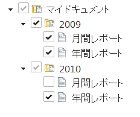
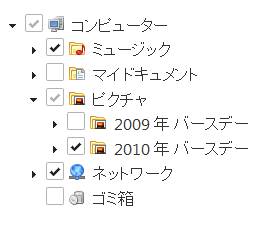

---
title: "チェックボックスおよび igTree による選択の構成"
slug: igtree-configure-checkboxes-and-selection
---

# チェックボックスおよび igTree による選択の構成

## トピックの概要
### 目的
このトピックでは、`igTree`™ コントロールで選択を構成する一般的な方法を説明します。

### このトピックの内容
このトピックは、以下のセクションで構成されます。

-   [igTree 構成の概要](#configuration-overview)
    -   [コントロールの構成表](#control-configuration-chart)
-   [チェックボックスを構成する](#configuring-checkboxes)
    -   [チェックボックス構成の概要](#checkboxes-configuration-overview)
    -   [チェックボックスのプロパティ設定](#checkboxes-property-settings)
    -   [例: tri-state チェックボックスを構成する](#configure-tri-state-checkboxes)
    -   [例: bi-state チェックボックスを構成する](#configure-bi-state-checkboxes)
    -   [チェックボックスのプロパティ参照を構成する](#configure-checkboxes-property-reference)
-   [オンにされたノードを取得する](#getting-checked-nodes)
    -   [オンにされたノードの概要](#checked_nodes_overview)
    -   [オンにされたノードを取得するプロパティ設定](#getting-checked-nodes-property-settings)
    -   [オンにされたすべてのノードを取得する](#get-all-checked-nodes)
-   [選択イベントとチェックボックス イベントを処理する](#handling-selection)
    -   [選択イベントとチェックボックス イベントの概要](#selection-and-checkbox-events-overview)
    -   [選択イベントとチェックボックス イベントのプロパティ設定](#selection-and-checkbox-events-property-settings)
    -   [例: インスタンス化中に選択イベントを構成する](#configuring-selction-events-during-instantiation)
    -   [例: live および bind で選択イベントとチェックボックス イベントを構成する](#configure-selection-and-checkbox-events-with-live-and-bind)
    -   [選択のキャンセル](#canceling-selection)
-   [関連トピック](#related-topics)

### 前提条件
以下の表は、このトピックを理解するために必要な前提条件です。

前提条件タイプ|コンテンツ
---|---
トピック|[「igTree を使用した作業の開始」](/controls/igtree/getting-started)というトピックを最初にお読みください。
外部リソース|まず [jQuery `bind()` API](http://api.jquery.com/bind/) 記事を読む必要があります。<br/>[jQuery `live()` API](http://api.jquery.com/live/)


## <a id="configuration-overview"></a>igTree 構成の概要 
### <a id="control-configuration-chart"></a>コントロールの構成表 
以下の表は、`igTree` コントロールの構成可能なビヘイビアーを示しています。


| 構成可能な動作 | 構成の詳細 | 構成プロパティ |
| --- | --- | --- |
| チェックボックスを構成する | `igTree` コントロールは bi-state チェックボックスと tri-state チェックボックスをサポートします。tri-state チェックボックスが有効な場合、親ノードはその子がすべてオン、すべてオフ、または部分的にオンになっているかどうか反映するために動的に更新します。 | checkboxMode |
| オンにされたノードを取得する | `igTree` コントロールは、オンにされたすべてのノード、オフにされたすべてのノード、および部分的に選択されたノードを取得する API を備えています。 | checkedNodes uncheckedNodes partiallyCheckedNodes |
| 選択イベントとチェックボックス イベントを処理する | 選択イベントをキャプチャし、発生している選択操作に対するロジックを実行します。 | selectionChanging selectionChanged nodeCheckstateChanging nodeCheckstateChanged |
| ノードを選択/選択解除する | これらのメソッドを使用して、コードからモードを選択および選択解除します。 | select(node) deselect(node) |


## <a id="configuring-checkboxes"></a>チェックボックスを構成する 
### <a id="checkboxes-configuration-overview"></a>チェックボックス構成の概要 
`igTree` コントロールは bi-state チェックボックスと tri-state チェックボックスをサポートします。tri-state チェックボックスが有効な場合、親ノードはその子がすべてオン、すべてオフ、または部分的にオンになっているかどうかを反映します。



## <a id="checkboxes-property-settings"></a>チェックボックスのプロパティ設定 
以下の表は、要求ビヘイビアーをプロパティ設定にマップしています。プロパティは `igTree` のオプション経由でアクセスされます。

目的|使用するプロパティ:|それを次に設定...
---|---|---
bi-state チェックボックスを有効にする|checkboxMode|biState
tri-state チェックボックスを有効にする|checkboxMode|triState

### <a id="configure-tri-state-checkboxes"></a>例: tri-state チェックボックスを構成する 
以下の画像は、以下の設定を行った後の tri-state チェックボックスを示しています。

プロパティ|設定|プレビュー
---|---|---
checkboxMode|triState|

### <a id="configure-bi-state-checkboxes"></a>例: bi-state チェックボックスを構成する 
以下の画像は、以下の設定を行った後の tri-state チェックボックスを示しています。

プロパティ|設定|プレビュー
---|---|---
checkboxMode|biState|

### <a id="configure-checkboxes-property-reference"></a>チェックボックスのプロパティ参照を構成する 
これらのプロパティの詳細情報は、プロパティ参照セクションのリストを参照してください。

-   [igTree オプション ](&#123;environment:jQueryApiUrl&#125;/ui.igtree#options)

## <a id="getting-checked-nodes"></a>オンにされたノードを取得する 
### <a id="checked_nodes_overview"></a>オンにされたノードの概要 
`igTree` は、オンにされたすべてのノード、オフにされたすべてのノード、および部分的に選択されたノードを取得する API を備えています。

### <a id="getting-checked-nodes-property-settings"></a>オンにされたノードを取得するプロパティ設定 
以下の表は、要求ビヘイビアーをプロパティ設定にマップしています。プロパティは、`igTree` メソッドからアクセスされます。

目的|このメソッドを使用:|戻り値...
---|---|---
オンにされたすべてのノードを取得する|checkedNodes|ノードの配列
オフにされたすべてのノードを取得する|uncheckedNodes|ノードの配列
部分的にオンにされたすべてのノードを取得する|partiallyCheckedNodes|ノードの配列

### <a id="get-all-checked-nodes"></a>オンにされたすべてのノードを取得する 
以下のコードは、以下の結果としてオンにされたすべてのノードを取得する方法を示しています。

メソッド|戻り値...
---|---
checkedNodes|ノードの配列

**HTML と ASPX の場合:**

```js
var nodes = $("#tree").igTree("checkedNodes");
```

## <a id="handling-selection"></a>選択イベントとチェックボックス イベントを処理する 
### <a id="selection-and-checkbox-events-overview"></a>選択イベントとチェックボックス イベントの概要 
選択イベントとチェックボックス イベントを処理することで、これらの操作に対するカスタム ロジックを実行できます。これらのイベントは、ウィジェットが bind または live jQuery 関数を使用して jQuery またはクライアントで初期化されるときに構成できます。

### <a id="selection-and-checkbox-events-property-settings"></a>選択イベントとチェックボックス イベントのプロパティ設定 
以下の表は、要求ビヘイビアーをプロパティ設定にマップしています。プロパティは、`igTree` イベントからアクセスされます。

目的|使用するプロパティ:|それを次に設定...
---|---|---
選択操作の前にイベントを処理する|selectionChanging|function()
選択操作の後にイベントを処理する|selectionChanged|function()
チェックボックス操作の前にイベントを処理する|nodeCheckstateChanging|function()
チェックボックス操作の前にイベントを処理する|nodeCheckstateChanged|function()

### <a id="configuring-selction-events-during-instantiation"></a>例: インスタンス化中に選択イベントを構成する 
以下のコードは、以下を使用して `igTree` のインスタンス化に選択を構成する方法を示しています。

プロパティ|設定
---|---
selectionChanged|function(evt, ui)&#123; &#125;
nodeCheckstateChanged|function(evt, ui)&#123; &#125;

**HTML の場合:**

```html
$("#tree").igTree({
    dataSource: data,
    checkboxMode: "triState",
    bindings: {
        textKey: 'Text',
        childDataProperty: 'Nodes'
    },
    selectionChanged: function (evt, ui) {
 
    },
    nodeCheckstateChanged: function (evt, ui) {
 
    }
});
```

### <a id="configure-selection-and-checkbox-events-with-live-and-bind"></a>例: live および bind で選択イベントとチェックボックス イベントを構成する 
以下のコードは、jQuery bind 関数と live 関数を使用して選択イベントとチェックボックス イベントを処理する方法を示しています。イベントの型は `igTree` をイベント名の先頭に付加して、小文字の文字列で構築します。

**HTML の場合:**

```html
$("#tree").bind("igtreeselectionchanging", function (evt, ui) {
 
});
 
$("#tree").live("igtreenodecheckstatechanged", function (evt, ui) {
                
});
```

## <a id="canceling-selection"></a>選択をキャンセルする 
以下のコードは、イベント ハンドラー関数から false を返すことで、選択操作をキャンセルする方法を示しています。`igTree` の -ing 関数に同じアプローチを使用できます。このコード例では、キャンセルは選択を行うかどうかを判断するアプリケーション ロジックのブール値結果を表します。

**HTML の場合:**

```html
$("#tree").live("igtreenodecheckstatechanging", function (evt, ui) {
    if (cancel == true)
        return false;         
});
```

## <a id="related-topics"></a>関連トピック 
以下は、その他の役立つトピックです。

-   [igTree API ドキュメント](&#123;environment:jQueryApiUrl&#125;/ui.igtree#!overview)
-   [igTree MVC API ドキュメント](Infragistics.Web.Mvc~Infragistics.Web.Mvc.TreeModel_members.html)

 

 


