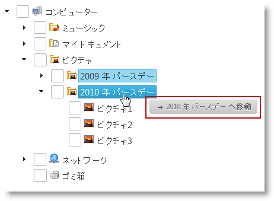
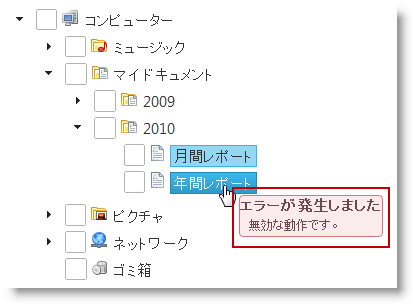

# ドラッグ ビジュアル トークンの外観の構成 (igTree)

## トピックの概要
### 目的

ここでは、コード例とともに、 Javascript と MVC の両方で `igTree`™ コントロールのドラッグ ビジュアル トークンの外観を構成する方法を説明します。

### 前提条件

このトピックを理解するために、以下のトピックを参照することをお勧めします。

- [ドラッグ アンド ドロップの概要 (igTree)](/igtree-drag-and-drop-overview): このトピックは、`igTree` コントロールのドラッグ アンド ドロップ機能の概要を提供します。

- [ドラッグ アンド ドロップの有効化 (igTree)](/igtree-drag-and-drop-enabling): このトピックは、コード例を示して、`igTree` コントロールでドラッグ アンド ドロップ機能を有効にする方法を説明します。

### このトピックの内容

このトピックは、以下のセクションで構成されます。

-   [概要](#introduction)
-   [ドラッグ アンド ドロップ ビジュアル トークンの外観の構成 (igTree)](#config-visual-token)
    -   [トークンの構成](#config-tokens)
    -   [構成の概要チャート](#config-summary-chart)
    -   [例](#config-example)
-   [コード例](#code-example)
-   [コード例: JavaScript におけるドラッグ ビジュアル トークンの外観の構成](#js-visual-token)
    -   [概要](#js-introduction)
    -   [プレビュー](#js-preview)
    -   [前提条件](#js-prerequisites)
    -   [概要](#js-overview)
    -   [手順](#js-steps)
-   [コード例: MVC におけるドラッグ ビジュアル トークンの外観の構成](#mvc-visual-token)
    -   [概要](#mvc-introduction)
    -   [プレビュー](#mvc-preview)
    -   [前提条件](#mvc-prerequisites)
    -   [概要](#mvc-overview)
    -   [手順](#mvc-steps)
-   [関連コンテンツ](#related-content)


## <a id="introduction"></a>概要
### ビジュアル トークの外観の構成概要

ビジュアル トークンとは、ノードをドラッグするときにマウス ポインターの下に表示されるヒント テキストです。ビジュアル トークンは、ノードが不正領域に移動、コピー、あるいはドロップされそうかどうかといった、ドラッグ アクションの現在の状態を示します。ビジュアル トークンの表示方法は、HTML マークアップでカスタマイズできます。

以下の図では、ビジュアル トークンのデフォルト (左) とカスタム (右) の外観を左右に並べて比較しています。右の図は、div 構造体と CSS スタイルでカスタマイズしたカスタム ビジュアル トークンの外観です。






## <a id="config-visual-token"></a>ドラッグ アンド ドロップ ビジュアル トークンの外観の構成 (igTree)
### <a id="config-tokens"></a>トークンの構成

ドラッグ アクションに構成できるトークンはいくつかあります。トークンは以下の要因を組み合わせて定義します。

-   ドラッグ アンド ドロップ アクションのタイプ:
    -   copy
    -   move
-   ドロップ場所のタイプ:
    -   別のノードの後 - ノードがその場所の最後のノードのとき
    -   別のノードの前 - ノードがその場所の最初のノードのとき
    -   2 つのノードの間
    -   別のノードの上に - ドラッグしたノードをドロップしたときにそのノードの兄弟/姉妹ノードになるとき
    -   不正領域へ

たとえば、別のノードの前にノードをコピーするビジュアル トークンがあり、もう 1 つは別のノードの後にコピーするビジュアル トークンがあり、さらに別のノードの前後にノードを移動する 2 つの別のビジュアル トークンなどの場合です。これらの組み合わせはいずれも特定のマークアップ プロパティで個別に処理します。

可能なすべての組み合わせとそれらを処理するプロパティについては、[構成概要チャート](#config-summary-chart)を参照してください。

### <a id="config-summary-chart"></a>構成の概要チャート

以下の表では、個々のドラッグ アンド ドロップ ビジュアル トークンを、HTML マークアップでそれらを構成する個々のプロパティにマップしています。

操作|位置|ビジュアル トークンを変更する状況:|使用するプロパティ:
---|---|---|---
copy|after|別のノードの後にノードをコピーしています。|copyAfterMarkup
copy|before|別のノードの前にノードをコピーしていします。|copyBeforeMarkup
copy|between|別のノードの間にノードをコピーしています。|copyBetweenMarkup
copy|onto|別のノードの上にノードをコピーしています。|copyToMarkup
move|after|別のノードの後にノードを移動しています。|moveAfterMarkup
move|before|別のノードの前にノードを移動しています。|moveBeforeMarkup
move|between|別のノードの間にノードを移動しています。|moveBetweenMarkup
move|onto|別のノードの上にノードを移動しています。|moveToMarkup
copy /move|invalid|不正領域にノードを移動しています。|invalidMoveToMarkup


### <a id="config-example"></a>例

この例では、以下のビジュアル トークンの構成方法を紹介します。

-   ドラッグしたノードを別のノードの後にコピーするトークン

コピー先:

-   デフォルト トークンより大型化します。
-   Heading 3 スタイルで書式設定したテキストを表示

技術|使用するプロパティ:|設定の選択肢:
---|---|---
JavaScript ファイル|copyAfterMarkup|`copyAfterMarkup: "<div class="message"><h3>Copy After</h3><p> {0}</p></div>"`
MVC|CopyAfterMarkup|`CopyAfterMarkup("<div class="message"><h3>Copy After</h3><p> {0}</p></div>");`


## <a id="code-example"></a>コード例
### コード例の概要

以下の表は、このトピックで使用したコード例をまとめたものです。

例|説明
---|---
[コード例: JavaScript におけるドラッグビジュアル トークンの外観の構成](#js-visual-token)|このプロシージャはドラッグ アンド ドロップ機能とともに `igTree` を初期化し、ドラッグ ビジュアル トークンの外観を変更し、それを JSON データにバインドします。
[コード例: MVC におけるドラッグ アンド ドロップ マークアップの構成](#mvc-visual-token)|このプロシージャはドラッグ アンド ドロップ機能とドラッグ ビジュアル トークンの外観とともに `igTree` を初期化し、それを XML ファイルにバインドします。


## <a id="js-visual-token"></a>コード例: JavaScript におけるドラッグ ビジュアル トークンの外観の構成
### <a id="js-introduction"></a>概要

このプロシージャはドラッグ ビジュアル トークンの外観を以下のように変更して、デフォルト トークンより大型化し、そのテキスト部分を見出しのように書式設定して表示します。そのための措置:

-   トークン プロパティを新しい HTML マークアップに設定 - div タグと div タグ内に h3 見出しタグ。
-   CSS でトークンのスタイル設定 - すべてのビジュアル トークンの幅を広げ、パディングを追加し、固定位置にトークンを構成します。h3 見出しタグのフォント サイズと重みを CSS で目的の設定に変更します。

### <a id="js-preview"></a>プレビュー

以下のスクリーンショットは最終結果のプレビューです。


### <a id="js-prerequisites"></a>前提条件

プロシージャを完成するには、HTML ファイルとともにデータ ソースにバインドした `igTree` コントロールのインスタンスが必要です。これには、ウォークスルーの項で取り上げたコードを利用します。

### <a id="js-overview"></a>概要

以下はプロセスの概念的概要です。

1. ドラッグ アンド ドロップ ビジュアル トークンのプロパティの構成

2. カスタム CSS の追加

### <a id="js-steps"></a>手順

以下の手順では、`igTree` でドラッグ アンド ドロップ機能を有効に構成し、ドラッグ ビジュアル トークンの外観を JavaScript で構成する方法を紹介します。

1. ドラッグ アンド ドロップ ビジュアル トークンのプロパティを構成します。

	1. `igTree` コントロールを初期設定したファイルに、 ドキュメント オブジェクト モデル (DOM) HTML 要素プレースホルダーを 定義します。

		**HTML の場合:**
				
```html
		 
		&lt;div id="tree"&gt; 
		</div> 
```
	
	2. `igTree`  でドラッグ アンド ドロップ機能をインスタンス化し、ドラッグ ビジュアル トークンを JavaScript に設定します。
	
		**JavaScript の場合:**
		
```js
		<script>
		$.ig.loader(function () {
		$("#tree").igTree({
			checkboxMode: 'triState',
			singleBranchExpand: true,
			dataSource: data,
			dataSourceType: 'json',
			initialExpandDepth: 0,
			pathSeparator: '.',
			bindings: {
				textKey: 'Text',
				valueKey: 'Value',
				imageUrlKey: 'ImageUrl',
				childDataProperty: 'Folder'
			},
			dragAndDrop: true,
			dragAndDropSettings: {
				invalidMoveToMarkup: "<div class="message"><h3>Ups, an error ocurred</h3><p> That is invalid action.</p></div>",
				moveToMarkup: "<div class="message"><h3>Move to</h3><p> {0}</p></div>",
				moveBetweenMarkup: "<div class="message"><h3>Move Between</h3><p> {0} and {1}</p></div>"
				moveAfterMarkup: "<div class="message"><h3>Move After</h3><p> {0}</p></div>",
				moveBeforeMarkup: "<div class="message"><h3>Move Before</h3><p> {0}</p></div>",
				copyToMarkup: "<div class="message"><h3>Copy to</h3><p> {0}</p></div>",
				copyBetweenMarkup: "<div class="message"><h3>Copy Between</h3><p> {0} and {1}</p></div>",
				copyAfterMarkup: "<div class="message"><h3>Copy After</h3><p> {0}</p></div>",
				copyBeforeMarkup: "<div class="message"><h3>Copy Before</h3><p> {0}</p></div>" 
				}
			});
		});
		</script>
```

2. カスタム CSS を追加します。

	1. CSS で、以下のように CSS プロパティを構成します。
	
		-   ビジュアル トークンの幅
		-   ビジュアル トークンのパディング
		-   ビジュアル トークンの固定位置
		-   見出しのタグ フォントのサイズと重み
	
	2. 構成した CSS を HTML ファイルに挿入します。**[プレビュー](#js-preview)で外観を設定するには、以下の CSS コードを使用します。**
	
		**CSS の場合:**
		
```css
		<style>
		.message
		{
		width: 300px;
		padding: 15px;
		position: fixed;
		}
		.message h3
		{
		font-size: 14px;
		font-weight: bold;
		}
		</style>
```


## <a id="mvc-visual-token"></a>コード例: MVC におけるドラッグ ビジュアル トークンの外観の構成
### <a id="mvc-introduction"></a>概要

このプロシージャはドラッグ ビジュアル トークンの外観を以下のように変更して、デフォルト トークンより大型化し、そのテキスト部分を見出しのように書式設定して表示します。
そのための措置:

-   トークン プロパティを新しい HTML マークアップに設定 - div タグと div タグ内に h3 見出しタグ。
-   CSS でトークンのスタイル設定 - すべてのビジュアル トークンの幅を広げ、パディングを追加し、固定位置にトークンを構成します。h3 見出しタグのフォント サイズと重みを CSS で目的の設定に変更します。

### <a id="mvc-preview"></a>プレビュー

以下のスクリーンショットは最終結果のプレビューです。


### <a id="mvc-prerequisites"></a>前提条件

この手順を実行するには、以下のリソースが必要です。

-   Microsoft® Visual Studio 2010 またははそれ以降のバージョンのインストール
-   MVC 3 Framework のインストール
-   bin フォルダーに追加した `Infragistics.Web.Mvc.dll` またはグローバル アセンブリー キャッシュ (GAC) までの参照。
-   内部にビューを定義した MVC プロジェクト
-   データ ソースにバインドした HTML ファイルと `igTree` コントロール のインスタンスこれには、ウォークスルーの項で取り上げたコードを利用します。

### <a id="mvc-overview"></a>概要

以下はプロセスの概念的概要です。

1. ドラッグ アンド ドロップ ビジュアル トークンのプロパティの構成

2. カスタム CSS の追加

### <a id="mvc-steps"></a>手順

以下の手順では、ドラッグ アンド ドロップ機能を有効にして `igTree` を構成し、ドラッグ ビジュアル トークンの外観を MVC で構成する方法を紹介します。

1. ドラッグ アンド ドロップ ビジュアル トークンのプロパティを構成します。

	ビューで、ドラッグ アンド ドロップ機能で  `igTree` をインスタンス化し、ドラッグ ビジュアル トークンを設定します。定義した `igTree` は、モデルからデータを取得します。
	
	**C# の場合:**
	
```csharp
	Purpose
	<script src="http://localhost/ig_ui/js/infragistics.loader.js" type="text/javascript"></script>
	@(Html.Infragistics()
		.Loader()
		.ScriptPath("http://localhost/ig_ui/js/")
		.CssPath("http://localhost/ig_ui/css/")
		.Render()
	)
	@(Html.
		Infragistics().
		Tree().
		ID("XMLTree").
		Bindings( bindings => {
			bindings.
			ValueKey("Value").
			TextKey("Text").
			ImageUrlKey("ImageUrl").
			ChildDataProperty("Folder");
		}).
		InitialExpandDepth(0).
		DataSource(Model).
		CheckboxMode(CheckboxMode.TriState).
		SingleBranchExpand(true).
		DragAndDrop(true).
		DragAndDropSettings(settings =>
		{
			// Configuring Drag-and-drop visual tokens
			settings.InvalidMoveToMarkup("<div class="message"><h3>Ups, an error ocurred</h3><p> That is invalid action.</p></div>").
			MoveToMarkup("<div class="message"><h3>Move to</h3><p> {0}</p></div>").
			MoveBetweenMarkup("<div class="message"><h3>Move Between</h3><p> {0} and {1}</p></div>").
			MoveAfterMarkup("<div class="message"><h3>Move After</h3><p> {0}</p></div>").
			MoveBeforeMarkup("<div class="message"><h3>Move Before</h3><p> {0}</p></div>").
			CopyToMarkup("<div class="message"><h3>Copy to</h3><p> {0}</p></div>").
			CopyBetweenMarkup("<div class="message"><h3>Copy Between</h3><p> {0} and {1}</p></div>").
			CopyAfterMarkup("<div class="message"><h3>Copy After</h3><p> {0}</p></div>").
			CopyBeforeMarkup("<div class="message"><h3>Copy Before</h3><p> {0}</p></div>");
		}).
		DataBind().
	Render()
	)
```

2. カスタム CSS を追加します。

	1. CSS で、以下のように CSS プロパティを構成します。
	
		-   ビジュアル トークンの幅
		-   ビジュアル トークンのパディング
		-   ビジュアル トークンの固定位置
		-   見出しのタグ フォントのサイズと重み
	
	2. 構成した CSS を HTML ファイルに挿入します。**[プレビュー](#mvc-preview)で外観を設定するには、以下の CSS コードを使用します。**
	
		**CSS の場合:**
		
```css
		<style>
		.message
		{
			width: 300px;
			padding: 15px;
			position: fixed;
		}
		.message h3
		{
			font-size: 14px;
			font-weight: bold;
		}
		</style>
```


## <a id="related-content"></a>関連コンテンツ
### トピック

このトピックの追加情報については、以下のトピックも合わせてご参照ください。

- [ドラッグ アンド ドロップ モードの構成 (igTree)](/igtree-drag-and-drop-configuring-mode): ここでは、コード例とともに、 Javascript と MVC の両方で `igTree` コントロールのドラッグ アンド ドロップ モードを構成する方法を紹介します。

- [カスタム ドロップ検証の構成 (igTree)](/igtree-drag-and-drop-configuring-custom-drop-validation): このトピックでは、コード例を使用して、 Javascript および MVC の両方で `igTree` コントロールのドラッグ アンド ドロップ機能のカスタム ドロップ検証を構成にする方法を紹介します。

- [ドラッグ アンド ドロップ API リファレンス (igTree)](../04_API Reference/~igTree_Drag-and-Drop_API_Reference.mdx): このグループのトピックは、`igTree` コントロールのドラッグ アンド ドロップ機能に関連するイベントとプロパティについての参照情報を提供します。


### サンプル

このトピックについては、以下のサンプルも参照してください。

- [ドラッグ アンド ドロップ - 単一のツリー](\{environment:SamplesUrl\}/tree/drag-and-drop-single-tree): このサンプルでは、`igTree` コントロールのドラッグ アンド ドロップ機能を有効にして初期化する方法を紹介します。

- [ドラッグ アンド ドロップ - 複数のツリー](\{environment:SamplesUrl\}/tree/drag-and-drop-multiple-trees): このサンプルでは、2 つの `igTree` の間にノードをドラッグ アンド ドロップする方法を紹介します。

- [API およびイベント](/igtree-event-reference#attaching-handlers-jquery): このサンプルは `igTree` API を使用する方法を紹介します。


 

 


