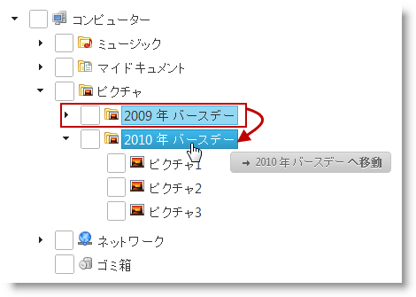

---
title: "ドラッグ アンド ドロップの概要 (igTree)"
slug: igtree-drag-and-drop-overview
---

# ドラッグ アンド ドロップの概要 (igTree)

## トピックの概要
### 目的 

ここでは、`igTree`™ コントロールのドラッグ アンド ドロップ機能の概要を紹介します。

### このトピックの内容 
このトピックは、以下のセクションで構成されます。  
                                       
-   [ドラッグ アンド ドロップ機能の紹介](#introduction)
   	-   [ドラッグ アンド ドロップ機能の概要](#drag-drop-features)
	-   [ドラッグ アンド ドロップ モード](#drag-drop-modes)
-   [ドラッグ アンド ドロップ機能を有効にする](#enable-drag-drop-feature)
-   [ドラッグ アンド ドロップ機能を構成する](#config-drag-drop-features)
-   [関連コンテンツ](#related-topics)          

## ドラッグ アンド ドロップ機能の紹介
### ドラッグ アンド ドロップ機能の概要

`igTree` コントロールのドラッグ アンド ドロップ機能では、ツリー ノードをドラッグ アンド ドロップできます。

ドラッグ アンド ドロップは、同じツリー内でも 2 つのツリー間でも操作できます。2 つの igTree コントロール間で動作するよう設定できます。

ドラッグ アンド ドロップ移動 (コピーまたは貼り付け) 時に実行するアクションを指定できます。また、2 つの間から選択するオプションもあります。機能は、`igTree` コントロールを構成すると、サポートしている[ドラッグ アンド ドロップ モード](#drag-drop-modes)のどれかに構成して管理します。

ドラッグ アンド ドロップ移動のカスタム検証ロジックも用意しています。このロジックは、移動の“ドロップ”部分に実装しています。(詳細については、[ドラッグ アンド ドロップ機能の構成](#config-drag-drop-features)を参照してください。)

### ドラッグ アンド ドロップ モード

ドラッグ アンド ドロップ モードは、ドラッグ アンド ドロップ アクションで、ドラッグしたノードをコピーか移動するか、またどちらのアクションを実行するかを選択できるかを指定します。以下の表では、サポートしているドラッグ アンド ドロップ モードを説明しています。

ドラッグ アンド ドロップ モード|説明
---|---
デフォルト (デフォルト値)|デフォルトで、ドラッグ アンド ドロップ アクションではノードを移動します。Ctrl キーを押してドラッグ アンド ドロップを実行すると、移動する代わりにそのノードをコピーします。
コピー|ドラッグ アンド ドロップ アクションでノードをコピーします。ユーザーは Ctrl キーでラッグ アンド ドロップ アクションを変更することはできません。(Ctrl キーは無効です。)
移動|ドラッグ アンド ドロップ アクションでノードを移動します。ユーザーは Ctrl キーでラッグ アンド ドロップ アクションを変更することはできません。(Ctrl キーは無効です。)

## ドラッグ アンド ドロップ機能を有効にする

デフォルトでは、ドラッグ アンド ドロップ機能は無効です。ドラッグ アンド ドロップ機能を有効にするには、`dragAndDrop` プロパティを true に します。詳細については、[ドラッグ アンド ドロップを有効にする (`igTree`)](/igtree-drag-and-drop-enabling) を参照してください。

## ドラッグ アンド ドロップ機能を構成する
### ドラッグ アンド ドロップ機能を構成する (概要チャート)

以下の表では、`igTree` コントロールのドラッグ アンド ドロップ機能の主な特徴をまとめました。追加の詳細は、以下の概要表の下に示します。

構成可能な要素|説明
---|---
ツリー間のドラッグ アンド ドロップのサポート|`igTree` コントロールには、他の `igTree` コントロールからのドラッグ アンド ドロップを受け付けるかどうかを指定できます。詳細については、[ドラッグ アンド ドロップを有効にする (igTree)](/igtree-drag-and-drop-enabling) を参照してください。
ドラッグ アンド ドロップ モード|ドラッグ アンド ドロップ モードを指定します。詳細については、[ドラッグ アンド ドロップを構成する (igTree)](/igtree-drag-and-drop-configuring-mode) を参照してください。
ドロップ検証|ドラッグ中のノードのドロップ アクションを検証するカスタム検証機能を指定できます。
ドラッグ ビジュアル トークンの外観|ノードのドラッグ中はトークン要素が表示されます。この要素は、ノードを移動するのか、コピーするのか、あるいはその時点では無効であるかを示します。トークンの外観はマークアップ設定でカスタマイズできます。
遅延|ドラッグ アンド ドロップのマウス アクションに対してさまざまな遅延時間を指定できます。たとえば、マウスの左ボタンを押した後に遅延を設定することで、要素をクリックしたときに生じる不要なドラッグを防ぐことができます。
取り消しアニメーション|ドロップ アクションが失敗したときは、ノードを元の位置に戻すアニメーションを表示できます。この取り消しアニメーションは有効/無効のほか、その再生時間を指定できます。

## 関連コンテンツ
### トピック

このトピックの追加情報については、以下のトピックも合わせてご参照ください。

- [ドラッグ アンド ドロップの有効化 (igTree)](/igtree-drag-and-drop-enabling): このトピックは、コード例を示して、`igTree` コントロールでドラッグ アンド ドロップ機能を有効にする方法を説明します。

- [ドラッグ アンド ドロップの構成 (igTree)](/igtree-drag-and-drop-configuring): ここでは、コード例とともに、 Javascript と MVC の両方で `igTree` コントロールのドラッグ アンド ドロップを構成する方法を紹介します。

- [ドラッグ アンド ドロップ API リファレンス (igTree)](./04_API Reference/~igTree_Drag-and-Drop_API_Reference.mdx): このグループについては、`igTree` コントロールのドラッグ アンド ドロップ機能のさまざまな側面の構成方法を説明します。

### サンプル

このトピックについては、以下のサンプルも参照してください。

- [ドラッグ アンド ドロップ - 単一のツリー](&#123;environment:SamplesUrl&#125;/tree/drag-and-drop-single-tree): このサンプルでは、`igTree` コントロールのドラッグ アンド ドロップ機能を有効にして初期化する方法を紹介します。

- [ドラッグ アンド ドロップ - 複数のツリー](&#123;environment:SamplesUrl&#125;/tree/drag-and-drop-multiple-trees): このサンプルでは、2 つの `igTree` の間にノードをドラッグ アンド ドロップする方法を紹介します。

- [API およびイベント](/igtree-event-reference#attaching-handlers-jquery): このサンプルは `igTree` API を使用する方法を紹介します。

 

 

