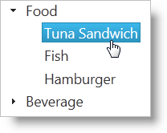

# igTree を使用した作業の開始


## トピックの概要
### 目的

`igTree`™ コントロールは、jQuery または ASP.NET MVC を使用して動作するよう構成できます。このトピックは、クライアントの JSON データおよびサーバーのビジネス オブジェクトのコレクションにバインドしている各環境で `igTree` コントロールを設定する方法を示しています。

### 前提条件
まず以下のトピックを読む必要があります。

-   [&#123;environment:ProductName&#125; で JavaScript リソースを使用](/deployment-guide-javascript-resources)
-   [&#123;environment:ProductName&#125; のスタイル設定とテーマ設定](/deployment-guide-styling-and-theming)

## 基本的な igTree 実装を作成する
### 概要
以下の手順は基本オプションの構成方法と、jQuery および ASP.NET MVC の両方を使用したデータへのバインド方法を示しています。

### プレビュー
以下は最終結果のプレビューで、ツリーが階層データにバインドされています。



### 概要
以下はプロセスの概念的概要です。

1.  [igTree をインスタンス化する](#instantiating-the-igtree)
2.  [データ バインド](#binding-to-data)
3.  [バインディングを構成する](#configuring-bindings)
4.  [(オプション) singleBranchExpand オプションを構成する](#configuring-singlebranchexpand)

### 手順
1.  <a id="instantiating-the-igtree"></a>`igTree` をインスタンス化します。
    1.  ターゲット要素を設定します。

        Web ページで、igTree コントロールのベース オブジェクトとしての役割を果たすターゲットの HTML 要素を定義し、その ID を設定します。これは ASP.NET MVC のオプション手順です。

        **HTML の場合:**

```html
        <div id="JSONTree"></div>
```

    2.  `igTree` をインスタンス化します。

        jQuery では、document ready JavaScript イベントを使用して igTree コントロールをインスタンス化できます。ASP.NET MVC では、&#123;environment:ProductNameMVC&#125; ヘルパーを使用して、IQueryable データ ソースにバインドします。

        **HTML の場合:**

```html
        <script type="text/javascript">
                $(function () {
                    $("#JSONTree").igTree({

                    });
                });
        </script>
```

        **ASPX の場合:**

```csharp
        <%= Html.
            Infragistics().
            Tree().
            Render()  
        %>
```

2.  <a id="binding-to-data"></a>データへバインドします。
    1.  データを定義します。

        この例では、入れ子になったオブジェクト配列で構築されている JSON 配列にバインドしています。オブジェクト スキーマは 2 種類あります。1 つは Label and Products プロパティを持つ製品カテゴリのスキーマ、もう 1 つは Name プロパティのある製品のスキーマです。Products プロパティに入れ子になったデータが入っています。この構造は、igTree コントロールの階層を形成しています。ASP.NET MVC では、入れ子になった IQueryable オブジェクトのコレクションは &#123;environment:ProductNameMVC&#125; ヘルパーにより受け入れられます。Entity Data Model と LINQ により、この構造を簡単に igTree コントロールに指定できます。サンプルという目的のため、オブジェクトのコレクションにバインドする場合に &#123;environment:ProductNameMVC&#125; ヘルパーで必要なデータの構造を示すため、サンプル データ コードを下に示します。ProductCategory クラスは JSON 配列同様に、Label プロパティと Products プロパティで定義されます。GetProductNodes メソッドは &#123;environment:ProductNameMVC&#125; へルパーのデータを返します。データはビューの Model として渡されていることがわかると思います。

        **HTML の場合:**

```html
        var data = [
            { Label: 'Food', Products: [
                { Name: 'Tuna Sandwich' },  
                { Name: 'Fish' },
                { Name: 'Hamburger' }
            ]},
            { Label: 'Beverage', Products: [
                { Name: 'Coke' },
                { Name: 'Pepsi' }
            ]}];
```

        **C# の場合:**

```csharp
        public class SamplesController : Controller
        {
            //This class defines the object to which the nodes are bound
            public class ProductCategory
            {
                private string _label;
                private List<Product> _products;
         
                public string Label { get { return _label; } }
         
                public IQueryable<Product> Products
                {
                    get
                    {
                        return _products.AsQueryable();
                    }
                }
         
                public ProductCategory(string label, List<Product> products)
                {
                    if (products == null)
                        products = new List<Product>();
                    this._products = products;
                    this._label = label;
                }
         
                public ProductCategory() { }
            }
         
            public class Product
            {
                public string Name { get; set; }
         
                public Product(string name)
                {
                    this.Name = name;
                }
         
                public Product() { }
            }
         
            //This method creates the collection of data for binding
            public IQueryable<ProductCategory> GetProductCategories()
            {
                return new List<ProductCategory>()
                {
                    new ProductCategory("Food",
                        new List<Product>{
                            new Product("Tuna Sandwich"),                            
                            new Product("Fish"),
                            new Product("Hamburger")
                        }),
                    new ProductCategory("Beverage",
                        new List<Product>{
                            new Product("Coke"),
                            new Product("Pepsi")
                        })
                }.AsQueryable();
            }
```

    2.  データ ソースを設定します

        dataSource オプションを使用してデータをツリーに提供します。ASP.NET MVC では Action Method を使用して、ビューとデータを返します。ヘルパーの DataSource メソッドを使用して、Model として渡されたデータへバインドし、DataBind() メソッドを呼び出します。

        **HTML の場合:**

```html
        dataSourceType: 'json',
        dataSource: data
```

        **ASPX の場合:**

```csharp
        DataSource(this.Model).
        DataBind()
```

        **C# の場合:**

```csharp
        //Send the data with the View
        public ActionResult Mvc()
        {
            return View("mvc", GetProductCategories());
        }
```

    3.  (ASP.NET MVC) Render() を呼び出します。

        &#123;environment:ProductNameMVC&#125; Tree をインスタンス化する場合、他のオプションをすべて構成し終わった後、最後に Render メソッドを呼び出します。これは、クライアントで igTree をインスタンス化するのに必要な HTML および JavaScript を描画するメソッドです。

        **ASPX の場合:**

```csharp
        Render()
```

3.  <a id="configuring-bindings"></a>バインディングを構成します。

    バインドされたデータの各フィールドが階層でどのように機能するか igTree コントロールが判断できるようにするには、バインディング オブジェクトを igTree で表示する必要がある型ごとに構成する必要があります。このサンプルでは、ProductCategory オブジェクトと Product オブジェクトを表す 2 つのバインディング オブジェクトが定義されています。このサンプルにあるバインディング オブジェクトは、テキストの表示だけでなく、どのプロパティが子データを公開するかメモするよう構成されています。

    **HTML の場合:**

```html
    bindings: {
        textKey: 'Label',
        childDataProperty: 'Products',
        bindings: {
            textKey: 'Name'
        }
    }
```

    **ASPX の場合:**

```csharp
    Bindings( bindings => {
        bindings.
        TextKey("Label").      
        ChildDataProperty("Products").
        Bindings( bindings2 => {
            bindings2.
            TextKey("Name");
        });
    })
```

4.  <a id="configuring-singlebranchexpand"></a>(オプション) `singleBranchExpand` オプションを構成する。

    igTree コントロールの使用可能な高さが制約される可能性があるページで igTree コントロールを動作させるため、singleBranchExpand オプションを設定できます。このオプションは、展開できる親ノードの量を一定期間 1 つに制限します。ノードが展開されると、そのレベルの他のノードは縮小されます。

    **HTML の場合:**

```html
    singleBranchExpand: true,
```

    **ASPX の場合:**

```csharp
    SingleBranchExpand(true)
```      

## コード例
### 例の概要
以下の表は、以下に提供されたコード例を示しています。

例|説明
---|---
基本的な jQuery の実装|jQuery でのデータへのバインド方法と基本オプションの設定方法を示します。
基本的な ASP.NET MVC の実装|&#123;environment:ProductNameMVC&#125; を使用したデータへのバインド方法と基本オプションの設定方法を示します。

## コード例: 基本的な jQuery の実装
### 例の詳細

以下のコードは、jQuery で `igTree` を作成し、構成する方法を示します。

>**注:** さまざまなテキスト キー値が各種バインディング オブジェクトで設定され、さまざまなレベルのデータを表します。

**HTML の場合:**

```html
<script type="text/javascript">
    var data = [
    { Label: 'Food', Products: [
        { Name: 'Tuna Sandwich' },
        { Name: 'Fish' },
        { Name: 'Hamburger' }
    ]
    },
    { Label: 'Beverage', Products: [
        { Name: 'Coke' },
        { Name: 'Pepsi' }
    ]
    }];
 
    $(function () {
        $("#tree").igTree({
            dataSource: data,
            singleBranchExpand: true,
            bindings: {
                textKey: 'Label',
                childDataProperty: 'Products',
                bindings: {
                    textKey: 'Name'
                }
            }
        });
    });
</script>
```

## コード例: 基本的な ASP.NET の実装
### 例の詳細

以下のコードは、ASP.NET MVC ヘルパーを使用して &#123;environment:ProductNameMVC&#125; `Tree` を作成し、構成する方法を示します。

>**注:** さまざまなテキスト キー値が各種バインディング オブジェクトで設定され、さまざまなレベルのデータを表します。

**ASPX の場合:**

```csharp
<%= Html.
    Infragistics().
    Tree().
    ID("tree").
    DataSource(this.Model).
    SingleBranchExpand(true).
    Bindings( bindings => {
        bindings.
        TextKey("Label").      
        ChildDataProperty("Products").
        Bindings( bindings2 => {
            bindings2.
            TextKey("Name");
        });
    }).
    DataBind().
    Render()       
%>
```

**C# の場合:**

```csharp
public class SamplesController : Controller
{
    //This class defines the object to which the nodes are bound
    public class ProductCategory
    {
        private string _label;
        private List<Product> _products;
 
        public string Label { get { return _label; } }
 
        public IQueryable<Product> Products
        {
            get
            {
                return _products.AsQueryable();
            }
        }
 
        public ProductCategory(string label, List<Product> products)
        {
            if (products == null)
                products = new List<Product>();
            this._products = products;
            this._label = label;
        }
 
        public ProductCategory() { }
    }
 
    public class Product
    {
        public string Name { get; set; }
 
        public Product(string name)
        {
            this.Name = name;
        }
 
        public Product() { }
    }
 
    //This method creates the collection of data for binding
    public IQueryable<ProductCategory> GetProductCategories()
    {
        return new List<ProductCategory>()
    {
        new ProductCategory("Food",
            new List<Product>{
                new Product("Tuna Sandwich"),                            
                new Product("Fish"),
                new Product("Hamburger")
            }),
        new ProductCategory("Beverage",
            new List<Product>{
                new Product("Coke"),
                new Product("Pepsi")
            })
    }.AsQueryable();
    }
 
    //Send the data along with the View
    public ActionResult Mvc()
    {
        return View("mvc", GetProductCategories());
    }
}
```

## 関連トピック
以下は、その他の役立つトピックです。

-   [&#123;environment:ProductName&#125; で JavaScript リソースを使用](/deployment-guide-javascript-resources)
-   [&#123;environment:ProductName&#125; のスタイル設定とテーマ設定](/deployment-guide-styling-and-theming)

 

 


