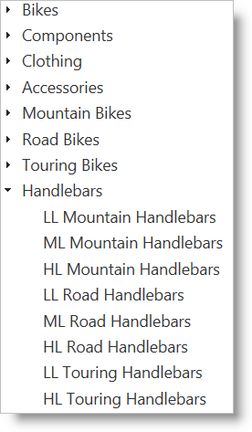
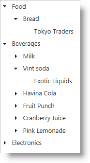

import ApiLink from 'docs-template/components/mdx/ApiLink.astro';

# igTree のパフォーマンスを最適化します
## トピックの概要
### 目的
`igTree`™ コントロールは、ノードが展開している時に必要に応じてデータを要求するためのロード オン デマンドをサポートします。この動作によって、ページの最初のロードで要求されたデータ量を制限することができ、エンド ユーザーに対して高いパフォーマンスが実現されます。

### このトピックの内容
このトピックは、以下のセクションで構成されます。

-   [**コントロールの構成の概要**](#control-configuration-overview)
    -   [コントロールの構成表](#control-configuration-chart)
-   [**ロードオンデマンドを有効にする**](#enable-load-on-demand)
    -   [ロード オン デマンドの詳細](#enable-load-on-demand-details)
    -   [ロード オン デマンドの構成設定](#load-on-demand-configuration-settings)
    -   [例: 基本的なロード オン デマンド](#load-on-demand-example)
    -   [ロード オン デマンド](#enable-load-on-demand)
	-   [リモート ロードオンデマンド](#enable-remote-load-on-demand)
-   [**ASP.NET MVC のロード オン デマンドの構成**](#configure-load-on-demand-for-mvc)
    -   [ASP.NET MVC のロード オン デマンドの詳細](#configure-load-on-demand-mvc-details)
    -   [ASP.NET MVC のロード オン デマンドのプロパティ設定](#load-on-demand-mvc-property-settings)
    -   [例: ASP.NET MVC を使用したロード オン デマンド](#load-on-demand-mvc-example)
-   [**OData のロード オン デマンドの構成**](#configure-load-on-demand-odata)
    -   [OData のロード オン デマンドの詳細](#configure-load-on-demand-odata-details)
    -   [OData のロード オン デマンドのプロパティ設定](#configure-load-on-demand-odata-property-settings)
    -   [例: OData を使用したロード オン デマンド](#configure-load-on-demand-odata-example)
-   [**関連トピック**](#related-topics)

### 前提条件
以下の表は、このトピックの情報を完全に理解するために前提条件を示しています。

以下の概念を理解する必要があります。

-   JSONP
-   オプション
    - ASP.NET MVC
    -   アクション メソッド

**トピック**

まず以下のトピックを読む必要があります。

-   [igTree の概要](/igtree-overview)
-   [igTree を使用した作業の開始](/igtree-getting-started)

**外部リソース**

まず以下のセクションを読む必要があります。

-   [OData: URI 規約](http://www.odata.org/documentation/odata-version-3-0/url-conventions/)

## <a id="control-configuration-overview"></a>コントロールの構成の概要 
### <a id="control-configuration-chart"></a>コントロールの構成表 
以下の表は、コントロールの構成可能な動作を示しています。

構成可能な動作|構成の詳細|構成プロパティ
---|---|---
[ロードオンデマンドを有効にする](#enable-load-on-demand)|ロード オン デマンドを有効にすると、ノードが展開された時に必要な HTML 要素のみを作成するようツリーは指示されます。|<ApiLink type="igTree" member="loadOnDemand" section="options" label="loadOnDemand" /> <br/>  <ApiLink type="igTree" member="dataSourceUrl" section="options" label="dataSourceUrl" />(オプション)
[ASP.NET MVC のロード オン デマンドの構成](#configure-load-on-demand-for-mvc)|ASP.NET MVC コントローラーで JSON を返すようにアクション メソッドを設定することによって、ノードが展開した時に新しいデータをリモートでフェッチすることができます。|<ApiLink type="igTree" member="loadOnDemand" section="options" label="loadOnDemand" /><br/><ApiLink type="igTree" member="dataSourceUrl" section="options" label="dataSourceUrl" />
[OData のロード オン デマンドの構成](#configure-load-on-demand-odata)|`igTree` コントロールに OData データ ソースを提供する際、ロード オン デマンドを有効にすると、サービスを呼び出して次のレベルのデータを取得するよう、`igTree` は指示されます。|<ApiLink type="igTree" member="loadOnDemand" section="options" label="loadOnDemand" /><br/><ApiLink type="igTree" member="dataSourceUrl" section="options" label="dataSourceUrl" /><br/><ApiLink type="igTree" member="responseDataKey" section="options" label="responseDataKey" /> <br/><ApiLink type="igTree" member="responseDataType" section="options" label="responseDataType" />


## <a id="enable-load-on-demand"></a>ロードオンデマンドを有効にする 
### <a id="enable-load-on-demand-details"></a>ロード オン デマンドの詳細 
ロード オン デマンドは、`igTree` コントロールの動作に様々なパフォーマンス強化を提供します。クライアントでロード オン デマンドを有効にすることによって、データを表示する必要がある場合に、ツリーはオン デマンドで HTML 要素を作成します。最初にビューから非表示になったノードには HTML 要素が作成されません。<ApiLink type="igTree" member="dataSourceUrl" section="options" label="dataSourceUrl" /> を使用してロード オン デマンドを有効にすると、オン デマンドでデータがサーバーから取得されます。

### <a id="load-on-demand-configuration-settings"></a>ロード オン デマンドの構成設定 
以下の表は、プロパティ設定の推奨構成をマップしています。プロパティは `igTree` のオプション経由でアクセスされます。

目的|使用するプロパティ:|それを次に設定...
---|---|---
ロードオンデマンドを有効にする|<ApiLink type="igTree" member="loadOnDemand" section="options" label="loadOnDemand" />|true
|<ApiLink type="igTree" member="dataSourceUrl" section="options" label="dataSourceUrl" /> | カスタム アクション メソッドの文字列 Url (オプション)

### <a id="load-on-demand-example"></a>例: 基本的なロード オン デマンド 
以下のコードでは、以下の設定の結果としてロード オン デマンドを有効にしています。

プロパティ|設定
---|---
loadOnDemand|true

**HTML の場合:**

```html
<script type="text/javascript">
    $(function () {
        $("#treeTarget").igTree({
            dataSource: data,
            loadOnDemand: true
        });
    });
</script>
```

### <a id="enable-remote-load-on-demand"></a> リモート ロードオンデマンド
<ApiLink type="igTree" member="dataSourceUrl" section="options" label="dataSourceUrl" /> オプションもリモート アドレスに設定できます。展開しているノードの子を生成するために、`igTree` はそのエンドポイントに非同期 GET 要求を実行します。
ASP.NET MVC TreeModel を使用して、データ応答の準備を自動的に処理できます。「[例: ASP.NET MVC でのロードオンデマンド](#load-on-demand-mvc-example)」セクションを参照してください。

プラットフォームに関係なしで要求を手動的に処理するには、ウィジェットが送信する 3 つのパラメーターを処理する必要があります。 
パラメーターは、`path` プロパティ、`binding` 情報、および階層の `depth` レベルです。以下のように書式されます。
```
<dataSourceUrl>?&path=CategoryID:8/@Products&binding=textKey:ProductName,primaryKey:ProductID,valueKey:ProductID,childDataProperty:Order_Details&depth=0
```
最初のパラメーターは、展開されているノードのプライマリ キーおよび要求されている子データ フィールドを含む `path` です。
「/」によって分割され、プライマリ キーの名前と値を取得するために文字列の最初の部分が「:」によって分割されます。
文字列の 2 つ目の部分の `@Property` は、表で検索しているフィールド (ナビゲーション プロパティ) です。
上の要求例は以下の基本クエリになります。
```sql
SELECT Products FROM Context WHERE CategoryID == 8
```
実際の 'Context' は `depth` パラメーターから決定されます。
この例で、'0' 値は階層の最初の表 (Categories 表) です。
子ノードが展開された場合:
```
<dataSourceUrl>?&path=ProductID:1/@Order_Details&binding=textKey:OrderID,valueKey:OrderID&depth=1`
```
`depth` は '1' で、クエリは Products 表に実行されます。

> **注:** プライマリ キーの使用が推薦されます。使用しない場合、ロードオンデマンド要求はノード インデックスを path として使用します。データ ソースが変更可能、あるいはクライアントに送信する前に変更された場合は正しくない可能性があります。

`binding` パラメーターは、コントロールに送信するオブジェクト プロパティの名前/値ペアを提供します。
オブジェクト プロパティは「:」によって分割されます。最初の部分は相対する <ApiLink type="igTree" member="bindings" section="options" label="bindings" /> オプションの名前で、第 2 の値は割り当てられたフィールドと一致します。
すべての予期されているプロパティがクライアントに送信されることを確認またはペイロード サイズを減らすために必須フィールドのみ応答を変換できます。

## <a id="configure-load-on-demand-for-mvc"></a>ASP.NET MVC のロード オン デマンドの構成 
### <a id="configure-load-on-demand-mvc-details"></a>ASP.NET MVC のロード オン デマンドの詳細 
ロード オン デマンドを有効にし、コントローラーでアクション メソッドを設定することによって、ASP.NET MVC アプリケーションから、リモートのロード オン デマンドを有効にする `igTree` へ、動的にデータを提供することができます。`igTree` の `dataSourceUrl` をアクション メソッドの url に設定することによって、この接続が作成されます。

###<a id="load-on-demand-mvc-property-settings"></a> ASP.NET MVC のロード オン デマンドのプロパティ設定 
以下の表では、望ましい構成をプロパティ設定にマップしています。プロパティは `igTree` オプション経由でアクセスされます。

目的|使用するプロパティ:|それを次に設定...
---|---|---
ASP.NET MVC のロード オン デマンドの構成|<ApiLink type="igTree" member="loadOnDemand" section="options" label="loadOnDemand" /><br/><ApiLink type="igTree" member="dataSourceUrl" section="options" label="dataSourceUrl" />|true<br/>カスタム アクション メソッドの文字列 Url

###<a id="load-on-demand-mvc-example"></a>例: ASP.NET MVC を使用したロード オン デマンド 
#### 概要

この手順では、ASP.NET MVC のロード オン デマンドを構成するために必要な、`igTree` のプロパティを有効にする方法を示しています。また、バインディングの構成方法、ロード オン デマンドの操作中にロジックを実行して適切なデータをクライアントに返す方法を示しています。

AdventureWorks データベースを使用して、親ノードとして製品カテゴリを、子ノードとして製品を示す `igTree` を作成します。

#### プレビュー

以下は最終結果のプレビューです。



#### 要件

この手順を実行するには、以下が必要です。

-   ASP.NET MVC アプリケーション
-   [AdventureWorks データベース](http://msftdbprodsamples.codeplex.com/releases/view/37109)
-   ProductCategory および Product テーブルを含む EntityDataModel
-   基本的な ASP.NET `igTree` の実装

#### 概要

以下はプロセスの概念的概要です。

1.  バインディングの構成
2.  初期ロードのデータ ソースの構成
3.  オン デマンドでデータを返すためのアクション メソッドの構成
4.  ロード オン デマンドのデータ ソース URL の構成

#### 手順

1.  **バインディングを構成します。**
    1.  **ProductCategory ノードのバインディングを構成します。**

        **ASPX の場合:**

```csharp
        <%= Html.
            Infragistics().
            Tree(). 
            Bindings( bindings => {
                bindings.
                TextKey("Name").
                PrimaryKey("ProductCategoryID").
                ValueKey("ProductCategoryID");        
            }).
            Render()       
        %>
```

    2.  **子 Product ノードのバインディングを構成します。**

        ProductCategory バインディング オプションの ChildDataProperty を設定します。また、バインディング オプションを ProductCategory バインディング オプションに追加して、Products テーブルのバインディングを定義します。

        **ASPX の場合:**

```csharp
        <%= Html.
            Infragistics().
            Tree(). 
            Bindings( bindings => {
                bindings.
                TextKey("Name").
                PrimaryKey("ProductCategoryID").
                ValueKey("ProductCategoryID").
                ChildDataProperty("Products").
                Bindings(b1 =>
                {
                    b1.
                    TextKey("Name")
                    .ValueKey("ProductID")
                    .PrimaryKey("ProductID");
                });
            }).
            Render()       
        %>
```

2.  **ビューを返すアクション メソッドを使用して、初期ローディングのデータ ソースを設定します。**

    1.  **アクション メソッドのデータを取得します。**

        アクション メソッドで ProductCategories を取得し、それらをビューのモデルとして返します。

        **C# の場合:**

```csharp
        public class SamplesController : Controller
        {
            //Send the data along with the View
            public ActionResult Mvc()
            {
                var ctx = new AdventureWorksEntities();
                return View("mvc", ctx.ProductCategories.AsQueryable());
            }
        }
```

    2.  **ASP.NET MVC でデータ ソースを設定します。**

        MVC API を使用して `igTree` のデータ ソースを設定します。

        **ASPX の場合:**

```csharp
        <%= Html.
            Infragistics().
            Tree(). 
            Bindings( bindings => {
                bindings.
                TextKey("Name").
                PrimaryKey("ProductCategoryID").
                ValueKey("ProductCategoryID").
                ChildDataProperty("Products").
                Bindings(b1 =>
                {
                    b1.
                    TextKey("Name")
                    .ValueKey("ProductID")
                    .PrimaryKey("ProductID");
                });
            }).
            DataSource(this.Model).
            DataBind().
            Render()       
        %>
```

3.  **オンデマンドでデータを返すためのアクション メソッドを構成します。**

    必要なアクション メソッドは、いくつかの異なる部分で構成されます。まず、JSON の結果を返します。2 番目に、要求から、パス、バインディング、および深度の 3 つのパラメーターを受け入れます。パスは展開されたオブジェクトを表す文字列で、そのプロパティから子データが取得されます。ロード オン デマンドを使用して展開したい各レベルのバインディングで、プライマリ キーが設定されていることを確認します。バインディングは、取得されているデータのバインディング要件を満たすために、クエリ フィールドを表す文字列です。その深度を使用して、展開されているレベルを判断し、クエリするデータ ソースを決定します。最後に、GetData メソッドは [TreeModel](Infragistics.Web.Mvc~Infragistics.Web.Mvc.TreeModel_methods.html) クラスにあります。このメソッドはパス文字列およびバインディング文字列を受け入れ、提供されたデータ ソースにクエリを行い、クライアントの `igTree` コントロールへの応答として JsonResult を返します。以下のコード リストは、アクション メソッドが GetData メソッドと共にどのように動作するかを示しています。

    **C# の場合:**

```csharp
    public JsonResult TreeGetData(string path, string binding, int depth)
    {
        var ctx = new AdventureWorksEntities();
        TreeModel model = new TreeModel();
        switch (depth)
        {
            case 0:
                model.DataSource = ctx.ProductCategories;
                break;
            case 1:
                model.DataSource = ctx.Products;
                break;
            default:
                model.DataSource = ctx.ProductCategories;
                break;
        }
        return model.GetData(path, binding);        
    }
```

4.  **ロード オン デマンドのデータ ソースの設定**

    最後に、`igTree` がサーバーと通信できるように、データ ソースの URL を設定し、ロード オン デマンドを有効にする必要があります。データ ソースの URL は、手順 3 で構成されるアクション メソッドを指す文字列です。

    **ASPX の場合:**

```csharp
    <%= Html.
        Infragistics().
        Tree(). 
        Bindings( bindings => {
            bindings.
            TextKey("Name").
            PrimaryKey("ProductCategoryID").
            ValueKey("ProductCategoryID").
            ChildDataProperty("Products").
            Bindings(b1 =>
            {
                b1.
                TextKey("Name")
                .ValueKey("ProductID")
                .PrimaryKey("ProductID");
            });
        }).
        DataSourceUrl("TreeGetData").
        LoadOnDemand(true).
        DataSource(this.Model).
        DataBind().
        Render()       
    %>
```

## <a id="configure-load-on-demand-odata"></a>OData のロード オン デマンドの構成 
### <a id="configure-load-on-demand-odata-details"></a>OData のロード オン デマンドの詳細 
OData プロトコルは、Web クライアントが HTTP で Web サービスからのデータにクエリを行うための一貫した方法を提供します。`igTree` でいくつかのオプションを設定することによって、コントロールは、必要に応じてデータをオン デマンドでロードできます。

### <a id="configure-load-on-demand-odata-property-settings"></a>OData のロード オン デマンドのプロパティ設定 
以下の表は、プロパティ設定の推奨構成をマップしています。プロパティは `igTree` オプション経由でアクセスされます。

目的|使用するプロパティ:|それを次に設定...
---|---|---
OData のロード オン デマンドの構成|<ApiLink type="igTree" member="dataSourceUrl" section="options" label="dataSourceUrl" /><br/><ApiLink type="igTree" member="responseDataKey" section="options" label="responseDataKey" /><br/><ApiLink type="igTree" member="responseDataType" section="options" label="responseDataType" /><br/><ApiLink type="igTree" label="loadOnDemand" />|OData サービスの文字列 URL<br/>文字列データ キー<br/>文字列タイプ「json」、「jsonp」<br/>true

### <a id="configure-load-on-demand-odata-example"></a>例: OData を使用したロード オン デマンド 
#### 概要

この例では、`igTree` コントロールを Northwind OData サービスにバインドし、ロード オン デマンドを構成して JSONP 形式でデータを取得します。

### プレビュー

以下は最終結果のプレビューです。



#### 要件

この手順を実行するには、以下が必要です。

-   Northwind OData サービスへの Web アクセス
-   様々な OData サービスへの OR アクセス
-   オプション - ASP.NET MVC アプリケーション
-   必要な `igTree` JavaScript ファイルおよび CSS

#### 概要

以下はプロセスの概念的概要です。

1.  データ ソースの設定
2.  ロードオンデマンドを有効にする
3.  バインディングの構成

#### 手順

1.  **データ ソースを設定します。**
    1.  **データ ソース URL を設定します。**

        dataSourceUrl を設定して、OData サービスからすべてのカテゴリを取得します。形式およびコールバック クエリ オプションを設定することによって、`igTree` コントロールは JSONP 形式のデータを要求します。

        **HTML の場合:**

```html
        <script type="text/javascript">
            $(function () {
                $("#treeTarget").igTree({
               dataSourceUrl: "http://services.odata.org/OData/OData.svc/Categories"+
                "?$format=json&$callback=?"        
           });
            });
        </script>
```

	    **ASPX の場合:**
		
```csharp
		<%= Html.
		    Infragistics().
		    Tree().
		    DataSourceUrl("http://services.odata.org/OData/OData.svc/Categories"+
		        "?$format=json&$callback=?").
		    Render()
		%>
```

2.  応答データ キーおよびタイプを構成します。

    応答データ キーは、OData サービスから返されるオブジェクトを含むオブジェクトです。v1 OData サービスの標準は「d」です。また、応答データ タイプを JSONP に設定します。

    **HTML の場合:**

```html
    $("#treeTarget").igTree({
       dataSourceUrl: "http://services.odata.org/OData/OData.svc/Categories"+
            "?$format=json&$callback=?",
        responseDataKey: "d",
        responseDataType: "jsonp"  
    });
```

    **ASPX の場合:**

```csharp
    <%= Html.
        Infragistics().
        Tree().
        DataSourceUrl("http://services.odata.org/OData/OData.svc/Categories"+
            "?$format=json&$callback=?").
        ResponseDataKey("d").
        ResponseDataType("jsonp").
        Render()
    %>
```

2.  **ロードオンデマンドを有効にします。**

    **HTML の場合:**

```html
    $("#treeTarget").igTree({
       dataSourceUrl: "http://services.odata.org/OData/OData.svc/Categories"+
            "?$format=json&$callback=?",
        responseDataKey: "d",
        responseDataType: "jsonp",
        loadOnDemand: true  
    });
```    
	
	**ASPX の場合:**
	
```csharp
	<%= Html.
	    Infragistics().
	    Tree().
	    DataSourceUrl("http://services.odata.org/OData/OData.svc/Categories"+
	        "?$format=json&$callback=?").
	    ResponseDataKey("d").
	    ResponseDataType("jsonp").
	    LoadOnDemand(true).
	    Render()
	%>
```

3.  **バインディングを構成します。**

    次に、Category および Product データ タイプのテキスト、値、およびプライマリ キーを設定します。また、ロード オン デマンド中に取得される子オブジェクトを指す ChildDataProperty オプション に注意してください。

    **HTML の場合:**

```html
    $("#treeTarget").igTree({
       dataSourceUrl: "http://services.odata.org/OData/OData.svc/Categories"+
            "?$format=json&$callback=?",
        responseDataKey: "d",
        responseDataType: "jsonp",
        loadOnDemand: true,
        bindings: {
            textKey: 'Name',
            valueKey: 'ID',
            primaryKey: 'ID',
            childDataProperty: 'Products',
            bindings: {
                textKey: 'Name',
                valueKey: 'ID',
                primaryKey: 'ID',
                childDataProperty: 'Supplier',
                bindings: {
                    textKey: 'Name',
                    valueKey: 'ID'
                }
            }
        }  
    });
```

	**ASPX の場合:**
```csharp
    <%= Html.
        Infragistics().
        Tree().
        DataSourceUrl("http://services.odata.org/OData/OData.svc/Categories"+
            "?$format=json&$callback=?").
        ResponseDataKey("d").
        ResponseDataType("jsonp").
        LoadOnDemand(true).
        Bindings( binding => {
            binding.
            TextKey("Name").
            ValueKey("ID").
            PrimaryKey("ID").
            ChildDataProperty("Products").
            Bindings( binding2 => {
                binding2.
                TextKey("Name").
                ValueKey("ID").
                PrimaryKey("ID").
                ChildDataProperty("Supplier").
                Bindings(binding3 => {
                    binding3.
                    TextKey("Name").
                    ValueKey("ID");
                });
            });
        }).
        Render()
    %>
```

## <a id="related-topics"></a>関連トピック 
以下は、その他の役立つトピックです。

-   [igTree のデータ バインディング](/igtree-data-binding) 

 

 


