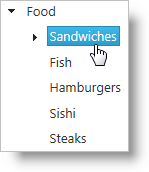
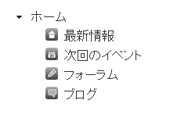
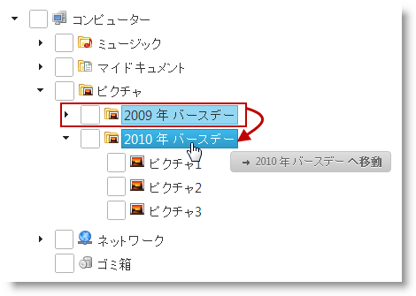
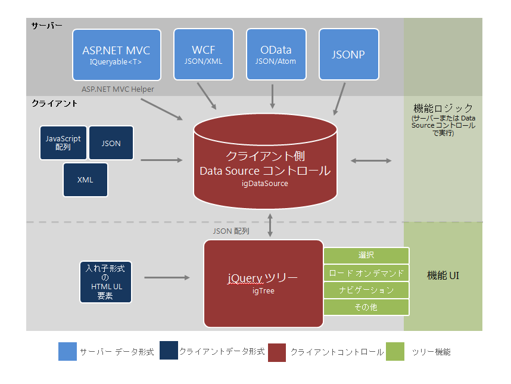

import ApiLink from 'docs-template/components/mdx/ApiLink.astro';

# igTree の概要

## トピックの概要
### 目的
このトピックでは、機能、データ ソースとのバインド、要件、テンプレートなど、`igTree`™ コントロール関連の概念について説明します。

### このトピックの内容
このトピックは、以下のセクションで構成されます。

-   [前提条件](#required-background)
-   [主要機能](#main-features)
    -   [機能の概要](#features-overview)
    -   [ロード オン デマンド](#load-on-demand)
    -   [チェックボックス](#checkboxes)
    -   [ナビゲーションと選択](#navigation-and-selection)
    -   [ノードの追加と削除](#adding-and-removing-nodes)
    -   [ドラッグ アンド ドロップ](#drag-and-drop)
    -   [&#123;environment:ProductNameMVC&#125;](#asp-mvc-helper)
-   [要件](#requirements)
    -   [概要](#requirements-introduction)
    -   [要件の表](#requirements-chart)
-   [データ ソースにバインド](#binding-to-data-sources)
    -   [バインドの要件](#requirements-for-binding)
    -   [サポートされるデータ ソース](#supported-data-sources)
    -   [データ ソースへのバインドに関する概要](#binding-to-data-sources-overview)
    -   [データ ソースへのバインドに関するクラス図](#class-diagram)
    -   [テンプレート使用チャート](#template-use-chart)
    -   [テンプレート選択チャート](#template-selection-chart)
-   [ユーザー相互作用と操作性](#user-interaction-and-usability)
    -   [ユーザー相互作用チャート](#user-interactions-chart)
-   [関連トピック](#related-topics)

## 前提条件
以下の表は、このトピックの情報を完全に理解するために前提条件を示しています。

前提条件タイプ|コンテンツ
---|---
トピック|まず以下のトピックを読む必要があります。 [&#123;environment:ProductName&#125; の概要](/igniteui-for-jquery-overview)  [&#123;environment:ProductName&#125; で JavaScript リソースを使用](/deployment-guide-javascript-resources) [&#123;environment:ProductName&#125; のスタイル設定とテーマ設定](/deployment-guide-styling-and-theming) [igGrid/igDataSource アーキテクチャの概要](/iggrid-igdatasource-architecture-overview)、データ ソース コントロール セクション
外部リソース|あらかじめ [jQuery ウィジェットの使用](http://wiki.jqueryui.com/w/page/12137708/How%20to%20use%20jQuery%20UI%20widgets) を読んでおくことをお勧めします。

## 主要機能
### 機能の概要
下の表は、`igTree` の主要機能を簡潔にまとめたものです。

機能|説明
---|---
ロード オン デマンド|ロード オン デマンドは、ユーザーに表示されたデータの HTML 要素を作成し、必要な場合だけデータを要求することで `igTree` コントロールのパフォーマンスを最適化する第一の方法です。
チェックボックス|チェックボックスは、簡単に複数選択できるよう bi-state モードまたは tri-state モードで使用できます。tri-state モードでは、選択はカスケードされ、親ノードをオンにするとすべての子ノードが選択されます。
ナビゲーションと選択|`igTree` コントロールは、ノードのナビゲーション、選択、展開および縮小のための豊富なキーボード相互作用モデルです。
ノードの画像|ノードは、項目に関する詳細情報を表示したり、ルック アンド フィールをカスタマイズしたりする自分のカスタム画像を設定できます。
ノードの追加と削除|`igTree` コントロールのノードの追加と削除機能を使用すると、ツリー ノードを追加または削除できます。
ドラッグ アンド ドロップ|`igTree` コントロールのドラッグ アンド ドロップ機能では、ツリー ノードをドラッグ アンド ドロップできます。ドラッグ アンド ドロップは、同じツリー内でも 2 つのツリー間でも操作できます。
&#123;environment:ProductNameMVC&#125; |マネージ .NET コードを使用して `igTree` コントロールを構成できます。

## ロード オン デマンド
ロード オン デマンドは、ユーザーに表示されたデータの HTML 要素を作成したり、必要な場合だけデータを要求したりすることで `igTree` コントロールのパフォーマンスを最適化する第一の方法です。ローカル データに対して有効な場合、`igTree` コントロールは、ノードが展開され、ビューに表示されたときにそれらのノードの必要なマークアップのみ作成します。リモート データにバインドしている場合、`igTree` コントロールは新しいデータの AJAX を要求し、ノードが展開されたときにサーバーから必要に応じて HTML 要素を作成します。

### 関連トピック

[igTree のパフォーマンスを最適化します](/igtree-optimize-performance)

## チェックボックス
チェックボックスは、簡単に複数選択できるよう bi-state モードまたは tri-state モードで使用できます。tri-state モードでは、選択はカスケードされ、親ノードをオンにするとすべての子ノードが選択されます。同様に、子チェックボックスがオンまたはオフの場合、チェック状態は親チェックボックスで、オン、部分、またはオフの状態で表現されます。

### 関連トピック

[チェックボックスおよび選択を構成する](/igtree-configure-checkboxes-and-selection)

## ナビゲーションと選択
`igTree` コントロールは、ノードのナビゲーション、選択、展開および縮小のための豊富なキーボード相互作用モデルです。詳細は、以下の「ユーザー インターフェイスと操作性」のセクションを参照してください。

### 関連トピック

[チェックボックスおよび選択を構成する](/igtree-configure-checkboxes-and-selection)

## ノードの画像 
カスタム ノード画像サポートは `igTree` コントロールに使用できます。画像はバインディング、CSS、またはテンプレートで設定できます。親ノードとリーフ ノードで別の画像を使用することも可能です。

### 関連トピック

[igTree のノードを構成する](/igtree-configure-nodes)

## ノードの追加と削除
`igTree` コントロールのノードの追加と削除機能を使用すると、ツリー ノードを追加または削除できます。

### 関連トピック

[ノードの追加と削除](./06_Adding and Removing Nodes/~igTree_Adding_Removing_Nodes.mdx)

## ドラッグ アンド ドロップ
`igTree` コントロールのドラッグ アンド ドロップ機能では、ツリー ノードをドラッグ アンド ドロップできます。

ドラッグ アンド ドロップは、同じ `igTree` コントロール内だけでなく、2 つの `igTree` コントロール間で操作できます。2 つの igTree コントロール間で動作するよう設定できます。ドラッグ アンド ドロップ機能の操作方法を指定できます。サポートされる[ドラッグ アンド ドロップ モード](/igtree-drag-and-drop-configuring-mode) に設定する必要があります。

### 関連トピック

[ドラッグ アンド ドロップ](./07_Drag and Drop/~igTree_Drag-and-Drop.mdx)

[ドラッグ アンド ドロップ モードの設定](/igtree-drag-and-drop-configuring-mode)

## &#123;environment:ProductNameMVC&#125;
&#123;environment:ProductNameMVC&#125; ヘルパーを使用して、マネージ コード言語で `igTree` コントロールを構成できます。MVC ヘルパーを使用すると、ASP.NET MVC アプリケーションで再利用可能な View または ViewModel を利用できるようになります。さらに、ASP.NET で IQueryable オブジェクトのコレクションへのバインドを行うこともでき、ヘルパーはクライアントで使用する `igTree` コントロールの JSON データを生成します。

### 関連トピック

- [igTree を使用した作業の開始](/igtree-getting-started)

- [ロード オン デマンドを構成する](/igtree-optimize-performance)

## 要件
### 概要
`igTree` コントロールは jQuery UI ウィジェットの 1 つであるため、jQuery ライブラリと jQuery UI JavaScript ライブラリに依存します。また、`igTree` コントロールが機能の共有やデータのバインドを行うために使用する &#123;environment:ProductName&#125;™ JavaScript リソースもいくつかあります。`igTree` コントロールを純粋に JavaScript コンテキストで使用する場合でも、ASP.NET MVC で使用する場合でも、こうした JavaScript の参照が必要になります。`igTree` コントロールを ASP.NET MVC で使用する場合、`igTree` コントロールを .NET 言語で構成するために Infragistics.Web.Mvc アセンブリが必要です。

### 要件の表
下の表は、`igTree` コントロールの要件をまとめたものです。

要件|説明
---|---
jQuery および jQuery UI JavaScript リソース|&#123;environment:ProductName&#125; は、これらのフレームワークの最上位にビルドされます。[jQuery](http://jquery.com/) [jQuery UI](http://jqueryui.com/) [テンプレート エンジンの概要](../../06_Infragistics-Templating-Engine/01_igTemplating Overview.mdx) (ノード テンプレート用)
&#123;environment:ProductName&#125; の共用 JavaScript リソース|&#123;environment:ProductName&#125; には、ほとんどのウィジェットが使用する共用 JavaScript リソースがいくつかあります。`infragistics.util.js` `infragistics.util.jquery.js` infragistics.ui.shared.js
`igDataSource` JavaScript リソース | `igTree` は `igDataSource` を内部的に使用してデータ操作を行います。 `infragistics.dataSource.js`
`igTree` JavaScript リソース | `igTree` コントロールの JavaScript ファイル: `infragistics.ui.tree.js`
IG テーマ|このテーマには、&#123;environment:ProductName&#125; 向けに作成されたカスタム ビジュアル スタイルが含まれます。
ベース テーマ|基本テーマには、主に各コントロールのフォームと機能を定義するスタイルが含まれています。

## データ ソースにバインド
## バインドの要件
以下の表は、`igTree` コントロールを要件カテゴリ別にグループ化されたデータ ソースにバインドするための要件を示しています。

要件のカテゴリ|要件の一覧
---|---
データ構造|以下のいずれかの形態を使用できます。 ローカルまたは Web サーバーから提供される適格な JSON または XML   入れ子になった UL HTML 要素   OData サービス   JSONP   ASP.NET MVC における IQueryable
データ型|String   Number   Boolean   画像 URL

## サポートされるデータ ソース
次の表は、サポートされるデータ ソース、および各データ ソースのバインドに関する基本情報をまとめたものです。

データ ソース|バインディング
---|---
[igDataSource](/igdatasource-igdatasource-overview)|`igDataSource` コンポーネントは、コントロールのデータ操作を管理するために `igTree` コントロールによって内部的に使用されます。このデータ ソースは、さまざまなタイプのローカル データやリモート データを受け入れます。 
入れ子になった HTML UL 要素|`igTree` コントロールは既存の非順序リスト (UL) または入れ子になっている UL 要素でインスタンス化できます。
[`IQueryable<T>`](http://msdn.microsoft.com/ja-jp/library/bb351562.aspx)|ASP.NET MVC では、`igTree` コントロールのデータ ソースとして IQueryable を指定します。そのコレクションは、ブラウザーでの使用に合わせて JSON にシリアル化されて View と共に返されます。

## データ ソースへのバインドに関する概要
ほとんどの場合、`igTree` コントロールの `dataSource` オプションまたは `dataSourceUrl` オプションを使用してデータのバインドを行うことになります。このアプローチは、サポートされるさまざまなデータ形式を処理できる `igDataSource` コンポーネントへデータを提供します。ただし、UL 要素を使用して `igTree` コントロールをインスタンス化する場合は例外で、このオプションは使用しません。`igTree` コントロールはそのベース UL 要素のデータとオプションを継承します。ASP.NET MVC では、IQueryable オブジェクトのコレクションを ASP.NET MVC ヘルパーに提供すると、サーバーからデータがシリアル化され、View に渡されます。そのページがブラウザーで受信されると、`igTree` コントロールの `dataSource` オプションが設定され、クライアント側での操作に使用されます。

## データ ソースへのバインドに関するクラス図
次のクラス図はデータ バインドの仕組みを示したものです。

## テンプレート使用チャート
下の表は、`igTree` コントロールのテンプレートと各テンプレートの用途をまとめたものです。

テンプレート|igTree での用途
---|---
ノード|バインディング オブジェクトの `nodeContentTemplate` オプションを設定することで、`igTree` コントロールの各ノードに表示されるカスタム HTML を定義できます。

## テンプレート選択チャート
下の表は、予想されるユーザーのニーズと、個々のニーズに適したテンプレートをリストしたものです。

用途|使用テンプレート
---|---
ある階層レベルで各ノードのカスタム HTML を表示する|`nodeContentTemplate`

## ユーザー相互作用と操作性
### ユーザー相互作用チャート
下の表は、`igTree` コントロールのユーザー インターフェイス機能を簡潔にまとめたものです。

用途|使用テンプレート
---|---
ある階層レベルで各ノードのカスタム HTML を表示する|`nodeContentTemplate`

## 関連トピック
以下は、その他の役立つトピックです。

-   [&#123;environment:ProductName&#125; の概要](/igniteui-for-jquery-overview)
-   [&#123;environment:ProductName&#125; で JavaScript リソースを使用](/deployment-guide-javascript-resources)
-   [&#123;environment:ProductName&#125; のスタイル設定とテーマ設定](/deployment-guide-styling-and-theming)
-   [igGrid/igDataSource アーキテクチャの概要](/iggrid-igdatasource-architecture-overview)
-   [igTree のパフォーマンスを最適化します](/igtree-optimize-performance)
-   [igTree のチェックボックスと選択を構成する](/igtree-configure-checkboxes-and-selection)
-   [igTree のノードを構成する](/igtree-configure-nodes)
-   [ノードの追加と削除](./06_Adding and Removing Nodes/~igTree_Adding_Removing_Nodes.mdx)
-   [ドラッグ アンド ドロップ](./07_Drag and Drop/~igTree_Drag-and-Drop.mdx)
-   <ApiLink type="igtree" label="igTree jQuery API ドキュメント" />
-   [igTree ASP.NET MVC API ドキュメント](Infragistics.Web.Mvc~Infragistics.Web.Mvc.TreeModel_members.html)

 

 

