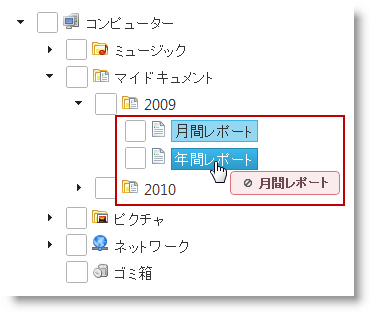

# カスタム ドロップ検証の構成 (igTree)

## トピックの概要
### 目的

ここでは、コード例とともに、Javascript および MVC の両方で `igTree`™ コントロールのドラッグ アンド ドロップ機能のカスタム ドロップ検証を、JavaScript と MVC の両方で構成する方法を紹介します。

### 前提条件

このトピックを理解するために、以下のトピックを参照することをお勧めします。

- [ドラッグ アンド ドロップの概要 (igTree)](../07_Drag and Drop/00_igTree_Drag-and-Drop_Overview.mdx): このトピックは、`igTree` コントロールのドラッグ アンド ドロップ機能の概要を提供します。

- [ドラッグ アンド ドロップの有効化 (igTree)](../07_Drag and Drop/01_igTree_Drag-and-Drop_Enabling.mdx): このトピックは、コード例を示して、`igTree` コントロールでドラッグ アンド ドロップ機能を有効にする方法を説明します。

### このトピックの内容

このトピックは、以下のセクションで構成されます。

-   [概要](#introduction)
    -   [igTree の機能概要](#overview)
    -   [プロパティ設定](#property-settings)
    -   [例](#example)
-   [コード例](#code-example)
-   [コード例: JavaScript におけるドラッグ アンド ドロップ カスタム ドロップ検証の構成](#config-custom-drop-validation-js)
    -   [概要](#js-introduction)
    -   [プレビュー](#js-preview)
    -   [概要](#js-overview)
    -   [手順](#js-steps)
-   [コード例: MVC におけるドラッグ アンド ドロップ カスタム ドロップ検証の構成](#config-custom-drop-validation-mvc)
    -   [概要](#mvc-introduction)
    -   [プレビュー](#mvc-preview)
    -   [要件](#mvc-prequiremnts)
    -   [概要](#mvc-overview)
    -   [手順](#mvc-steps)
-   [関連コンテンツ](#related-content)


## <a id="introduction"></a>概要
### <a id="overview"></a>igTree の機能概要

デフォルトで、`igTree` コントロールのドラッグ アンド ドロップ機能には専用の組み込み検証機能があります。この機能はドロップ ターゲットがノードかどうかを検証します。`customDropValidation` プロパティにはその他の検証機能もあります。

### <a id="property-settings"></a>プロパティ設定

以下の表には、カスタム ドロップ検証機能を実装するプロパティ設定をまとめました。

目的:|使用するプロパティ:|設定の選択肢:
---|---|---
カスタム ドロップ検証機能の構成|`customDropValidation`|カスタム機能


### <a id="example"></a>例

以下の表には、jQuery と MVC 双方の `customDropValidation` プロパティの設定例をまとめました。

技術|`customDropValidation` プロパティ値
---|---
JavaScript ファイル|関数
MVC|string


## <a id="code-example"></a>コード例
### コード例の概要

以下の表は、このトピックで使用したコード例をまとめたものです。

例|説明
---|---
[コード例: JavaScript におけるドラッグ アンド ドロップ カスタム ドロップ検証の構成](#config-custom-drop-validation-js)|この手順では、ドラッグ アンド ドロップ機能で `igTree` を初期化し、カスタム ドロップ検証機能を追加し、シンプルなフォルダー構造で JSON データ ソースにそれをバインドします。
[コード例: MVC におけるドラッグ アンド ドロップ カスタム ドロップ検証の構成](#config-custom-drop-validation-mvc)|この手順では、ドラッグ アンド ドロップ機能で `igTree` を初期化し、カスタム ドロップ検証機能を追加し、シンプルなフォルダー構造で XML ファイルにそれをバインドします。


## <a id="config-custom-drop-validation-js"></a>コード例: JavaScript におけるドラッグ アンド ドロップ カスタム ドロップ検証の構成
### <a id="js-introduction"></a>概要

この手順では、ドラッグ アンド ドロップ機能で `igTree` を初期化し、カスタム ドロップ検証機能を追加し、シンプルなフォルダー構造で JSON データ ソースにそれをバインドします。カスタム ドロップ機能では、ドラッグしているノードがファイル (かフォルダー) かどうか、ファイル ノード上にドロップするかどうかを確認します。ドロップの検証ができなければ、ノードのドラッグは取り消しになります。

### <a id="js-preview"></a>プレビュー

以下のスクリーン ショットは、ユーザー ドロップ アクションで実行するカスタム検証です。



### <a id="js-overview"></a>概要

ここでは、JavaScript によるカスタム ドロップ検証付きのドラッグ アンド ドロップ機能で `igTree` を構成する方法について順を追って説明します。以下はプロセスの概念的概要です。

1. `igTree` コントロールのデータ ソースの定義

2. インフラジスティックス ローダーによるスクリプト参照の追加

3. ドラッグ アンド ドロップ モードをコピーに設定

4. カスタム ドロップ検証機能の追加

### <a id="js-steps"></a>手順

次の手順では、JavaScript によるドラッグ アンド ドロップ カスタム ドロップ検証で `igTree` を構成する方法を紹介します。

1. `igTree` コントロールのデータ ソースを定義します。

	このサンプルでは、JSON 形式のファイルとフォルダー構造があります。各オブジェクトには以下のプロパティがあります。
	
	-   `Text` - ノードの名前
	-   `Value` - ノードのタイプ - ファイル または フォルダー
	-   `ImageUrl` - 特定のノード画像への URL リンク
	-   `Folder` - 以上のデータを含むオブジェクトの配列
	
	**JavaScript の場合:**
	
```js
	[{
	      Text: "My Documents",
	      Value: "Folder",
	      ImageUrl: "../content/images/DocumentsFolder.png",
	      Folder: [{
	            Text: "2009",
	            Value: "Folder",
	            ImageUrl: "../content/images/DocumentsFolder.png",
	            Folder: [{
	                  Text: "Month Report",
	                  Value: "File",
	                  ImageUrl: "../content/images/Documents.png",
	                  Folder: ""
	            }, {
	                  Text: "Year Report",
	                  Value: "File",
	                  ImageUrl: "../content/images/Documents.png",
	                  Folder: ""
	            }]
	      }, {
	            Text: "2010",
	            Value: "Folder",
	            ImageUrl: "../content/images/DocumentsFolder.png",
	            Folder: [{
	                  Text: "Month Report",
	                  Value: "File",
	                  ImageUrl: "../content/images/Documents.png",
	                  Folder: ""
	            }, {
	                  Text: "Year Report",
	                  Value: "File",
	                  ImageUrl: "../content/images/Documents.png",
	                  Folder: ""
	            }]
	      }]
	}]
```

2. Infragistics ローダーでスクリプト参照を追加します。

	この参照は `igTree` コントロールの初期化で必要です。
	
	以下の参照を含む HTML ファイル (たとえば、tree.html) を作成します。
	
	**HTML の場合:**
	
```html
	<script src="../scripts/jquery.min.js"></script>
	<script src="../scripts/jquery-ui.min.js"></script>
	<script src="../js/infragistics.loader.js"></script>
	 $.ig.loader({
	    scriptPath: "../js/",
	    cssPath: "../css/",
	    resources: "igTree"
	});
```

3. カスタム ドロップ検証機能を追加します。

	1. `tree.html` ファイルで DOM (ドキュメント オブジェクト モデル) HTML 要素のプレースホルダーを定義します。
	
		**HTML の場合:**
		
```html
		
		<div id="tree">
		</div>
```
	
	2. JavaScript による `igTree` カスタム ドロップ検証関数のサンプルを以下に示します。
	
		**JavaScript の場合:**
		
```js
		$("#tree").igTree({
			checkboxMode: 'triState',
			singleBranchExpand: true,
			dataSource: data,
			dataSourceType: 'json',
			initialExpandDepth: 0,
			pathSeparator: '.',
			bindings: {
				textKey: 'Text',
				valueKey: 'Value',
				imageUrlKey: 'ImageUrl',
				childDataProperty: 'Folder' 
			},
			dragAndDrop: true,
			dragAndDropSettings : {
				customDropValidation: function (element) {
					// Validates the drop target
					var valid = true,
					droppableNode = $(this);
					if (droppableNode.is('a') && droppableNode.closest('li[data-role=node]').attr('data-value') === 'File') {
						valid = false;
					}
					return valid;
				}
			}
		});
```

## <a id="config-custom-drop-validation-mvc"></a>コード例: MVC におけるドラッグ アンド ドロップ カスタム ドロップ検証の構成
### <a id="mvc-introduction"></a>概要

このプロシージャでは、ドラッグ アンド ドロップ機能がある `igTree` を初期化し、カスタム ドロップ検証機能を追加し、シンプルなフォルダー構造で XML ファイルにそれをバインドします。カスタム ドロップ機能では、ドラッグしているノードがファイル (かフォルダー) かどうか、ファイル ノード上にドロップするかどうかを確認します。ドロップの検証ができなければ、ノードのドラッグは取り消しになります。

### <a id="mvc-preview"></a>プレビュー

以下のスクリーン ショットは、ユーザー ドロップ アクションで実行するカスタム検証です。


### <a id="mvc-prequiremnts"></a>要件

この手順を実行するには、以下が必要です。

-   Microsoft® Visual Studio 2010 またははそれ以降のバージョンのインストール
-   MVC 3 Framework のインストール
-   `Infragistics.Web.Mvc.dll` の追加

### <a id="mvc-overview"></a>概要

このトピックでは、MVC によるカスタム ドロップ検証付きドラッグ アンド ドロップ機能で `igTree` を構成する方法について順を追って説明します。以下はプロセスの概念的概要です。

1. XML データ ソース ファイルの作成

2. View の定義

3. コントローラーの定義

### <a id="mvc-steps"></a>手順

以下の手順は、`igTree` を構成する View、および Controller を定義する方法を示します。


1. XML データ ソース ファイルを作成します。

	1. プロジェクトに新しい XML ファイルを追加します。ファイル名を `ThreeData.xml` とします。
	2. 以下の構造で属性に応じて Text、ImageUrl、Value のサンプル データを XML ファイルに追加します。:
	
		**XML の場合:**
		
```xml
		…
		<Folder Text="Network" ImageUrl="../content/images/igTree/Common/door.png" Value="Folder">     
		          <Folder Text="Archive" ImageUrl="../content/images/igTree/Common/door_in.png" Value="Folder"></Folder>
		          <Folder Text="Back Up" ImageUrl="../content/images/igTree/Common/door_in.png" Value="Folder"></Folder>
		          <Folder Text="FTP" ImageUrl="../content/images/igTree/Common/door_in.png" Value="Folder"></Folder>
		</Folder>
		…
```

2. View を定義します。

	1. Views フォルダーに新しい View を追加します。ファイル名を `SampleDataXML.cshtml` に設定します。
	
	2. ビューでツリーを定義し、カスタム ドロップ検証を実行する機能の名前を設定します。以下に示すのは、ビューに追加するサンプル コードです。
	
		**C# の場合:**
		
```csharp
		<script src="http://localhost/ig_ui/js/infragistics.loader.js" type="text/javascript"></script>
		@(Html.Infragistics()
		.Loader()
		.ScriptPath("http://localhost/ig_ui/js/")
		.CssPath("http://localhost/ig_ui/css/")
		.Render()
		)
		@(Html.
		Infragistics().
		Tree().
		ID("XMLTree").
		Bindings( bindings => {
		bindings.
		ValueKey("Value").
		TextKey("Text").
		ImageUrlKey("ImageUrl").
		ChildDataProperty("Folder");
		}).
		InitialExpandDepth(0).
		DataSource(Model).
		CheckboxMode(CheckboxMode.TriState).
		SingleBranchExpand(true).
		DragAndDrop(true).
		DragAndDropSettings(settings =>
		{
		// Configuring Drag-and-drop with custom drop validation
		settings.CustomDropValidation ("customDropValidation");
		}).
		DataBind().
		Render()
		)
```
	
	3. JavaScript に `customDropValidation` 機能を定義します。この機能は、ターゲット ドロップの場所がファイルではないことを検証します。
	
		**JavaScript の場合:**
		
```js
		customDropValidation (element) { 
		// Validates the drop target 
		var valid = true, 
		droppableNode = $(this); 
		if (droppableNode.is('a') && droppableNode.closest('li[data-role=node]').attr('data-value') === 'File') { 
		valid = false; 
		} 
		return valid; 
		}
```

3. コントローラーを定義します。

	1. Controllers フォルダーに新しいコントローラーを追加します。この例では、`SampleDataXMLController.cs` という名前を付けました。
	
	2. ビューを返すメソッド (`ActionResult` メソッド) を追加します。この例では、DataBindingUsingMVC という名前を付けました。
	
	3. コントローラーに、XML ファイルを読み込み、フォルダー オブジェクトの IEnumerable  オブジェクトを返す新しいメソッドを追加します。この例では、GetData という名前を付けました。

4. Folders オブジェクトを表すクラスを追加します。(この例では Folders)。

	**C# の場合:**
	
```csharp
	public class SampleDataXMLController : Controller
	    {
	        public ActionResult DataBindingUsingMVC()
	        {
	            return View("SampleDataXML", this.GetData());
	        }
	        private IEnumerable<Folders> GetData()
	        {
	            string phisicalFilePath = System.Web.HttpContext.Current.Server.MapPath("~/ThreeData.xml");
	            var ctx = XDocument.Load(phisicalFilePath);
	            IEnumerable<Folders> data = from item in ctx.Root.Elements("Folder")
	                                        select new Folders
	                                        {
	                                            Text = item.Attribute("Text").Value,
	                                            Value = item.Attribute("Value").Value,
	                                            ImageUrl = Url.Content(item.Attribute("ImageUrl").Value),
	                                            Folder = from i1 in item.Elements("Folder")
	                                                     select new Folders
	                                                     {
	                                                         Text = i1.Attribute("Text").Value,
	                                                         Value = i1.Attribute("Value").Value,
	                                                         ImageUrl = Url.Content(i1.Attribute("ImageUrl").Value),
	                                                         Folder = from i2 in i1.Elements("Folder")
	                                                                  select new Folders
	                                                                  {
	                                                                      Text = i2.Attribute("Text").Value,
	                                                                      Value = i2.Attribute("Value").Value,
	                                                                      ImageUrl = Url.Content(i2.Attribute("ImageUrl").Value),
	                                                                      Folder = from i3 in i2.Elements("Folder")
	                                                                               select new Folders
	                                                                               {
	                                                                                   Text = i3.Attribute("Text").Value,
	                                                                                   Value = i3.Attribute("Value").Value,
	                                                                                   ImageUrl = Url.Content(i3.Attribute("ImageUrl").Value)
	                                                                               }
	                                                                  }
	                                                     }
	                                        };
	            return data;
	        }
	    }
	    public class Folders{
	        public string Text { get; set; }
	        public string Value { get; set; }
	        public string ImageUrl { get; set; }
	        public IEnumerable<Folders> Folder { get; set; }
	}
```

## <a id="related-content"></a>関連コンテンツ
### トピック

このトピックの追加情報については、以下のトピックも合わせてご参照ください。

- [ドラッグ アンド ドロップ モードの構成 (igTree)](/igtree-drag-and-drop-configuring-mode): ここでは、コード例とともに、 Javascript と MVC の両方で `igTree` コントロールのドラッグ アンド ドロップ モードを構成する方法を紹介します。

- [ドラッグ ビジュアル トークンの外観の構成 (igTree)](../07_Drag and Drop/02_Configuring/00_igTree_Drag-and-Drop_Configuring_Tokens.mdx): このトピックでは、コード例を使用して、 Javascript および MVC の両方で `igTree` コントロールのドラッグ ビジュアル トークンの外観を構成にする方法を紹介します。

- [ドラッグ アンド ドロップ API リファレンス (igTree)](../07_Drag and Drop/04_API Reference/~igTree_Drag-and-Drop_API_Reference.mdx): このグループのトピックは、`igTree` コントロールのドラッグ アンド ドロップ機能に関連するイベントとプロパティについての参照情報を提供します。

### サンプル

このトピックについては、以下のサンプルも参照してください。

- [ドラッグ アンド ドロップ - 単一のツリー](&#123;environment:SamplesUrl&#125;/tree/drag-and-drop-single-tree): このサンプルでは、`igTree` コントロールのドラッグ アンド ドロップ機能を有効にして初期化する方法を紹介します。

- [ドラッグ アンド ドロップ - 複数のツリー](&#123;environment:SamplesUrl&#125;/tree/drag-and-drop-multiple-trees): このサンプルでは、2 つの `igTree` の間にノードをドラッグ アンド ドロップする方法を紹介します。

- [API およびイベント](/igtree-event-reference#attaching-handlers-jquery): このサンプルは `igTree` API を使用する方法を紹介します。


 

 


