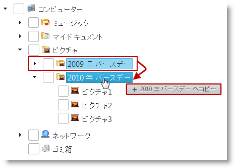

---
title: "ドラッグ アンド ドロップ モードの構成 (igTree)"
slug: igtree-drag-and-drop-configuring-mode
---

# ドラッグ アンド ドロップ モードの構成 (igTree)

## トピックの概要
### 目的

このトピックでは、コード例を使用して、 Javascript および MVC の両方で `igTree`™ コントロールのドラッグ アンド ドロップ モードを構成にする方法を紹介します。

### 前提条件

このトピックを理解するために、以下のトピックを参照することをお勧めします。

- [ドラッグ アンド ドロップの概要 (igTree)](../07_Drag and Drop/00_igTree_Drag-and-Drop_Overview.mdx): このトピックは `igTree` コントロールのドラッグ アンド ドロップ機能およびドラッグ アンド ドロップ モードを説明して概要を提供します。

- [ドラッグ アンド ドロップの有効化 (igTree)](../07_Drag and Drop/01_igTree_Drag-and-Drop_Enabling.mdx): このトピックは、コード例を示して、`igTree` コントロールでドラッグ アンド ドロップ機能を有効にする方法を説明します。


### このトピックの内容

このトピックは、以下のセクションで構成されます。

-   [ドラッグ アンド ドロップ モードの構成概要](#config-summary)
-   -   [概要](#overview)
    -   [ドラッグ アンド ドロップ モードの構成概要表](#config-summary-chart)
-   [コード例の概要](#code-example-summary)
-   [コード例: JavaScript でドラッグ アンド ドロップ モードの構成](#drag-drop-mode-js)
-   -   [概要](#js-introduction)
    -   [プレビュー](#js-preview)
    -   [概要](#js-overview)
    -   [手順](#js-steps)
-   [コード例: MVC でドラッグ アンド ドロップ モードの構成](#drag-drop-mode-mvc)
-   -   [概要](#mvc-introduction)
    -   [プレビュー](#mvc-preview)
    -   [要件](#mvc-requirements)
    -   [概要](#mvc-overview)
    -   [手順](#mvc-steps)
-   [関連コンテンツ](#related-content)


## <a id="config-summary"></a>ドラッグ アンド ドロップ モードの構成概要
### <a id="overview"></a>概要

`igTree` コントロールの[ドラッグ アンド ドロップ モード](/igtree-drag-and-drop-configuring-mode)は [dragAndDropMode](../07_Drag and Drop/04_API Reference/01_igTree_Drag-and-Drop_Property_API_Reference.mdx) プロパティで管理されます。詳細設定について、[ドラッグ アンド ドロップ モードの構成概要表](#config-summary-chart)を参照してください。表の後のコードで完全の構成プロシージャを提供します。

### <a id="config-summary-chart"></a>ドラッグ アンド ドロップ モードの構成概要表

以下の表は、ドラッグ アンド ドロップ モードとそれらを構成するプロパティ設定の関係を示しています。

目的:|[dragAndDropMode](../07_Drag and Drop/04_API Reference/01_igTree_Drag-and-Drop_Property_API_Reference.mdx) プロパティを以下に設定:
---|---
Ctrl キーを使用してコピーと移動の間に切り替えることができます。|デフォルト<br/>これはドラッグ アンド ドロップ モードのデフォルト設定です。機能を有効にすることのみが必要です。
ドラッグ アンド ドロップ操作をコピー操作に設定します。|copy
ドラッグ アンド ドロップ操作を移動操作に設定します。|move

## <a id="code-example-summary"></a>コード例の概要
### コード例の概要表

以下の表は、このトピックで使用したコード例をまとめたものです。

例|説明
---|---
[コード例: JavaScript でドラッグ アンド ドロップ モードの構成](#drag-drop-mode-js)|このプロシージャは `igTree` のインスタンスを初期化し、ドラッグ アンド ドロップ機能を有効にし、コピー モードに設定して、インスタンスを XML ファイルにバインドします。
[コード例: MVC でドラッグ アンド ドロップ モードの構成](#drag-drop-mode-mvc)|このプロシージャは `igTree` を初期化し、ドラッグ アンド ドロップ機能を有効にし、コピー モードに設定して、XML ファイルにバインドします。

## <a id="drag-drop-mode-js"></a>コード例: JavaScript でドラッグ アンド ドロップ モードの構成
### <a id="js-introduction"></a>概要

このプロシージャは `igTree` のインスタンスを初期化し、ドラッグ アンド ドロップ機能を有効にし、コピー モードに設定して、インスタンスを JSON データ ソースバインドします。

他のモード (move または default) を設定するには、コードで手順 3.2 の下にコードを置き換えます。検索: `dragAndDropMode: 'copy'`

置き換え: `dragAndDropMode: 'move'` または `dragAndDropMode: 'default'`

### <a id="js-preview"></a>プレビュー

以下の画像は、このコードを実行してノードのコピーを紹介します。



### <a id="js-overview"></a>概要

このトピックでは、ドラッグ アンド ドロップ機能とコピー モードを有効にして JavaScript で `igTree` を構成する方法について順を追って説明します。以下はプロセスの概念的概要です。

1. `igTree` のデータ ソースの定義

2. インフラジスティックス ローダーを使用してスクリプト参照を追加

3. ドラッグ アンド ドロップ モードをコピーに設定

### <a id="js-steps"></a>手順

以下の手順は、`igTree` コントロール インスタンスを JavaScript でドラッグ アンド ドロップのコピー モードに設定する方法を紹介します。

1. `igTree` のデータ ソースの定義

このサンプルでは、JSON 形式のファイルとフォルダー構造があります。各オブジェクトには以下のプロパティがあります。

-   `Text` - ノードの名前
-   `Value` - ノードのタイプ - ファイル または フォルダー
-   `ImageUrl` - 特定のノード画像への URL リンク
-   `Folder` - 以上のデータを含むオブジェクトの配列

**JavaScript の場合:**

```js
[{
      Text: "My Documents",
      Value: "Folder",
      ImageUrl: "../content/images/DocumentsFolder.png",
      Folder: [{
            Text: "2009",
            Value: "Folder",
            ImageUrl: "../content/images/DocumentsFolder.png",
            Folder: [{
                  Text: "Month Report",
                  Value: "File",
                  ImageUrl: "../content/images/Documents.png",
                  Folder: ""
            }, {
                  Text: "Year Report",
                  Value: "File",
                  ImageUrl: "../content/images/Documents.png",
                  Folder: ""
            }]
      }, {
            Text: "2010",
            Value: "Folder",
            ImageUrl: "../content/images/DocumentsFolder.png",
            Folder: [{
                  Text: "Month Report",
                  Value: "File",
                  ImageUrl: "../content/images/Documents.png",
                  Folder: ""
            }, {
                  Text: "Year Report",
                  Value: "File",
                  ImageUrl: "../content/images/Documents.png",
                  Folder: ""
            }]
      }]
}]
```

2. Infragistics ローダーを使用してスクリプト参照を追加します。

	この参照は igTree コントロールの初期化で必要です。
	
	以下の参照を含む HTML ファイル (たとえば、tree.html) を作成します。
	
	**HTML の場合:**
	
```html
	<script src="../scripts/jquery.min.js"></script>
	<script src="../scripts/jquery-ui.min.js"></script>
	<script src="../js/infragistics.loader.js"></script>
	 $.ig.loader({
	            scriptPath: "../js/",
	            cssPath: "../css/",
	            resources: "igTree"
	});
```

3. ドラッグ アンド ドロップ モードをコピーに設定します。

	1. `tree.html` ファイルで DOM (ドキュメント オブジェクト モデル) HTML 要素のプレースホルダーを定義します。
	
		**HTML の場合:**
		
```html
		
		<div id="tree">
		</div>
```
	
	2. JavaScript で `igTree` をインスタンス化し、ドラッグ アンド ドロップ機能を有効にして、コピー モードに設定します。
	
		**JavaScript の場合:**
		
```js
		<script>
		        $.ig.loader(function () {
		            $("#tree").igTree({
		                checkboxMode: 'triState',
		                singleBranchExpand: true,
		                dataSource: data,
		                dataSourceType: 'json',
		                initialExpandDepth: 0,
		                pathSeparator: '.',
		                bindings: {
		                    textKey: 'Text',
		                    valueKey: 'Value',
		                    imageUrlKey: 'ImageUrl',
		                    childDataProperty: 'Folder'
		                },
		             dragAndDrop: true,             
		                dragAndDropSettings: {
		                   dragAndDropMode: 'copy'
		               }
		            });
		        });        
		</script>
```


## <a id="drag-drop-mode-mvc"></a>コード例: MVC でドラッグ アンド ドロップ モードの構成
### <a id="mvc-introduction"></a>概要

このプロシージャは `igTree` を初期化し、ドラッグ アンド ドロップ機能を有効にし、コピー モードに設定して、XML ファイルにバインドします。

その他のモード (Move または Default) を設定するには、手順 2 のコードで、以下のコード (// Configuring Drag-and-drop copy mode コメントの後のコード) を置き換えます。
`settings.DragAndDropMode(DragAndDropMode.Copy);` を `settings.DragAndDropMode(DragAndDropMode.Move);` または `settings.DragAndDropMode(DragAndDropMode.Default);` と置き換えます。

### <a id="mvc-preview"></a>プレビュー

以下のスクリーンショットは最終結果のプレビューです。


### <a id="mvc-requirements"></a>要件

この手順を実行するには、以下が必要です。

-   Microsoft® Visual Studio 2010 またははそれ以降のバージョンのインストール
-   MVC 3 Framework のインストール
-   `Infragistics.Web.Mvc.dll` の追加

### <a id="mvc-overview"></a>概要

このトピックでは、ドラッグ アンド ドロップ機能とコピー モードを有効にして MVC で `igTree` を構成する方法について順を追って説明します。以下はプロセスの概念的概要です。

1. XML データ ソース ファイルの作成

2. View の定義

3. コントローラーの定義

### <a id="mvc-steps"></a>手順

以下の手順は、`igTree` を構成する View、および Controller を定義する方法を示します。

1. XML データ ソース ファイルを作成します。

	データの XML ファイルを作成します。 Text、ImageUrl、および Value 属性を設定します。
	
	**XML の場合:**
	
```xml
	…
	<Folder Text="Network" ImageUrl="../content/images/igTree/Common/door.png" Value="Folder">     
	          <Folder Text="Archive" ImageUrl="../content/images/igTree/Common/door_in.png" Value="Folder"></Folder>
	          <Folder Text="Back Up" ImageUrl="../content/images/igTree/Common/door_in.png" Value="Folder"></Folder>
	          <Folder Text="FTP" ImageUrl="../content/images/igTree/Common/door_in.png" Value="Folder"></Folder>
	</Folder>
	…
```

2. View を定義します。

	1. Views フォルダーに新しい View を追加します。ファイル名を `SampleDataXML.cshtml` に設定します。
	
	2. `igTree` を初期化するコードを追加して ビューで Copy モードを有効にします。
	
		**C# の場合:**
		
```csharp
		<script src="http://localhost/ig_ui/js/infragistics.loader.js" type="text/javascript"></script>
		    @(Html.Infragistics()
		        .Loader()
		        .ScriptPath("http://localhost/ig_ui/js/")
		        .CssPath("http://localhost/ig_ui/css/")
		        .Render()
		    )
		@(Html.
		                        Infragistics().
		                        Tree().
		                        ID("XMLTree").
		                        Bindings( bindings => {
		                            bindings.
		                            ValueKey("Value").
		                            TextKey("Text").
		                            ImageUrlKey("ImageUrl").
		                            ChildDataProperty("Folder");
		                        }).
		                        InitialExpandDepth(0).
		                        DataSource(Model).
		                        CheckboxMode(CheckboxMode.TriState).
		                        SingleBranchExpand(true).
		                        DragAndDrop(true).
		                        DragAndDropSettings(settings =>
		                        {
		                            // Configuring Drag-and-drop copy mode
		                            settings.DragAndDropMode(DragAndDropMode.Copy);
		                        }).
		                        DataBind().
		                        Render()  
		 )
```

3. コントローラーを定義します。

	**C# の場合:**
	
```csharp
	public class SampleDataXMLController : Controller
	    {
	        public ActionResult DataBindingUsingMVC()
	        {
	            return View("SampleDataXML", this.GetData());
	        }
	        private IEnumerable<Folders> GetData()
	        {
	            string phisicalFilePath = System.Web.HttpContext.Current.Server.MapPath("~/ThreeData.xml");
	            var ctx = XDocument.Load(phisicalFilePath);
	            IEnumerable<Folders> data = from item in ctx.Root.Elements("Folder")
	                                        select new Folders
	                                        {
	                                            Text = item.Attribute("Text").Value,
	                                            Value = item.Attribute("Value").Value,
	                                            ImageUrl = Url.Content(item.Attribute("ImageUrl").Value),
	                                            Folder = from i1 in item.Elements("Folder")
	                                                     select new Folders
	                                                     {
	                                                         Text = i1.Attribute("Text").Value,
	                                                         Value = i1.Attribute("Value").Value,
	                                                         ImageUrl = Url.Content(i1.Attribute("ImageUrl").Value),
	                                                         Folder = from i2 in i1.Elements("Folder")
	                                                                  select new Folders
	                                                                  {
	                                                                      Text = i2.Attribute("Text").Value,
	                                                                      Value = i2.Attribute("Value").Value,
	                                                                      ImageUrl = Url.Content(i2.Attribute("ImageUrl").Value),
	                                                                      Folder = from i3 in i2.Elements("Folder")
	                                                                               select new Folders
	                                                                               {
	                                                                                   Text = i3.Attribute("Text").Value,
	                                                                                   Value = i3.Attribute("Value").Value,
	                                                                                   ImageUrl = Url.Content(i3.Attribute("ImageUrl").Value)
	                                                                               }
	                                                                  }
	                                                     }
	                                        };
	            return data;
	        }
	    } public class Folders
	{
	        public string Text { get; set; }
	        public string Value { get; set; }
	        public string ImageUrl { get; set; }
	        public IEnumerable<Folders> Folder { get; set; }
	}
```


## <a id="related-content"></a>関連コンテンツ
### トピック

このトピックの追加情報については、以下のトピックも合わせてご参照ください。

- [カスタム ドロップ検証の構成 (igTree)](/igtree-drag-and-drop-configuring-custom-drop-validation): このトピックでは、コード例を使用して、 Javascript および MVC の両方で `igTree` コントロールのドラッグ アンド ドロップ機能のカスタム ドロップ検証を構成にする方法を紹介します。

- [ドラッグ ビジュアル トークンの外観の構成 (igTree)](../07_Drag and Drop/02_Configuring/00_igTree_Drag-and-Drop_Configuring_Tokens.mdx): このトピックでは、コード例を使用して、 Javascript および MVC の両方で `igTree` コントロールのドラッグ ビジュアル トークンの外観を構成にする方法を紹介します。

- [ドラッグ アンド ドロップ API リファレンス (igTree)](../07_Drag and Drop/04_API Reference/~igTree_Drag-and-Drop_API_Reference.mdx): このグループのトピックは、`igTree` コントロールのドラッグ アンド ドロップ機能に関連するイベントとプロパティについての参照情報を提供します。

### サンプル

このトピックについては、以下のサンプルも参照してください。

- [ドラッグ アンド ドロップ - 単一のツリー](&#123;environment:SamplesUrl&#125;/tree/drag-and-drop-single-tree): このサンプルでは、`igTree` コントロールのドラッグ アンド ドロップ機能を有効にして初期化する方法を紹介します。

- [ドラッグ アンド ドロップ - 複数のツリー](&#123;environment:SamplesUrl&#125;/tree/drag-and-drop-multiple-trees): このサンプルでは、2 つの `igTree` の間にノードをドラッグ アンド ドロップする方法を紹介します。

- [API およびイベント](/igtree-event-reference#attaching-handlers-jquery): このサンプルは `igTree` API を使用する方法を紹介します。


 

 


