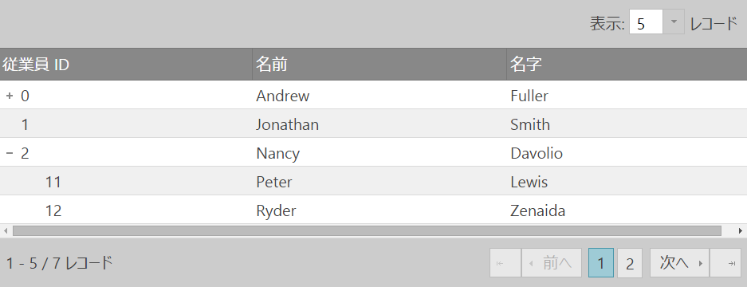
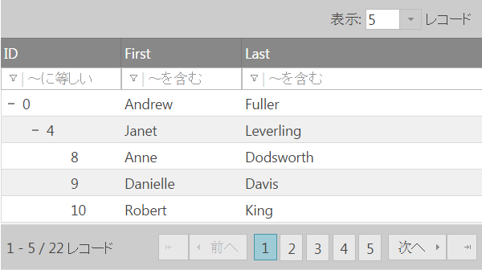
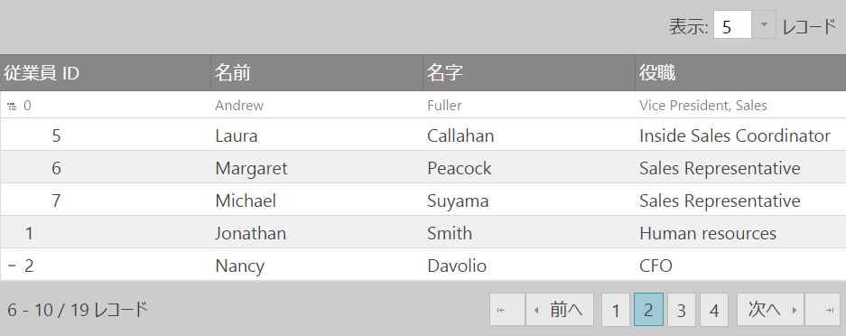
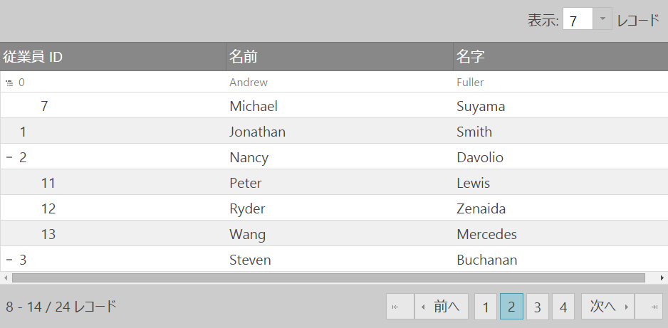
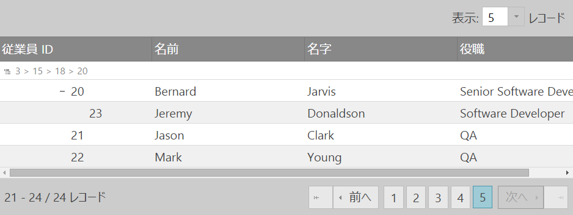
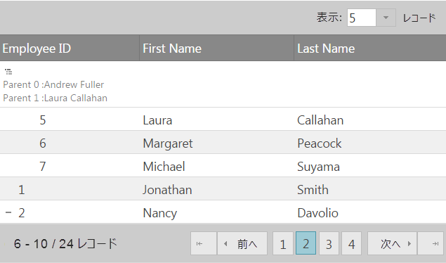

# ページング (igTreeGrid)
igTreeGrid のページング機能は、igGrid のページング機能が拡張されています。階層データを表示するようにカスタマイズされているだけではなく、igTreeGrid に固有の追加の API オプションやメソッドも含まれています。

### このトピックの内容

- [**概要**](#introduction)
- [**ページング モード**](#paging-modes)
    - [ルート レベルのページング](#paging-mode-root-level)
    - [すべてのレベルのページング](#paging-mode-all-levels)
- [**コンテキスト行**](#context-row)
    - [コンテキスト行なし (デフォルト)](#context-row-none)
    - [親コンテキスト行](#context-row-parent)
    - [ブレッドクラムのコンテキスト行](#context-row-breadcrumb)
    - [カスタム コンテキスト行の描画](#context-row-custom-rendering)
- [**関連コンテンツ**](#related-content)
    - [トピック](#topics)
    - [サンプル](#samples)


## <a id="introduction"></a> 概要
階層データを表示するため、追加のページング モードが追加され、現在および前のページの親子コンテキストも提示されます。

## <a id="paging-modes"></a> ページング モード
igTreeGrid には、データのルート レベルまたはすべてのデータ レベルを操作する 2 つのページング モードがあります。  

ページングの [`mode`](&#123;environment:jQueryApiUrl&#125;/ui.igtreegridpaging#options:mode) オプションは、この機能を制御します。デフォルトで、このオプションはルート レベルのレコードのみを操作するように設定されています。デフォルト モードでは、行の展開または縮小によって表示される行を変更しても、ページ数には影響しません。

### <a id="paging-mode-root-level"></a> ルート レベルのページング
ルート レベルでのページング操作では、ルート行のみがページングされ、子行はページングに影響されません。ルート行を展開すると、現在のページにそのすべての子行が描画されます。
次の例では、配列の `flatDS` は **4 つのルート レベルの行**のみを持ちます。

```js
$("#treegrid").igTreeGrid({
	dataSource: flatDS,
	primaryKey: "employeeID",
	foreignKey: "PID", 
	features: [{
		name: 'Paging',
		mode: 'rootLevelOnly'
	}]
});
```



### <a id="paging-mode-all-levels"></a> すべてのレベルのページング

表示されるすべてのレコードにページングを適用するには、`mode` を `allLevels` に設定します。このモード設定は、データ内の位置にかかわらず、表示されるすべてのレコードに対してページングを適用します。`allLevels` モードは、ページングを動的に制御します。たとえば、行の展開や縮小により使用可能なページ数が変化します。

```js
$("#treegrid").igTreeGrid({
	dataSource: flatDS,
	primaryKey: "employeeID",
	foreignKey: "PID", 
	features: [{
		name: 'Paging',
		mode: 'allLevels'
	}]
});
```



## <a id="context-row"></a> コンテキスト行

子データが次のページに続き (ページング モードが「allLevels」に設定されている場合)、そのページに跨る子レベルの行にコンテキストを取り込むことが必要なシナリオの場合、TreeGridPaging 機能に導入された追加の [contextRowMode](&#123;environment:jQueryApiUrl&#125;/ui.igtreegridpaging#options:contextRowMode) オプションで、子レベルの行の親行の情報を含むコンテキスト行をグリッド ヘッダーの下に描画することができます。
「none」、「parent」、「breadcrumb」の 3 つの選択できるモードがあります。

### <a id="context-row-none"></a> コンテキスト行なし(デフォルト)
デフォルトで、このオプションは「none」に設定されています。この場合、コンテキスト行は描画されません。



スクリーンショットでは、最上行は子行ですが、その親行は前のページにあります。このモードの場合、現在のページのコンテキストから親行を特定する方法はありません。

### <a id="context-row-parent"></a> 親コンテキスト行

contextRowMode を「parent」に設定すると、直近の親行に関する情報を含むコンテキスト行が表示されます。このモードは、階層があまり深くなく、直近の親から子行のコンテキストが比較的得られやすい場合に役立ちます。 



### <a id="context-row-breadcrumb"></a> ブレッドクラムのコンテキスト行

複雑な階層のコンテキストをより詳細に表示する場合は、「breadcrumb」モードが使用できます。このモードは、祖先から現在の子行までの完全なパスを描画します。デフォルトで、プライマリ キーの値を使用して、現在の行までのブレッドクラム パスがビルドされます。



表示されるブレッドクラムの変更を許可する追加オプション があります (contextRowMode が「breadcrumb」に設定されている場合にのみ適用)。

[breadcrumbKey](&#123;environment:jQueryApiUrl&#125;/ui.igtreegridpaging#options:breadcrumbKey) - ブレッドクラム トレイルに表示する先祖の列キーを設定します。デフォルトで、プライマリ キーの列を使用します。

[breadcrumbDelimiter](&#123;environment:jQueryApiUrl&#125;/ui.igtreegridpaging#options:breadcrumbKey) - ブレッドクラム トレイル内の先祖と先祖の間にデリミターを設定します。デリミターのディフォルトは「&gt;」です。

### <a id="context-row-custom-rendering"></a> カスタム コンテキスト行の描画

コンテキスト行全体の描画は、[renderContextRowFunc](&#123;environment:jQueryApiUrl&#125;/ui.igtreegridpaging#options:renderContextRowFunc) オプションを使用して手動で処理することができます。このオプションでは、コンテキスト行の描画を処理するカスタム関数を設定できます。

この関数には、4 つの引数があります。 

dataRow - コンテキスト行を定義する現在のデータ行。

$textArea - コンテキスト行のテキスト領域 

parents - 現在のデータ行の一連の親。

contextMode - 現在のコンテキスト モード。

この関数は次のいずれかを返します。コンテキスト行のテキスト領域に挿入される文字列 (html)、false の場合は空の文字列または何も返さない。false の場合は、$textArea 引数を使用して、その内容をテキスト領域に直接追加できます。

次に示す例ではどちらも、コンテキスト行の内容を変更できます。

カスタム文字列を返す: 
```js
renderContextRowFunc: function(dataRow, $textArea, parents, mode) {
        var contextRowText = "<div>";
        $(parents).each(function(index) {
			contextRowText += "<div> Parent " + index + " :" + this.row["firstName"] + " " + this.row["lastName"] + "</div>";
        });
        contextRowText += "</div>";
        return contextRowText;
} 
```
textArea の内容を直接変更する: 
```js
renderContextRowFunc: function(dataRow, $textArea, parents, mode) {
        var contextRowText = "<div>";
        $(parents).each( function(index) {
			contextRowText += "<div> Parent "+ index + " :" + this.row["firstName"] + " " + this.row["lastName"] + "</div>";
        });
        contextRowText += "</div>";				
		$textArea.html(contextRowText);
} 
```
どちらも同じ結果になります。



## <a id="related-content"></a> 関連コンテンツ

### <a id="topics"></a> トピック
-	[リモート機能 (igTreeGrid)](/igtreegrid-remote-features): このトピックは、`igTreeGrid` の機能を使用したリモート操作実行における実装の詳細と概要を説明します。

### <a id="samples"></a> サンプル
-	[igTreeGrid のリモート機能](&#123;environment:SamplesUrl&#125;/tree-grid/remote-features)
-	[igTreeGrid でのページング](&#123;environment:SamplesUrl&#125;/tree-grid/paging)
