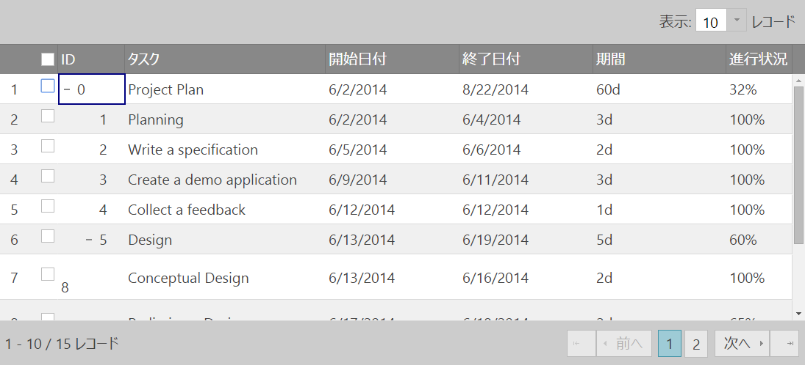
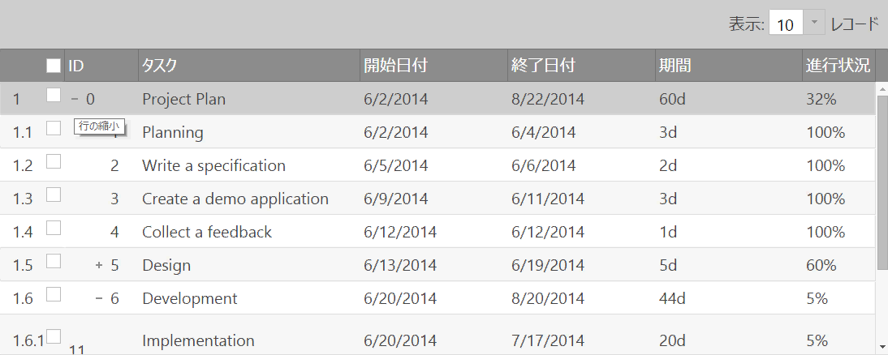
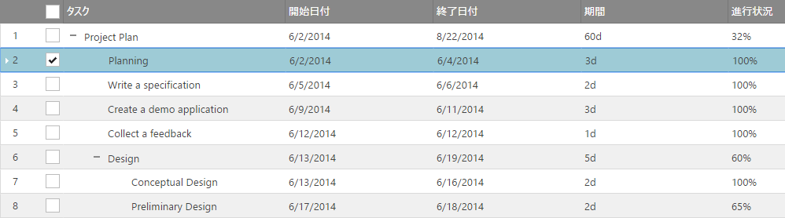
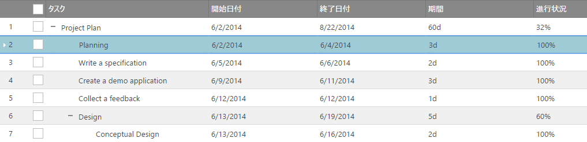
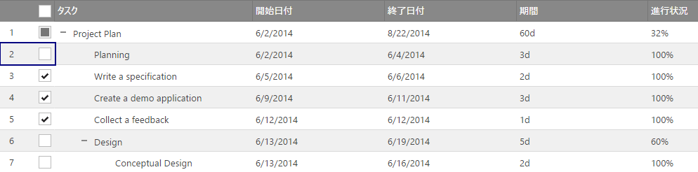

import ApiLink from 'docs-template/components/mdx/ApiLink.astro';

# 行セレクター (igTreeGrid)
`igTreeGrid` の行セレクター機能は、`igGrid` の RowSelectors が拡張されています。階層データが簡単に選択できるように、機能がカスタマイズされています。さらに、すべての要件を満たすために、行セレクターではチェックボックスを選択から分離できます。igTreeGrid に固有の追加 API オプションの `rowSelectorNumberingMode`、`chechkboxMode`、および追加 API メソッドの `checkedRows`、`uncheckedRows`、`partiallyCheckedRows`、`toggleCheckState`、`toggleCheckStateById` が導入されています。

### このトピックの内容

- [**概要**](#introduction)
- [**行セレクターの番号付けモード**](#numbering-modes)
    - [連番付け](#sequential-numbering-mode)
    - [階層番号付け](#hierarachical-numbering-mode)
- [**行セレクターのチェックボックス モード**](#checkobox-modes)
    - [bi-state チェックボックス](#biState-checkobox-mode)
    - [tri-state チェックボックス](#triState-checkobox-mode)

## 概要
rowSelectors 機能ウィジェットでは、グリッドの最初の列の左側に配置された行セレクター列をクリックすると、セルまたは行全体を選択できます。さらに、このウィジェットは行の番号付け機能や行を選択するためのチェックボックスが提供されています。行セレクターのもう 1 つの利点は、チェックボックスを選択から分離することで、アプリケーションの「ツリー構造のような」ルック アンド フィールが簡単に構成できることです。

## 行セレクターの番号付けモード
`igTreeGrid` では、行セレクターの番号付け <ApiLink type="igtreegridrowselectors" member="rowSelectorNumberingMode" section="options" label="モード" /> に連番付けと階層番号付けの 2 つのモードがあります。

### 連番付け
RowSelectors には、行の番号付け形式を指定する `rowSelectorNumberingMode` オプションがあります。このオプションは、デフォルトで「連番」に設定されています。このシナリオでは、行`に表示されるインデックスが行の番号付け形式になります。

```js
$("#treegrid ").igTreeGrid({
	dataSource: flatDS,
	primaryKey: “employeeID”,
	foreignKey: “PID”,
	features : [
	{
		name : "RowSelectors",
		rowSelectorNumberingMode: "sequential"
	},
	{
		name: "Selection"
	}
	]
});
```



### 階層番号付け
適用する書式設定が親と子のインデックス セットの連結の場合は、`rowSelectorNumberingMode` を「階層」に設定します。 

```js
$("#treegrid ").igTreeGrid({
	dataSource: flatDS,
	primaryKey: “employeeID”,
	foreignKey: “PID”,
	features : [
	{
		name : "RowSelectors",
		rowSelectorNumberingMode: "hierarachical"
	},
	{
		name: "Selection"
	}
	]
});


```


## 行セレクターの番号付けモード
チェックボックスを選択に連結する、または選択から分離するのいずれかによって、描画できるチェック ボックスには、biState と triState の 2 つのタイプがあります。
bi-state チェックボックス

### bi-state チェックボックス
このオプションのデフォルトは、「biState」です。このオプションを有効にした場合、チェック ボックスを選択または行を選択すると、この行にのみ選択が適用されます。

```js
$("#treegrid ").igTreeGrid({
	dataSource: flatDS,
	primaryKey: “employeeID”,
	foreignKey: “PID”,
	features : [
	{
		name : "RowSelectors",
		checkBoxMode: "biState"
	},
	{
		name: "Selection"
	}
	]
});
```




### tri-state チェックボックス
このモードでは、選択された行と対応するチェックボックスの状態との間に明らかな差異があります。この構成は、チェック ボックスを選択から分離します。この場合の選択は 1 つのみです。
`checkBoxMode` が「triState」の場合、行を選択しても、対応するチェックボックスはオンになりません。同様にセレクター チェックボックスを選択しても、選択が行に適用されません。

```js
$("#treegrid ").igTreeGrid({
	dataSource: flatDS,
	primaryKey: “employeeID”,
	foreignKey: “PID”,
	features : [
	{
		name : "RowSelectors",
        enableCheckBoxes: true,
		checkBoxMode: "triState"
	},
	{
		name: "Selection"
	}
	]
});
```

tri-state チェックボックス - 行の選択



tri-state チェックボックス - チェックボックスの選択




## ページングとの統合
デフォルトで、行セレクター列のヘッダーのチェックボックスを使用すると、現在のグリッド ページのすべての行を選択できます。 
ページング機能に加え、行セレクター機能では、「enableSelectAllForPaging」オプションが有効な場合に、すべてのグリッド ページに跨るすべてのレコードを選択できます。 
> **注:** このオプションはデフォルトで有効化されています。  

通知テンプレートの管理には、「selectAllForPagingTemplate」オプションが使用できます。このテンプレートは、$&#123;checked&#125;パラメータ (total checked records) と $&#123;totalRecordsCount&#125; パラメータをサポートします。 
デフォルトのテンプレートは次のとおりです。
```<div class='ui-widget-header' tabindex='0'><div><div class='ui-widget-header' tabindex='0'><div>${checked} レコードを選択しました。 <a href='#' tabindex='0' data-rs-select-all>${totalRecordsCount} レコードをすべて選択</a><span data-rs-close-all class='ui-icon-close ui-icon ui-iggrid-button' tabindex='0' style='float:right;'></span></div></div>```       
すべてのレコードの選択と同様に、グリッドには、「deselectAllForPagingTemplate」オプションを使用してすべてのレコードの選択を解除する機能があります。グリッドのデフォルトのテンプレートは次のとおりです。```<div class='ui-widget-header' tabindex='0'><div>選択解除された ${unchecked} レコードがあります。<a href='#' tabindex='0' data-rs-deselect-all>すべての ${totalRecordsCount} レコードの選択解除</a><span data-rs-close-all class='ui-icon-close ui-icon ui-iggrid-button' tabindex='0' style='float:right;'></span></div></div>```
<br/>
<br/>
> **注:**  [すべて選択/すべて選択解除] テンプレートは、レコード上に直接描画するオーバレイを表し、一番上から開始します。 

<br/>
以下は、ページング機能の 2 つのチェックボックスモードの違いについての説明です。
### Bi-state モード
デフォルトの Bi-state モードで "enableSelectAllForPaging" オプションと共にすべてのグリッド ページを選択するには、複数選択も有効にする必要があります。

```js
$("#treegrid").igTreeGrid({
	dataSource: flatDS,
	primaryKey: “employeeID”,
	foreignKey: “PID”,
	features : [
	{
		name: "RowSelectors",
        rowSelectorNumberingMode: "sequential",
        enableCheckBoxes: true,
        checkBoxMode: "biState",
        enableSelectAllForPaging: true
	},
	{
		name: "Selection",
        multipleSelection: true
	},
    {
        name: "Paging",
        pageSize: 10,
        mode : "allLevels"
    }
	]
});
```
