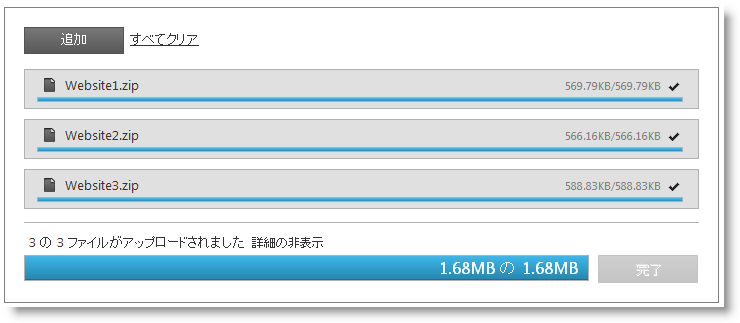
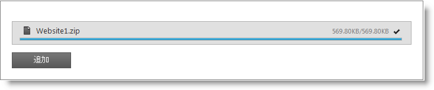

---
title: "igUpload の概要"
slug: igupload-overview
---

# igUpload の概要

## igUpload について
&#123;environment:ProductName&#125;™ アップロード コントロール、つまり `igUpload` は、あらゆるタイプのファイルをアップロードし、クライアントのブラウザーからサーバーへファイルを送信できるようにするコントロールです。アップロードされたファイルのサイズは、サーバー側の制限にのみ制限されるため、デフォルトの 10MB を超えるサイズの大規模ファイルをアップロードできます。

アップロード コントロールは、シングル アップロード (デフォルト) または同時に複数のファイルのアップロード操作を行うことができます。複数ファイルのアップロードを簡単に行うため、コントロールは HTML iframe 要素を使用してバックグラウンドでファイルをアップロードします。ファイルがアップロードされると、iframe は HTML として削除されます。

**図 1** で示すように、アップロード コントロールをサポートする UI 要素は多数存在します。次のような視覚要素があります。

-   個々のファイルのアップロードの進行状況を示すプログレス バー。
-   合計サイズ、アップロード サイズ、ファイル名などの情報。
-   ファイル タイプにしたがって変化するアイコン｡
-   キャンセル ボタン。
    -   ファイルがアップロードされると、キャンセル ボタンが消え、その場所に成功インジケーターが表示されます。
    -   アップロードがキャンセルされると、ファイル情報が非表示になります。

複数ファイルのアップロード中には、次のような視覚要素があります。

-   ファイルごとにプログレス バーとキャンセル ボタンがあります。
    -   キャンセルをクリックすると、個々のファイルはアップロード キューから削除されます。
-   サマリー プログレス バーは、すべてのファイルのアップロードの進行状況を表示します。
    -   全体をキャンセル ボタンをクリックすると、アップロード全体をキャンセルできます。

## アーキテクチャー
`igUpload` コントロールは、クライアント側 jQuery ウィジェットと、各アップロード要求の処理を担当するサーバー側ロジックという 2 つの必須部分で使用されます。サーバーは、アップロード自体の処理も担当しています。このドキュメントの例では ASP.NET Framework を使用してサーバー コードを実装していますが、`igUpload` コントロールはサーバー技術とは関係ありません。

アップロード コントロールは、豊富な jQuery API を公開しているため、コントロールをクライアント側で簡単に構成できます。また、Microsoft® ASP.NET MVC フレームワークを使用する開発者は、アップロード コントロールのサーバー側コンポーネントを利用して、好みの .NET 言語を使ってコントロールを構成できます。

`igUpload` コントロールは、大幅にスタイル変更できるため、デフォルトのスタイルとまったく異なるルック アンド フィールのコントロールを実現できます。スタイル設定オプションでは、独自のスタイルも jQuery UI の ThemeRoller のスタイルも使用できます。

**図 1:** ユーザーに表示された igUpload コントロール



## 機能
-   シングル/マルチ モード
-   デフォルトの 10MB 以上をアップロードします
-   自動アップロード
-   複数ファイルの同時アップロード
-   アップロード プロセスをキャンセルします
-   クライアント側イベント
-   最大アップロード ファイルを設定します
-   進行状況情報を表示/非表示にします
-   クライアント側の検証
-   サーバー側の検証
-   テーマのサポート
-   進行状況情報とファイルのアップロード状況を変更します
-   ファイルの拡張子にしたがって適切なアイコンを表示します
-   コントロールのラベルのテキストを変更します

## jQuery アップロードの Web ページへの追加
この例は、コントロールのクライアント側ロジックを組み込み、実装する方法、またサーバーがアップロードされたファイルを受信し保存するようサーバー側を構成する方法を示しています。

>**注:** サーバー側のアーキテクチャと実装の詳細は、[HTTP ハンドラーとモジュールの使用](./01_Working with igUpload/01_igUpload_Using_HTTP_Handler_and_Modules.mdx)をご覧ください。

このサンプルは、シングル モードでの基本的なアップロード シナリオを示しており、アップロードは自動的に開始します。

**図 2**



[igUpload シングル アップロードのサンプル](&#123;environment:SamplesUrl&#125;/file-upload/basic-usage)

1.  最初に、アプリケーションに必要なローカライズ済みのリソースを含めます。組み込むリソースの詳細は、「[&#123;environment:ProductName&#125; で JavaScript リソースを使用](/general-and-getting-started/deployment-guide-javascript-resources)」ヘルプ トピックをご覧ください。
2.  ご自分の HTML ページまたは ASP.NET MVC View で、必要な JavaScript ファイル、CSS ファイル、および ASP.NET MVC アセンブリを参照してください。

    **HTML の場合:**

```html
    <link type="text/css" href="/css/themes/infragistics/infragistics.theme.css" rel="stylesheet" /><link type="text/css" href="/css/structure/infragistics.css" rel="stylesheet" />
     <script type="text/javascript" src="/Scripts/jquery-1.4.4.min.js"></script>
    <script type="text/javascript" src="/Scripts/jquery-ui.min.js"></script>
    <script type="text/javascript" src="/Scripts/Samples/infragistics.core.js"></script><script type="text/javascript" src="/Scripts/Samples/infragistics.lob.js"></script>
```

    **ASPX の場合:**

```csharp
    <%@ Import Namespace="Infragistics.Web.Mvc" %><link type="text/css" href="<%= Url.Content("~/css/themes/infragistics/infragistics.theme.css") %>" rel="stylesheet" />
    <link type="text/css" href="<%= Url.Content("~/css/structure/infragistics.css") %>" rel="stylesheet" />
    <script type="text/javascript" src="<%= Url.Content("~/Scripts/jquery-1.4.4.min.js") %>"></script>
    <script type="text/javascript" src="<%= Url.Content("~/Scripts/jquery-ui.min.js") %>"></script>
    <script type="text/javascript" src="<%= Url.Content("~/Scripts/Samples/infragistics.core.js") %>"></script><script type="text/javascript" src="<%= Url.Content("~/Scripts/Samples/infragistics.lob.js") %>"></script>
```

    **Razor の場合:**

```csharp
    @using Infragistics.Web.Mvc;

    <link type="text/css" href="@Url.Content("~/css/theme/infragistics/infragistics.theme.css")" rel="stylesheet" />
    <link type="text/css" href="@Url.Content("~/css/structure/infragistics.css")" rel="stylesheet" />

    <script type="text/javascript" src="@Url.Content("~/Scripts/jquery-1.4.4.min.js")"></script>
    <script type="text/javascript" src="@Url.Content("~/Scripts/jquery-ui.min.js")"></script>
    <script type="text/javascript" src="@Url.Content("~/Scripts/Samples/infragistics.core.js")"></script><script type="text/javascript" src="@Url.Content("~/Scripts/Samples/infragistics.lob.js")"></script>
```

3.  jQuery の実装では、HTML 内のターゲット要素として DIV を定義します。ASP.NET MVC の実装の場合、含める要素を &#123;environment:ProductNameMVC&#125; が作成してくれるので、この手順はオプションです。

    **HTML の場合:**

```html
    <div id="igUpload1"></div>
```

4.  上記のセットアップが完了したら、ID、`autostartupload`、`progressUrl` などのオプションを設定します。最後のプロパティは、ファイルの進行状況またはファイル サイズに関する情報を返し、cancel upload コマンドを扱う HTTP ハンドラーの URL を定義します。サーバー側に接続し、アップロード コントロールを動作させるため、クライアント側ウィジェットで必要なものはそれだけです。残りのオプションにはデフォルト値を設定します。たとえば、アップロード モードの場合は single です。注: ASP.NET MVC View では、その他のオプションをすべて設定した後で Render メソッドを呼び出す必要があります。

    **jQuery の場合:**

```js
    <script type="text/javascript" language="javascript">
    $(window).load(function () {
        $("#igUpload1").igUpload({
            autostartupload: true,
            progressUrl: "/IGUploadStatusHandler.ashx"
        });
    });
    </script>
```

    **ASPX の場合:**

```csharp
    <%= Html.Infragistics().Upload()
        .ID("igUpload1")
        .AutoStartUpload(true)
        .ProgressUrl("/IGUploadStatusHandler.ashx")
        .Render()
    %>
```

    **Razor の場合:**

```csharp
    @(  Html.Infragistics().Upload()
        .ID("igUpload1")
        .AutoStartUpload(true)
        .ProgressUrl("/IGUploadStatusHandler.ashx")
        .Render()
    )
```
	>**注:** MVC プロジェクトで igUpload を使用する場合、*Global.asax* ファイル内の HTTP ハンドラーの URL を無視する必要があります。
	
	**Global.asax の場合:**
```csharp
	    protected static void RegisterRoutes(RouteCollection routes)
	    {
	        routes.IgnoreRoute("IGUploadStatusHandler.ashx");
	    }
```

5.  次に、サーバー側 HTTP ハンドラーとモジュールを構成する必要があります。

## ASP.NET の HTTP ハンドラーとモジュールの構成
必要な HTTP ハンドラーとモジュールは、`Infragistics.Web.MVC dll` だけではなく &#123;environment:ProductNameMVC&#125; の一部です。次の手順に従ってそれらを Web.config ファイルに登録します。

1.  まず最初に、アップロードされたファイルを保存する書き込み許可のあるフォルダー を作成する必要があります。次に、`igUpload` がどこにファイルを保存するか認識するよう、そのフォルダーを Web.config ファイルに登録する必要があります (以下のコードを参照)。現在の例では、Uploads というフォルダーになっています。
2.  `maxFileSizeLimit` 設定を行うことで、アップロードされたファイルのサイズを制限できます。このサンプルでは、このサイズは約 100 MB です。

    **Web.config の場合:**

```xml
    <appSettings>
        <add key="fileUploadPath" value="~/Uploads" />
        <add key="maxFileSizeLimit" value="100000000" />
    </appSettings>
```

    >**注:** `maxFileSizeLimit` の値はバイト単位です。

3.  モジュールとハンドラーを登録する必要があります。サーバーによっては、Web.config ファイルを構成する必要があります。

    IIS6 (および開発環境) の場合:
    ======================================

    **Web.config の場合:**

```xml
    <system.web>
        <httpHandlers>
             <add verb="GET" type="Infragistics.Web.Mvc.UploadStatusHandler" 
                             path="IGUploadStatusHandler.ashx" />
        </httpHandlers>
        <httpModules>
            <add name="IGUploadModule" type="Infragistics.Web.Mvc.UploadModule" />
        </httpModules>
		
		<httpRuntime executionTimeout="3600" maxRequestLength="2097151000"/>
    </system.web>
```

    IIS7 の場合:
    ========

    **Web.config の場合:**

```xml
    <system.webServer>
        <modules runAllManagedModulesForAllRequests="true">
            <add name="IGUploadModule" type="Infragistics.Web.Mvc.UploadModule" 
                                       preCondition="managedHandler" />
        </modules>
        <handlers>
            <add name="IGUploadStatusHandler" path="IGUploadStatusHandler.ashx" verb="*"
				type="Infragistics.Web.Mvc.UploadStatusHandler" preCondition="integratedMode" />
       </handlers>    
	   <security>      
			<requestFiltering>    
				
				<requestLimits maxAllowedContentLength="2097151000"/>
	      </requestFiltering>    
	   </security>
    </system.webServer>
```

4.  Web ページを実行して、基本的なアップロード コントロールを取得します。ブラウザーに表示されるファイル ピッカーからファイルを選択し、図 2 に示すように `igUpload` が公開する進行状況情報を監視します。
	 >**注:** アップロード コントロールを実行することがまだできない場合には、可能性のあるエラーを探し出すために[「クライアント側イベントの使用」](./01_Working with igUpload/02_igUpload_Using_Client_Side_Events.mdx)に従ってください。クライアント側イベントのトピックでは、クライアント側イベント onError に添付し問題を調査する方法を説明します。

## igUpload のアプリケーション設定
`igUpload` は、HTTP モジュールおよびハンドラーの動作を制御するアプリケーション設定があります。この設定はアプリケーションの web.config ファイルに構成されます。
**表 1:** `igUpload` のアプリケーション設定

設定|説明|デフォルト値
---|---|---
FileUploadPath |ファイルにアップロードされるパスを構成します。|"~/Uploads"
CustomDictionaryProvider |サード パーティのディクショナリ プロバイダー (アップロードされているファイルのメタデータを含む構造) を構成します。この設定は、共有のファイル メタデータが複数のコンピューター/プロセルの間に共有される Web ファーム/Web ガーデンなどのシナリオのために実装されます。この設定は、`ISafeDictionary&lt;string, UploadInfo&gt;` インターフェイスを実装するタイプ名です。|-
FileSaveType |アップロードの処理ライフサイクルを構成します。「filestream」または「memorystream」に設定できます。「filestream」モードの場合、HTTP モジュールはファイルを自動的に処理し、FileUploadPath ディレクトリに保存されます。「memorystream」モードの場合、ファイルはサーバー RAM にアップロードされます。FileUploading または UploadFinishing のサーバー側イベントを処理すると、ディスクまたはデータベースに手動的に保存する必要があります。「memorystream」モードの詳細については、「[ファイルをストリームとして保存](./01_Working with igUpload/04_igUpload_Saving_Files_as_Stream.mdx)」トピックを参照してください。|"filestream"
maxFileSizeLimit |アップロード可能な最大のファイル サイズの制限を構成します。|"4194304"
bufferSize |サーバーにアップロードされるデータの部分のサイズを構成します。|"16384"
allowedMIMEType |アップロード可能な MIME の種類を構成します。MIME の種類を分割するには、「|」文字を使用します。例: `&lt;add key="allowedMIMEType" value="image/jpeg/image/gif"/&gt;`|"*"


## 関連リンク
-   [igUpload シングル アップロードのサンプル](&#123;environment:SamplesUrl&#125;/file-upload/basic-usage)
-   [&#123;environment:ProductName&#125; の概要](/igniteui-for-jquery-overview)
-   [&#123;environment:ProductName&#125; で JavaScript リソースを使用](/general-and-getting-started/deployment-guide-javascript-resources)
-   [igUpload HTTP ハンドラーおよびモジュール](./01_Working with igUpload/01_igUpload_Using_HTTP_Handler_and_Modules.mdx)
-   [igUpload クライアント側イベント](./01_Working with igUpload/02_igUpload_Using_Client_Side_Events.mdx)
-   [ASP.NET MVC での igUpload サーバー側イベント](./01_Working with igUpload/03_igUpload_Using_Server_Side_Events.mdx)

 

 


