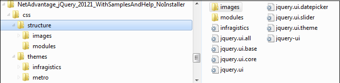
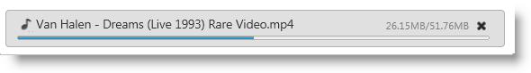
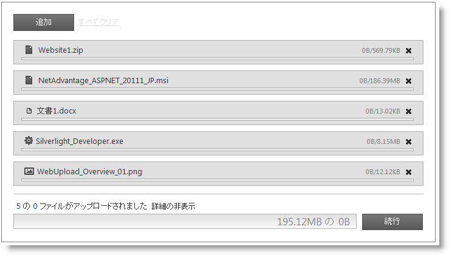

---
title: "igUpload のスタイル設定"
slug: igupload-styling-and-theming
---

# igUpload のスタイル設定

このトピックは、`igUpload` コントロールをカスタマイズして、カスタムのルック アンド フィールを実現する方法を紹介します。コントロールをスタイル設定するのに必要なスクリプトおよびスタイルについても説明します。

## 必要な CSS とテーマ

&#123;environment:ProductName&#125;™ `igUpload` は、ほかの jQuery ウィジェットのように、スタイリングに jQuery UI CSS Framework を使用します。&#123;environment:ProductName&#125; には、Infragistics および Metro と呼ばれるカスタム jQuery UI テーマが含まれています。これらのテーマによって、Infragistics ウィジェットおよび標準の jQuery UI ウィジェットが、プロフェッショナルで魅力的な外観になります。

Infragistics および Metro テーマに加えて、Infragistics ウィジェットの基本 CSS レイアウトに必要な structure ディレクトリがあります。

### 必要なテーマの Web サイトへの追加

Infragistics および Metro テーマは、css フォルダー内のインストール ディレクトリに配置されています。テーマをアプリケーションに追加するには、css フォルダー全体 (structure および themes ディレクトリを含む) をサイトの場所にコピーします。

>**注:** Infragistics Loader の使用時は、フォルダー構造を保持する必要があります。このようにすると、ローダーは期待通りに機能します。使用されないテーマがある場合、それらは削除することができますが、その構造は変更してはいけません。

**図 1: 製品インストール時に含まれるテーマ フォルダー**



## Infragistics および Metro テーマ

Infragistics テーマは、jQuery UI テーマに通常存在するすべてのスタイルを含むカスタム テーマです。このテーマは、別のテーマで置き換えることができますが、jQuery ウィジェットを正しく表示するには、`{IG Resources root}/css/structure/infragistics.css` ファイルへの参照が必要です。

Metro テーマは、クリーン、モダンかつ高速な Metro デザイン言語の実装です。これには、Infragistics テーマと同様に、`{IG Resources ルート}/css/structure/infragistics.css` と同じ要件があります。

Infragistics (または Metro) テーマ以外のテーマを使うと、`igUpload` にスタイル設定ポイントがいくつか追加されるため、完璧なデザインを実現するにはカスタマイズが必要になる場合があります (upload で有効にしている機能とテーマによって異なります)。

`igUpload` コントロールには、標準の jQuery UI テーマのスタイルシートへのリンクが必要です。IG テーマの場合、テーマのスタイルシートへの参照をページに含める必要があります。

### リスト 1: Infragistics テーマへの手動 CSS 参照

**HTML の場合:**

```html
<link href="css/themes/infragistics/infragistics.theme.css" rel="stylesheet" type="text/css" />
<link href="css/structure/modules/infragistics.ui.upload.css" rel="stylesheet" type="text/css" />
```

### リスト 2: ASP.NET MVC の Infragistics テーマへの CSS 参照

**HTML の場合:**

```html
<%@ Import Namespace="Infragistics.Web.Mvc" %>
<!DOCTYPE html>
<html>
<head runat="server">
<link href="<%= Url.Content("~/css/themes/infragistics/infragistics.theme.css") %>” rel="stylesheet"                                                                       type="text/css" />
<link href="<%= Url.Content("~/css/structure/modules/infragistics.ui.upload.css") %>” rel="stylesheet"                                                                       type="text/css" />
```

**Metro テーマ**

Metro テーマは、jQuery テーマの後に参照されます。`igUpload` コントロールを使用する場合、以下のスタイルシートが必要です。

### リスト 3: Metro テーマへの手動 CSS 参照

**HTML の場合:**

```html
<link href="css/themes/metro/infragistics.theme.css " rel="stylesheet" type="text/css" />
<link href="css/structure/modules/infragistics.ui.upload.css" rel="stylesheet" type="text/css" />
```

### リスト 4: ASP.NET MVC の Metro テーマへの CSS 参照

**HTML の場合:**

```html
<%@ Import Namespace="Infragistics.Web.Mvc" %>
<!DOCTYPE html>
<html>
<head runat="server">
<link href="<%= Url.Content("~/css/themes/metro/infragistics.theme.css ") %>” rel="stylesheet"                                                                       type="text/css" />
<link href="<%= Url.Content("~/css/structure/modules/infragistics.ui.upload.css") %>” rel="stylesheet"                                                                       type="text/css" />
```

## CSS プロパティ
upload CSS プロパティは、コントロールのすべてのスタイルが適用されるメンバーです。**表 1** は、CSS オブジェクト プロパティのすべてのプロパティとそれらに適用されるすべてのルールを示しています。これによって、特定のクラスを上書きすることで独自のテーマを自由に作成できるようになります。

>**注:** Theme Roller は、表に示したクラスを単純に上書きすることによってコントロールにテーマを設定しています。詳細は、Theme Roller を使用した実際のサンプル [サンプルへのリンク] を参照してください。

### 表 1: CSS クラスのリスト
CSS オブジェクト プロパティ|プロパティに適用される CSS クラスのリスト|CSS クラスが適用される範囲
---|---|---
clearClass|ui-helper-clearfix |フロート ラッピング プロパティを親要素に適用します
hiddenClass|ui-helper-hidden |要素を非表示にします
baseClassIE6|ui-ie6 |IE6 のクラス
baseClassIE7|ui-ie7 |IE7 のクラス
baseClassMoz|ui-moz |FF のクラス
baseClassOpera|ui-opera |Opera のクラス
startupBrowseButtonClasses|ui-igstartupbrowsebutton |スタートアップ参照ボタンのクラス
baseClass|ui-widget ui-widget-content ui-corner-all ui-igupload |コンテナーのクラス
baseMainContainerClass|ui-igupload-basemaincontainer |単一/複数 モードでメイン コンテナーに適用されるクラス
multipleDialogClasses|ui-iguploadmultiple |複数ファイル アップロード モードを選択したときにメイン コンテナーに適用されるクラス
singleDialogClass|ui-iguploadsingle |複数ファイル アップロード モードを選択したときにメイン コンテナーに適用されるクラス
browseButtonClass|ui-igupload-browsebutton |メイン コンテナーの参照ボタンに適用されるクラス
containerClass|ui-igupload-container ui-widget-content |すべてのファイル アップロード プログレス バーを含む DOM 要素に適用されるクラス
uploadProgressClass|ui-igupload-uploadprogress |個々のファイル アップロードを含む DIV
fileInfoMainContainer|ui-igupload-fimaincontainer |追加ボタン、クリアボタン、およびファイルの進行状況の詳細を含む DIV に適用されるクラス
progressContainer|ui-helper-clearfix |各ファイルのクラス コンテナー
progressBarUploadClass|ui-igupload-progressbar-upload ui-helper-clearfix |単一のプログレス バーに適用されるクラス
progressBarFileNameClass|ui-igupload-progressbar-filename |サマリー プログレス バーのファイル名 DOM 要素に適用されるクラス
progressBarFileSizeClass|ui-igupload-progressbar-filesize |サマリー プログレス バーのファイル サイズ DOM 要素に適用されるクラス
progressBarInnerHTMLContainerClass|ui-igupload-progressbar-container ui-helper-clearfix |各プログレス バー内のファイル名 DOM 要素およびファイル サイズ DOM 要素のコンテナーのクラス
containerButtonCancelClass|ui-container-button-cancel-class ui-helper-clearfix |プログレス バーの近くにあるキャンセル/完了ボタンのコンテナーのクラス
summaryProgressBarClass|ui-igupload-summaryprogressbar |サマリー プログレス バーに適用されるクラス
summaryProgressContainerClass|ui-igupload-summaryprogresscontainer |サマリー プログレス バーのコンテナーに適用されるクラス
summaryProgressbarLabelClass|ui-igupload-summaryprogress-label |サマリー プログレス バーのラベルのクラス
summaryInformationContainerClass|ui-igupload-summaryinformation-container ui-helper-clearfix |サマリー プログレス領域内のコンテナーのクラス。サマリー プログレスのラベルおよび詳細の表示/非表示ボタンを含みます
summaryUploadedFilesLabelClass|ui-igupload-summaryuploadedfiles-label |サマリー プログレスのステータスを表示する DOM 要素に適用されるクラス
summaryShowHideDetailsButtonClass|ui-igupload-showhidedetails-button |サマリー プログレス領域にある詳細の表示/非表示ボタンのクラス
summaryButtonClass|ui-igupload-summary-button |キャンセル ボタンに設定されるクラス
summaryProgressBarInnerProgress|ui-igupload-summaryprogres_summpbar_progress |プログレス DIV 内に設定されるクラス
summaryProgressBarSecondaryLabel|ui-igupload-summaryprogress-label ui-igupload-summaryprogress-secondary-label |サマリー プログレス バーの 2 番目のラベルのクラス
containerFUS|ui-widget-content ui-igupload-progress-container ui-corner-all ui-helper-clearfix |個々のファイルのコンテナーのクラス。プログレス バー、ファイル情報、キャンセル ボタンなどを含みます


>**注:** すべてのクラスが upload コントロール用のカスタムということではありません。一部は、jQuery UI CSS Framework から再利用されます。

## ファイル拡張子のアイコン
Upload プロパティ `showFileExtensionIcon` を True に設定すると、コントロールは、アップロードされるファイルの種類を示すアイコンをファイル名の左に表示します。

**図 3: アップロード時のファイル拡張子アイコン**



デフォルトで、主要な拡張子のアイコンの多くが組み込み済みです。アイコンでサポートされる種類は、現在のカテゴリによるものです。

ファイルの種類|ファイルの拡張子
---|---
アプリケーション|exe、app
画像|gif、jpg、jpeg、png、bmp、uyv、tif、thm、psd
音楽|mp3、wav、mp4、aac、mid、wma、ra、iff、aif、m3u、mpa
ドキュメント|doc、docx、xls、xlsx、txt、ppt、pptx、pdf
ビデオ|3pg、asf、asx、avi、flv、mov、mp4、mpg、rm、swf、vob、wmv

**図 4** は、複数ファイルのアップロード操作をしているときのデフォルトでのアイコンの外観を示しています。

**図 4: 複数ファイル アップロード処理時のアップロード コントロール**



>**注:** 組み込み済みのファイルの種類以外のファイルには、デフォルト アイコンが適用されます。

## ファイル拡張子アイコンの変更
ファイル拡張子アイコンをカスタマイズしたい場合は、新しいアイコンを `fileExtensionIcons` プロパティに指定してデフォルト値をオーバーライドします。

`fileExtensionIcons` プロパティは、それぞれのファイルの種類にマップするオブジェクトの配列を受け取ります。**リスト 1** は、既存の拡張子スタイルを新しい CSS クラスに関連付ける方法を示しています。

**リスト 1: デフォルトのファイル拡張子アイコンのオーバーライド**

**JavaScript の場合:**

```js
fileExtensionIcons: [
    {
        ext: ['gif', 'jpg', 'jpeg', 'png', 'bmp', 'yuv', 'tif', 'thm', 'psd'],
        css: 'image-class',
        def: true
    },
    {
        ext: ['mp3', 'wav', 'mp4', 'aac', 'mid', 'wma', 'ra', 'iff', 'aif', 'm3u', 'mpa'],
        css: 'audio-class',
        def: false
    }
]
```

各マッピングは、以下の 3 つの値を考慮する必要があります。

-   `ext`: アイコンを共有するファイル拡張子の配列。
-   `css`: ext プロパティで定義された拡張子を持つ各ファイルに適用される CSS クラス。
-   `def`: ext 配列で定義されていない種類に適用されるデフォルトのルールかどうかを指定します。

複数のデフォルト プロパティを持つファイル拡張子アイコンがある場合、最後の定義が優先されます。

## 外部参照
-   [jQuery UI](http://jqueryui.com/)
-   [jQuery UI - はじめに](http://docs.jquery.com/UI/Getting_Started)
-   [jQuery Themeroller](http://jqueryui.com/themeroller/)
-   [jQuery UI のテーマ設定](http://docs.jquery.com/UI/Theming)
-   [jQuery UI CSS Framework](http://docs.jquery.com/UI/Theming/API)

## 関連リンク
-   [&#123;environment:ProductName&#125; の概要](/igniteui-for-jquery-overview)
-   [&#123;environment:ProductName&#125; で JavaScript リソースを使用](/deployment-guide-javascript-resources)

 

 


