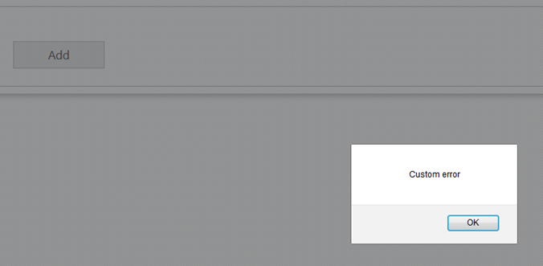

# ASP.NET MVC でサーバー側イベントの使用 (igUpload)

import ApiLink from 'docs-template/components/mdx/ApiLink.astro';

# ASP.NET MVC でサーバー側イベントの使用 (igUpload)

## トピックの概要
このトピックでは、*igUpload* コントロールのサーバー側イベントをリストし、目的および引数を説明し、Infragistics.Web.Mvc.dll の ** UploadProgressManager** クラスによってイベントの処理の例を表示します。サーバー側の検証を実装するためにファイル アップロード プロセスを処理する例もあります。

## 前提条件
以下の表は、このトピックを理解するための前提条件として必要な概念、トピック、および記事の一覧です。

-   [igUpload の概要](/igupload-overview)
-   [HTTP ハンドラーおよびモジュールの使用 (igUpload)](/igupload-using-http-handler-and-modules)

## このトピックの内容

-	UploadProgressManager とサーバー イベント
-	クライアントおよびサーバの間に追加データの送信
-	チュートリアル: MVC でのサーバー側検証

## UploadProgressManager とサーバー イベント

`igUpload` コントロールは、ASP.NET を使用してアップロードしたデータを処理して保存するために Infragistics.Web.Mvc.dll でサーバー側実装を含みます。アップロードしたデータを受け取るサーバー イベントを処理する HTTP モジュールと HTTP ハンドラーによって実装されます。[HTTP ハンドラーおよび Module の使用 (igUpload)](/igupload-using-http-handler-and-modules) トピックでイベントの構成についての詳細および例があります。

[UploadProgressManager](Infragistics.Web.Mvc~Infragistics.Web.Mvc.UploadProgressManager.html) は、ハンドラーとモジュールがプロキシ クラスを使用して通信するよう設計されたサーバー アーキテクチャです。このクラスは単一のオブジェクトとして実装されます。インスタンスは [UploadProgressManager.Instance](Infragistics.Web.Mvc~Infragistics.Web.Mvc.UploadProgressManager~Instance.html) プロパティによってアクセスできます。このクラスは、サーバー イベントをアタッチし、トリガーする役割もします。これらのイベントでは、ファイル アップロード処理に対して、アップロード済みファイルの削除や移動、アップロードのキャンセル、状態情報の修正などの操作を実行できます。**表 1** は利用可能なサーバー側イベントをリストします:

**表 1:** サーバー側イベント


| イベント | 説明 | 引数 | キャンセル可能 |
| --- | --- | --- | --- |
| UploadStarting | ファイルのアップロードが開始しているときにトリガーされます。この段階では、ファイルがアップロードされていません。要求ヘッダーからの情報は `UploadStartingEventArgs` 引数に利用可能です。この情報を使用した場合、検証ルールを実装しアップロードをキャンセルするかどうかを決定できます。 | object - イベントをトリガーした UploadProgressManager インスタンスを含みます。 [UploadStartingEventArgs](Infragistics.Web.Mvc~Infragistics.Web.Mvc.UploadStartingEventArgs.html) - アップロードするファイルの情報を含みます。 | true |
| FileUploading | ファイルの各部分がサーバーにアップロードされたときにトリガーされます。このイベントで、FileUploadingEventArgs.FileChunk プロパティから現在の部分を読み込み、ファイルを手動的に処理できます。 注: このイベントは[ファイルをストリームとして保存](/igupload-saving-files-as-stream)シナリオで使用されます。このイベントは FileSaveType="memorystream" の場合のみにトリガーされます。 | object - イベントをトリガーした UploadProgressManager インスタンスを含みます。 [FileUploadingEventArgs](Infragistics.Web.Mvc~Infragistics.Web.Mvc.FileUploadingEventArgs.html) - アップロードされているファイルの現在のデータ部分を含みます。 | true |
| UploadFinishing | ファイルのアップロードが完了しているときにトリガーされます。この段階では、ファイルはすでにアップロードされていますが、一時的な名前のままです。`igUpload` はファイルをリリースしているので、自由に変更できます。 | object - イベントをトリガーした UploadProgressManager インスタンスを含みます。 [UploadFinishingEventArgs](Infragistics.Web.Mvc~Infragistics.Web.Mvc.UploadFinishingEventArgs.html) - アップロードされたファイルの情報を含みます。 | true |
| UploadFinished | ファイルのアップロードが完了したときにトリガーされます。この段階では、ファイルはアップロードされており、オリジナルの名前で変更されています。古いファイル名と同じ名前のファイルがある場合は上書きされ、最後のファイルのみが使用可能になります。 | object - イベントをトリガーした UploadProgressManager インスタンスを含みます。 [UploadFinishedEventArgs](Infragistics.Web.Mvc~Infragistics.Web.Mvc.UploadFinishedEventArgs.html) - アップロードされたファイルの情報を含みます。 | false |


ASP.NET MVC の場合、`igUpload` コントロールのサーバー側イベントにアタッチ/デタッチするには、UploadProgressManager メソッドを使用します。各メソッドの最初パラメーターは、イベントにアタッチするコントロールの ID ([UploadModel.ControlId](Infragistics.Web.Mvc~Infragistics.Web.Mvc.UploadModel~ControlId.html)) です。**表 2** は、UploadProgressManager メソッドおよびイベント ハンドラーにあった地する相対イベントをリストします。

**表 2:** サーバー側イベントにアタッチするために使用される UploadProgressManager メソッド。

UploadProgressManager メソッド|イベント|例
---|---|---
[AddStartingUploadEventHandler](infragistics.web.mvc~infragistics.web.mvc.uploadprogressmanager~addstartinguploadeventhandler.html)|UploadStarting|`UploadProgressManager .Instance.AddStartingUploadEventHandler("upload1" , startingUploadHandler);`
[AddFileUploadingEventHandler](infragistics.web.mvc~infragistics.web.mvc.uploadprogressmanager~addfileuploadingeventhandler.html) |FileUploading |`UploadProgressManager .Instance.AddFileUploadingEventHandler("upload1" , fileUploadingHandler);`
[AddFinishingUploadEventHandler](infragistics.web.mvc~infragistics.web.mvc.uploadprogressmanager~addfinishinguploadeventhandler.html) |UploadFinishing |`UploadProgressManager .Instance.AddFinishingUploadEventHandler("upload1" , fileFinishingHandler);`
[AddFinishedUploadEventHandler](infragistics.web.mvc~infragistics.web.mvc.uploadprogressmanager~addfinisheduploadeventhandler.html) |UploadFinished |`UploadProgressManager .Instance.AddFinishedUploadEventHandler("upload1" , fileFinishedHandler);`


**注:** コントローラー アクションで `igUpload` サーバー側イベントにアタッチしないでください。コントローラー アクションがアプリケーション ライフサイクルで複数回起動する可能性があるため、単一のイベント ハンドラーが複数回にアタッチする結果が可能です。サーバー側イベントに一回のみアタッチします。MVC プロジェクトの Global.asax ファイルのアプリケーション開始ロジックでサーバー側イベントを処理してください。

##  ファイル アップロードでクライアントおよびサーバの間に追加データの送信

アップロードされたファイルに関連するカスタムのデータをさらにサーバーからクライアントへ、またはクライアントからサーバーへ送信する場合もあります。

たとえば、サーバーでカスタムのファイル検証を適用し結果をクライアントで表示する、またはファイル アプロードが完了したときにカスタムのメッセージを表示することがあります。あるいは、クライアント側からアプロード中のファイルに関係のある追加的データ (セキュリティ GUID、クライアント側入力フィールドなど) を送信し、関連するサーバー側イベントでデータにアクセスするケースもあります。

以下では、`igUpload` を使用してその詳細手順を説明します。

### サーバーからクライアントへの追加的データの送信

カスタム メッセージを追加するには、`UploadStarting`、`UploadFinishing` および `UploadFinished` イベント引数の `ServerMessage` を使用します。

**C# の場合**

```
public static void igUpload_UploadStarting(object sender, Infragistics.Web.Mvc.UploadStartingEventArgs e){          
              e.ServerMessage = "Upload of " + e.FileName + " started.";   
        }
        
public static void igUpload_UploadFinishing(object sender, Infragistics.Web.Mvc.UploadFinishingEventArgs e){          
             e.ServerMessage = "Upload of " + e.FileName + "is about to finish.";   
        }
        
public static void igUpload_UploadFinished(object sender, Infragistics.Web.Mvc.UploadFinishedEventArgs e){          
            	e.ServerMessage = "Upload of " + e.FileName + "is finished.";   
        }           
```

この値はクライアント側で、<ApiLink type="igupload" member="fileUploading" section="events" label="fileUploading" /> および <ApiLink type="igupload" member="fileUploaded" section="events" label="fileUploaded" /> の関連するクライアント側イベントから取得します。`uploadInfo` イベント引数は、サーバーから送信された serverMessage 値など、追加ファイル情報を含みます。

**JavaScript の場合:**

```
$(function(){
        $("#upload1").on("iguploadfileuploading", function (evt, ui) {
			alert(ui.fileInfo.serverMessage);
        });  
    
        $("#upload1").on("iguploadfileuploaded", function (evt, ui) {
			alert(ui.fileInfo.serverMessage);
        });
        
     });

```

>**注:** 詳細なデータを渡す場合は、e.ServerMessage の一部として JSON 形式で渡し、クライアント側で逆シリアル化します。

### クライアントからサーバーへの追加データの送信

要求にデータを追加するには <ApiLink type="igupload" member="onFormDataSubmit" section="events" label="onFormDataSubmit" /> クライアント側イベントを使用します。<ApiLink type="igupload" member="addDataField" section="methods" label="addDataField" /> および <ApiLink type="igupload" member="addDataFields" section="methods" label="addDataFields" /> メソッドでパラメーターを追加します。

**JavaScript の場合:**

```
 $("#upload1").on("iguploadonformdatasubmit", function (evt, ui) {
            $("#upload1").igUpload("addDataField", ui.formData, { "name": "Parameter Name", "value": "Value" });
        });
```

クライアント側のデータを取得するには、サーバーに渡されるフィールド名および値のコレクションを含む、`UploadStarting`、`UploadFinishing` および `UploadFinished` の `AdditionalDataFields` イベント引数を使用します。

**C# の場合:**

```
public static void igUpload_UploadStarting(object sender, Infragistics.Web.Mvc.UploadStartingEventArgs e){          
       foreach (var dataField in e.AdditionalDataFields)
	   {
		   string fieldName = dataField.Name;
		   string fieldValue = dataField.Value;
	   } 
   }
```

##　チュートリアル: MVC でのサーバー側検証

###　概要
この手順は、`igUpload` のカスタム検証をサーバー側で実装する方法を説明します。

###　要件
この手順を実行する前に、[igUpload の概要](/igupload-overview) トピックの手順を完了してください。


1.	jQuery アップロードの Web ページへの追加
2.	ASP.NET の HTTP ハンドラーとモジュールの構成

その手順を実行した後、MVC アプリケーションで基本のアップロード コントロールがあります。

###　手順

**手順 1**`igUpload` の UploadStarting イベントのサーバー側イベント ハンドラーを登録します。

`UploadStarting` イベント ハンドラーを `Global.asax` の ` Application_Start()` メソッドで登録します。[AddStartingUploadEventHandler](Infragistics.Web.Mvc~Infragistics.Web.Mvc.UploadProgressManager~AddStartingUploadEventHandler.html) メソッドは 2 つのパラメーターを受けます: コントロール ID およびイベント ハンドラー。コントロール ID の値が関連する `igUpload` コントロールで定義された `ControlId` プロパティと一致する必要があります。イベントが関連する `ControlId` を持つ各 `igUpload` コントロールで発生されます。定義されるビュー/コントローラーに関係がありません。このイベント ハンドラーを登録する必要な別の `ControlId` 値を持つその他の igUpload コントロールがある場合、 
[AddStartingUploadEventHandler](Infragistics.Web.Mvc~Infragistics.Web.Mvc.UploadProgressManager~AddStartingUploadEventHandler.html) メソッドを各コントロールで呼び出します。最初のパラメーターが関連する `igUpload` コントロールで定義される `ControlId` オプションと一致する必要があります。 

**C# の場合**

```
protected void Application_Start()
{
            //configurations for  Area Registration, WebApi, Filte and Route 
            AreaRegistration.RegisterAllAreas();

            WebApiConfig.Register(GlobalConfiguration.Configuration);
            FilterConfig.RegisterGlobalFilters(GlobalFilters.Filters);
            RouteConfig.RegisterRoutes(RouteTable.Routes);

            //registed UploadStarting event via the UploadProgressManager
            UploadProgressManager.Instance.AddStartingUploadEventHandler("upload1",
           new EventHandler<UploadStartingEventArgs>(igUpload_UploadStarting));
} 
public static void igUpload_UploadStarting(object sender, Infragistics.Web.Mvc.UploadStartingEventArgs e)
{
            // implement logic here. See next step for details.
} 

```

**手順 2** イベント ハンドラーでカスタム検証ロジックを追加します。条件と一致しない場合、カスタム [ServerMessage](Infragistics.Web.Mvc~Infragistics.Web.Mvc.UploadCancellableBaseEventArgs~ServerMessage.html) を設定し、イベントをキャンセルします。

**C# の場合**

```
public static void igUpload_UploadStarting(object sender, Infragistics.Web.Mvc.UploadStartingEventArgs e){
            //Custom Validation logic		
            e.ServerMessage = "Custom error";
            e.Cancel = true;
        }

```

**手順 3**クライアント側エラー イベントでカスタム サーバー メッセージをクライアント側で表示します。

**JavaScript の場合**

```
$(function(){
        $("#upload1").on("iguploadonerror", function (evt, ui) {
            // This property can be set during the 
            // server event UploadStarting. If not set it’s 
            // an empty string. (You can use it to display custom error messages.)
            alert(ui.serverMessage);
        });
    });

```

**手順 4**結果を検証します。

条件と一致しないファイルをアップロードした後、カスタム エラー メッセージが表示されます。



## 関連リンク
-   [\{environment:ProductName\} の概要](/igniteui-for-jquery-overview)
-   [\{environment:ProductName\} で JavaScript リソースを使用](/deployment-guide-javascript-resources)

 

 


