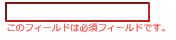

# igValidator の概要

`igValidator` コントロールは、従来とは異なる新しいルック アンド フィールを提供します。このコントロールは、すべてのフォーム要素およびエディター、コンボ ボックスなどの既存のコンポーネントやユーザー入力を収集するためのその他のコンポーネントで簡単に操作できるように設計されています。このコントロールは、通知ウィジェットのデザインを活用し、その視覚エフェクトを使用して、必要な success メッセージと error メッセージを表示します。

### このトピックの内容

- [概要](#introduction)
- [igValidator のセットアップ](#setting-up)
- [検証トリガー](#triggers)
- [入力規則](#validation-priority)
- [ASP.NET MVC でのデータ注釈](#mvc-annotations)
- [関連コンテンツ](#related-content)

## <a id="introduction"></a> 概要

`igValidator` コントロールの主な目的は、デフォルトで、合格した検証と失敗した検証について直ちにエンドユーザーに通知することです。ユーザーがエディターの入力をぼかした場合、フィードバック メッセージが即座に表示され、エディターの状態に関する有益な情報を提供します。たとえば、現在のフィールドの必要の有無、要求されたデータの入力の有無などの詳細を示すメッセージを表示できます。

`igValidator` は、success と error のメッセージを使用して、異なる[構成](#setting-up)や複数の[入力規則](#validation-priority)をサポートします。メッセージは、定義済みの [`messageTarget`](&#123;environment:jQueryApiUrl&#125;/ui.igValidator#options:messageTarget) に配置、または `igNotifier` ウィジェットに渡すことができます。ウィジェットの場合は、入力されたデータが入力規則に適合しないと特定の入力が赤色で表示され、現在の操作に問題があることを通知します。

`requiredIndication` プロパティを使用すると、オプションで必要なフォーム要素を事前にアドバイスできます。また、`optionalIndication` プロパティで特定のフィールドがオプションであることを示すこともできます。

すべての`igValidator` オプションについては、[igValidator API](&#123;environment:jQueryApiUrl&#125;/ui.igvalidator) を参照してください。

## <a id="setting-up"></a> igValidator のセットアップ

バリデーター コントロールは、複数のターゲット (フィールド) で個別に、またはサポートされる &#123;environment:ProductName&#125; コントロール、エディター、コンボおよびレーティングを統合した状態で構成できます。このコントロールのカスタマイズと構成で使用できる多数のオプションがあります。

### 他の &#123;environment:ProductName&#125; コントロールからの構成

```html
<div id="textEditor"></div>
```
```js
$('#textEditor').igTextEditor({
  inputName: "pass",
  textMode: "password",
  validatorOptions: {
    required: true,
    onblur: true,
    lengthRange: [6, 20],
    requiredIndication: true
  }
});
```



> **注:** エディター コントロールから構成するとバリデーターは、追加の`フィールド`のコレクションをサポートしません。

### 1 つのフィールドのスタンドアロンの igValidator
以下の例では、単一のターゲット ファイルによるバリデーターの基本的な使用方法を示します。特定のエディター コントロールおよびコンボのみでなく、任意のHTML フォーム要素がターゲットになります。

```html
<div id="validator"></div>
```

```js
$('#validator').igTextEditor();

$('#validator').igValidator({
  required: true,
  onblur: true,
  requiredIndication: true
});
```

### 複数のフィールドによるスタンドアロンの igValidator
このコントロールは、複数の検証オプションと 1 つのセレクターを持つ各フィールドが記述された、[`フィールド`](&#123;environment:jQueryApiUrl&#125;/ui.igvalidator#options:fields)のコレクションをサポートします。有効な jQuery [`selector`](&#123;environment:jQueryApiUrl&#125;/ui.igvalidator#options:fields.selector) を提供する必要があるフィールドは、すべての入力規則とトリガーを含むことができますが、その他のフィールドまたはイベント ハンドラーは含まれません。主要なオプションのレベルのルールは、そのようなオプションが提供されない場合、フィールドにより継承されます。

```html
<form id="validationForm">
    <fieldset>
        <h4> Feedback form</h4>
        &lt;p&gt; Enter your name: (Validation onsubmit, required)</p>
        <input type="text" id="grpEdit1"></input>
        &lt;p&gt; Enter date: (Validation onblur, not required on submit)</p>
        <input type="text" id="grpEdit2"></input>
        &lt;p&gt; Give us rating: ( Validation onsubmit, minimum value = 1.5) </p>
        <div id="rating"></div>
        &lt;p&gt; Subscribe for free samples : (Validation onsubmit,required)</p>
        <div id="igCheckboxEditor"></div>
        <br>
        <input type="submit" value="Submit"></input>
    </fieldset>
</form>
```

```js
$("#rating").igRating({
		precision : "half",
		valueAsPercent : false
	});
	$("#igCheckboxEditor").igCheckboxEditor();

	$('#validationForm').igValidator({
		required : true, //inherited
		fields : [{
				selector : "#grpEdit1",
				onblur : false // override default
			}, {
				selector : "#grpEdit2",
				date : true,
				required : false, // override
				onchange : true
			}, {
				selector : "#rating",
				successMessage : "Thanks!",
				onchange : true,
				valueRange : {
					min : 1.5,
					errorMessage : "At least 1.5 stars required (custom message)"
				},
				notificationOptions : {
					mode : "popover"
				}
			}, {
				selector : "#igCheckboxEditor",
				onchange : true
			}
		]
	});
```

> **注**: 前述の 2 つのスタンドアロン構成ではどちらも、&#123;environment:ProductName&#125; エディター コントロールで強化されたフィールドをサポートしますが、バリデーターがそれらのフィールドを検出し、正しく処理するためには、事前に初期化する必要があります。他のコントロールより先にバリデーターを初期化できない場合は、[`updateField`](&#123;environment:jQueryApiUrl&#125;/ui.igvalidator#methods:updateField) メソッドを使用して、バリデーターのフィールドを更新できます。

## <a id="triggers"></a> 検証トリガー

トリガーは、検証が実行される段階を指定できます。使用可能なオプションは [`onchange`](&#123;environment:jQueryApiUrl&#125;/ui.igValidator#options:onchange)、[`onblur`](&#123;environment:jQueryApiUrl&#125;/ui.igValidator#options:onblur) および [`onsubmit`](&#123;environment:jQueryApiUrl&#125;/ui.igValidator#options:onsubmit) です。このオプションは関連するネイティブの DOM イベントに似ており、通常のユーザー インタラクションに基づいて、値が検証される頻度を制御します。通常のシナリオで必要とされるオプションはデフォルトで有効になり、`onchange` のみが無効化さています。対象の入力の親フォームがない場合、または検証コントロールがフォーム自体で初期化されない場合は、`onsubmit` トリガーが有効にならないことにご注意ください。

### <a id="threshold"></a> しきい値
[`threshold`](&#123;environment:jQueryApiUrl&#125;/ui.igValidator#options:threshold) オプションは検証トリガーではないが、検証サイクルにおいて中心的な役割を果たします。しきい値が設定されているとき、値の**長さ**がしきい値より小さい場合、すべての入力規則は実行されません。 値が一定の長さより小さい場合に条件を満たさないため、エラー メッセージを即時に表示する価値がないというシナリオ、たとえば `onchange` が有効化された場合に便利です。

> **注:** [`isValid`](&#123;environment:jQueryApiUrl&#125;/ui.igvalidator#methods:isValid) を [`validate`](&#123;environment:jQueryApiUrl&#125;/ui.igvalidator#methods:validate) メソッド、または onsubmit 検証と一緒に使用する場合、しきい値が無視されます。このように、必須フィールドの送信が阻止されます。API メソッドもトリガー条件を無視します。


## <a id="validation-priority"></a> 入力規則

`igValidator` ルールは、値が検証される複数の条件を定義します。シナリオによって、異なる条件で検証を行うために、単一の入力に複数のルールを設定する場合があります。単一入力へのルールは、一定の順序で検証ごとに実行されます。

デフォルトの入力規則には以下のものが含まれます (優先順):

1.	必須
2.	Infragistics エディタ (オプション)
3.	数値
4.	日付
5.	LengthRange
6.	ValueRange
7.	EqualsTo
8.	メール
9.  クレジットカード
10.	パターン (正規表現)
11.	カスタム関数

各ルールの詳細は、[**「入力規則」**](/controls/igvalidator/validation-rules)トピックを参照してください。


## <a id="mvc-annotations"></a> ASP.NET MVC でのデータ注釈

ASP.NET MVC で検証コントロールを構成するために、&#123;environment:ProductNameMVC&#125; Helper [Validator()](Infragistics.Web.Mvc~Infragistics.Web.Mvc.InfragisticsSuite`1~Validator().html) 拡張機能を使用します。

**Razor の場合:**
```csharp
	@(Html.Infragistics().Validator()
		.ID("firstName")
		.Required(true)
		.Render())
```
ヘルパーは [ValidatorModel](Infragistics.Web.Mvc~Infragistics.Web.Mvc.ValidatorModel.html) でも初期化できます。 Model プロパティおよび &#123;environment:ProductNameMVC&#125; メソッドは、できるだけコントロールの jQuery API に従い設定します。

検証コントロールを固有のヘルパーで構成するほか、厳密に型指定されたエディターを使用する場合、Model のデータ注釈が自動的に検出され、適切な入力規則とそのメッセージがコントロールの設定に追加されます。一方、[ValidatorOptions()](Infragistics.Web.Mvc~Infragistics.Web.Mvc.BaseEditorWrapper`2~ValidatorOptions.html) ヘルパー メソッドも使用してルールを追加しオーバーライドできます。

設定の手順は、[ASP.NET MVC 検証の構成 (エディター)](../igEditors/Config/00_Configuring ASP.NET MVC Validation.mdx) トピックを参照してください。

## <a id="related-content"></a> 関連コンテンツ

- [バリデーターの概要のサンプル](&#123;environment:SamplesUrl&#125;/validator/overview)
- [データ注釈の検証サンプル](&#123;environment:SamplesUrl&#125;/editors/data-annotation-validation)
- [igValidator jQuery API](&#123;environment:jQueryApiUrl&#125;/ui.igValidator)
