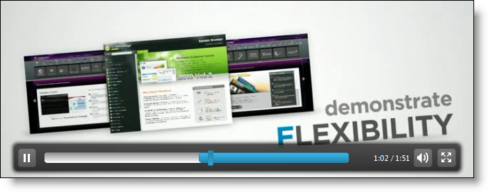

---
title: "igVideoPlayer の概要"
slug: igvideoplayer-overview
---

# igVideoPlayer の概要

## ビデオ プレーヤーの概要
&#123;environment:ProductName&#125;™ ビデオ プレーヤー、つまり `igVideoPlayer` は HTML 5 ビデオ プレーヤーで、堅牢なクロスブラウザー ユーザー インターフェイスにより Web ページ上のビデオを描画します。ビデオ プレーヤーは HTML 5 ビデオ タグと jQuery UI フレームワークを使用してビルドされており、ブラウザーのプラグインをインストールして使用しなくても、高速ロードが可能な豊富なマルチメディア エクスペリエンスを実現します。

ビデオ プレーヤーを使用する場合、さまざまな実装オプションから選択できます。このビデオ プレーヤーは、特定のサーバー バックエンドを使用せずに構成できる豊富な jQuery API を公開しています。また、Microsoft® ASP.NET MVC フレームワークを使用する開発者は、ビデオ プレーヤーのサーバー側ヘルパーを利用して、好みの .NET 言語を使ってコントロールを構成できます。

`igVideoPlayer` をスタイル設定することによって、すべての対応ブラウザーに一貫性のある外観を提供できます。ビデオ プレーヤーは、既存のスタイル シートを活用でき、さらに jQuery UI の ThemeRoller を使用してスタイル設定することもできます。

**図 1: igVideoPlayer とプレーヤー コントロール**

[](&#123;environment:SamplesUrl&#125;/video-player/basic-usage)

## 機能
-   HTML 5 ビデオ タグを使用して、ブラウザーのプラグインを使用せずにビデオを描画します。
-   カスタマイズ可能な未対応メッセージなど HTML 5 以外のブラウザー向け内蔵フォールバック
-   対応ブラウザー間で一貫性ある表示を実現するスタイル設定可能な再生コントロール
-   オプションおよびアニメーションを備えた全画面サポート
-   ビデオ広告およびバナー広告などの広告をサポート
-   目次などのブックマーク サポート
-   JavaScript Playback API
-   キーボード ショートカット
-   関連ビデオの表示

## igVideoPlayer の Web ページへの追加
次のステップは、jQuery クライアント コードまたは ASP.NET MVC サーバー コードのいずれかを使用して、Web ページにビデオ プレーヤーの基本的な実装を作成する方法を示します。

>**注:** どの実装を選択するかについて詳細は、[「&#123;environment:ProductName&#125; の概要」](/igniteui-for-jquery-overview)を参照してください。

**図 2: ビデオ プレーヤーの初回ビューを示す igVideoPlayer**

[](&#123;environment:SamplesUrl&#125;/video-player/basic-usage)

1.  最初に、アプリケーションに必要なローカライズ済みのリソースを含めます。組み込むリソースの詳細は、「[&#123;environment:ProductName&#125; で JavaScript リソースを使用](/deployment-guide-javascript-resources)」ヘルプ トピックをご覧ください。
2.  ご自分の HTML ページまたは ASP.NET MVC View で、必要な JavaScript ファイル、CSS ファイル、および ASP.NET MVC アセンブリを参照してください。

	**リスト 1: igVideoPlayer の CSS および JavaScript 参照**
	
	**HTML の場合:**

```html
	<link type="text/css" href="/css/themes/infragistics/infragistics.theme.css" rel="stylesheet" />    
	<link type="text/css" href="/css/structure/infragistics.css" rel="stylesheet" />
	<script src="scripts/jquery-1.4.4.js" type="text/javascript"></script>    
	<script src="scripts/jquery-ui.js" type="text/javascript"></script>
    <script type="text/javascript" src="/Scripts/Samples/infragistics.core.js"></script>    
	<script type="text/javascript" src="/Scripts/Samples/infragistics.lob.js"></script>
```
	 
	**リスト 2: ASPX ASP.NET MVC View における igVideoPlayer の CSS および JavaScript 参照**
	
	**ASPX の場合:**

```csharp
    <%@ Import Namespace="Infragistics.Web.Mvc" %>

    <!DOCTYPE html>
    <html>
    <head runat="server">
        <link href="<%= Url.Content("~/css/themes/infragistics/infragistics.theme.css") %>" rel="stylesheet" type="text/css" />
		<link href="<%= Url.Content("~/css/structure/infragistics.css") %>" rel="stylesheet" type="text/css" />

        <script src="<%= Url.Content("~/scripts/jquery-1.4.4.js") %>" type="text/javascript"></script>
		<script src="<%= Url.Content("~/scripts/jquery-ui.js") %>" type="text/javascript"></script>
        <script src="<%= Url.Content("~/scripts/infragistics.core.js") %>" type="text/javascript"></script>
		<script src="<%= Url.Content("~/scripts/infragistics.lob.js") %>" type="text/javascript"></script>
```

	**リスト 3: Razor ASP.NET MVC View における igVideoPlayer の CSS および JavaScript 参照**
	
	**Razor の場合:**
	
```csharp
	@using Infragistics.Web.Mvc;
	
	<!DOCTYPE html>
	<html>
	<head>
	    <link href="@Url.Content("~/css/themes/infragistics/infragistics.theme.css")" rel="stylesheet" type="text/css" />
	    <link href="@Url.Content("~/css/structure/infragistics.css")" rel="stylesheet" type="text/css" />
	    <script src="@Url.Content("~/scripts/jquery-1.4.4.js")" type="text/javascript"></script>
		<script src="@Url.Content("~/scripts/jquery-ui.js")" type="text/javascript"></script>
	    <script src="@Url.Content("~/scripts/infragistics.core.js")" type="text/javascript"></script>
		<script src="@Url.Content("~/scripts/infragistics.lob.js")" type="text/javascript"></script>
```

3.  jQuery の実装では、HTML 内のターゲット要素として div または video を定義します。ASP.NET MVC の実装の場合、含める要素を &#123;environment:ProductNameMVC&#125; が作成してくれるので、この手順はオプションです。

	**リスト 4: igVideoPlayer で使用するために定義されたベース DIV 要素**

    **HTML の場合:**

```html
    <div id=”videoPlayer” ></div>
```

4.  上記のセットアップが完了したら、ID、Height、Width、Title などのオプションを設定します。Height および Width オプションは、整数、ピクセル、またはパーセント幅として設定できる文字列です。 
	>**注:** ASP.NET MVC View では、その他のオプションをすべて設定した後で Render メソッドを呼び出す必要があります。
	
	**リスト 5: igVideoPlayer の jQuery でのインスタンス化**

    **JavaScript の場合:**

```js
    <script type="text/javascript">

        $(window).load(function () {
            $('#videoPlayer').igVideoPlayer({
                height: '300px',
                width: '400px',
                title: 'Video Sample'
            });
        });

    </script>
```

    **リスト 6: igVideoPlayer の ASPX ASP.NET MVC View でのインスタンス化**

    **ASPX の場合:**

```csharp
    <%= Html.Infragistics().VideoPlayer()
        .ID("videoPlayer")
        .Height("300px")
        .Width("400px")
        .Title("Video Sample")
        .Render() %>
```

    **リスト 7: igVideoPlayer の Razor ASP.NET MVC View でのインスタンス化**

    **Razor の場合:**

```csharp
	@(
	  Html.Infragistics().VideoPlayer()
	  .ID("videoPlayer")
	  .Height("300px")
	  .Width("400px")
	  .Title("Video Sample")
	  .Render()
	)
```

5.  ブラウザー間の互換性については、多くのサイトでビデオごとに異なるフォーマットをホストする必要があります。HTML 5 ビデオおよびブラウザー サポートの詳細は、「[igVideoPlayer による HTML5 ビデオの処理](/igvideoplayer-working-with-html5-video)」ヘルプ トピックをご覧ください。ソース オプションをビデオ ソースのリストに設定します。

    1.  ASP.NET MVC では、View の関連付けられた Controller および Action Method を使用してビデオ URL を View に提供します。
    2.  ASP.NET MVC では、Render を最後に呼び出す前に Source を設定する必要があります。

    **
     リスト 8: ビデオ ソースの jQuery への設定**

    **JavaScript の場合:**

```js
    $('#videoPlayer').igVideoPlayer({
        height: '300px',
        width: '400px',
        title: 'Sample',
        sources: ['http://www.yourdomainhere.com/videos/sample.mp4',
            'http://www.yourdomainhere.com/videos/sample.webm',
            'http://www.yourdomainhere.com/videos/sample.ogv']
    });
```

    **リスト 9: ビデオ ソースの ASPX ASP.NET MVC View への設定**

    **HTML の場合:**

```html
    <%= Html.Infragistics().VideoPlayer()
        .ID("videoPlayer")
        .Height("300px")
        .Width("400px")
        .Sources(ViewData["videoSources"] as List<String>)
        .Render() %>
```

    **リスト 10: ビデオ ソースの Razor ASP.NET MVC View への設定**

    **Razor の場合:**

```csharp
	@(
	  Html.Infragistics().VideoPlayer()
	  .ID("videoPlayer")
	  .Height("300px")
	  .Width("400px")
	  .Title("Video Sample")     
	  .Sources(ViewData["videoSources"] as List<String)
	  .Render()
	)
```

    **リスト 11: ビデオ ソースを ASP.NET MVC の Controller に設定して View で使用する**

    **C# の場合:**

```csharp
    public class HomeController : Controller
    {
        public ActionResult Index()
        {
            ViewData["videoSources"] = new List<String> {
                    "http://yourdomainhere.com/videos/sample.mp4",
                    "http://yourdomainhere.com/videos/sample.webm",
                    "http://yourdomainhere.com/videos/sample.ogv" };

            return View();
        }

    }
```

    **Visual Basic の場合:**

```vb
    Public Class HomeController
        Inherits Controller

        Public Function Index() As ActionResult
            ViewData("videoSources") = New List(Of [String])() From { _
                "http:// yourdomainhere.com/videos/sample.mp4", _
                "http:// yourdomainhere.com/videos/sample.webm ", _
                "http:// yourdomainhere.com/videos/sample.ogv" _
            }

            Return View()
        End Function

    End Class
```

6.  最後に、HTML 5 に準拠したブラウザーで Web ページを実行すると､ビデオ プレーヤーは選択したビデオをロードします。

## 関連リンク
-   [igVideoPlayer 基本的な使用方法サンプル](&#123;environment:SamplesUrl&#125;/video-player/basic-usage)
-   [&#123;environment:ProductName&#125; の概要](/igniteui-for-jquery-overview)
-   [&#123;environment:ProductName&#125; で JavaScript リソースを使用](/deployment-guide-javascript-resources)
-   [&#123;environment:ProductName&#125; での JavaScript ファイル](/deployment-guide-javascript-files)
-   [igVideoPlayer の HTML5 ビデオとの連携](/igvideoplayer-working-with-html5-video)

 

 


