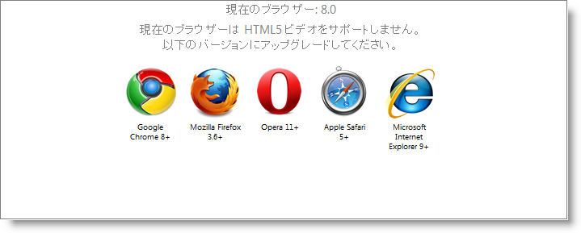

# HTML5 ビデオとの連携 (igVideoPlayer)

import ApiLink from 'docs-template/components/mdx/ApiLink.astro';

# HTML5 ビデオとの連携 (igVideoPlayer)

## 概要
`igVideoPlayer` コントロールは、HTML5 固有の `<video>` タグを使用してビデオを再生します。これは、最も人気のあるブラウザーの以下のバージョンでサポートされています。

Internet Explorer|Firefox|Safari|Chrome|Opera
---|---|---|---|---
9+ | 3.6+ | 5+ (QuickTime が必要) | 8+ | 11.+

これらのブラウザーの古いバージョンは、HTML5 ビデオと互換性がありません。以前のバージョンのブラウザーでコントロールを初期化すると、<ApiLink type="igVideoPlayer" label="BrowserNotSupported" /> イベントが発生することになります。処理されない場合は、それぞれサポートされたブラウザーのダウンロード ページへのリンクと共に、ユーザー フレンドリなメッセージが表示されます。



HTML5 ビデオをサポートしないブラウザーを使用している場合に希望する操作が異なる場合には、<ApiLink type="igVideoPlayer" label="browserNotSupported" /> イベントを処理して、Microsoft® Silverlight または Adobe® Flash を使用して代わりのビデオ プレーヤーを表示するなどカスタム ロジックを実行できます。以下のコードはこれを示しています。

**JavaScript の場合:**

```js
$("#player1").bind({
   igvideoplayerbrowsernotsupported: function (sender, eventArgs) {
       $("#flashContainer").css("display", "block");
       $("#player1").css("display", "none");
       eventArgs.cancel = true;
   }
});
```

## ビデオ コーデック
それぞれのブラウザーには、ビデオ タグを処理する独自の方法があり、1 つ以上のビデオ コーデックをサポートしています。今のところ、すべてをサポートしているコーデックは存在しません。そのため、ビデオを人気のあるブラウザーすべてで表示可能にするには、ビデオを複数回エンコードする必要があります。

現在のブラウザーでサポートされているコーデックの完全なリストを以下に示します。

コーデック/コンテナー|IE|Firefox|Safari|Chrome|Opera
---|---|---|---|---|---
Theora+Vorbis/Ogg|-|3.5+|**|3.0+|11+
H264+AAC/MP4|9.0+|-|5+|-|-
WebM|9.0+* |4.0+|**|6.0+|11+

エンドユーザーが VP8 コーデックをインストールしている場合、Internet Explorer 9 は WebM のみをサポートします。

Safari は、Apple® QuickTime で再生できるものはなんでも再生できますが、QuickTime では H.264/AAC/MP4 サポートのみがあらかじめインストールされています。

>**注:** ブラウザーのサポートに関する最新データについては、[http://en.wikipedia.org/wiki/HTML5_video](http://en.wikipedia.org/wiki/HTML5_video) をご覧ください。

多くの場合、上に挙げたコーデック/コンテナーの組み合わせをそれぞれ使用して、ビデオをエンコードする必要があります。3 つのファイルへのパスをコントロールに渡す必要があります。ブラウザーが複数の種類をサポートしている場合、コントロールはブラウザーに最適なものを選択します。優先順位は以下のようになります。

1.  MP4 コンテナーの H264/AAC
2.  Ogg コンテナーの Theora/Vorbis
3.  WebM

選択したソースはビデオ タグの src 属性に追加されます。

組み込み関数を使用して、独立した 3 つのコーデック/コンテナーの組み合わせの互換性を特定のブラウザーでテストすることも可能です。

**JavaScript の場合:**

```js
var supportsHTML5 = $("#player1").igVideoPlayer("supports_video");
var supportsH264 = $("#player1").igVideoPlayer("supports_h264_baseline_video");
var supportsOgv = $("#player1").igVideoPlayer("supports_ogg_theora_video");
var supportsWebM = $("#player1").igVideoPlayer("supports_webm_video");
```

**関連トピック**

-   [igVideoPlayer の概要](/igvideoplayer-overview)

 

 


