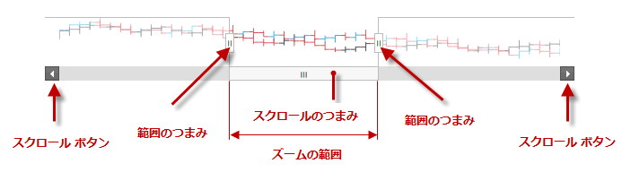

---
title: "igZoombar"
slug: igzoombar-landingpage
---

# igZoombar

## このグループのトピックについて
### 概要

このグループのトピックでは、`igZoombar`™ コントロールとその使用方法を説明します。

`igZoombar` コントロールは、範囲ベースのコントロールにズーム機能を提供します。`igZoombar` には、水平スクロールバー、全範囲の縮小表示、サイズ変更可能なズーム範囲ウィンドウの機能があります。

`igZoombar` コントロールは、`igDataChart`™ のような範囲対応コントロールに対する機能拡張として使用するように設計されています。`igZoombar` は、スタンドアロン コントロールとしては機能しません。

### トピック

- [igZoombar の概要](/controls/igzoombar/overview): このトピックでは、`igZoombar` コントロールの概念的な情報を説明し、このコントロールがサポートするユーザー インタラクションや基本構成などを含む機能を紹介します。

- [igZoombar の追加](/controls/igzoombar/adding-igzoombar): このトピックではコード例を使用して、`igZoombar` コントロールを HTML ページおよび ASP.NET MVC アプリケーションに追加する方法を説明します。

- [igZoombar の構成](/controls/igzoombar/configuring-igzoombar): このトピックではコード例を使用して、ズーム動作と `igZoombar` コントロールのズーム ウィンドウを構成する方法を説明します。

- [アクセシビリティの遵守 (igZoombar)](/controls/igzoombar/accessibility-compliance): このトピックは、`igZoombar` コントロールのアクセシビリティ機能を説明し、このコントロールを含むページのアクセシビリティ遵守を実現する方法に関する情報を提供します。

- [既知の問題と制限 (igZoombar)](/controls/igzoombar/known-issues-and-limitations): このトピックでは、`igZoombar` コントロールの既知の問題と制限、その回避策について説明します。

- [jQuery および MVC API リファレンス リンク (igZoombar)](/controls/igzoombar/asp-net-mvc-helper-api): このトピックでは、`igZoombar` コントロールと ASP.NET MVC ヘルパーに関する API 参照ドキュメントへのリンクを提供します。

 

 

