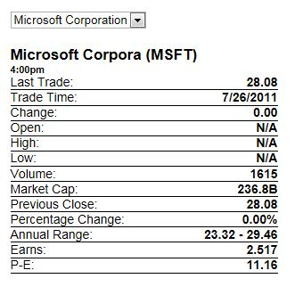
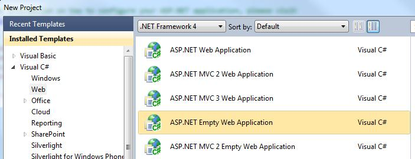
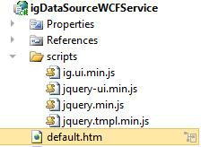

---
title: "igDataSource を WCF データ サービスへバインド"
slug: igdatasource-binding-to-wcf-data-services
---

# igDataSource を WCF データ サービスへバインド

`igDataSource` は、XML、JSON、Atom、JavaScript 配列、さらには HTML テーブルなどをも含むさまざまなフォーマットのデータとバインドできるクライアント側の JavaScript データ ソース コンポーネントです。&#123;environment:ProductName&#125; で使用されているいろいろなフォーマットは[サンプル ブラウザー](&#123;environment:SamplesUrl&#125;/data-source/mashup)で見ることができます。

`igDataSource` はサーバーに依存性がなく、特定のサーバー側ソフトウェア アーキテクチャに依存しません。そのため、.NET フレームワークを利用する開発者はしばしば、自分の RIA アプリケーション内のデータを提供するのに WCF を利用しようとします。このトピックでは、サンプル ブラウザーから WCF サンプルのひとつを分析して独自の WCF サービスを設定するプロセスを解説し、XML データを ASP.NET アプリケーションの `igDataSource` に提供します。

以下はサンプル アプリケーションの画像です。



このサンプルでは、ユーザーがドロップダウンから会社名を選択し、その会社の株価実績についての詳細をアプリケーションで表示します。シーンの背後で、ドロップダウン中の選択が Web サーバー上の WCF エンドポイントへの AJAX コールをトリガーします。プロダクション サンプル内で、株式についての最新情報を得るために Web サーバーが実際の株価サービスを呼び出し、クライアントに返します。動作およびデータの提供方法を確認するために、このトピックの例では Web サーバーから XML 文字列を返します。

以下は Microsoft Visual Studio® 2010 でサンプルを構築する方法です。


 >**注:** [こちらからサンプルをダウンロードできます](http://dl.infragistics.com/community/jquery/codesamples/aaronm/2011-07-28/igDataSourceWCFService.zip)。

1.  Visual Studio を開き、新しい ASP.NET 空の Web アプリケーション 'igDataSourceWCFService' を作成します。**注**: `igDataSource` はサーバー依存がありません。従って、この演習では、&#123;environment:ProductName&#125; がアウト オブ ボックスで ASP.NET WCF をサポートするのに対して、ASP.NET WebForms でサポートされる OData の実装方法について説明します。

    

2.  製品に付いている結合され縮小されたスクリプト ファイル infragistics.core.js である &#123;environment:ProductName&#125; への参照を追加します。加えて、サンプルを実行するには jQuery コア、jQuery UI、jQuery テンプレート スクリプトが必要です。この[ヘルプ トピック](/general-and-getting-started/deployment-guide-javascript-resources)では、必要なスクリプトへの参照やアプリケーションに追加する統合および縮小されたスクリプトがどこにあるかについて説明します。**注:** 製品版とトライアル版は[こちら](http://jp.infragistics.com/products/dotnet/igniteui/jquery-controls.aspx#Downloads)からダウンロードできます。jQuery テンプレート スクリプトは、[こちら](http://plugins.jquery.com/tag/templates/)から入手できます。

3.  プロジェクト内にスクリプト ディレクトリを作成し、そのフォルダーに JavaScript ファイルをコピーしてください。

4.  次に、サンプル ページを設定します。アプリケーションに対し新しい html ページを追加し、それを 'default.htm' と呼ぶことにします。それが終わると、プロジェクトは次のように表示されます。

    

5.  default.htm ファイルを開き、スクリプト ファイル用の スクリプト タグを含めます。

    **HTML の場合:**

```html
    <head>
        <title>igDataSource Bound to WCF Service</title>
        <script src="scripts/jquery.min.js" type="text/javascript"></script>
		<script src="scripts/jquery-ui.min.js" type="text/javascript"></script>
		<script src="scripts/infragistics.core.js" type="text/javascript"></script>
    </head>
```

6.  自分の default.htm ファイルの中心には、

    **HTML の場合:**

```html
    <style type="text/css">
     #quoteContainer
     {
         width: 300px; 
         margin:20px 0;
     }
        
    .quote
    {
        font-weight: bold;
        float: right;
    }
    .quoteTime
    {
        font-weight: bold;
        font-size: 11px;
    }
    .quoteName
    {
         font-weight: bold;
         font-size: 17px;
    }
    .quoteContainer
    {
        border-bottom: 1px solid black;
    }

    </style>
     <script id="quoteTemplate" type="text/x-jquery-tmpl">
        &lt;div class="quoteName"&gt; ${Name} (${Symbol}) </div>
        &lt;div class="quoteTime"&gt; ${Time} </div>
        <div class="quoteContainer">Last Trade: <span class="quote"> ${Last} </span> </div> 
        <div class="quoteContainer">Trade Time:  <span class="quote"> ${Date}</span>  </div> 
        <div class="quoteContainer">Change:  <span class="quote"> ${Change} </span> </div> 
        <div class="quoteContainer">Open:    <span class="quote">  ${Open}</span>  </div> 
        <div class="quoteContainer">High:    <span class="quote">  ${High}</span>  </div> 
        <div class="quoteContainer">Low:     <span class="quote"> ${Low}</span>  </div> 
        <div class="quoteContainer">Volume:  <span class="quote"> ${Volume}</span>  </div> 
        <div class="quoteContainer">Market Cap:  <span class="quote"> ${MktCap}</span>  </div> 
        <div class="quoteContainer">Previous Close: <span class="quote"> ${PreviousClose}</span>  </div> 
        <div class="quoteContainer">Percentage Change:  <span class="quote"> ${PercentageChange}</span>  </div> 
        <div class="quoteContainer">Annual Range:  <span class="quote"> ${AnnRange} </span> </div> 
        <div class="quoteContainer">Earns: <span class="quote">   ${Earns} </span> </div>
        <div class="quoteContainer">P-E: <span class="quote">  ${PE} </span>  </div> 
    </script>
    <script type="text/javascript">
        var ds,
            quoteSchema,
            render;
        $(function () {
            var url;
            render = function (success, error) {

                if (success) {
                    $("#quoteContainer").empty();
                    $("#quoteTemplate").tmpl(ds.dataView()).appendTo("#quoteContainer");
                } else {
                    alert(error);
                }
            };

            url= "StockQuoteService.svc/GetStockQuoteGET?symbol=MSFT";

            quoteSchema = new $.ig.DataSchema("xml", { fields: [
                  { name: "Name", xpath: "Name" },
                  { name: "Symbol", xpath: "Symbol" },
                  { name: "Last", xpath: "Last" },
                  { name: "Date", xpath: "Date" },
                  { name: "Time", xpath: "Time" },
                  { name: "Change", xpath: "Change" },
                  { name: "Open", xpath: "Open" },
                  { name: "High", xpath: "High" },
                  { name: "Low", xpath: "Low" },
                  { name: "Volume", xpath: "Volume" },
                  { name: "MktCap", xpath: "MktCap" },
                  { name: "PreviousClose", xpath: "PreviousClose" },
                  { name: "PercentageChange", xpath: "PercentageChange" },
                  { name: "AnnRange", xpath: "AnnRange" },
                  { name: "Earns", xpath: "Earns" },
                  { name: "PE", xpath: "P-E"}],
                searchField: "//StockQuotes/Stock"
            });
            ds = new $.ig.DataSource({ callback: render, dataSource: url, schema: quoteSchema }).dataBind();
        });

        function GetQuote(elem) {
            var url= "StockQuoteService.svc/GetStockQuoteGET?symbol=" + $(elem).val();
            ds = new $.ig.DataSource({ callback: render, dataSource: url, schema: quoteSchema }).dataBind();
        }

    </script>
    <div>
    <select id="quotes" onchange="GetQuote(this);">
        <option selected="selected" value="MSFT">Microsoft Corporation</option>
        <option value="AAPL">Apple Inc.</option>
        <option value="GOOG">Google Inc.</option>
        <option value="INTC">Intel Corporation</option>
        <option value="GE">General Electric Co.</option>
    </select>
    </div>

    <div id="quoteContainer">

    </div>
```

7.  次のステップは、ウェブ サービスの設定です。`System.ServiceModel.Web` アセンブリへアセンブリ参照を追加します。また、'StockQuoteService.svc' というプロジェクトに新しい WCF サービスを追加します。これはサービス コントラクト、`IStockQuoteService` を設定するためにインターフェイスに加えて `.svc` ファイルを提供します。

8.  `IStockQuoteService.cs` ファイルを開き、'GetStockQuoteGET' メソッドを定義します。次に `WebGet` 属性を使用して GET アクセスを許可します。

    **C# の場合:**

```csharp
    using System.ServiceModel;
    using System.ServiceModel.Web;
    using System.Xml;

    [OperationContract]
    [WebGet]
    XmlElement GetStockQuoteGET(string symbol);
```

9.  データを返すための `StockQuoteService` でメソッドを実装します。以下のコードは GetStockQuoteGET を実装します。 **注**: ここには一社のデータのみ表示されていますが、このトピック最後からダウンロードできるサンプルに全社のサンプルデータが含まれます。

    **C# の場合:**

```csharp
    using System.Xml;

    public XmlElement GetStockQuoteGET(string symbol)
    {
        XmlDocument stockQuoteXmlDoc = new XmlDocument();
        string stockXmlData = string.Empty;

        switch (symbol)
        {
            case "MSFT":
                stockXmlData =
                    "<StockQuotes>" +
                        "<Stock>" +
                            "<Symbol>MSFT</Symbol>" +
                            "<Last>28.08</Last>" +
                            "<Date>7/26/2011</Date>" +
                            "<Time>4:00pm</Time>" +
                            "<Change>0.00</Change>" +
                            "<Open>N/A</Open>" +
                            "<High>N/A</High>" +
                            "<Low>N/A</Low>" +
                            "<Volume>500</Volume>" +
                            "<MktCap>236.8B</MktCap>" +
                            "<PreviousClose>28.08</PreviousClose>" +
                            "<PercentageChange>0.00%</PercentageChange>" +
                            "<AnnRange>23.32 - 29.46</AnnRange>" +
                            "<Earns>2.517</Earns>" +
                            "<P-E>11.16</P-E>" +
                            "<Name>Microsoft Corporation</Name>" +
                        "</Stock>" +
                    "</StockQuotes>";
                break;
			default:
			    stockXmlData =
			        "<StockQuotes>" +
			            "<Stock>" +
			                "<Symbol>!!!</Symbol>" +
			                "<Name>No Information Found</Name>" +
			            "</Stock>" +
			        "</StockQuotes>";
			    break;
		}
		
		stockQuoteXmlDoc.LoadXml(stockXmlData);
		
		return stockQuoteXmlDoc.DocumentElement;
	}
```

10. 次に、ウェブ サービスが http でアクセスするために `web.config` を設定します。

    **HTML の場合:**

```html
    <system.serviceModel>
            <behaviors>
                <serviceBehaviors>
                    <behavior name="StockQuoteServiceBehavior">
                        <serviceMetadata httpGetEnabled="true"/>
                        <serviceDebug includeExceptionDetailInFaults="true"/>
                    </behavior>
                </serviceBehaviors>
                <endpointBehaviors>
                    <behavior name="StockQuoteServiceBehavior">
                        <webHttp/>
                    </behavior>
                </endpointBehaviors>
            </behaviors>
            <services >
                <service name="igDataSourceWCFService.StockQuoteService" behaviorConfiguration="StockQuoteServiceBehavior">
                    <endpoint address="" binding="webHttpBinding" contract="igDataSourceWCFService.IStockQuoteService" behaviorConfiguration="StockQuoteServiceBehavior"/>
                </service>
            </services>
        </system.serviceModel>
```

11. アプリケーションを実行すると、Microsoft の株式情報が表示されます。最初にデータが定義されているのは 1 社のみです。その完全なフォームでのサンプルと同時に全企業のデータを見るには、[すべてのサンプル](http://dl.infragistics.com/community/jquery/codesamples/aaronm/2011-07-28/igDataSourceWCFService.zip)をダウンロードしてください。

>**注:** &#123;environment:ProductName&#125; スクリプト ファイルはこのダウンロードには含まれていません。&#123;environment:ProductName&#125; のコピーと一緒にインストールされるファイルを利用するか、[こちら](http://jp.infragistics.com/dotnet/igniteui/jquery-controls.aspx#Downloads)からコピーをダウンロードしてください。

## 関連トピック
以下は、その他の役立つトピックです。

-   [igGrid/igDataSource アーキテクチャの概要](/controls/iggrid/igdatasource-architecture-overview)
-   [REST サービスへのバインド](/data-sources/igdatasource/binding-to-rest-services)

 

 


