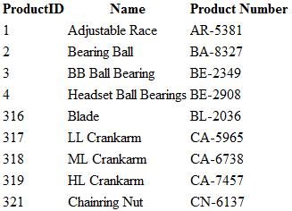

# igDataSource の概要

import ApiLink from 'docs-template/components/mdx/ApiLink.astro';

# igDataSource の概要

## igDataSource の概要
`igDataSource` は、`igGrid` コントロールなどのデータ バインドされたコントロールと実際のデータ ソース間の仲介レイヤーとしての役割を果たす jQuery に基づくコンポーネントです。コンポーネントのデータのソースには、次のものがあります。

-   Web サービス (REST GET、WCF などから接続)
-   ローカル データ - JSON、XML、HTML Table、JavaScript 配列 (JSON および XML の文字列を含む)
-   関数が戻すデータ

>**注:** `igGrid` コントロールと違い、`igDataSource` コンポーネントはプレーン JavaScript クラスとして実装され、基本 jQuery ウィジェットは拡張しません。

## 機能
`igDataSource` コンポーネントは、以下の機能をそのままサポートしています。

-   ローカル (データはクライアント側に定義されています) およびリモート (データはサーバーから送信されています) のデータ バインド
-   ページング
-   並べ替え
-   フィルタリング
-   データ スキーマ サポート。多くのソースから一貫したフォーマットにデータを変換します。
-	スキーマ フィールド マッパー 
	
###  スキーマ フィールド マッパー 

スキーマ フィールドの定義は、dataType "object" の列にマッパー機能の設定が可能で、データソース レベルですべてのデータ処理に使用されます。 
これは、複合オブジェクトの特定の値にデータ処理を適用する場合に便利です。以下のデータ ソース構造がある場合:

**JavaScript の場合:**
	
```js
var data = [
	{ "ID": 0, "Name": "Bread", "Description": "Whole grain bread", "Category":  { "ID": 0, "Name": "Food", , "Date": "\/Date(1159660800000)\/"  } }
...
];
```

既成のデータ ソースは、複合オブジェクト構造であるため Category フィールドにデータ処理を適用できません。 
<ApiLink pkg="ig" type="datasource" member="settings.fields" section="options" label="フィールド" />のマッパー オプションでデータ抽出関数を定義でき、フィールドに使用されるデータを指定できるようになります。サブフィールドまたは複合データ
たとえば、データ操作を ID サブフィールドに基づいて実行する場合、ID 値を返すマッパー関数を設定できます。コード例 1 を参照できます。 

コード例 1: igGrid の列にマッパー関数を定義します。

**JavaScript の場合:**
	
```js
var ds = new $.ig.DataSource({
	type: "json", 
	dataSource: data, 
	 schema: {
		fields: [{
			name: "ID", type:"number"
		}, {
			name: "Name", type:"string"
		}, {
			name: "Category" , type:"object", mapper: function(record){							
				return record.Category.ID;
			}
		}]         
	}
});
```

この関数は、データ レコードへの参照を保持する単一パラメーターを受け入れ、戻り値を返し、関連フィールドのすべてのデータ処理に使用されます。
フィールドの dataType が "object" であるため、その他のフィールドのデータ変換が適用されずに戻り値が使用されることに注意してください。そのため、追加データ タイプ変換は関数で処理する必要があります。
たとえば、クライアント データソースに文字列形式で保存されるデータ値は、マッパーに返される前に処理する必要があります。それ以外の場合、文字列値として見なされます。

マッパー関数で文字列を日付へ変換

**JavaScript の場合:**
	
```js
var ds = new $.ig.DataSource({
	type: "json", 
	dataSource: data, 
	 schema: {
		fields: [{
			name: "ID", type:"number"
		}, {
			name: "Name", type:"string"
		}, {
			name: "Category" , type:"object", mapper: function(record){							
					var ticks = record.Category.Date.replace("Date(", "").replace(")", "");
					return new Date( parseInt(ticks)) ;
			}
		}]         
	}
});
```

> **注:** この関数は、データ ソースが関連フィールドのデータを抽出する必要がある度に呼び出されます。これには、フィールドに関連するデータ操作処理が含まれます。
 そのため、複雑なデータの抽出および (または) 計算ロジックがパフォーマンスに影響する場合があることに注意してください。

## データ ソースの Web ページへの追加
1.  ご使用の HTML ページで、必要な JavaScript ライブラリを参照します。

	**HTML の場合:**
	
```html
	<script type="text/javascript" src="jquery-1.4.4.min.js"></script>
	<script type="text/javascript" src="jquery-ui.min.js"></script>
	<script type="text/javascript" src="infragistics.core.js"></script>
```

2.  次に、`igDataSource` のデータ ソースとしての役割を果たす JSON 配列を作成します。

	**JavaScript の場合:**
	
```js
	var products = [];
	products[0] = { "ProductID": 1, "Name": "Adjustable Race", "ProductNumber": "AR-5381" };
	products[1] = { "ProductID": 2, "Name": "Bearing Ball", "ProductNumber": "BA-8327" };
	products[2] = { "ProductID": 3, "Name": "BB Ball Bearing", "ProductNumber": "BE-2349" };
	products[3] = { "ProductID": 4, "Name": "Headset Ball Bearings", "ProductNumber": "BE-2908" };
	products[4] = { "ProductID": 316, "Name": "Blade", "ProductNumber": "BL-2036" };
	products[5] = { "ProductID": 317, "Name": "LL Crankarm", "ProductNumber": "CA-5965" };
	products[6] = { "ProductID": 318, "Name": "ML Crankarm", "ProductNumber": "CA-6738" };
	products[7] = { "ProductID": 319, "Name": "HL Crankarm", "ProductNumber": "CA-7457" };
	products[8] = { "ProductID": 320, "Name": "Chainring Bolts", "ProductNumber": "CB-2903" };
	products[8] = { "ProductID": 321, "Name": "Chainring Nut", "ProductNumber": "CN-6137" };
```

3.  ご使用の HTML ドキュメントの body タグで、HTML テーブルを追加します。
    
	**HTML の場合:**
	
```html
	<table id="table1">
	</table>
```

4.  次の jQuery テンプレートを作成します。

	**JavaScript の場合:**

```js
	var rowTemplate = "<tr> <td>${ProductID}</td> <td>${Name}</td> <td>${ProductNumber}</td>
</tr>"
```

5.  `$(document).ready()` イベント ハンドラーの中で、新しい `igDataSource` インスタンスを作成し、それをローカル JSON 文字列にバインドし、そのデータを jQuery テンプレートを使用してテーブル要素に適用します。

	**JavaScript の場合:**
	
```js
	<script type="text/javascript">
	    $(document).ready(function () {
	        var ds = new $.ig.DataSource({ type: "json", dataSource: products });
	        ds.dataBind();
	        $($.ig.tmpl(rowTemplate, ds.dataView())).appendTo("#table1 tbody");
	    });
	</script>
```

	>**注:** datasource プロパティは JSON データを保持する products 変数に設定されています。 

6.  HTML ドキュメントを保存して実行します。
	
	

###  <a id="filter-by-text"></a>テキストでフィルターする
`igDataSource` コンポーネントは、すべてのフィールドで特定の単語または句を検索する方法を提供します。検索には <ApiLink pkg="ig" type="datasource" member="methods.filterByText" section="options" label="filterByText" /> メソッドを使用します。

**Javascript の場合:**
	
```js
var ds = new $.ig.DataSource({
	type: "json", 
	dataSource: data, 
	schema: {
		fields: [{
			name: "ID", type:"number"
		}, {
			name: "Name", type:"string"
		}]         
	}
}), fd;
ds.filterByText("bread");
fd = ds.dataView();
// Result:
// fd = [{
//	 ID: 0,
// 	 Name: "Bread"
// }]
```   
 
フィールドに formatter 関数がある場合、メソッドはそれを使用し、対応する値を持つレコードを検索します。

**Javascript の場合:**

```js
var ds = new $.ig.DataSource({
	type: "json", 
	dataSource: data, 
	schema: {
		fields: [{
			name: "ID", type:"number"
		}, {
			name: "Name", type:"string", formatter: function(val, record) {
				return val == "Bread" ? "Tasty Bread" : val;
			}
		}]         
	}
}), fd;
fd = ds.filterByText("tasty");
fd = ds.dataView();
// Result:
// fd = [{
//	 ID: 0,
// 	 Name: "Bread"
// }]
```

いくつかのケースを以下に説明します。

1.  複数の単語を一度に検索 - 式にスペースによって分割される 2 つ以上の単語がある場合、メソッドはすべての単語 (順序を無視) を含む値を検索します。

 **Javascript の場合:**

```js
 ds.filterByText("bread tasty");
```

2.  フレーズを検索 - テキストを二重引用符で囲むと、メソッドは渡される順序で単語を検索します。書式付きの値も含みます。

 **Javascript の場合:**

```js
 ds.filterByText('"tasty bread"');
```

3.  フィールドのセットをフィルター - メソッドは特定のフィールドのみでテキストを検索する方法を提供します。配列としてパラメーターによって渡されます。

 **Javascript の場合:**

```js
 ds.filterByText("bread", [{name: "Name", type: "string"}]);
```

4. 式の単語がその他の単語の部分文字列である場合は、無視されます。たとえば、式が "1 2 12" の場合、メソッドは "12" のみでフィルターします。

 以下は本機能の例です。

 **Javascript の場合:**

```js
<!DOCTYPE html>
<html>
	<head>
		<title> Filter By Text </title>
		<script type="text/javascript" src="jquery-1.4.4.min.js"></script>
		<script type="text/javascript" src="jquery-ui.min.js"></script>
		<script type="text/javascript" src="infragistics.core.js"></script>
		
		<script type="text/javascript">
			$(function () {
				var products = [], ds, table,
					rowTemplate = "<tr> <td>${ProductID}</td> <td>${Name}</td> <td>${ProductNumber}</td>
</tr>";
				
				products[0] = { "ProductID": 1, "Name": "Adjustable Race", "ProductNumber": "AR-5381" };
				products[1] = { "ProductID": 2, "Name": "Bearing Ball", "ProductNumber": "BA-8327" };
				products[2] = { "ProductID": 3, "Name": "BB Ball Bearing", "ProductNumber": "BE-2349" };
				products[3] = { "ProductID": 4, "Name": "Headset Ball Bearings", "ProductNumber": "BE-2908" };
				products[4] = { "ProductID": 316, "Name": "Blade", "ProductNumber": "BL-2036" };
				products[5] = { "ProductID": 317, "Name": "LL Crankarm", "ProductNumber": "CA-5965" };
				products[6] = { "ProductID": 318, "Name": "ML Crankarm", "ProductNumber": "CA-6738" };
				products[7] = { "ProductID": 319, "Name": "HL Crankarm", "ProductNumber": "CA-7457" };
				products[8] = { "ProductID": 320, "Name": "Chainring Bolts", "ProductNumber": "CB-2903" };
				products[9] = { "ProductID": 321, "Name": "Chainring Nut", "ProductNumber": "CN-6137" };
				
				ds = new $.ig.DataSource({ 
					type: "json", 
					dataSource: products,
					schema: {
						fields: [{
							name: "ProductID", type:"number"
						}, {
							name: "Name", type:"string"
						}, {
							name: "ProductNumber", type:"string"
						}]         
					}
				});
				ds.dataBind();
				table = $("#table1 tbody")
				$($.ig.tmpl(rowTemplate, ds.dataView())).appendTo(table);
				$("#btn").on("click", function(e) {
					var val = $('#searchBox').val();
					ds.filterByText(val);
					table.empty();
					$($.ig.tmpl(rowTemplate, ds.dataView())).appendTo(table);
				});
			});
		</script>
		<style>
			#table1 {
				border:1px solid #000000; 
				border-spacing: 0;
			}
			#table1 th {
				background-color: #b1b1b1;			
			}
			#table1 th, #table1 td {
				text-align:left; 
				border:1px solid #000000; 
				padding:4px;
			}
		</style>
	</head>
	<body>
		<input type="text" id="searchBox" />
		<input id="btn" type="button" value="Filter" />
		<div style="width: 10px; height: 10px;"></div>
		
| Product ID | Name | Product Number |
| --- | --- | --- |

	</body>
</html>
```

## 関連トピック

-   [igGrid/igDataSource アーキテクチャの概要](/iggrid-igdatasource-architecture-overview)
-   [DataSchema を使用したデータ変換の実行 (igDataSource)](/igdatasource-using-dataschema)