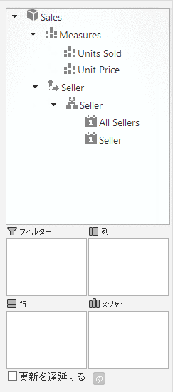
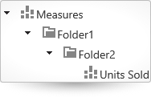
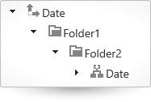
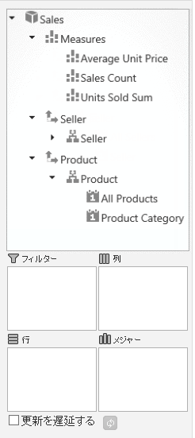

# メタデータの定義 (igOlapFlatDataSource)

import ApiLink from 'docs-template/components/mdx/ApiLink.astro';

# メタデータの定義 (igOlapFlatDataSource)

## トピックの概要
### 目的

このトピックでは、フラット データを多次元に表示するために `igOlapFlatDataSource`™ と使用するデータのメタデータを定義する方法を紹介します。

### 前提条件

このトピックを理解するために、以下のトピックを参照することをお勧めします。

- [igOlapFlatDataSource の概要](/igolapflatdatasource-overview): このトピックは、`igOlapFlatDataSource` コンポーネントおよびその機能の概要を説明します。

- [igOlapFlatDataSource の追加](/igolapflatdatasource-adding): このトピックのグループは、`igOlapFlatDataSource` コンポーネントを HTML ページおよび ASP.NET MVC ビュー の追加する方法について説明します。


### このトピックの内容

このトピックは、以下のセクションで構成されます。

-   [**概要**](#introduction)
    -   [メタデータの定義の概要](#defining-metadata)
    -   [メタデータの定義の最小要件](#min-metadata)
    -   [手順](#steps)
-   [**メタデータの構成の概要**](#metadata-config-summary)
-   [**メタデータ キューブの構成**](#config-metadata-cube)
    -   [概要](#metadata-cube-overview)
    -   [プロパティ設定](#metadata-cube-settings)
    -   [例](#metadata-cube-example)
-   [**メジャーのディメンションの構成**](#config-measures-dimension)
    -   [概要](#measures-dimension-overview)
    -   [プロパティ設定](#measures-dimension-settings)
-   [**メジャーの構成**](#config-measures)
    -   [概要](#config-measures-overview)
    -   [プロパティ設定](#config-measures-settings)
-   [**ディメンションの構成**](#config-dimentions)
    -   [概要](#config-dimentions-overview)
    -   [プロパティ設定](#config-dimentions-settings)
-   [**階層の構成**](#config-hierarchies)
    -   [概要](#hierarchies-overview)
    -   [プロパティ設定](#hierarchies-settings)
-   [**レベルの構成**](#config-levels)
    -   [概要](#levels-overview)
    -   [プロパティ設定](#levels-settings)
-   [**コード例: igOlapFlatDataSource のメタデータの定義**](#code-example)
    -   [説明](#description)
    -   [コード](#code)
-   [**関連コンテンツ**](#related-content)
    -   [トピック](#topics)
    -   [サンプル](#samples)


## <a id="introduction"></a>概要
### <a id="defining-metadata"></a>メタデータの定義の概要

`igOlapFlatDataSource` コンポーネントは、データ ソース コンポーネント ([igDataSource](/igdatasource-igdatasource)™) から提供されるフラットまたは階層データから多次元 (OLAP) データ キューブを作成します。キューブを作成するために、1 つ以上のディメンションのメタデータを定義する必要があります。各ディメンションの識別子 (名前) および階層を 1 つ以上定義する必要があります。各階層は、名前およびレベルを 1 つ以上設定する必要があります。また、メジャーのメタデータも定義する必要があります。各メジャーは、名前およびセル値を計算するために使用されるアグリゲーターを設定する必要があります。このメタデータ プロパティに追加のオプションなプロパティがあります。`igOlapFlatDataSource` が初期化した場合およびランタイムの場合に、このメタデータ定義を使用してキューブおよびすべての子項目 (ディメンション、階層、メジャーなど) を作成します。

`igOlapFlatDataSource` のコンテキストで、メタデータは、入力のフラット データが多次元 (OLAP) 形式に表示する方法を決定するユーザー定義のルールのセットです。このルールは、メタデータ項目 (キューブ、ディメンション、階層、レベル、メンバー、およびメジャー) が生成される方法を指定し、入力データ オブジェクトの使用するプロパティを指定するメタデータ定義によって実装されます。メタデータ定義は、<ApiLink pkg="ig" type="OlapMetadataTreeItem" label="$.ig.MetadataTreeItem" /> オブジェクトが生成されたときに使用されるメタデータ項目オブジェクトを指定すると設定されています。<ApiLink pkg="ig" type="OlapMetadataTreeItem" label="$.ig.MetadataTreeItem" /> オブジェクトは、ツリー構造に配置され、`igPivotDataSelector`™ コンポーネントにメタデータ ツリーを表示するために必要です。メタデータの構造は、多次元 (OLAP) データ ソースの <ApiLink pkg="ig" type="OlapFlatDataSource" label="metadataTree()" /> プロパティによって取得できます。

### <a id="min-metadata"></a>メタデータの定義の最小要件

すべてのメタデータ項目のために、名前 (コードで識別子として使用されること) およびキャプション (オプションで、データ ソースにアタッチされる場合に `igPivotDataSelector` のメタデータ ツリーに表示されること) を指定します。名前およびキャプションに追加して、以下のように定義する必要がある指定の構成項目があります。

-   **dimensions**: 階層を 1 つ以上を指定する必要があります。
-   **hierarchies**: レベルを 1 つ以上を指定する必要があります。
-   **levels**: メンバー プロバイダー関数を設定する必要があります。

(この関数は、特定のレベルのメンバーが生成されるときに、入力データの各データ項目に呼び出されます。データ項目である 1 つのパラメーターと呼び出されます。データ項目に基づいて、データ項目に対応するメンバーのキャプションとして使用する文字列を返す必要があります。)

-   **measures**: アグリゲーターを指定する必要があります。

(アグリゲーターは結果セルの値を計算するときに呼び出された関数です。定義する関数は 2 つのパラメーターを受けます: (1) セルの値の評価のために使用される項目の配列、および (2) 列および行インデックスなどのセルについての情報を含む `CellMetadata` オブジェクト。この関数では、提供された項目に必要な計算を実行し、使用される値を返します。たとえば、データ オブジェクトの数値プロパティに合計アグリゲーター関数を定義するには、提供されたオブジェクトのプロパティの値の合計を返します。

階層およびメジャーの場合、オプションに表示フォルダー設定を構成できます。表示フォルダー設定は、階層またはメジャーがメタデータ ツリーに配置される位置を指定します。

### <a id="steps"></a>手順

以下はメタデータを指定して構成する一般的な手順です。

1. メタデータ キューブの構成

2. ディメンションの構成

3. メジャーの構成

4. 階層の構成

5. レベルの構成 


## <a id="metadata-config-summary"></a>メタデータの構成の概要

以下の表は、`igOlapFlatDataSource` コンポーネントのメタデータの構成可能な要素を説明し、構成するプロパティにマップします。


| 構成可能な項目 | 詳細 | プロパティ |
| --- | --- | --- |
| [メタデータ キューブ](#config-metadata-cube) | キューブの名前とキャプションを定義します。メジャーのディメンションおよびすべての他のディメンションの定義で使用されます。 | `cube` `name` `caption` `measuresDimension` `measures` |
| [メジャーのディメンション](#config-measures-dimension) | メジャーのディメンションの名前とキャプションを定義します。メジャーの指定に使用されます。 | `measuresDimension` `name` `caption` `measures` |
| [メジャー](#config-measures) | メジャーの名前、キャプション、および集計関数を定義します。 | `measures` `name` `caption` `displayFolder` `aggregator` |
| [ディメンション](#config-dimentions) | ディメンションの名前、キャプション、および階層を定義します。 | `dimensions` `name` `caption` `hierarchies` |
| [階層](#config-hierarchies) | メジャーの階層の名前、キャプション、およびレベルを定義します。 | `hierarchies` `name` `caption` `displayFolder` `levels` |
| [レベル](#config-levels) | 階層のレベルの名前、キャプション、およびメンバー プロバイダー関数を定義します。 | `levels` `name` `caption` `memberProvider` |


## <a id="config-metadata-cube"></a>メタデータ キューブの構成
### <a id="metadata-cube-overview"></a>概要

メタデータ キューブは、メジャー ディメンションおよびすべての残りのディメンションを含むメタデータ ツリーのルートです。メタデータ キューブは、各キューブの名前とキャプションを指定します。メジャーのディメンションおよびすべてのメジャーの定義で使用されます。

### <a id="metadata-cube-settings"></a>プロパティ設定

以下の表では、構成をプロパティ設定にマップします。

目的:|使用するプロパティ:|型:|設定の選択肢:|必須ですか？
---|---|---|---|---
キューブの名前を設定する|name|string|名前を含む文字列。|はい
(ピボット データ セレクターに表示される) キューブのキャプションを設定する|caption|string|キャプションを含む文字列。|いいえ
メジャー ディメンションのメタデータを構成する|measuresDimension|object|メジャー ディメンションのメタデータを含む `measuresDimensionMetadata` オブジェクト。|はい
ディメンションのメタデータを構成する|dimensions|array|各ディメンションのメタデータを含む `dimensionsMetadata` オブジェクトの配列。|はい


### <a id="metadata-cube-example"></a>例

以下の画像は、以下のキューブ設定の結果として、1 つのメジャーのメタデータを含む `MeasuresDimensionMetadata` オブジェクトおよび 2 つのレベルを持つ階層のメタデータを含む `DimensionsMetadata` オブジェクトを表示します。


- `name` : セールス
- `measuresDimension` : 

**JavaScript の場合:** 
```jsmeasuresDimension 
   measuresDimension:{
  		measures [ { 
			name: "Units Sold", 
			aggregator: function (items, cellMetadata) { 
				var sum = 0; 
				$.each(items, function (index, item) { 
					sum += item.UnitsSold; 
				}); 
			return sum; 	
			} 
		}], 
	}
``` 
- `dimensions`

**JavaScript の場合:**
```js
dimensions
dimensions: [ { 
	name: "Seller", 
	hierarchies: [{ 
		name: "Seller", 
		levels: [ { 
			name: "All Sellers", 
			memberProvider: function (item) { return "All Sellers"; } }, { 
				name: "Seller", 
				memberProvider: function (item) { 
					return item.SellerName; 
				} 
			}] 
		}] 
	} ]
```




以下のコードはこの例を実装します。

**JavaScript の場合:**

```js
cube: {
    name: "Sales",
    measuresDimension: {
        measures: [
            {
                name: "Units Sold",
                aggregator: function (items, cellMetadata) {
                    var sum = 0;
                    $.each(items, function (index, item) {
                        sum += item.UnitsSold;
                    });
                    return sum;
                }
            }],
    },
    dimensions: [
        {
            name: "Seller", hierarchies:
               [{
                   name: "Seller", levels: [
                     {
                         name: "All Sellers",
                         memberProvider: function (item) { return "All Sellers"; }
                     },
                     {
                         name: "Seller",
                         memberProvider: function (item) { return item.SellerName; }
                     }]
               }]
        }
    ]
}
```


## <a id="config-measures-dimension"></a>メジャーのディメンションの構成
### <a id="measures-dimension-overview"></a>概要

メジャー ディメンションはすべてのメジャーをグループ化するために使用されます。キューブにメジャー ディメンションが 1 つのみあります。メジャー ディメンションはディメンションの名前、キャプション、および階層を定義します。measuresDimension プロパティでは、階層の代わりにメジャーが指定されています。

### <a id="measures-dimension-settings"></a>プロパティ設定

以下の表では、構成をプロパティ設定にマップします。

目的:|使用するプロパティ:|型:|設定の選択肢:|必須ですか？
---|---|---|---|---
メジャーのディメンションの名前を設定する|name|string|名前を含む文字列。(デフォルト値は “`Measures`” です。)メジャーのディメンションを識別するために使用されます。|いいえ
メジャーのディメンションのキャプションを設定する|caption|string|キャプションを含む文字列。ピボット データ セレクターにメジャーのディメンションのラベルを表示します。キャプションが設定されていない場合は名前が使用されます。|いいえ
メジャーのメタデータを指定する|measures|array|`measureMetadata` オブジェクトの配列。|はい


## <a id="config-measures"></a>メジャーの構成
### <a id="config-measures-overview"></a>概要

メジャーを構成するには、メジャーの名前、キャプション、および集計関数を定義します。メジャーのメタデータは <ApiLink pkg="ig" type="OlapFlatDataSource" member="measuresDimension" section="options" label="measuresDimension" /> の <ApiLink pkg="ig" type="OlapFlatDataSource" member="measures" section="options" label="measures" /> 配列に指定されています。プロパティ設定をメジャー配列の各 `measureMetadata` オブジェクトに適用する必要があります。

### <a id="config-measures-settings"></a>プロパティ設定

以下の表では、構成をプロパティ設定にマップします。


| 目的: | 使用するプロパティ: | 型: | 設定の選択肢: | 必須ですか？ |
| --- | --- | --- | --- | --- |
| メジャーの名前を設定する | name | string | キャプションを含む文字列。メジャーを識別するために使用されます。 | はい |
| メジャーのキャプションを設定する | caption | string | キャプションを含む文字列。ピボット グリッドにメジャーのラベルを表示します。キャプションが設定されていない場合は名前が使用されます。 | いいえ |
| 表示階層内のメジャーの位置を指定する | displayFolder | string | 以下の形式の文字列: `“Folder\\Inner Folder”`. igPivotDataSelector では、メジャーが以下のように表示されます。  | いいえ |
| 各セル結果が評価されたときにコールバックを発生することを指定する | aggregator | function | 結果セルに表示する値を返す関数。null を返すと、結果にセルを作成しません。関数は以下の 2 つのパラメーターを受け付けます。 `items` - セルの値の計算に使用されるデータ ソース オブジェクトの配列。 `cellMetadata` - セルについての情報を含む `CellMetadata` オブジェクト。 平均、カウント、および合計集計のサンプル実装について、[コード例: igOlapFlatDataSource のメタデータの定義](#code-example)に参照してください。 | はい |


## <a id="config-dimentions"></a>ディメンションの構成
### <a id="config-dimentions-overview"></a>概要

ディメンションは階層をグループするために使用されます。各ディメンションは 1 つ以上の階層を指定する必要があります。ディメンションを構成するには、名前、キャプション、および階層を定義します。メジャー ディメンション以外のすべてのディメンションは、cube の dimensions プロパティをオブジェクトの配列として指定されます。プロパティ設定は、dimensions 配列に指定する各 `measureMetadata` オブジェクトに適用します。

### <a id="config-dimentions-settings"></a>プロパティ設定

以下の表では、構成をプロパティ設定にマップします。

目的:|使用するプロパティ:|型:|設定の選択肢:|必須ですか？
---|---|---|---|---
ディメンションの名前を設定する|*name* |string|名前を含む文字列。ディメンションを識別するために使用されます。|はい
ディメンションのキャプションを設定する|*caption* |string|キャプションを含む文字列。ピボット データ セレクターにディメンションのラベルを表示します。キャプションが設定されていない場合は名前が使用されます。|いいえ
このメジャーに属する階層のメタデータを指定する|*hierarchies* |array|ディメンションのメタデータを含む `dimensionMetadata` オブジェクトの配列。|はい


## <a id="config-hierarchies"></a>階層の構成
### <a id="hierarchies-overview"></a>概要

ディメンションの階層は `dimension` の `hierarchies` プロパティで指定されます。各ディメンションに 1 つ以上の階層を定義する必要があります。以下のプロパティ設定を階層配列の各 `hierarchyMetadata` オブジェクトに適用する必要があります。

### <a id="hierarchies-settings"></a>プロパティ設定

以下の表では、目的の構成をプロパティ設定にマップしています。

目的:|使用するプロパティ:|型:|設定の選択肢:|必須ですか？
---|---|---|---|---
階層の名前を設定する|name|string|名前を含む文字列。階層を識別するために使用されます。|はい
階層のキャプションを設定する|caption|string|キャプションを含む文字列。ピボット グリッドに階層のラベルを表示します。キャプションが設定されていない場合は名前が使用されます。|いいえ
階層の位置を指定する|displayFolder|string|以下の形式の文字列:
`“Folder\\Inner Folder”`
`igPivotDataSelector` では、階層が以下のように表示されます。
 |いいえ
この階層に属するレベルのメタデータを指定する|levels|配列|階層のメタデータを含む `levelMetadata` オブジェクトの配列。|はい


## <a id="config-levels"></a>レベルの構成
### <a id="levels-overview"></a>概要

階層のレベルは `hierarchy` の `levels` プロパティで指定されます。各階層に 1 つ以上のレベルを定義する必要があります。以下のプロパティ設定をレベル配列の各 `levelMetadata` オブジェクトに適用する必要があります。

### <a id="levels-settings"></a>プロパティ設定

以下の表では、構成をプロパティ設定にマップします。

目的:|使用するプロパティ:|型:|設定の選択肢:|必須ですか？
---|---|---|---|---
レベルの名前を設定する|name|string|名前を含む文字列。レベルを識別するために使用されます。|はい 
レベルのキャプションを設定する|caption|string|キャプションを含む文字列。ピボット グリッドにレベルのラベルを表示します。キャプションが設定されていない場合は名前が使用されます。|いいえ
レベル メンバーが作成されたときに、データ ソース配列の各項目のためにコールバックを発生することを構成する|memberProvider|関数|データ ソースの項目をパラメーターとして取得して、それに基づいて相対するメンバーの名前およびキャプションとして使用される文字列を返す関数。|はい


## <a id="code-example"></a>コード例: igOlapFlatDataSource のメタデータの定義
### <a id="description"></a>説明

以下のコード例は、`igOlapFlatDataSource` コンポーネントのメタデータを構成します。別の集計関数を持つ 3 つのメジャーを定義し、2 つのディメンションに 1 つの階層を定義します。各階層は 2 つのレベルがあります。



### <a id="code"></a>コード

以下のは、`igOlapFlatDataSource` インスタンスの完全宣言を含むコード例です。

**JavaScript の場合:**

```js
Var dataSource = new $.ig.FlatDataSource({
                dataOptions: {
                    dataSource:
                        [{ "ProductCategory": "Clothing", "UnitPrice": 12.81, "SellerName": "Stanley Brooker", "Country": "Bulgaria", "City": "Plovdiv", "Date": "2007-01-01", "UnitsSold": 282 },
                        { "ProductCategory": "Clothing", "UnitPrice": 49.57, "SellerName": "Elisa Longbottom", "Country": "US", "City": "New York", "Date": "2007-01-05", "UnitsSold": 296 },
                        { "ProductCategory": "Bikes", "UnitPrice": 3.56, "SellerName": "Lydia Burson", "Country": "Uruguay", "City": "Ciudad de la Costa", "Date": "2007-01-06", "UnitsSold": 68 },
                        { "ProductCategory": "Accessories", "UnitPrice": 85.58, "SellerName": "David Haley", "Country": "UK", "City": "London", "Date": "2007-01-07", "UnitsSold": 293 },
                        { "ProductCategory": "Components", "UnitPrice": 18.13, "SellerName": "John Smith", "Country": "Japan", "City": "Yokohama", "Date": "2007-01-08", "UnitsSold": 240 },
                        { "ProductCategory": "Clothing", "UnitPrice": 68.33, "SellerName": "Larry Lieb", "Country": "Uruguay", "City": "Ciudad de la Costa", "Date": "2007-01-12", "UnitsSold": 456 },
                        { "ProductCategory": "Components", "UnitPrice": 16.05, "SellerName": "Walter Pang", "Country": "Bulgaria", "City": "Sofia", "Date": "2007-02-09", "UnitsSold": 492 }]
                },
                metadata: {
                    cube: {
                        name: "Sales",
                        measuresDimension: {
                            measures: [
                                {
                                    // example for sum aggreagor
                                    name: "Units Sold Sum",
                                    aggregator: function (items, cellMetadata) {
                                        var sum = 0;
                                        $.each(items, function (index, item) {
                                            sum += item.UnitsSold;
                                        });
                                        return sum;
                                    }
                                },
                                {
                                    // example for average aggreagor
                                    name: "Average Unit Price",
                                    aggregator: function (items, cellMetadata) {
                                        var sum = 0;
                                        $.each(items, function (index, item) {
                                            sum += item.UnitPrice;
                                        });
                                        return sum / items.length;
                                    }
                                },
                                {
                                    // example for count aggregator
                                    name: "Sales Count",
                                    aggregator: function (items, cellMetadata) {
                                        var count = 0;
                                        $.each(items, function (index, item) {
                                            if (item.UnitsSold !== undefined &&
                                                item.UnitsSold !== null &&
                                                item.UnitsSold > 0) {
                                                count++;
                                            }
                                        });
                                        return count;
                                    }
                                }
                            ],
                        },
                        dimensions: [
                            {
                                name: "Seller", hierarchies:
                                   [{
                                       name: "Seller", levels: [
                                         {
                                             name: "All Sellers",
                                             memberProvider: function (item) { return "All Sellers"; }
                                         },
                                         {
                                             name: "Seller",
                                             memberProvider: function (item) { return item.SellerName; }
                                         }]
                                   }]
                            },
                            {
                                caption: "Product", name: "Product", hierarchies: [
                                    {
                                        name: "Product", levels: [
                                            {
                                                name: "All Products",
                                                memberProvider: function (item) { return "All Products"; }
                                            },
                                            {
                                                name: "Product Category",
                                                memberProvider: function (item) { return item.ProductCategory; }
                                            }
                                        ]
                                    }]
                            }
                        ]
                    }
                }
            });
```


## <a id="related-content"></a>関連コンテンツ
### <a id="topics"></a>トピック

このトピックの追加情報については、以下のトピックも合わせてご参照ください。

- [igPivotDataSelector の概要](/igpivotdataselector-overview): このトピックは、主な機能、最小要件およびユーザー機能性など、igPivotDataSelector コントロールに関する概念的な情報を提供します。

- [igPivotDataSelector を ASP.NET MVC アプリケーションに追加](/igpivotdataselector-adding-using-the-mvc-helper): このトピックでは、ASP.NET MVC ヘルパーを使用して `igPivotDataSelector` コントロールを ASP.NET MVC アプリケーションに追加する方法を説明します。

### <a id="samples"></a>サンプル

このトピックについては、以下のサンプルも参照してください。

- [フラット データ ソースへのバインド](\{environment:SamplesUrl\}/pivot-grid/binding-to-flat-data-source): このサンプルでは、`igPivotGrid` を `igOlapFlatDataSource` にバインドし、データ選択のために `igPivotDataSelector` を使用します。


 

 


