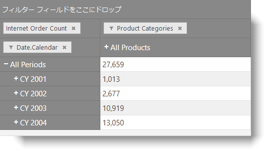

---
title: "リモート プロバイダーからの igOlapXmlaDataSource の構成"
slug: igolapxmladatasource-configuring-through-a-remote-provider
---

# リモート プロバイダーからの igOlapXmlaDataSource の構成

## トピックの概要
### 目的

このトピックでは、`igOlapXmlaDataSource`™ コンポーネントのためにリモート データ プロバイダーを構成する方法を説明します。

### 前提条件

以下の表は、このトピックを理解するための前提条件として必要なトピックと記事の一覧です。

**トピック**

- [igOlapXmlaDataSource の概要](/igolapxmladatasource-overview): このトピックは、`igOlapXmlaDataSource` コンポーネントおよびその機能の概要を説明します。

- [igOlapXmlaDataSource の HTML ページへの追加](/igolapxmladatasource-adding-to-an-html-page): このトピックでは、`igOlapXmlaDataSource` を HTML ページに追加し、Microsoft® SQL Server Analysis Services (SSAS) サーバーからデータを取得するように構成する方法を説明します。

- [データ プロバイダーの構成の概要 (igOlapXmlaDataSource)](/igolapxmladatasource-data-provider-configuration-overview): このトピックでは、`igOlapXmlaDataSource` コンポーネントをサポートするデータ プロバイダーの概要とそれらを構成する方法についての概念的情報を提供します。

**外部リソース**

- [ADOMD.NET を使用した開発](http://technet.microsoft.com/ja-jp/library/ms123483.aspx): これは、ADOMD.NET に関係するトピックのグループです。

- [Internet Information Services (IIS) 7.0 での分析サービスへの HTTP アクセスの構成](http://technet.microsoft.com/ja-jp/library/gg492140.aspx): SSAS サーバーのために HTTP データ プロバイダー (`msmdpump.dll`) を構成する方法を説明するトピック


### このトピックの内容

このトピックは、以下のセクションで構成されます。

-   [**概要**](#introduction)
-   [**リモート データ プロバイダーの構成 - 概念的な概要**](#conceptual-overview)
    -   [リモート データ プロバイダーの構成の概要](#remote-data-provider-summary)
    -   [要件](#requirements)
    -   [手順](#steps)
-   [**リモート データ プロバイダーの構成 - 例**](#remote-data-provider-example)
    -   [概要](#introduction)
    -   [プレビュー](#preview)
    -   [前提条件](#prerequisites)
    -   [概要](#overview)
    -   [手順](#example-steps)
    -   [全コード - コントローラー](#code-controller)
    -   [全コード - ビュー](#code-view)
-   [**関連コンテンツ**](#related-content)
    -   [トピック](#topics)
    -   [サンプル](#samples)
    -   [リソース](#resources)


## <a id="introduction"></a>概要

リモート データ プロバイダー用の `igOlapXmlaDataSource` を構成するには、まず ASP.NET MVC アプリケーションにデータ プロバイダーを追加してから、リモート プロバイダーを使用するように `igOlapXmlaDataSource` を構成し、それをプロバイダー URL により提供します。

リモート データ プロバイダーの構成についての概念的な説明は、[データ プロバイダーの構成 - 概要 (igOlapXmlaDataSource)](/igolapxmladatasource-data-provider-configuration-overview)を参照してください。


## <a id="conceptual-overview"></a>リモート データ プロバイダーの構成 - 概念的な概要
### <a id="remote-data-provider-summary"></a>リモート データ プロバイダーの構成の概要

以下の表は、`igOlapXmlaDataSource` コンポーネントでサポートされるリモート データ プロバイダーのタイプを示し、各タイプを簡単に説明します。

リモート データ プロバイダーのタイプ|説明
---|---
XMLA|SSAS の HTTP データ プロバイダー (msmdpump) に接続します。
ADOMD.NET|Microsoft® ADOMD.NET を使用して SSAS インスタンスに直接接続します。


### <a id="requirements"></a>要件

以下に示すのは、リモート データ プロバイダーから `igOlapXmlaDataSource` を構成するための全般的な要件です。

-   少なくとも 1 つのデータベースを持つ Microsoft SSAS サーバー
-   (条件付き - ADOMD プロバイダーのみ) [ADOMD.NET Client](http://www.microsoft.com/ja-jp/download/confirmation.aspx?id=16978) (`Microsoft.AnalysisServices.AdomdClient.dll` アセンブリ バージョン 10.0.0.0) がサーバーにインストールされていること
-   (条件付き - XMLA プロバイダーのみ) HTTP サーバーが MS SQL Server インスタンスへの読取りアクセス権を持つこと
-   以下のアセンブリへの参照を持つ ASP.NET MVC アプリケーション:
    -   `Infragistics.Web.Mvc.dll`
    -   (条件付き - ADOMD プロバイダーのみ) `Infragistics.Olap.DataProvider.Adomd.Mvc.dll`

### <a id="steps"></a>手順

リモート データ プロバイダーから `igOlapXmlaDataSource` を構成するための一般的な手順を簡単に示すと、次のようになります。

1. エンドポイントの構成

2. `igOlapXmlaDataSource` の構成

この手順の具体的な例は、[リモート データ プロバイダーの構成 - 例](#remote-data-provider-example)を参照してください。


## <a id="remote-data-provider-example"></a>リモート データ プロバイダーの構成 - 例
### <a id="introduction"></a>概要

この手順は、ASP.NET MVC アプリケーションで ADOMD.NET リモート データ プロバイダーまたは XMLA リモート データ プロバイダーを設定し、データ プロバイダーからのデータを実行する `igOlapXmlaDataSource` を構成して `igPivotGrid`™ で視覚化します。(オプションで、カタログ、キューブ、行、列、メジャーのプリロード、またはデータ ソースの追加構成ができます。この手順では、結果を表示するためにピボット グリッドが追加されます。)

### <a id="preview"></a>プレビュー

次のスクリーンショットは最終結果のプレビューです。ピボット グリッドにリモート データ プロバイダーからのデータが取り込まれています。



### <a id="prerequisites"></a>前提条件

この手順を実行するには、以下のリソースが必要です。

-   「HTML ページまたは JavaScript への `igPivotGrid` の追加」に記載された必須の JS/CSS リソース、および CSS 結合したファイル

### <a id="overview"></a>概要

以下はプロセスの概念的概要です。

1. エンドポイントの構成

2. `igOlapXmlaDataSource` の構成

### <a id="example-steps"></a>手順

以下の手順は、リモート データ プロバイダーから `igOlapXmlaDataSource` を構成する手順を示します。

1. エンドポイントを構成します。

	`igOlapXmlaDataSource` に対してリモート データ プロバイダーを使用できるようにするには、`igOlapXmlaDataSource` が接続するコントローラーでアクションを構成します。
	
	ADOMD リモート プロバイダーの場合
	
	アクションには、[AdomdDataSourceActionAttribute](Infragistics.Olap.DataProvider.Adomd.Mvc~Infragistics.Web.Mvc.AdomdDataSourceActionAttribute_members.html) を適用する必要があります。アクションの本文で、適切に設定された[ConnectionString](Infragistics.Olap.DataProvider.Adomd.Mvc~Infragistics.Web.Mvc.AdomdDataSourceModel~ConnectionString.html) プロパティを持つ [AdomdDataSourceModel](Infragistics.Olap.DataProvider.Adomd.Mvc~Infragistics.Web.Mvc.AdomdDataSourceModel_members.html) インスタンスを渡す新しいビューを返します。
	
	**C# の場合:**
	
```csharp
	[AdomdDataSourceAction]
	public ActionResult RemoteAdomdProviderEndpoint()
	{
	    return View(new AdomdDataSourceModel { ConnectionString = "Provider=MSOLAP.4;Persist Security Info=True;Data Source=http://sampledata.infragistics.com/olap/msmdpump.dll;Initial Catalog=Adventure Works DW Standard Edition;MDX Compatibility=1;Safety Options=2;MDX Missing Member Mode=Error"});
	}
```
	
	サーバーに `Microsoft.AnalysisServices.AdomdClient` アセンブリのバージョン 10.0.0.0 以外の別のバージョンがすでにインストールされている場合、以下のバインド リダイレクト セクションを Web アプリケーションの `web.config` ファイルに追加すると、インストール済みのバージョンを使用できます。
	
	**XML の場合:**
	
```xml
	<runtime>
	  <assemblyBinding xmlns="urn:schemas-microsoft-com:asm.v1">
	    <dependentAssembly>
	      <assemblyIdentity name="Microsoft.AnalysisServices.AdomdClient" publicKeyToken="89845dcd8080cc91" culture="neutral" />
	      <bindingRedirect oldVersion="0.0.0.0-65535.65535.65535.65535" newVersion="[your version]" />
	    </dependentAssembly>
	  </assemblyBinding>
	</runtime>
```
	
	XMLA リモート プロバイダーの場合
	
	アクションに [XmlaDataSourceActionAttribute](Infragistics.Web.Mvc~Infragistics.Web.Mvc.XmlaDataSourceActionAttribute_members.html) を適用する必要があります。アクションの本文で、mdsmdpump データ プロバイダーの URL に設定された [ServerUrl](Infragistics.Web.Mvc~Infragistics.Web.Mvc.XmlaDataSourceModel~ServerUrl.html) プロパティを持つ [XmlaDataSourceModel](Infragistics.Web.Mvc~Infragistics.Web.Mvc.XmlaDataSourceModel_members.html) インスタンスを渡す新しいビューを返します。
	
	**C# の場合:**
	
```csharp
	[XmlaDataSourceAction]
	public ActionResult RemoteXmlaProviderEndpoint()
	{
	    return View(new XmlaDataSourceModel{ ServerUrl = "http://sampledata.infragistics.com/olap/msmdpump.dll" });
	}
```

2. `igOlapXmlaDataSource` を構成します。

	`igOlapXmlaDataSource` がリモート データ プロバイダーで機能するためには、[serverUrl](&#123;environment:jQueryApiUrl&#125;/ig.OlapXmlaDataSource#options:serverUrl) を手順 1 で定義したアクションの URL に設定し、[isRemote](&#123;environment:jQueryApiUrl&#125;/ig.OlapXmlaDataSource#options:isRemote) オプションを true に設定します。
	
	この例の手順では、結果を表示するピボット グリッドを追加します。(オプションで、カタログ、キューブ、行、列、メジャーのプリロード、またはデータ ソースの追加構成ができます。)
	
	**JavaScript の場合:**
	
```js
	$(function () {
	    var remoteDataSource = new $.ig.OlapXmlaDataSource({
	        isRemote: true,
	        // if using ADOMD
	        serverUrl: '@Url.Action("RemoteAdomdProviderEndpoint")',
	        // if using XMLA
	        //serverUrl: '@Url.Action("RemoteXmlaProviderEndpoint")',
	        catalog: 'Adventure Works DW 2008',
	        cube: 'Adventure Works',
	        rows: '[Date].[Calendar]',
	        columns: '[Product].[Product Categories]',
	        measures: '[Measures].[Internet Order Count]'
	    });
	    $("#pivotGrid").igPivotDataSelector({
	        dataSource: remoteDataSource,
	        width: "900px",
	        height: "500px"
	    });
	});
```


### <a id="code-controller"></a>全コード - コントローラー

以下は、PivotGridController の完全なコードです。

**C# の場合:**

```csharp
using System.Web.Mvc;
using Infragistics.Web.Mvc;
namespace OlapAdomdMvc.Controllers
{
    public class PivotGridController : Controller
    {
        [AdomdDataSourceAction]
        public ActionResult RemoteAdomdProviderEndpoint()
        {
            return View(new AdomdDataSourceModel { ConnectionString = "Provider=MSOLAP.4;Persist Security Info=True;Data Source=http://sampledata.infragistics.com/olap/msmdpump.dll;Initial Catalog=Adventure Works DW Standard Edition;MDX Compatibility=1;Safety Options=2;MDX Missing Member Mode=Error" });
        }
        [XmlaDataSourceAction]
        public ActionResult RemoteXmlaProviderEndpoint()
        {
            return View(new XmlaDataSourceModel { ServerUrl = "http://sampledata.infragistics.com/olap/msmdpump.dll" });
        }
        public ActionResult RemoteDataProvider()
        {
            return View("RemoteDataProvider");
        }
    }
}
```

### <a id="code-view"></a>全コード - ビュー

以下は、RemoteDataProviderSample ビューのコードです。

**HTML の場合:**

```html
<!DOCTYPE html>
<html>
<head>
    <title></title>
    
    <link href="@Url.Content("[IG root]/css/themes/infragistics/infragistics.theme.css")" rel="stylesheet" />
    <link href="@Url.Content("[IG root]/css/structure/infragistics.css")" rel="stylesheet" />
    <script src="@Url.Content("~/js/modernizr.min.js")"></script>
    <script src="@Url.Content("~/js/jquery.min.js")"></script>
    <script src="@Url.Content("~/js/jquery-ui.min.js")"></script>
    
    <script src="@Url.Content("[IG root]/js/infragistics.core.js")"></script>
    <script src="@Url.Content("[IG root]/js/infragistics.lob.js")"></script>
</head>
<body>
    <script type="text/javascript">
        $.support.cors = true;
        $(function () {
            var remoteDataSource = new $.ig.OlapXmlaDataSource({
                isRemote: true,
                serverUrl: '@Url.Action("RemoteXmlaProviderEndpoint")',
                catalog: 'Adventure Works DW 2008',
                cube: 'Adventure Works',
                rows: '[Date].[Calendar]',
                columns: '[Product].[Product Categories]',
                measures: '[Measures].[Internet Order Count]'
            });
            $("#pivotGrid").igPivotGrid({
                dataSource: remoteDataSource,
                width: "500px",
                height: "270px"
            });
        });
    </script>
    <div id="pivotGrid"></div>
</body>
</html>
```


## <a id="related-content"></a>関連コンテンツ
### <a id="topics"></a>トピック

このトピックの追加情報については、以下のトピックも合わせてご参照ください。

- [ピボット グリッドの列、行、フィルター、メジャーの配列による結果セットの表形式ビューを構成します (igOlapFlatDataSource、 igOlapXmlaDataSource、igPivotDataSelector、igPivotGrid, igPivotView)](/configuring-the-tabular-view): このトピックは、グリッドのインターフェイスまたはコードを使用し、ピボット グリッド列、行、フィルター、およびメジャーの階層を配置して設定される OLAP キューブ結果の表形式ビューを構成する方法を説明します。


### <a id="samples"></a>サンプル

このトピックについては、以下のサンプルも参照してください。

- [リモート XMLA プロバイダー](&#123;environment:SamplesUrl&#125;/pivot-grid/remote-xmla-provider): このサンプルは、igOlapXmlaDataSource コンポーネントでリモート プロバイダーを使用してネットワーク トラフィックを低減する方法を紹介します。

- [ADOMD.NET リモート データ プロバイダー](&#123;environment:SamplesUrl&#125;/pivot-grid/remote-adomd-provider): このサンプルは、igPivotGrid コントロールで ADOMD.NET リモート データ プロバイダーを使用する方法を紹介します。

### <a id="resources"></a>リソース

以下の資料 (Infragistics のコンテンツ ファミリー以外でもご利用いただけます) は、このトピックに関連する追加情報を提供します。

- [ADOMD.NET ダウンロード ページ](http://www.microsoft.com/ja-jp/download/details.aspx?id=23089): ADOMD.NET に関する Microsoft のダウンロード ページ。


 

 


