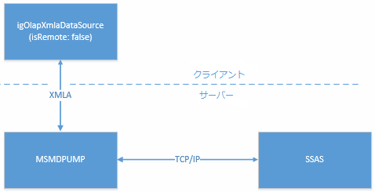
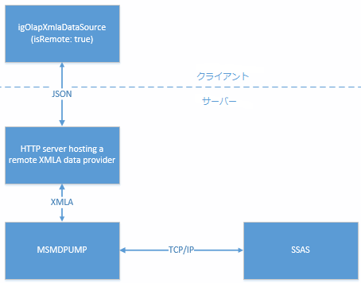
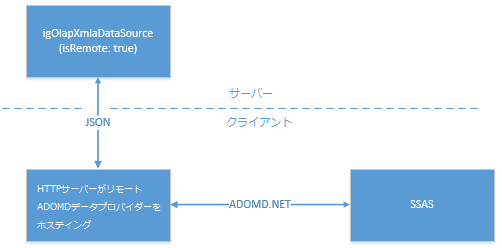

---
title: "データ プロバイダーの構成の概要 (igOlapXmlaDataSource)"
slug: igolapxmladatasource-data-provider-configuration-overview
---

# データ プロバイダーの構成の概要 (igOlapXmlaDataSource)

## トピックの概要
### 目的

このトピックでは、`igOlapXmlaDataSource`™ コンポーネントをサポートするデータ プロバイダーの概要とそれらを構成するための概念レベルの情報を紹介します。構成に固有な具体的な方法は、[リモート プロバイダーからの igOlapXmlaDataSource の構成](/igolapxmladatasource-configuring-through-a-remote-provider)および [igOlapXmlaDataSource の HTML ページへの追加](/igolapxmladatasource-adding-to-an-html-page)を参照してください。

### 前提条件

以下の表は、このトピックを理解するための前提条件として必要なトピックと記事の一覧です。

- [igOlapXmlaDataSource の概要](/igolapxmladatasource-overview): このトピックは、`igOlapXmlaDataSource` コンポーネントおよびその機能の概要を説明します。

### このトピックの内容

このトピックは、以下のセクションで構成されます。

-   [**データ プロバイダーの構成の概要**](#data-provider)
    -   [データ プロバイダーの構成のタイプ](#config-types)
    -   [ダイレクト データ プロバイダーの構成](#direct-data-provider)
    -   [リモート データ プロバイダーの構成](#remote-data-provider)
    -   [リモート プロバイダーのための igOlapXmlaDataSource の構成](#remote-provider)
-   [**関連コンテンツ**](#related-content)
    -   [トピック](#topics)
    -   [サンプル](#samples)

## データ プロバイダーの構成の概要
### データ プロバイダーの構成のタイプ

`igOlapXmlaDataSource` コンポーネントにより SSAS サーバーからデータを取得するために構成可能なタイプを、以下の表に示します。各構成タイプの概要は、表の後に記載されています。

構成タイプ|説明
---|---
[ダイレクト](#direct-data-provider)|`igOlapXmlaDataSource` は msmdpump HTTP データ プロバイダーに接続します。
[リモート](#remote-data-provider)|Infragistics® リモート データ プロバイダーは、`igOlapXmlaDataSource` と SSAS サーバーとの間のすべての通信のプロキシに使用されます。

### ダイレクト データ プロバイダーの構成

ダイレクト データ プロバイダーの構成では、`igOlapXmlaDataSource` は msmdpump HTTP データ プロバイダーを介して SSAS と通信します。`igOlapXmlaDataSource` とデータ プロバイダーとの間のすべての通信は、図に示すように XMLA 経由で実行されます。

リモートの場合と比較したダイレクト データ プロバイダーの主な利点は、以下のとおりです。

-   ASP.NET サーバー側コンポーネント (データ プロバイダー) が不要です。したがって、ダイレクト データ プロバイダーはどの Web アプリケーションでも使用できます。
-   クライアントとサーバーとの間で送信されるデータ量は多くなりますが、状況によってはダイレクト データ プロバイダーのほうが速い場合もあります。

ダイレクトで `igOlapXmlaDataSource` を構成するには、msmdpump データ プロバイダーの URL を提供する必要があります。この構成に固有な具体的な方法は、[igOlapXmlaDataSource のための IIS for MSMDPUMP の構成](/igolapxmladatasource-configuring-iis-for-msmdpump)および [igOlapXmlaDataSource の HTML ページへの追加](/igolapxmladatasource-adding-to-an-html-page)を参照してください。

### リモート データ プロバイダーの構成

`igOlapXmlaDataSource` のためのリモート プロバイダーは、いわゆるリモート構成に対応したサーバー側コンポーネントです。このタイプの構成では、`igOlapXmlaDataSource` は、SSAS サーバーのために msmdpump HTTP データ プロバイダーと直接通信するのではなく、SSAS に通信をプロキシするサーバー アプリケーションと通信します。

ダイレクトの場合と比較してリモート データ プロバイダーを使用する主な利点は、以下のとおりです:

-   クライアント (`igOlapXmlaDataSource`) とサーバー (HTTP サーバー) との間のすべての通信は、XMLA ではなく JSON で実行されるため、ネットワーク トラフィックが減少します。

[サーバー側の必要な構成](/igolapxmladatasource-configuring-iis-for-msmdpump)の一部が不要です。

以下の表は、`igOlapXmlaDataSource` コンポーネントでサポートされるリモート データ プロバイダーのタイプを示し、各タイプを簡単に説明します。

リモート データ プロバイダーのタイプ|説明
---|---
XMLA|SSAS の HTTP データ プロバイダー (msmdpump) に接続します。
ADOMD.NET|Microsoft® ADOMD.NET を使用して SSAS インスタンスに直接接続します。

以下の図に、各プロバイダー タイプでの概念的なデータ フローを示します。

**XMLA データ プロバイダー**

**ADOMD.NET データ プロバイダー**

### リモート プロバイダーのための igOlapXmlaDataSource の構成

リモート データ プロバイダー用の `igOlapXmlaDataSource` を構成するには、まず ASP.NET MVC アプリケーションにデータ プロバイダーを追加してから、リモート プロバイダーを使用するように `igOlapXmlaDataSource` を構成し、それをプロバイダー URL により提供します。

構成に固有な具体的な方法は、[リモート プロバイダーからの `igOlapXmlaDataSource` の構成](/igolapxmladatasource-configuring-through-a-remote-provider)および [`igOlapXmlaDataSource` の HTML ページへの追加](/igolapxmladatasource-adding-to-an-html-page)を参照してください。

## 関連コンテンツ
### トピック

このトピックの追加情報については、以下のトピックも合わせてご参照ください。

- [`igOlapXmlaDataSource` の HTML ページへの追加](/igolapxmladatasource-adding-to-an-html-page): このトピックでは、`igOlapXmlaDataSource` を HTML ページに追加する方法、および Microsoft SQL Server Analysis Services (SSAS) サーバーからデータを取得するための構成方法を説明します。

- [リモート プロバイダーからの `igOlapXmlaDataSource` の構成](/igolapxmladatasource-configuring-through-a-remote-provider): このトピックでは、リモート データ プロバイダーで `igOlapXmlaDataSource` を構成する方法を説明します。

### サンプル

このトピックについては、以下のサンプルも参照してください。

- [XMLA データ ソースへのバインド](&#123;environment:SamplesUrl&#125;/pivot-grid/binding-to-xmla-data-source): このサンプルは、`igPivotGrid`™ を `igOlapXmlaDataSource` にバインドする方法を紹介します。

- [リモート XMLA プロバイダー](&#123;environment:SamplesUrl&#125;/pivot-grid/remote-xmla-provider): このサンプルは、`igOlapXmlaDataSource` コンポーネントでリモート プロバイダーを使用してネットワーク トラフィックを低減する方法を紹介します。

- [ADOMD.NET リモート データ プロバイダー](&#123;environment:SamplesUrl&#125;/pivot-grid/remote-adomd-provider): このサンプルは、`igPivotGrid` コントロールで ADOMD.NET リモート データ プロバイダーを使用する方法を紹介します。

 

 

