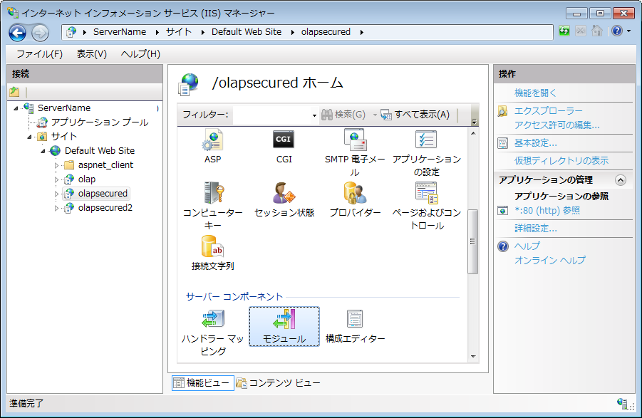
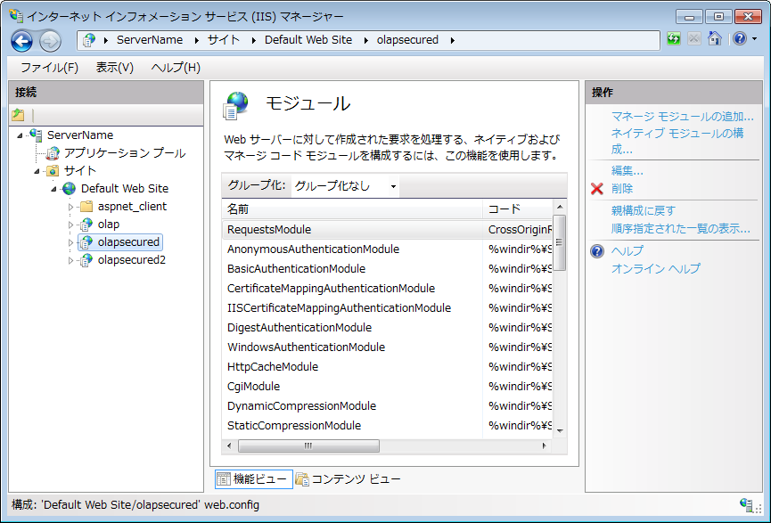
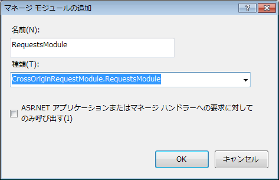

# Mozilla Firefox ブラウザーの認証済みアクセスの構成

(igOlapXmlaDataSource)

## トピックの概要
### 目的

このトピックでは、Mozilla® Firefox® ブラウザーでクロスドメイン認証済みアクセスに IIS を構成する回避策を提供します。(このトピック作成時点では、バグにより、Firefox ブラウザーの現在のバージョン (17.0.1) は規格の IIS 構成 ([ここ](/igolapxmladatasource-configuring-iis-for-cross-domain-olap-data)に提供される) をサポートしていません。)

認証されていないアクセスを構成するか、Firefox ブラウザーとの互換性を無視する場合、[クロスドメイン OLAP データの IIS の構成 (igOlapXmlaDataSource)](/igolapxmladatasource-configuring-iis-for-cross-domain-olap-data) トピックを参照してください。

### 前提条件

以下の表は、このトピックを理解するための前提条件として必要な概念とトピックの一覧です。

**概念**

-   [SQL Server Analysis Services (SSAS)](http://msdn.microsoft.com/ja-jp/library/ms175609%28v=sql.90%29.aspx)
-   [XML for Analysis (XMLA)](http://en.wikipedia.org/wiki/XML_for_Analysis)
-   [オンライン解析処理 (OLAP) との操作](http://msdn.microsoft.com/ja-jp/library/ms175367%28v=sql.90%29.aspx)
-   [インターネット インフォメーション サービス (IIS)](http://technet.microsoft.com/ja-jp/library/hh831725)
-   [IIS のマネージド ハンドラー](http://technet.microsoft.com/ja-jp/library/cc753249%28v=ws.10%29.aspx)

**トピック**

- [igOlapXmlaDataSource の概要](/igolapxmladatasource-overview): このトピックでは、`igOlapXmlaDataSource` フレームワークの概要を解説します。

- [クロスドメイン OLAP データの IIS の構成 (igOlapXmlaDataSource)](/igolapxmladatasource-configuring-iis-for-cross-domain-olap-data): このトピックでは、インターネット インフォメーション サービス (IIS) のホスト HTTP データ プロバイダー (`msmdpump.dll`) を SQL Server Analysis Services (SSAS) のクロスドメイン アクセス (認証済みアクセスおよび認証されていないアクセス) のために構成する方法を紹介します。


### このトピックの内容

このトピックは、以下のセクションで構成されます。

-   [Firefox の認証済みアクセスを持つクロスドメイン OLAP データのために IIS の構成](#authenticated-access-firefox)
-   [マネージド ハンドラーを承諾するために IIS の構成](#accepting-managed-handlers)
    -   [概要](#introduction)
    -   [前提条件](#prerequisites)
    -   [概要](#overview)
    -   [手順](#steps)
-   [関連コンテンツ](#related-content)
    -   [サンプル](#samples)
    -   [リソース](#resources)


## <a id="authenticated-access-firefox"></a>Firefox の認証済みアクセスを持つクロスドメイン OLAP データのために IIS の構成
### Firefox の認証済みアクセスを持つクロスドメイン OLAP データのために IIS の構成の概要

デフォルトでは、Mozilla Firefox の現在のバージョン (17.0.1) は、クロスドメイン データの承認要求を送信しません。Firefox で `igOlapXmlaDataSource` コントロールの認証を使用するには、カスタム IIS モジュールを作成する必要があります。Mozilla Firefox ® OPTIONS verb を取得して、検証ヘッダーを応答に追加します。IIS 応答は指定して構成する必要なマネージされたハンドラーによって制御されます。

詳細および手順について、[マネージド ハンドラーを承諾するために IIS の構成](#accepting-managed-handlers)セクションを参照してください。

### 要件

以下は、マネージド ハンドラーを承諾するために構成する一般的な要件です

-   インターネット インフォメーション サービス (IIS) バージョン 7 以後
-   以下のアセンブリへの参照
	-   System.Web
	-   Microsoft.Web.Management
	-   Microsoft.Web.Administration


## <a id="accepting-managed-handlers"></a>マネージド ハンドラーを承諾するために IIS の構成
### <a id="introduction"></a>概要

以下の手順は、マネージド ハンドラー モジュールを使用して OLAP アプリケーションへの認証済みアクセスを構成します。

この手順は、Mozilla ブラウザーからの OPTIONS 要求を取得して応答に承認ヘッダーを追加するモジュールを作成します。認証されるコミュニケーションを有効にします。モジュールは 2 つのクラスです。1 つは要求を処理するモジュールです。他のはサーバー設定を取得するヘルパー クラスです。このヘルパー クラスは IHttpModule インターフェイスを実装します。アプリケーションがサーバーに要求を送信する前に、最初の要求を確認し、以下の手順を実行します。

1. 要求が Origin ヘッダーを含むかどうかを確認します。ヘッダーが存在する場合、Origin ヘッダーの値を含む Access-Control-Allow-Origin ヘッダーは応答に追加されます。

2. コンテキストが Access-Control-Request-Method を含むかどうかを確認します。含む場合、応答に POST, GET の値を含む Access-Control-Request-Method に追加します。

3. 要求が Access-Control-Request-Headers を含むかどうかを確認します。ヘッダーが値を含む場合、`accessControlRequestHeaders` 変数に保存されます。

4. `ConfigHelper` クラス メソッドを使用して、IIS で認証が有効かどうかを決定します。有効の場合、サポートされる認証タイプを `authentication` 文字列に保存します。

5. 認証が有効の場合、応答に*true* の値を含む *Access-Control-Allow-Credentials* ヘッダーを追加します。`accessControlRequestHeaders` 変数が値を持つ場合、`authorization` 文字列を追加します。実際の要求は *Authorization* ヘッダーを含むことができます。

6. `accessControlRequestHeaders` 変数が値を持つ場合、値として `accessControlRequestHeaders` を使用して *Access-Control-Allow-Headers* ヘッダーは応答に追加されます。

7. 要求のメソッドは OPTIONS かどうかを確認します。その場合、 Authentication: および authentication 文字列で保存されるサポートされる認証タイプを応答に追加します。

8. 要求を完了します。

### <a id="prerequisites"></a>前提条件

この手順を実行するには、以下が必要です。

-   空のクラス ライブラリおよび以下のアセンブリへの参照を含む MS Visual Studio® プロジェクト:
    -   *System.Web*
    -   *Microsoft.Web.Management*
    -   *Microsoft.Web.Administration*
-   HTTP データ プロバイダー (`msmdpump.dll`) がホストされる IIS サーバーへのアクセス

この手順では、クラス ライブラリ プロジェクトの名前は `CrossOriginRequestModule` ので、コード例の名前空間は同じです。

### <a id="overview"></a>概要

以下はプロセスの概念的概要です。

1. カスタム HTTP モジュールの作成

2. カスタム HTTP モジュールを Web アプリケーション フォルダーにコピー

3. カスタム HTTP モジュールをマネージド モジュールとして構成

### <a id="steps"></a>手順

以下の手順は、マネージド ハンドラーを承認するために IIS を設定する方法を紹介します。

1. カスタム HTTP モジュールを作成します。

	2 つのクラスを追加する必要があります。この手順では、クラス ライブラリに追加する 2 つのクラスがあります。1 つは要求を処理する `RequestsModule` です。他のはサーバー設定を取得する `ConfigHelper` です。

	1. サーバー設定を取得するクラスを作成します。
	
		以下のコードを ConfigHelper ファイルに追加します。このクラスの `IsAuthenticated` メソッドは、OLAP アプリケーションの `web.config` ファイルまたは `ApplicationHost.config` ファイルで認証が有効かどうかを確認します。
	
		**C# の場合:**
		
```csharp
		using Microsoft.Web.Administration;
		using System;
		namespac CrossOriginRequestModule
		{
		    internal class ConfigHelper
		    {
		        public static bool IsAuthenticated(out string authentication, bool applicationHost = true)
		        {
		            return IsAuthenticated(out authentication, applicationHost, "IIS7");
		        }
		        public static bool IsAuthenticated(out string authentication, bool applicationHost, string iisVersion)
		        {
		            authentication = null;
		            string leadPathPart = iisVersion.ToUpper() == "IIS7"
		                                  ? "system.webServer/security/"
		                                  : "system.web/";
		            string[] authPaths = new string[4];
		            authPaths[0] = leadPathPart + "authentication/anonymousAuthentication";
		            authPaths[1] = leadPathPart + "authentication/basicAuthentication";
		            authPaths[2] = leadPathPart + "authentication/digestAuthentication";
		            authPaths[3] = leadPathPart + "authentication/windowsAuthentication";
		            ServerManager serverManager = new ServerManager();
		            Configuration appHostConfig = serverManager.GetApplicationHostConfiguration();
		            ConfigurationSection configSection = null;
		            for (int i = 0; i < authPaths.Length; i++)
		            {
		                try
		                {
		                    if (applicationHost)
		                    {
		                        configSection = appHostConfig.GetSection(authPaths[i]);
		                    }
		                    else
		                    {
		                        configSection = WebConfigurationManager.GetSection(authPaths[i]);
		                    }
		                }
		                catch (Exception)
		                {
		                }
		                if (configSection != null)
		                {
		                    bool enabled = Convert.ToBoolean(configSection.GetAttributeValue("enabled"));
		                    if (enabled)
		                    {
		                        authentication = authPaths[i];
		                        // do nothing for anonymousAuthentication 
		                        if (i > 0)
		                        {
		                            return true;
		                        }
		                        return false;
		                    }
		                }
		            }
		            return false;
		        }
		    }
		}
```
	
		**Visual Basic の場合:**
		
```vb
		Imports Microsoft.Web.Administration
		Namespace CrossOriginRequestModule
		      Friend Class ConfigHelper
		            Public Shared Function IsAuthenticated(ByRef authentication As String, Optional applicationHost As Boolean = True) As Boolean
		                  Return IsAuthenticated(authentication, applicationHost, "IIS7")
		            End Function
		            Public Shared Function IsAuthenticated(ByRef authentication As String, applicationHost As Boolean, iisVersion As String) As Boolean
		                  authentication = Nothing
		                  Dim leadPathPart As String = If(iisVersion.ToUpper() = "IIS7", "system.webServer/security/", "system.web/")
		                  Dim authPaths As String() = New String(3) {}
		                  authPaths(0) = leadPathPart & "authentication/anonymousAuthentication"
		                  authPaths(1) = leadPathPart & "authentication/basicAuthentication"
		                  authPaths(2) = leadPathPart & "authentication/digestAuthentication"
		                  authPaths(3) = leadPathPart & "authentication/windowsAuthentication"
		                  Dim serverManager As New ServerManager()
		                  Dim appHostConfig As Configuration = serverManager.GetApplicationHostConfiguration()
		                  Dim configSection As ConfigurationSection = Nothing
		                  For i As Integer = 0 To authPaths.Length - 1
		                        Try
		                              If applicationHost Then
		                                    configSection = appHostConfig.GetSection(authPaths(i))
		                              Else
		                                    configSection = WebConfigurationManager.GetSection(authPaths(i))
		                              End If
		                        Catch generatedExceptionName As Exception
		                        End Try
		                        If configSection IsNot Nothing Then
		                              Dim enabled As Boolean = Convert.ToBoolean(configSection.GetAttributeValue("enabled"))
		                              If enabled Then
		                                    authentication = authPaths(i)
		                                    ' do nothing for anonymousAuthentication 
		                                    If i > 0 Then
		                                          Return True
		                                    End If
		                                    Return False
		                              End If
		                        End If
		                  Next
		                  Return False
		            End Function
		      End Class
		End Namespace
```
	
	2. 要求を処理するクラスを作成します。
	
		以下のコードをファイルに追加します。
		
		**C# の場合:**
		
```csharp
		using System;
		using System.Web;
		namespace CrossOriginRequestModule
		{
		    public class RequestsModule : IHttpModule
		    {
		        public void Dispose()
		        {
		        }
		        public void Init(HttpApplication app)
		        {
		            // register for events created by the pipeline 
		            app.BeginRequest += new EventHandler(this.OnBeginRequest);
		        }
		        void OnBeginRequest(object sender, EventArgs e)
		        {
		            HttpApplication context = (HttpApplication)sender;
		            try
		            {
		                string origin = context.Request.Headers.Get("Origin");
		                if (string.IsNullOrEmpty(origin))
		                {
		                    origin = context.Request.Headers.Get("origin");
		                }
		                if (!string.IsNullOrEmpty(origin))
		                {
		                    context.Response.AppendHeader("Access-Control-Allow-Origin", origin);
		                }
		                if (!string.IsNullOrEmpty(context.Request.Headers.Get("Access-Control-Request-Method")))
		                {
		                    context.Response.AppendHeader("Access-Control-Request-Method", "POST, GET");
		                }
		                string accessControlRequestHeaders = context.Request.Headers.Get("Access-Control-Request-Headers");
		                string authentication = null;
		                bool isAuthenticated = ConfigHelper.IsAuthenticated(out authentication, false);
		                // no auth section in web.config
		                if (authentication == null)
		                {
		                    isAuthenticated = false;
		                    isAuthenticated = ConfigHelper.IsAuthenticated(out authentication);
		                }
		                if (isAuthenticated)
		                {
		                    context.Response.AppendHeader("Access-Control-Allow-Credentials", "true");
		                    if (!string.IsNullOrEmpty(accessControlRequestHeaders) &&
		                        !accessControlRequestHeaders.Contains("authorization"))
		                    {
		                        accessControlRequestHeaders = accessControlRequestHeaders + ", authorization";
		                    }
		                }
		                if (!string.IsNullOrEmpty(accessControlRequestHeaders))
		                {
		                    context.Response.AppendHeader("Access-Control-Allow-Headers", accessControlRequestHeaders);
		                }
		                if (context.Request.HttpMethod == "OPTIONS")
		                {
		                    if (authentication != null)
		                    {
		                        context.Response.Write(string.Format("Authentication: {0}", authentication));
		                    }
		                    HttpContext.Current.ApplicationInstance.CompleteRequest();
		                }
		            }
		            catch (Exception ex)
		            {
		                context.Response.Write(ex.Message);
		                HttpContext.Current.ApplicationInstance.CompleteRequest();
		            }
		        }
		    }
		}
```
		
		**Visual Basic の場合:**
		
```vb
		Imports System.Web
		Namespace CrossOriginRequestModule
		      Public Class RequestsModule
		            Implements IHttpModule
		            Public Sub Dispose() Implements IHttpModule.Dispose
		            End Sub
		            Public Sub Init(app As HttpApplication) Implements IHttpModule.Init
		                  ' register for events created by the pipeline 
		                  AddHandler app.BeginRequest, New EventHandler(AddressOf Me.OnBeginRequest)
		            End Sub
		            Private Sub OnBeginRequest(sender As Object, e As EventArgs)
		                  Dim context As HttpApplication = DirectCast(sender, HttpApplication)
		                  Try
		                        Dim origin As String = context.Request.Headers.[Get]("Origin")
		                        If String.IsNullOrEmpty(origin) Then
		                              origin = context.Request.Headers.[Get]("origin")
		                        End If
		                        If Not String.IsNullOrEmpty(origin) Then
		                              context.Response.AppendHeader("Access-Control-Allow-Origin", origin)
		                        End If
		                        If Not String.IsNullOrEmpty(context.Request.Headers.[Get]("Access-Control-Request-Method")) Then
		                              context.Response.AppendHeader("Access-Control-Request-Method", "POST, GET")
		                        End If
		                        Dim accessControlRequestHeaders As String = context.Request.Headers.[Get]("Access-Control-Request-Headers")
		                        Dim authentication As String = Nothing
		                        Dim isAuthenticated As Boolean = ConfigHelper.IsAuthenticated(authentication, False)
		                        ' no auth section in web.config
		                        If authentication Is Nothing Then
		                              isAuthenticated = False
		                              isAuthenticated = ConfigHelper.IsAuthenticated(authentication)
		                        End If
		                        If isAuthenticated Then
		                              context.Response.AppendHeader("Access-Control-Allow-Credentials", "true")
		                              If Not String.IsNullOrEmpty(accessControlRequestHeaders) AndAlso Not accessControlRequestHeaders.Contains("authorization") Then
		                                    accessControlRequestHeaders = accessControlRequestHeaders & ", authorization"
		                              End If
		                        End If
		                        If Not String.IsNullOrEmpty(accessControlRequestHeaders) Then
		                              context.Response.AppendHeader("Access-Control-Allow-Headers", accessControlRequestHeaders)
		                        End If
		                        If context.Request.HttpMethod = "OPTIONS" Then
		                              If authentication IsNot Nothing Then
		                                    context.Response.Write(String.Format("Authentication: {0}", authentication))
		                              End If
		                              HttpContext.Current.ApplicationInstance.CompleteRequest()
		                        End If
		                  Catch ex As Exception
		                        context.Response.Write(ex.Message)
		                        HttpContext.Current.ApplicationInstance.CompleteRequest()
		                  End Try
		            End Sub
		      End Class
		End Namespace
```
	
	3. プロジェクトをビルドします。

2. カスタム HTTP モジュールを Web アプリケーション フォルダーにコピーします。

	1. サーバーへ接続します。
	
		リモート デスクトップ接続などのツールを使用してアプリケーションがあるリモート サーバーに接続します。
	
	2. IIS マネージャーを起動します。
	
		サーバーのインターネット インフォメーション サービス マネージャーを起動します。
	
	3. OLAP IIS アプリケーションへ移動します。
	
		IIS マネージャー インターフェイスを使用して、HTTP アクセス プロバイダー (`msmdpump.dll` など) をホストするアプリケーションへ移動します。以下の画像では、olapsecured アプリケーションにアクセスします。
		
		
	
	4. サーバーのアプリケーションに含まれるフォルダーを開きます。
	
		IIS でアプリケーションを**右クリック**して、コンテキスト メニューから**「エクスプローラー」をクリック**します。
		
		Windows エクスプローラーはサーバーのアプリケーションに含まれるフォルダーを開きます。
	
	5. HTTP モジュールを bin フォルダーにコピーします。
	
		手順 1 に作成した `CrossOriginRequestModule.dll` モジュールを bin フォルダーにコピーします。bin フォルダーが存在しない場合、作成します。

3. カスタム HTTP モジュールをマネージド モジュールとして構成します。

	1. IIS の Modules モジュールにアクセスします。
	
		インターネット インフォメーション サービス マネージャーで Modules にアクセスします。
		
		
	
	2. カスタム HTTP モジュールを追加します。
	
		A.「アクション」メニューから マネージド モジュールを追加… を**クリック**します。
		
		マネージド モジュールの追加ウィンドウが開きます。
		
		B. モジュールの名前およびタイプを入力します。
		
		a. Name は RequestsModule です。
		
		b. Type のために、以前の手順で追加したカスタム HTTP モジュールを選択します (CrossOriginRequestModule.RequestsModule)。
		
		

## <a id="related-content"></a>関連コンテンツ
### <a id="samples"></a>サンプル

このトピックについては、以下のサンプルも参照してください。

- [XMLA にバインドした KPI の表示](\{environment:SamplesUrl\}/pivot-view/binding-to-xmla-data-source): このサンプルでは、`igPivotView` を `igOlapXmlaDataSource` にバインドする方法を紹介します。

- [リモート XMLA プロバイダー](\{environment:SamplesUrl\}/pivot-grid/remote-xmla-provider): このサンプルは、`igOlapXmlaDataSource` のネットワーク トラフィックのより少ないリモート プロバイダー機能を使用するメリットのいずれかを示します。すべての要求は、クロス ドメインの問題を防止するためにサーバー アプリケーションを介してプロキシーされます。また、応答のサイズを小さくなるために、データが JSON に変換されます。


### <a id="resources"></a>リソース

以下の資料 (Infragistics のコンテンツ ファミリー以外でもご利用いただけます) は、このトピックに関連する追加情報を提供します。

- [XML for Analysis (XMLA)](http://msdn.microsoft.com/ja-jp/library/ms187178%28v=SQL.90%29.aspx): このトピックでは、XML for Analysis ツールの基本機能を説明します。

- [SQL Server Analysis Services](http://msdn.microsoft.com/ja-jp/library/ms175609%28v=sql.90%29.aspx): このページは MSDN の SQL Server Analysis Services (SSAS) の概要です。

- [オンライン解析処理 (OLAP) との操作](http://msdn.microsoft.com/ja-jp/library/ms175367%28v=SQL.90%29.aspx): このトピックは OLAP データの操作の概要です。

- [チュートリアル: カスタム HTTP モジュールの作成と登録](http://msdn.microsoft.com/ja-jp/library/ms227673%28v=vs.100%29.aspx): このチュートリアルは、カスタム HTTP モジュールの基本機能を紹介します。


 

 


