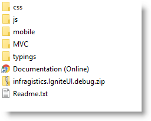
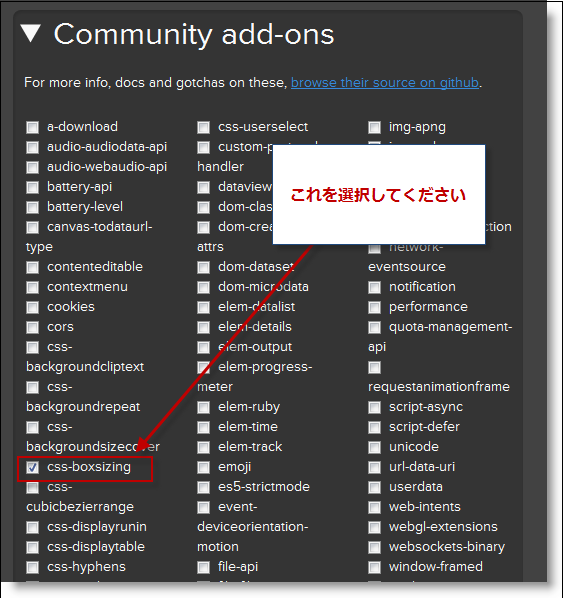

# 必要なリソースを手動で追加する

## トピックの概要

### 目的
このトピックでは、*Infragistics*®  *Loader* を使用せずに \{environment:ProductName\}™ の必要な JavaScript リソースを追加する方法について説明します。

### このトピックの内容

このトピックは、以下のセクションで構成されます。

- [概要](#introduction)
- [要件](#requirements)
- [手順](#steps)
- [関連コンテンツ](#related-content)

###  概要
この手順では、必要なすべてのリソース (CSS および JavaScript ファイル) を手動で追加して、\{environment:ProductName\} を使用して作業する方法を示します。この手順に従うと、縮小された CSS および JavaScript ファイルが追加されます。これは、Web 全体で共有するデータ量を減らす必要があるときに推奨されます。

すべての \{environment:ProductName\} の結合スクリプトを含む JavaScript ファイルの名前は以下のリストです:

-   `infragistics.core.js`: 共有依存関係 (必須)

-   `infragistics.lob.js`: すべて業務用コントロール

-   `infragistics.dv.js`: すべてのデータ ビジュアライゼーション コントロール

-   `infragistics.excel-bundled.js`: すべての Excel エクスポートに関連するロジック (`infragistics.spreadsheet-bundled.js` で必須)

-   `infragistics.spreadsheet-bundled.js`: スプレッドシート ユーザー インターフェイスの実装のみ

-   `infragistics.scheduler-bundled.js`: すべてのスケジューラに関連するロジック

これらは、インストールされた npm パッケージの `js` フォルダーにあります。結合スクリプト バージョンの名前付きのローカライズ リソースもあり、これは `i18n` フォルダーにあります。

デバッグ バージョンの例外を除き、すべての JavaScript ファイルは縮小されています。デバッグには、縮小されていないファイルを使用します。これらのファイルは縮小されたファイルと同じファイル構造を持ち、ファイル名も同じです。縮小されていないファイルは、.zip アーカイブで提供されます (`infragistics.IgniteUI.debug.zip`)。

結合 JavaScript ファイルの使用、または Infragistics ローダーを使用できます。ローダーは、modules フォルダーから個々のモジュールを読み込みます。

- `infragistics.ui.CONTROL_NAME.js`
- `infragistics.ui.CONTROL_NAME.CONTROL_FEATURE.js`

各コントロールに必要なすべてのスクリプトに関する参考文献については、[\{environment:ProductName\} 内の JavaScript ファイル](/deployment-guide-javascript-files)トピックを参照してください。

> **注:** ローカライズ スクリプトは、ページ コード内の実際の JavaScript ファイルの前に参照する必要があります。

##  要件

この手順を実行するには、以下が必要です。

-   Web アプリケーションが含まれるプロジェクト
-   \{environment:ProductName\} npm パッケージがインストール済み
-   [jQuery](http://jquery.com/) コア ライブラリ バージョン 1.9.1 またはそれ以降
-   [jQuery UI](http://jqueryui.com/) ライブラリ 1.9.0 以降
-   [Modernizr](http://modernizr.com/) オープン ソース JavaScript ライブラリ 2.5.2 以降

> **注:** \{environment:ProductName\} のサポートされるフレームワーク バージョンの詳細について、[http://jp.infragistics.com/support/supported-environments](http://jp.infragistics.com/support/supported-environments) を参照してください。

##  手順

### 手順 1: 必要なインフラジスティックス リソースを追加します。

インストール ディレクトリからリソースをコピーします。

1. \{environment:ProductName\}™ リソースは、`js` および `css` フォルダー内の npm パッケージ ディレクトリに置かれています。

2. `css` フォルダーを Web アプリケーションの `Styles` フォルダーにコピーします。

3. scripts フォルダーを `js` から Web アプリケーションの Scripts フォルダーにコピーします。

> **注**: この手順は、CSS および JavaScript ファイルそれぞれが保存されている styles および scripts ディレクトリが Web アプリケーションにあることを前提としています。

### 手順 2: その他の必要なリソースをダウンロードおよび追加します。

開発目的では、jQuery、jQuery UI、および Modernizr JavaScript ファイル の 3 つの JavaScript ファイルを Web サイトに含める必要があります。

Modernizr JavaScript ファイルをコピーします。

1. JavaScript ライブラリをダウンロードします。

2. ダウンロードした JavaScript ファイルを Web アプリケーションの Scripts フォルダーにコピーします。

> **注**: Modernizr JavaScript ライブラリは現在のブラウザ機能を検出するために使用され、その他のすべてのリソース (`css` および `js`) の前に追加する必要があります。

> **注**: IE7 サポートに関しては、カスタマイズされたバージョンの Modernizr `js` ファイルを作成する必要があります。

Modernizr のデフォルトのパッケージには含まれていない、`css-boxsizing` が必要です。このため、Modernizr サイトのダウンロード セクションに移動します : [http://www.modernizr.com/download/](http://www.modernizr.com/download/)

`css-boxsizing` (Community アドオンから) にチェックが付いていることを確認してから、[生成] ボタンをクリックしてカスタム ビルドを作成する必要があります。

#### JQuery JavaScript ファイルをコピーします。

1. JavaScript ライブラリをダウンロードします。

2. ダウンロードした JavaScript ファイルを Web アプリケーションの `Scripts` フォルダーにコピーします。

#### JQuery UI JavaScript ファイルおよび JQuery UI 基本テーマをコピーします。

1. JavaScript ライブラリをダウンロードします。
2. ダウンロードしたファイルをファイル システムで解凍し、そのフォルダーを開きます。
3. `js` フォルダーを開き、ダウンロードした JQuery UI JavaScript ファイルを Web アプリケーションの Scripts フォルダーにコピーします。
4. 解凍したフォルダーの development-bundle フォルダー内で、themes フォルダーを見つけます。
5. base フォルダーを、Web アプリケーションの themes フォルダーにコピーします。

> 注: `themes` フォルダーは、Web アプリケーションの `Styles` フォルダーにあります。見つからない場合は、そのフォルダーを作成します。

##  関連コンテンツ

### トピック
このトピックの追加情報については、以下のトピックも合わせてご参照ください。

- [\{environment:ProductName\} の JavaScript ファイル](/deployment-guide-javascript-files): このトピックは、\{environment:ProductName\}™ に含まれるコントロールを使用して作業するために必要な JavaScript ファイルへの参照です。
- [\{environment:ProductName\} で JavaScript リソースを使用](/deployment-guide-javascript-resources): このトピックでは、Web アプリケーションで \{environment:ProductName\} を操作して、必要なリソースを管理する方法について説明します。
- [\{environment:ProductName\} のスタイル設定とテーマ設定](/deployment-guide-styling-and-theming): アプリケーションの設計時間の設定に関する指示、生産で CSS を使用するためのオプション、およびテーマの作成またはカスタマイズに関する概要です。
- [\{environment:ProductName\} 向けのインフラジスティックス コンテンツ配信ネットワーク (CDN)](/deployment-guide-infragistics-content-delivery-network(cdn)).mdx): このトピックでは、Infragistics Loader を使用して \{environment:ProductName\} を使用して作業するために必要なリソースを管理する方法について説明します。

### リソース
以下の資料 (Infragistics のコンテンツ ファミリー以外でもご利用いただけます) は、このトピックに関連する追加情報を提供します。

- [Modernizr](http://modernizr.com/)
- [jQuery](http://jquery.com/)
- [jQuery UI](http://jqueryui.com/)
