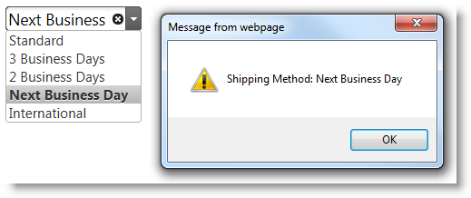

# \{environment:ProductNameMVC\} によるイベントの定義

##トピックの概要


#### 目的

このトピックでは、\{environment:ProductNameMVC\} を使用してクライアント側のイベント ハンドラーを定義する方法を説明します。このサンプルは `igCombo`™ の `selectionChanged` イベントを使用しますが、すべてのコンポーネントの \{environment:ProductNameMVC\} で同じ方法を使用できます (すべての Line of Bussiness の\{environment:ProductNameMVC\} コンポーネント)。

#### 前提条件

このトピックを理解するために、以下のトピックを参照することをお勧めします。


- [コントロールを MVC プロジェクトに追加](./00_Adding IgniteUI Controls to an MVC Project.mdx): このトピックでは、\{environment:ProductNameMVC\}® コンポーネントを使用して作業を開始する方法を説明します。

- [\{environment:ProductNameMVC\} でイベントの使用](/using-events-in-igniteui-for-jquery): このトピックは、\{environment:ProductNameMVC\} コントロールが発生させるイベントの処理方法について説明します。また、初期化と初期化後のイベントのバインドの違いについても説明します。


##イベント ハンドラーの定義 - 概要


### イベント ハンドラーの定義 - 概要

手順 1 はオプションで、基本 ASP.NET MVC ビューを作成します。既存の ASP.NET MVC ヘルパー実装を使用して、手順 2 から開始することもできます。ASP.NET MVC ヘルパーを構成した後に、イベント ロジックを処理するために「イベント ハンドラー」と呼ばれる関数を定義する必要があります。イベントをアタッチするには、`AddClientEvent` メソッドを使用します。最初のメソッド引数は、イベントのオプションの文字列名前です。第 2 の引数は、イベント ハンドラー関数の文字列名前です。

この方法は一般的なユース ケースに使用できますが、`AddClientEvent` メソッドの第 2 の引数も実行する JavaScript コードの文字列が可能で、スクリプト要素タグがない手順 2 の完全な JavaScript 関数を表現する文字列も可能です。

### 要件

前提要件は、Infragistics アセンブリによって構成された ASP.NET MVC アプリケーションです。

## 手順

以下は、\{environment:ProductNameMVC\} を使用してイベント ハンドラーを定義する手順の概要です。

1. \{environment:ProductNameMVC\} コントロールをインスタンス化します。

2. イベントを処理するための JavaScript 関数を定義します。

3. \{environment:ProductNameMVC\} でイベントを構成します。

##イベント ハンドラーの定義 - 手順

### 概要

この手順では、ASP.NET MVC ヘルパーを使用してイベント ハンドラーとして JavaScript 関数を構成する方法を説明します。この例では、`igCombo` の `selectionChanged` イベントを処理して、選択したテキストを含むメッセージを表示します。

### プレビュー

以下のスクリーンショットは最終結果のプレビューです。



### 前提条件

この手順を実行するには、以下のリソースが必要です。

-   必要な \{environment:ProductName\} リソースと構成された ASP.NET MVC アプリケーション
-   ビューを返すために構成されたコントローラーおよびアクション メソッド

### 概要

以下はプロセスの概念的概要です。

1. \{environment:ProductNameMVC\} コントロールをインスタンス化します。

2. イベントを処理するための JavaScript 関数を定義します。

3. \{environment:ProductNameMVC\} でイベントを構成します。

### 手順

以下の手順は、\{environment:ProductNameMVC\} `igCombo` を `selectionChanged` をクライアント側で処理するために構成する方法を紹介します。


1. \{environment:ProductNameMVC\} コントロールをインスタンス化します。

	イベントを既存の \{environment:ProductNameMVC\} の実装に追加する場合、手順 2 から開始してください。既存の \{environment:ProductNameMVC\} の実装がない場合、\{environment:ProductNameMVC\} *igCombo* を含むプロジェクトに以下のコードをコピーします。
	
	**ASPX の場合:**
	
```csharp
	<%@ Page Language="C#" Inherits="System.Web.Mvc.ViewPage<IEnumerable<ShipMethod>>" %>
	<%@ Import Namespace="Infragistics.Web.Mvc" %>
	<!DOCTYPE html>
	<html>
	<head>
	    <title></title>
	    <link href="<%= Url.Content("~/infragistics/css/themes/infragistics/infragistics.theme.css") %>" rel="stylesheet" />
	    <link href="<%= Url.Content("~/infragistics/css/structure/infragistics.css") %>" rel="stylesheet" />
	    <script src="<%= Url.Content("~/js/jquery.js") %>"></script>
	    <script src="<%= Url.Content("~/js/jquery-ui.js") %>"></script>
	    <script src="<%= Url.Content("~/js/modernizr.js") %>"></script>
	    <script src="<%= Url.Content("~/infragistics/js/infragistics.core.js") %>"></script>
	    <script src="<%= Url.Content("~/infragistics/js/infragistics.lob.js") %>"></script>
	</head>
	<body>
	    <%= Html.Infragistics().Combo()
	        .DataSource(Model)
	        .TextKey("DisplayText")
	        .ValueKey("Value")
	        .AddClientEvent("selectionChanged", "comboSelectionChanged")
	        .Render()
	    %>
	</body>
	</html>
```
	
	**C# の場合:**
	
```csharp
	using System.Collections.Generic;
	using System.Web.Mvc;
	public class HomeController : Controller
	{
	    public ActionResult Index()
	    {
	        List<ShipMethod> shipMethods = new List<ShipMethod>
	        {
	            new ShipMethod{DisplayText="Standard", Value=0},
	            new ShipMethod{DisplayText="3 Business Days", Value=1},
	            new ShipMethod{DisplayText="2 Business Days", Value=2},
	            new ShipMethod{DisplayText="Next Business Day", Value=3},
	            new ShipMethod{DisplayText="International", Value=4},
	        };
	        return View(shipMethods);
	    }
	}
```

2. イベントを処理するための JavaScript 関数を定義します。

	イベントを処理するための JavaScript 関数を定義し、規格の jQuery UI イベント引数を渡します。

	**ASPX の場合:**

```csharp
    <script>
        function comboSelectionChanged(e, ui) {
            alert("Shipping Method: " + ui.items[0].text);
        }
    </script>
```

3. \{environment:ProductNameMVC\} イベントを構成します。

	イベントが発生されたときに、JavaScript 関数を呼び出すために \{environment:ProductNameMVC\} を構成します。

	**ASPX の場合:**

```csharp
    <%= Html.Infragistics().Combo()
        .DataSource(Model)
        .TextKey("DisplayText")
        .ValueKey("Value")
        .AddClientEvent("selectionChanged", "comboSelectionChanged")
        .Render()
    %>
```

>**注:** *AddClientEvent* メソッドの最初のパラメーターで、イベントのオプション名前を jQuery イベント API のバインドで使用される文字列と変換しないでください。例: `on`、`delegate`、および `live`。`AddClientEvent` メソッドの引数に入力される文字列は、JavaScript で jQuery UI ウィジェットとインスタンス化するときにイベントを構成するために使用されるオプションの名前です。 

##関連コンテンツ

### トピック

以下のトピックでは、このトピックに関連する追加情報を提供しています。

- [\{environment:ProductName\} でイベントの使用](/using-events-in-igniteui-for-jquery): このトピックは、\{environment:ProductName\} コントロールが発生させるイベントの処理方法について説明します。また、初期化と初期化後のイベントのバインドの違いについても説明します。


 

 


