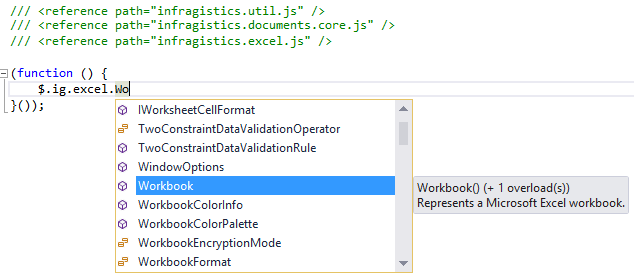
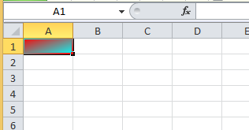

# JavaScript Excel ライブラリの概要

Excel ライブラリは JavaScript クライアント サイド ライブラリです。Microsoft Excel 文書を 2003 (.xls) 以降のファイル形式で読み込み、保存できます。このライブラリはデータの取得や設定をサポートし、また行、列、およびセルの各種フォーマット プロパティをサポートします。また、ライブラリはユーザーに対して以下のコントロールを可能にします。

-   セル スタイル
-   セルの結合
-   テーブル (並べ替えとフィルター処理が可能)
-   データ検証
-   数式の解決
-   名前付き参照
-   書式が混在するセル値
-   その他 ...

Excel ライブラリは、クライアント マシン上のワークブック ドキュメントにグリッドやテーブルをエクスポートするために使用でき、また Excel のドキュメントの読み取りやデータをブラウザに表示するために使用できます。ライブラリは Excel での計算と同様に、ブラウザで数式の解を得るために使用することもできます。その際にサーバーへの送信は行われません。

## 環境のセットアップ

Excel ライブラリを使用するには、\{environment:ProductName\} 製品から最低限必要な以下の各 JavaScript ファイルを参照する必要があります。

-   infragistics.util.js
-   infragistics.ext_core.js [17.1 で新規]
-   infragistics.ext_collections.js [17.1 で新規]
-   infragistics.ext_text.js [17.1 で新規]
-   infragistics.ext_io.js [17.1 で新規]
-   infragistics.ext_ui.js [17.1 で新規]
-   infragistics.documents.core_core.js [17.1 で新規]
-   infragistics.ext_collectionsextended.js [17.1 で新規]
-   infragistics.excel_core.js [17.1 で新規]

ワークシート オブジェクトを既存の Excel ファイルから読み込むか、デフォルトの Office Excel 2007 以後の XML ファイル形式で新しい Excel ファイルに保存する場合、以下のアセンブリも参照する必要があります。

-   infragistics.ext_threading.js [17.1 で新規]
-   infragistics.ext_web.js [17.1 で新規]
-   infragistics.xml.js [17.1 で新規]
-   infragistics.documents.core_openxml.js [17.1 で新規]
-   infragistics.excel_serialization_openxml.js [17.1 で新規]

また、Visual Studio での作業では、コーティング中により良いステートメント完了についてのサポートと記述を提供する、以下の IntelliSense アノテーション ファイルを含めることができます。

-   infragistics.documents.core_core.intellisense.js [17.1 で新規]
-   infragistics.excel_core.intellisense.js [17.1 で新規]
-   infragistics.excel_serialization_openxml.intellisense.js [17.1 で新規]

これらのリファレンスを含めた場合は、Excel ライブラリを使用して `.js` ファイルのコードの一番上に以下のコードを追加する必要があります。

**JavaScript の場合:**
```js
/// <reference path="infragistics.util.js" />
/// <reference path="infragistics.ext_core.js" />
/// <reference path="infragistics.ext_collections.js" />
/// <reference path="infragistics.ext_text.js" />
/// <reference path="infragistics.ext_io.js" />
/// <reference path="infragistics.ext_ui.js" />
/// <reference path="infragistics.documents.core_core.js" />
/// <reference path="infragistics.ext_collectionsextended.js" />
/// <reference path="infragistics.excel_core.js" />
/// <reference path="infragistics.ext_threading.js" />
/// <reference path="infragistics.ext_web.js" />
/// <reference path="infragistics.xml.js" />
/// <reference path="infragistics.documents.core_openxml.js" />
/// <reference path="infragistics.excel_serialization_openxml.js" />
```
このコードを追加すると、Excel ライブラリの型が `$.ig.excel` 名前空間に表示されるようになります。



このような IntelliSense を設定すると、各関数の呼出し方法や返却値などの重要な情報にアクセス可能になり、Excel ライブラリでの作業の生産性が大きく向上します。

## ワークブックの作成

フォーマット タイプをオプションで受け取るワークブック コンストラクターを使用して、新しいワークブック インスタンスを簡単に作成できます。

**JavaScript の場合:**
```js
 var workbook = new $.ig.excel.Workbook();
// workbook.currentFormat() === $.ig.excel.WorkbookFormat.excel97To2003
```
**JavaScript の場合:**
```js
var workbook = new $.ig.excel.Workbook($.ig.excel.WorkbookFormat.excel2007);
// Change the format to the ISO/IEC 29500 Strict Open XML format
workbook.setCurrentFormat($.ig.excel.WorkbookFormat.strictOpenXml);
```
このコードは指定された書式を使用せずにワークブックを作成しますが、デフォルトの Excel 97-2003 または .xls ファイル書式を使用します。ワークブックを別の書式で作成するには、コンストラクターに対して書式を指定、または実行時に `setCurrentFormat` 関数で書式を変更することができます。

ワークブックの書式は、ワークブックを保存する時に書き出すデータのタイプを制御し、実行時の各オブジェクトの容量や制限値も制御します。たとえば、 `excel97To2003` 書式または `excel97To2003Template` 書式を使用している場合、ワークシートが持つことができる領域は 65,536 行 ｘ 256 列に限定されますが、その他のすべての書式では、ワークシートは 1,048,576 行 ｘ 16,384 列の領域を持つことができます。

## ワークシートの追加

各ワークブックは、1 つ以上のワークシートを有効な状態にする必要があります。ただし、ワークブック インスタンスが最初に作成されると、ワークシートを持つことができません。新たに作成されたワークブックを保存する際に、エラーが発生します。ワークシートを追加するには、ワークブックのワークシート コレクションの add 関数を使用します。

>**注:** ワークシートの関数を、インスタンスの作成に直接使用することはできません。実際に、Excel ライブラリ内の複数のオブジェクトをコンストラクターにより作成することはできません。それらは独自のワークブックで管理し、作成を制御する必要があります。

**JavaScript の場合:**
```js
var workbook = new $.ig.excel.Workbook();
var worksheet = workbook.worksheets().add('Sheet1');
```
add 関数が文字列を受け取る方法に注意してください。作成するワークシートの名前、および新たに作成したワークシートのインスタンスを返します。Excel ライブラリ内の複数のコレクションは同一パターンに従いますが、add 関数はインスタンス化の作成に必要な情報を受け取り、新たに作成されたインスタンスを返します。

## セルへのデータの追加

ワークシートの作成後に実行する次の手順は、通常データの追加です。要求に応じて、読みやすさ重視のコードの使用または高速を重視したコードの使用のいくつかの方法があります。最も読みやすいコードを使用してデータをセルに追加するには、ワークシートの `getCell` 関数を使用してセル インスタンスへの参照を取得します。次に値を設定、または式を適用します。

**JavaScript の場合:**
```js
var workbook = new $.ig.excel.Workbook();
var worksheet = workbook.worksheets().add('Sheet1');
var cell = worksheet.getCell('A1');
cell.value(7.354);
cell = worksheet.getCell('R2C1', $.ig.excel.CellReferenceMode.r1C1);
cell.applyFormula('=A1*2');
var x = cell.value(); // x === 14.708
```
このコードは、いくつかの注意すべき点を示しています。最初に、A1 スタイルのセル アドレスで使用された `getCell` 関数を示しています。これは作成時のワークブックのデフォルトのセル参照モードで (セル参照モードは、ワークブックの `cellReferenceMode` 関数で取得または設定できます)、デフォルト設定では、`getCell` はワークブックのセル参照モードで参照文字列を解析し、セルを取得します。またこのコード例は、セル参照モードをオーバーライドできることを示しています。代わりに R1C1 モードを使用して参照を解析します。また、`getCell` 関数はセルを参照する名前付き参照の名前を受け入れることもできます。参照文字列が 'R[-3]C' のようなオフセット付きの相対的な参照を表す場合、セルはオプションで他のセル インスタンスを元のセルとして受け入れることができます。

このコードは、セル インスタンスの取得に加え、値の関数でセルの値を設定する方法も示しています。この関数は、ブール値、番号、文字列、日付 (**注**: 現時点で日付は CTP で完全にサポートされていないため、日付のセルへの設定や日付を セルの値とした ワークブックの読出し/保存で例外が発生する可能性があります)、エラー リテラルを示す `ErrorValue` インスタンス、および複数の書式を持つテキストを示す `FormattedString` インスタンスを指定することができます。またコードの末尾に示すように、値の関数を引数なしで指定し、セルの値を取得することができます。読み書きのエンティティを表す Excel ライブラリ内の多くの関数は、以下のパターンに従っています。関数は引数が提供された場合に値を設定します。関数が引数なしで呼び出された場合は値を読み出します。

またこのコード例は、`applyFormula` 関数でセルに式を設定する方法を示します。この関数は、ワークブックで現在使用されているセル参照モードの内で、式の文字列を受け入れます (デフォルトは、A1)。またこのコードでは、式を持つセルの値を取得することにより、式の計算済の値を直ちに取得できることを示しています。

前述したように、非常に読みやすいコードは、何千ものセルの値の設定が必要なループがあるために処理が遅くなります。各セルのアクセスには、アドレス文字列の解析が必要です。また、セルは実際には行が保有しているため、同じ行で複数のセルの値を設定するには、同じ行をアドレスから繰り返し検索する必要があります。一方、行のインスタンスはキャッシュすることができ、行の各セルにより高速でアクセスできます。

**JavaScript の場合:**
```js
var workbook = new $.ig.excel.Workbook();
var worksheet = workbook.worksheets().add('Sheet1');
for (var rIndex = 0; rIndex < 100; rIndex++) {
    var row = worksheet.rows(rIndex);
    for (var cIndex = 0; cIndex < 32; cIndex++) {
        var cell = row.cells(cIndex);
        cell.value('Row :' + (rIndex + 1) + ', Column :' + (cIndex + 1));
    }
}
```
このコード例は、Excel ライブラリに関するいくつかの重要な概念を示します。第一に、行と列は最初に要求されると大まかに割り当てられます (*各セルは要求されるたびに、常に再割当てされます。詳細は後述します*)。各行のインスタンスは、最初のアクセスで自動的に作成され追加されるため、このコードはワークシートにインスタンスを作成も追加もせずに最初の 100 行を要求します。ここで紹介するその他の重要な概念は、combination collection 関数と indexer 関数の使用についてです。コレクションを取得してアクセスする一つの方法は、get accessor 関数を使用してコレクションを取得し、次にコレクションの item 関数でインデックスを挿入しますが、これは非常に冗長な作業です。

**JavaScript の場合:**
```js
var cell = workbook.worksheets().item('Sheet1').rows().item(0).cells().item(1);
```
したがって、コレクションが読取り専用の場合は、通常コレクションを返却する関数によりコレクションから取得するエレメントを示す引数をオプションで代わりに受け取ることができます。combination collection 関数と indexer 関数を使用すると、前述のプログラム行を以下のように短くすることができます。

**JavaScript の場合:**
```js
var cell = workbook.worksheets('Sheet1').rows(0).cells(1);
```
前述の長いコードも使用することができますが、新しいコードの方か明らかに簡潔になっています。

3,200 (100 行 x 32 列) のセルに値を設定する前述のコードは、Excel に表示される実際のセル アドレスが記述されないため、元のコードよりも若干読みやすさが低減します。しかし、各行が読み出されるのは一度のみでアドレスの解析が不要なため、文字列のアドレスですべてのセルにアクセスする同様のコードよりも、このコードは実行速度がより速くなります。コードの実行速度を、ここに示した最適化以上に高速にすることができます。セル インスタンスはデータを保存しないため、内部でも保持されません。各行のインスタンスは、論理的なセルのすべてのデータと書式情報を実際に保存します。これにより、ワークブックによるオブジェクト階層のルートによってメモリーに保持するインスタンスが少なくなるため、Excel ライブラリではメモリーが大幅に節約されます。しかし、Excel ライブラリーはセルをエンティティとして作業可能にする API の公開も、その目的としています。したがって、前述の 2 つのメカニズムのいずれかでセルが要求された場合は、セルを表すために過渡的なセル インスタンスが返されます。コードでセルが参照されなくなると、ガーベッジ コレクションで解放されます。行は実際にセルのデータを保有しているため、セル インスタンスはアクセス時に関連する行から情報を取得し、設定されます。しかし、セル インスタンスは実際には行の周りのラッパーで、ほとんどの場合作成する必要がないことに注意してください。特定の列インデックスでセルに関する情報を所得し設定するために、行を公開する複数の関数があります。以下は、前述のコードを変更し、セル インスタンスを使用しないようにしています。

**JavaScript の場合:**
```js
var workbook = new $.ig.excel.Workbook();
var worksheet = workbook.worksheets().add('Sheet1');
for (var rIndex = 0; rIndex < 100; rIndex++) {
    var row = worksheet.rows(rIndex);
    for (var cIndex = 0; cIndex < 32; cIndex++) {
        row.setCellValue(cIndex, 'Row :' + (rIndex + 1) + ', Column :' + (cIndex + 1));
    }
}
```
この変更の結果、セルの値を設定するには前述の例より若干読みにくくなりますが、3,200 個のセル インスタンスが作成されないためメモリーの負荷が大きく低減します。このアプローチは高いパフォーマンスを発揮します。

### セルの書式設定

セルの書式を変更するには、以下のように、`cellFormat` 関数でセルからフォーマット インスタンスを取得し、書式設定の値を設定します。

**JavaScript の場合:**
```js
var workbook = new $.ig.excel.Workbook();
var worksheet = workbook.worksheets().add('Sheet1');
var format = worksheet.getCell("A1").cellFormat();
format.fill($.ig.excel.CellFill.createLinearGradientFill(45, '#FF0000', '#00FFFF'));
Or as described above, if you have a performance-critical area of code, you can bypass the address parsing and cell object creation by going through the row directly:
var workbook = new $.ig.excel.Workbook();
var worksheet = workbook.worksheets().add('Sheet1');
var format = worksheet.rows(0).getCellFormat(0);
format.fill($.ig.excel.CellFill.createLinearGradientFill(45, '#FF0000', '#00FFFF'));
```
これら 2 つのコードのいずれかを使用してワークブックを作成します。Microsoft の Excel で保存したワークブックを開くと、以下のようになります。



フォーマット オブジェクトを使用すると、セルの外観の変更やテキストの表示に使用するフォントを変更できます。プロパティと関係があるすべてのフォントは、フォーマットの font 関数で返されるフォント サブオブジェクトで公開されます。以下のコードは、セル、行、または列で設定可能な各種の書式とフォントのプロパティを示します。

**JavaScript の場合:**
```js
var workbook = new $.ig.excel.Workbook();
var worksheet = workbook.worksheets().add('Sheet1');
var format = worksheet.getCell("A1").cellFormat();
format.alignment($.ig.excel.HorizontalCellAlignment.center);
format.bottomBorderColorInfo(new $.ig.excel.WorkbookColorInfo('#FF0000'));
format.bottomBorderStyle($.ig.excel.CellBorderLineStyle.dotted);
format.indent(1);
format.fill($.ig.excel.CellFill.createLinearGradientFill(45, '#FF0000', '#00FFFF'));
format.formatString("0.00%");
format.locked($.ig.excel.ExcelDefaultableBoolean.true);
format.rotation(45);
format.shrinkToFit($.ig.excel.ExcelDefaultableBoolean.false);
format.style(workbook.styles('Bad'));
format.verticalAlignment($.ig.excel.VerticalCellAlignment.top);
format.wrapText($.ig.excel.ExcelDefaultableBoolean.true);
format.font().bold($.ig.excel.ExcelDefaultableBoolean.true);
format.font().colorInfo(new $.ig.excel.WorkbookColorInfo('#0000FF'));
format.font().height(440);
format.font().italic($.ig.excel.ExcelDefaultableBoolean.true);
format.font().name('Consolas');
format.font().strikeout($.ig.excel.ExcelDefaultableBoolean.true);
format.font().superscriptSubscriptStyle($.ig.excel.FontSuperscriptSubscriptStyle.subscript);
format.font().underlineStyle($.ig.excel.FontUnderlineStyle.single);
```
>**注:**: JavaScript の Excel ライブラリは、各種のプラットフォームで提供される Infragistics C# Excel ライブラリから移植されています。コードの作成時に追加のデフォルト値でブール値を表現するには列挙型、ここでは `ExcelDefaultableBoolean` と呼ばれる列挙型が必要です。現在、新しいバージョンの C# では、`ExcelDefaultableBoolean` の必要性がない null 可能なブール値を使用できますが、列挙型ではなく null 可能なブール値を使用すると、予期せぬ重大な変更が実行される場合があります。移植のプロセスで、列挙は JavaScript では不必要であるにもかかわらず、列挙がフォントの太字などの関数として渡され、true、false、または null を受け取ることができます。しかし、CTP に対して安全な変更を実装するには時間が十分ではありませんでした。RTM 版の JavaScript Excel ライブラリの場合、変更されると `ExcelDefaultableBoolean` はもはや存在しません。

>**注**: 今回の リリースで、`WorkbookColorInfo` インスタンスが必要な色を渡す能力についても、CTP への変更が実現しませんでした。`WorkbookColorInfo` インスタンスは、アクセント カラーと淡い色付けができますが、多くの場合、通常の RGB 色が指定され微妙な淡い色付けが表現できません。これらの場合は色の文字列で十分であり、それは `WorkbookColorInfo` インスタンスに自動的にラップされます。これは RTM に対して行われますが、CTP の場合、`WorkbookColorInfo` を受け入れるすべての場所で、前述のコードに示したように、手動で渡される 1 の値を持つ必要があります。

また以下のように、書式が混在するセル値を作成することもできます。

**JavaScript の場合:**
```js
var workbook = new $.ig.excel.Workbook();
var worksheet = workbook.worksheets().add('Sheet1');
var formattedString = new $.ig.excel.FormattedString('This text is bold and italic');
// Apply the value first before changing format values since 
// formats are shared internally on the workbook
worksheet.getCell("A1").value(formattedString);
var font = formattedString.getFont(13, 4);
font.bold($.ig.excel.ExcelDefaultableBoolean.true);
font = formattedString.getFont(22);
font.italic($.ig.excel.ExcelDefaultableBoolean.true);
```
このコードは作成した `FormattedString` インスタンスをセルに設定し、次にテキストの特定の範囲にフォントの書式を適用します。`getFont` 関数はフォントを返し、開始のインデックスとオプションの長さパラメータに基づいた特定の範囲にそれらのフォントを適用します。長さが指定されていない場合、返却されたフォントが、開始インデックスから文字列の終りまでをコントロールします。これらのフォント オブジェクトは、セル書式の font 関数で示されたフォント サブオブジェクトと同じです。一般的なフォントの情報はワークブックの内部で共有されます。スタンドアローンの `FormattedString` インスタンスはフォント情報を共有するワークブックを持たないため、書式化を適用する前に `FormattedString` をセルで設定する必要があることに注意してください。このコードは、以下に示すMicrosoft の Excel で保存し開いた状態のワークブックを作成します。


### ワークブックの保存

ワークブックを保存する場合は、ワークブックのインスタンスで公開された save 関数を使用するだけです。

**JavaScript の場合:**
```js
var workbook = new $.ig.excel.Workbook();
var worksheet = workbook.worksheets().add('Sheet1');
worksheet.getCell("A1").value(1.5);
workbook.save(function (err, data) {
        
});
```
この関数は 1 つの callback 関数を受け取り、保存時または最終データの保存時に発生したエラーを渡します。このデータは、保存したバイト数を含む Uint8Array タイプで、Microsoft Excel はその表記を認識します。保存されたデータはダウンロードの準備のためにサーバーに返送される、またはBase64 のエンコード文字列に変換され保存されます。

>**注:**: 現在、save オペレーションと callback は同期して発生しますが、将来的に非同期保存の追加とサポートにより、変更される可能性があります。

>**注:** ユーザーが保存済のワークブックをブラウザから (サーバーに戻らずに) 直接ダウンロード可能にする save 関数の結果の使用方法の詳細は、****JavaScript Excel ライブラリの使用** のトピックを参照してください。

### ワークブックのロード

ワークブックをロードするには、Workbook コンストラクターを使用しません。Workbook には代わりに、新しくロードされたワークブック インスタンスを作成し戻す、Unit8Array または Base64 のエンコード文字列からワークブックをロードする関数があります。

**JavaScript の場合:**
```js
$.ig.excel.Workbook.load(data, function (err, workbook) {
});
```
save メソッドと同様に、callback 関数はロード時に発生したエラーを渡す、または新たにロードされたワークブックのインスタンスを渡します。

>**注:**: 現在、load オペレーションと callback は同期的に発生しますが、将来的に非同期のロードの追加とサポートにより、変更される可能性があります。

ロード後、前述したように、ワークシートやセルのデータにアクセスできます。

### セルからのデータの取得

ワークシートにアクセスする場合、前述の combination collection 関数と indexer 関数を使用して、ワークブックのワークシート コレクションにインデックスを挿入することができます。ワークシートの 0 ベースのインデックスを、コレクションまたはその名前に指定できます。インデックスは、ワークシートをループする際に使用します。

**JavaScript の場合:**
```js
$.ig.excel.Workbook.load(data, function (err, workbook) {
    // (Error checking logic)
    for (var i = 0; i < workbook.worksheets().count(); i++) {
        var worksheet = workbook.worksheets(i);
        // ...
    }
});
```
ただし、ユーザーが特定のワークシートの名前 (大文字と小文字を区別) を知っている場合、ユーザーは名前でワークシートを取得できます。

**JavaScript の場合:**
```js
$.ig.excel.Workbook.load(data, function (err, workbook) {
    // (Error checking logic)
    var worksheet = workbook.worksheets('Sheet1');
});
```
ワークシートへの参照を一度取得すると、ユーザーはセル インスタンスを取得し、その値の関数を (設定ではなく、値を読み出す) 引数を指定せずに呼び出してセルの値を取得できます。

**JavaScript の場合:**
```js
$.ig.excel.Workbook.load(data, function (err, workbook) {
    // (Error checking logic)
    var worksheet = workbook.worksheets('Sheet1');
    var value = worksheet.getCell('A1').value();
});
```
別の方法として、コードのパフォーマンスが重要な領域でセルの値を取得する必要がある場合、ユーザーは前述したように、行に直接示された関数を使用して、アドレスの解析とセル インスタンスの作成をバイパスすることができます。

**JavaScript の場合:**
```js
$.ig.excel.Workbook.load(data, function (err, workbook) {
    // (Error checking logic)
    var worksheet = workbook.worksheets('Sheet1');
    var value = worksheet.rows(0).getCellValue(0);
});
```
セルの値を取得する他に、Microsoft Excel で値の表示に使用する表示テキストを取得することも可能です。

**JavaScript の場合:**
```js
var workbook = new $.ig.excel.Workbook();
var worksheet = workbook.worksheets().add('Sheet1');
var cell = worksheet.getCell('A1');
cell.cellFormat().formatString('0.00%');
cell.value(5.12638);
var text = cell.getText(); // text === '512.64%'
```
このコードは、セル インスタンスで `getText` 関数を使用して、表示で書式化された通りの値を取得します。また別な方法として、行のインスタンスで `getCellText` 関数を使用し、セル インスタンスを経由せずにテキストを取得することもできます。
                    
