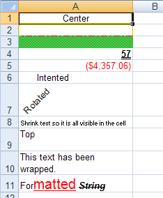

---
title: "スタイルをセルに適用"
slug: javascript-excel-library-applying-styles-to-cells
---

# スタイルをセルに適用

## 始める前に
スタイルをセルに適用する機能は、JavaScript Excel でワークシートをカスタマイズする方法の 1 つです。セルのあらゆる特性はカスタマイズ可能で、各セルに異なる表示方法を設定できます。セルで使用するフォント、セルの背景と境界線、およびテキストの配置と回転を制御できます。同じセル内の異なるテキスト部分に異なる書式設定を使用することもできます。

ほとんどのスタイルは、[`WorksheetCell`](&#123;environment:jQueryApiUrl&#125;/ig.excel.WorksheetCell)、[`WorksheetRow`](&#123;environment:jQueryApiUrl&#125;/ig.excel.WorksheetRow)、[`WorksheetColumn`](&#123;environment:jQueryApiUrl&#125;/ig.excel.WorksheetColumn)、および [`WorksheetMergedCellsRegion`](&#123;environment:jQueryApiUrl&#125;/ig.excel.WorksheetMergedCellsRegion) の `cellFormat` プロパティでプロパティを設定し、適用できます。

## 達成すること
この詳細なガイドでは、ワークシートのセルにさまざまなスタイルを適用する方法を示します。

## 次の手順を実行します
1.  **1 つのワークシートを含むワークブックを作成します。**
    1.  HTML ページを作成します。
    2.  ボタンを追加します。
    3.  そのボタンのクリック イベントの機能を作成します。
    4.  1 つのワークシートを含むワークブックを作成します。

        **JavaScript の場合:**

```js
		var workbook = new $.ig.excel.Workbook();
		var worksheet = workbook.worksheets().add("Sheet1");
```

    5.  セルのすべてのテキストが表示されるように、最初の列の幅を変更します。

        **JavaScript の場合:**

```js
		worksheet.columns(0).width(6000);
```

2.  **スタイルをセルに適用します。**
    1.  セルの水平方向の配置を変更し、値をセルの中央揃えにします。

        **JavaScript の場合:**

```js
        worksheet.rows(0).cells(0).value("Center");
		worksheet.rows(0].cells(0).cellFormat().alignment($.ig.excel.HorizontalCellAlignment.center);
```

    2.  セルに異なる境界線スタイルと色を指定して、他のセルと区別します。

        **JavaScript の場合:**

```js
        worksheet.rows(1).cells(0).cellFormat().bottomBorderColor(new $.ig.excel.WorkbookColorInfo("red"));
		worksheet.rows(1).cells(0).cellFormat().bottomBorderStyle($.ig.excel.CellBorderLineStyle.dashDot);
		worksheet.rows(1).cells(0).cellFormat().leftBorderColor(new $.ig.excel.WorkbookColorInfo("yellow"));
		worksheet.rows(1).cells(0).cellFormat().leftBorderStyle($.ig.excel.CellBorderLineStyle.thick);
		worksheet.rows(1).cells(0).cellFormat().rightBorderColor(new $.ig.excel.WorkbookColorInfo("orange"));
		worksheet.rows(1).cells(0).cellFormat().rightBorderStyle($.ig.excel.CellBorderLineStyle.thin);
		worksheet.rows(1).cells(0).cellFormat().topBorderColor(new $.ig.excel.WorkbookColorInfo("blue"));
		worksheet.rows(1).cells(0).cellFormat().topBorderStyle($.ig.excel.CellBorderLineStyle.double);
```

    3.  背景のスタイルをセルに適用して、強調します。

        **JavaScript の場合:**

```js
		worksheet.rows(2).cells(0).cellFormat().fill($.ig.excel.CellFill.createPatternFill("lime", "gray", $.ig.excel.FillPatternStyle.diagonalCrosshatch);
```

    4.  値が異なって表示されるように、セルのフォントを変更します。

        **JavaScript の場合:**

```js
		worksheet.rows(3).cells(0).value(57);
		worksheet.rows(3).cells(0).cellFormat().font().bold(true);
		worksheet.rows(3).cells(0).cellFormat().font().underlineStyle($.ig.excel.FontUnderlineStyle.double);
```

    5.  表示される値のタイプを認識しやすくするために、フォーマット文字列をセルに適用します（以下のセルは通貨を表示するために使用されます）。

        **JavaScript の場合:**

```js
		worksheet.rows(4).cells(0).value(-4357.059);
		worksheet.rows(4).cells(0).cellFormat().formatString("\"$\"#,##0.00_);[Red](\"$\"#,##0.00)");
```

    6.  セルでテキストをインデントします。

        **JavaScript の場合:**

```js
        worksheet.rows(5).cells(0).value("Intented");
		worksheet.rows(5).cells(0).cellFormat().indent(2);
```

    7.  セルでテキストを回転します。

        **JavaScript の場合:**

```js
        worksheet.rows(6).cells(0).value("Rotated");
		worksheet.rows(6).cells(0].cellFormat().rotation(45);
```

    8.  セルに収まるようにテキストを縮小します。

        **JavaScript の場合:**

```js
		worksheet.rows(7).cells(0).value("Shrink text so it is all visible in the cell");
		worksheet.rows(7).cells(0).cellFormat().ShrinkToFit(true);
```

    9.  セルにデフォルトの高さがない場合に値がセルの上部に表示されるように、セルの垂直方向の配置を変更します。

        **JavaScript の場合:**

```js
		worksheet.rows(8).height(500);
		worksheet.rows(8).cells(0).value("Top");
		worksheet.rows(8).cells(0).cellFormat().verticalAlignment($.ig.excel.VerticalCellAlignment.top);
```

    10. セル内のテキストが次のセルにはみ出したり、途中で切れないように折り返します。

        **JavaScript の場合:**

```js
		worksheet.rows(9).cells(0).value("This text has been wrapped.");
		worksheet.rows(9).cells(0).cellFormat().wrapText(true);
```

    11. FormattedString オブジェクトを使用して、セル内のテキストに複数のフォーマットを適用します。

        **JavaScript の場合:**

```js
		var formattedString = new $.ig.excel.FormattedString( "Formatted String" );
		worksheet.rows(10).cells(0).value(formattedString);
		
		var font1 = formattedString.getFont( 3, 6 );
		font1.color(new $.ig.excel.WorkbookColorInfo("red"));
		font1.underlineStyle($.ig.excel.FontUnderlineStyle.single);
		font1.height(300);
		
		var font2 = formattedString.getFont( 10 );
		font2.bold(true); 
		font2.italic(true);
		font2.strikeout(true);
```

3.  **ワークブックをシリアル化します。**

    ワークブックを保存します。

    **JavaScript の場合:**

```js
	workbook.save(function(data) { 
	  },
	  function(error) {
	  });
```




 

 


