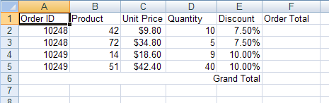
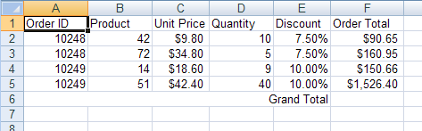
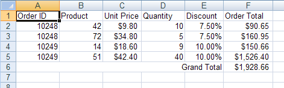

---
title: "注文合計を計算"
slug: javascript-excel-library-calculating-order-totals
---

# 注文合計を計算

## 始める前に
Microsoft® Excel® ワークブックで頻繁に使用するのは、1 列または 1 行の数値データを格納し、新しいセルにこれらの合計値を計算するタスクです。この合計の良い点は、いずれかの数値を変更すると合計が自動的に更新されることです。セルの値として数式を適用することにより、ワークシートに合計セルを作成できます。

## 達成すること
このトピックでは、データの合計を含むセルをワークシートに作成する方法を学習します。

## 次の手順を実行します
1.  **ワークシートを使用してワークブックを作成します。**
    1.  HTML ページを作成します。
    2.  ボタンを追加します。
    3.  そのボタンのクリック イベントの機能を作成します。
    4.  ひとつのワークシートを使用してワークブックを作成します。

        **JavaScript の場合:**

```js
		var workbook = new $.ig.excel.Workbook();
		var worksheet = workbook.worksheets().add("Sheet1");
```

2.  **ワークシート データの列を定義します。**
    1.  データを簡単に識別できるように列ヘッダーを作成します。

        **JavaScript の場合:**

```js
		var headersRow = worksheet.rows(0);
		headersRow.cells(0).value("Order ID");
		headersRow.cells(1).value("Product");
		headersRow.cells(2).value("Unit Price");
		headersRow.cells(3).value("Quantity");
		headersRow.cells(4).value("Discount");
		headersRow.cells(5).value("Order Total");
```

    2.  特別なフォーマットを必要とする任意の列に特別なフォーマットを設定します。

        **JavaScript の場合:**

```js
        // The "Unit Price" column should display its values as dollars
		worksheet.columns(2).cellFormat.formatString("\"$\"#,##0.00_);(\"$\"#,##0.00)");
		
		// The "Discount" column should display its values as percentages
		worksheet.columns(4).cellFormat.formatString("0.00%");
		
		// The "Order Total" column should display its values as dollars
		worksheet.columns(5).cellFormat.formatString("\"$\"#,##0.00_);(\"$\"#,##0;00)");
		// Allow enough room to display the totals
		worksheet.columns(5).width(3000);
```

3.  **セルにデータを格納します。**
    1.  セルにデータを格納します（合計を含むセルではありません。これらは後で数式で計算されます）。

        **JavaScript の場合:**

```js
		var currentRow = worksheet.rows(1);
		currentRow.cells(0).value(10248);
		currentRow.cells(1).value(42);
		currentRow.cells(2).value(9.80);
		currentRow.cells(3).value(10);
		currentRow.cells(4).value(0.075);
		
		currentRow = worksheet.rows(2);
		currentRow.cells(0).value(10248);
		currentRow.cells(1).value(72);
		currentRow.cells(2).value(34.80);
		currentRow.cells(3).value(5);
		currentRow.cells(4).value(0.075);
		
		currentRow = worksheet.rows(3);
		currentRow.cells(0).value(10249);
		currentRow.cells(1).value(14);
		currentRow.cells(2).value(18.60);
		currentRow.cells(3).value(9);
		currentRow.cells(4).value(0.1);
		
		currentRow = worksheet.rows(4);
		currentRow.cells(0).value(10249);
		currentRow.cells(1).value(51);
		currentRow.cells(2).value(42.40);
		currentRow.cells(3).value(40);
		currentRow.cells(4).value(0.1);
```

4.  **データの下に Grand Total のラベルを作成します。**
    1.  マージしたセルを作成し、データを更新して、ラベルを適用します。

        **JavaScript の場合:**

```js
		var mergedCell = worksheet.mergedCellsRegions().add( 5, 0, 5, 4 );
		mergedCell.value("Grand Total");
```

    2.  Grand Total セルが配置される近くにラベルが表示されるように、テキストの配置を調整します。

        **JavaScript の場合:**

```js
		mergedCell.cellFormat().alignment($.ig.excel.HorizontalCellAlignment.right);
```

	

5.  **各注文記録の小計を計算するために数式を適用します。**
    1.  注文合計を計算する数式を作成します。数式は、次のように単価に数量を掛けて、合計から値引きを引きます。 =[UnitPrice]*[Quantity]*(1-[Discount])。最初の発注の注文合計を計算するように、数式を作成します（セル F2 の合計）。ただし、相対的なセルの参照を使用して数式は作成されます。したがって、その他の発注合計セルに適用されると、セル参照は正しく下に移動します。

        **JavaScript の場合:**

```js
		var orderTotalFormula = $.ig.excel.Formula.parse("=C2*D2*(1-E2)", $.ig.excel.CellReferenceMode.a1);
```

    2.  数式が適用されるセルを定義するセル領域を作成します。

        **JavaScript の場合:**

```js
		var region = new $.ig.excel.WorksheetRegion(worksheet, 1, 5, 4, 5);
```

    3.  注文合計セルの領域に数式を適用します。

        **JavaScript の場合:**

```js
        orderTotalFormula.applyTo( region );
```

	

6.  **総計を決定するために数式を適用します。**
    1.  総計を出すためにすべての「Order Total」セルを合計する数式を作成します。この数式は、ドル記号（$）を行および列の識別子の前に置くことで絶対参照を使用しますが、相対参照も同様に使用できます。

        **JavaScript の場合:**

```js
		var grandTotalFormula = $.ig.excel.Formula.parse("=SUM($F$2:$F$5)", $.ig.excel.CellReferenceMode.a1);
```

    2.  数式を総計セルに適用します。

        **JavaScript の場合:**

```js
        grandTotalFormula.applyTo(worksheet.rows(5).cells(5));
```

	

7.  **ワークブックを保存します。**

    ワークブックを保存します。

    **JavaScript の場合:**

```js
	workbook.save(function(data) { 
	  },
	  function(error) {
	  });
```
