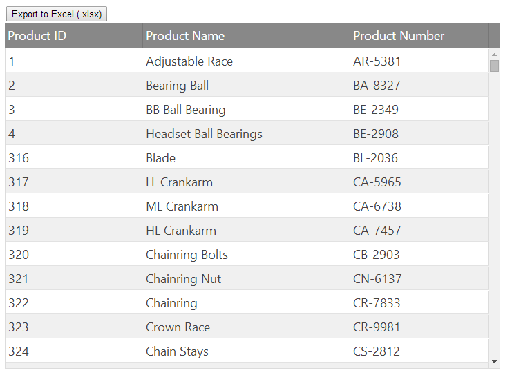
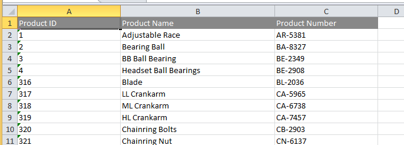

---
title: "Infragistics JavaScript Excel ライブラリの使用"
slug: using-the-javascript-excel-library
---

#Infragistics JavaScript Excel ライブラリの使用

このセクションには、Infragistics JavaScript Excel ライブラリの使用に関するトピックが含まれています。

このトピックは、新しい JavaScript Excel ライブラリを使用して、&#123;environment:ProductName&#125; `igGrid` のコンテンツを Excel ワークブックにエクスポートする方法を紹介します。Infragistics JavaScript Excel ライブラリが強力であることを理解することができます。

## 初期設定 

以下のトピックでは、次のコードを使用してローダーのウィジェットで設定される `igGrid` を使用します。

**JavaScript の場合:**
```js
$.ig.loader({
    scriptPath: "js/",
    cssPath: "http://cdn-na.infragistics.com/igniteui/&#123;environment:ProductVersion&#125;/latest/css/",
    resources: "igGrid.Summaries"
});
```
ここでは、js フォルダーから JavaScript ファイル、Infragistics CDN から &#123;environment:ProductName&#125; スタイルをそれぞれ読み込み、グリッドの集計機能を読み込むようにローダーを構成します。

スクリプトが読み込まれると、次のコードに示すように、グリッドが作成されます。

**JavaScript の場合:**

```js
$.ig.loader(function () {
    $("#grid1").igGrid({
        autoGenerateColumns: false,
        autoCommit: true,
        columns: [
            {
                headerText: "Product ID", key: "ProductID",
                dataType: "number", width: "200px"
            },
            {
                headerText: "Product Name", key: "Name",
                dataType: "string", width: "300px"
            },
            {
                headerText: "Product Number", key: "ProductNumber",
                dataType: "string", width: "200px"
            }
        ],
        primaryKey: "ProductID",
        dataSource: adventureWorks,
        height: "500px"
    });
});
```
>**注: **`adventureWorks` データ ソースは、JavaScript 配列としての [Adventure Works データベース](http://msftdbprodsamples.codeplex.com/)の抜粋で、下記にリンクされた関連サンプルで使用できます。

HTML の本文は以下のようになります。

**HTML の場合:**
```html
<body>
    <button id="export" onclick="exportWorkbook()">Export to Excel (.xlsx)</button>
    <a id="link" download="grid.xlsx"></a>
    <table id="grid1"></table>
</body>
```
この文書の本文はボタンですが、このボタンをクリックと、`exportWorkbook` 関数が呼び出されます。このトピックでは、グリッド データを Excel ワークブックにエクスポートするために、この関数を構築する方法を紹介します。前述した初期化コードにより `igGrid` が配置されるテーブルは、関連サンプルにもあります。

>**注:** このトピックでは、ボタンの onclick イベント ハンドラーは説明の目的でのみ使用しています。サンプル コードでは、クリック イベントの処理に jQuery を使用します。

この初期設定では、次のようなページが表示されます。



## ワークブックとワークシートの作成

Excel ワークブックへのエクスポート処理の最初のステップでは、ワークブックのインスタンスを作成します。次のようにワークブックのコンストラクター関数を呼び出します。

**JavaScript の場合:**

```js
var workbook = new $.ig.excel.Workbook($.ig.excel.WorkbookFormat.excel2007);
```
最終的にワークブックを 2007 (.xlsx) ファイル形式で保存するために、ここで形式を指定します。次に、エクスポートされたデータを保持するワークシートを追加します。ワークブックとは異なり、ワークシートの作成にはワークシートのコンストラクター関数は使用しません。ワークシートが追加されると、ワークシートの作成はワークブックにより管理されます。コードの指定が必要なのは、新しいワークシートの名前のみです。

**JavaScript の場合:**
```js
var worksheet = workbook.worksheets().add('Sheet1');
```
このコードは、「Sheet1」という名前のワークシートをワークシートの集合に追加し、add 関数から新しく作成されたワークシートのインスタンスに返された参照を取得します。

## ヘッダーのエクスポート

`igGrid` では、ヘッダーとデータは、それぞれ異なるセクションに割り当てますが、ワークシートでは、ヘッダーとデータは、セルの同じ領域に存在する必要があります。そのため、グリッドをエクスポートするコードにより、現在の行インデックスを追跡する必要があります。このインデックスにより、ヘッダーとデータが重ならないように、セルが確実にエクスポートされます。行、列、セルの概念は、グリッドと Excel ワークシートの両方に存在するため、このコードでは、これらのあいまいな Excel 関連エンティティに、たとえば「xl」などのプレフィックスを付加する規則を採用しています。

**JavaScript の場合:**
```js
var xlRowIndex = 0;
```
行インデックスは、Excel ライブラリの 0 ベースであるため、このコードは、ワークシートの最初の行がエクスポートで次に使用可能な行であることを示しています。

次に、グリッドのヘッダーを表すセルのテーブルへの参照を取得し、そのテーブル内の行を繰り返す必要があります。

**JavaScript の場合:**
```js
var headersTable = $("#grid1").igGrid("headersTable")[0];
for (var headerRowIndex = 0;
    headerRowIndex < headersTable.rows.length;
    headerRowIndex++, xlRowIndex++) {
    var headerRow = headersTable.rows[headerRowIndex];
    // TODO: Export the header row
}
```
ループのインクレメント部分が `headerRowIndex` と `xlRowIndex` の両方をどのようにインクレメントするかに注意してください。これにより、各ヘッダー行をエクスポートするたびに、コードは次のヘッダー行と次のワークシート行に移動します。この例では、ヘッダー行は 1 つのみであるため、このループの内部は 1 回のみ実行されます。ただし、`xlRowIndex` の値は次のワークシート行を指した状態です。

ループ本体の各ヘッダー行をエクスポートするには、最初にワークシート内の関連付けられた行への参照を取得する必要があります。

**JavaScript の場合:**
```js
var xlHeaderRow = worksheet.rows(xlRowIndex);
```
行は初めて要求されたときに遅延作成されるため、行を作成しワークシートに追加する必要はありません。行は、要求するのみで作成されます。

その後、ヘッダー行に適用された書式設定を上書きすることができます。この場合、エクスポートが必要なのはフォントの色のみです。次のように設定します。

**JavaScript の場合:**
```js
var computedStyle = window.getComputedStyle(headerRow);
var xlColorInfo = new $.ig.excel.WorkbookColorInfo(computedStyle.color);
xlHeaderRow.cellFormat().font().colorInfo(xlColorInfo);
```
このコードは、ブラウザーのヘッダー行用に算出された前景色を取得し、それを使用してフォントの色を設定します。その場合、最初にこの前景色が `WorkbookColorInfo` のインスタンスでラップされます。Excel のフォントの色やその他の色は単なる RGB だけではなく、テーマ化された色や濃淡など、より複雑な色情報をサポートします。この色情報は、`WorkbookColorInfo` のインスタンスで表現します。

ワークシートでヘッダー行を初期化した後、その行の各ヘッダー セルをエクスポートします。

**JavaScript の場合:**
```js
for (var headerCellIndex = 0;
    headerCellIndex < headerRow.cells.length;
    headerCellIndex++) {
    var headerCell = headerRow.cells[headerCellIndex];
            
    worksheet.columns(headerCellIndex).setWidth(
        headerCell.offsetWidth, $.ig.excel.WorksheetColumnWidthUnit.pixel);
    var xlHeaderCell = xlHeaderRow.cells(headerCellIndex);
    var computedStyle = window.getComputedStyle(headerCell);
    xlHeaderCell.cellFormat().fill(
        $.ig.excel.CellFill.createSolidFill(computedStyle.backgroundColor));
    xlHeaderCell.value($(headerCell).text());
}
```
ここでは、同時にいくつかの処理がされています。最初に、現在のヘッダー行の各セルに対してコードが繰り返され、`headerCell` にあるセルへの参照を取得します。次に、そのセルの算出された幅を使用して、ワークシートの関連付けられた列の幅を初期化します。この場合、幅の単位はピクセルです。

さらに、ヘッダー データのエクスポート先となるワークシートのセルへの参照を取得します。セルの背景色はエクスポート時に保持する必要があるため、算出されたスタイルの背景色をヘッダー セルから取得し、ベタ一色の `CellFill` インスタンスに変換し、セル書式の塗りつぶし色として使用します。

最後に、ブラウザーに表示されるテキストをセルの値として使用します。値を設定するためにテキストをセルの value 関数に渡すことにより、この処理は実行されます。

## データのエクスポート

データ セルのエクスポートは、ヘッダー セルのエクスポートとほとんど同じです。ここでも、エクスポートされた行がワークシートで重ならないように行のループによって、グリッド行のインデックスとワークシート行のインデックスの両方を繰り返し処理する必要があります。この場合、コードでセルの書式をエクスポートする必要はありません。セルの値をエクスポートするのみです。

**JavaScript の場合:**

```js
var rows = $("#grid1").igGrid("rows");
for (var dataRowIndex = 0;
    dataRowIndex < rows.length;
    dataRowIndex++, xlRowIndex++) {
    var dataRow = rows[dataRowIndex];
    var xlRow = worksheet.rows(xlRowIndex);
    for (var dataCellIndex = 0;
        dataCellIndex < dataRow.cells.length;
        dataCellIndex++) {
        var dataCell = dataRow.cells[dataCellIndex];
        xlRow.setCellValue(dataCellIndex, $(dataCell).text());
    }
}
```
ただし、ここでは少し異なることが発生しています。この例では存在するヘッダー セルが 3 つのみのため、パフォーマンスは重要ではありませんが、データのエクスポート時には、多数の行が存在する可能性があるため、パフォーマンスを検討して可能な限り最速のコードを使用する必要があります。「JavaScript Excel ライブラリの概要」トピックに説明するように、メモリの最適化として、行にはすべてのセル データと書式設定情報が実際に含まれています。したがって、実際には、各種の操作にセルのインスタンスを使用する必要はありません。書式およびセル値を設定する場合、すべての操作は行のインスタンスを介して実行することができます。この場合、コードは `setCellValue` を使用し、現在の列インデックスと新しい値を渡して、その行の指定された列インデックスの位置にセルの値を設定します。セルを要求しないとセルの一時インスタンスが作成されないため、エクスポート時のメモリの負荷が減ります。その結果、コードの効率がさらに向上します。

## ワークブックの保存

グリッドからワークブックへのデータのコピー完了後、最後に、ワークブックを保存します。Excel ライブラリの場合、これは、ワークブックのオブジェクト モデル表現から Microsoft Excel が認識するファイル コンテンツを含むバイナリ表記への変換を意味します。この処理には、ワークブックの save 関数を使用します。この場合、保存時に使用するファイル形式はExcel 2007 です。この形式は、ワークブックのインスタンスを最初に作成したときに指定しました。

>**注:**ブラウザーを完全にサポートするために、以下のコードはサードパーティの 2 つのライブラリ、[Blob.js](https://github.com/eligrey/Blob.js/) と [FileSaver.js](https://github.com/eligrey/FileSaver.js/) に依存します。ページでこれらのライブラリを参照すると、クライアント側で生成されたファイルをローカルで保存できる saveAs 関数が定義されます。これらのライブラリをページに含めることができない場合は、[window.btoa](http://en.wikipedia.org/wiki/Data_URI_scheme) 関数を使用し、データ配列を Base64 でエンコードされた文字列に変換して、[データ URI](https://developer.mozilla.org/en-US/docs/Web/API/WindowBase64.btoa) を作成し、"application/vnd.openxmlformats-officedocument.spreadsheetml.sheet" の MIME の種類を使用します。この URI は、アンカー タグの href 属性として使用します。ただし、この方法はセキュリティ上の理由により IE では機能しませんが、Chrome と Firefox では機能します。もう 1 つの方法は、データをサーバーに送信し、保存されたファイルのダウンロード先の URL をサーバーからユーザーに提供するようにします。

**JavaScript の場合:**
```js
workbook.save(function (err, data) {
    if (err) {
        alert('Error Exporting');
    }
    else {
        var blob = new Blob([data], {
            type: "application/vnd.openxmlformats-officedocument.spreadsheetml.sheet"
        });
        saveAs(blob, "grid.xlsx");
    }
});
```
save 関数は、以下の 2 つのパラメーターを持つコールバックを受け付けます。1 つはエラー インスタンスで、もう 1 つは Uint8Array のインスタンスです。コールバックが呼び出されるとき、どちらかのインスタンスは null 以外の値になります。保存操作が正常に完了すると、grid.xlsx という名前のファイルにデータが保存されます。以下に、Microsoft Excel で表示させたファイル grid.xlsx を示します。



## まとめ

以下に、`exportWorkbook` 関数のコードの全文を示します。集計式およびすべての書式設定プロパティを含むグリッドのエクスポートに関する詳細なソリューションは、以下の「関連サンプル」を参照してください。

**JavaScript の場合:**
```js
function exportWorkbook() {
    var workbook = new $.ig.excel.Workbook($.ig.excel.WorkbookFormat.excel2007);
    var worksheet = workbook.worksheets().add('Sheet1');
    var xlRowIndex = 0;
    var headersTable = $("#grid1").igGrid("headersTable")[0];
    for (var headerRowIndex = 0;
        headerRowIndex < headersTable.rows.length;
        headerRowIndex++, xlRowIndex++) {
        var headerRow = headersTable.rows[headerRowIndex];
        var xlHeaderRow = worksheet.rows(xlRowIndex);
        var computedStyle = window.getComputedStyle(headerRow);
        var xlColorInfo = new $.ig.excel.WorkbookColorInfo(computedStyle.color);
        xlHeaderRow.cellFormat().font().colorInfo(xlColorInfo);
        for (var headerCellIndex = 0;
            headerCellIndex < headerRow.cells.length;
            headerCellIndex++) {
            var headerCell = headerRow.cells[headerCellIndex];
            worksheet.columns(headerCellIndex).setWidth(
                headerCell.offsetWidth, $.ig.excel.WorksheetColumnWidthUnit.pixel);
            var xlHeaderCell = xlHeaderRow.cells(headerCellIndex);
            var computedStyle = window.getComputedStyle(headerCell);
            xlHeaderCell.cellFormat().fill(
                $.ig.excel.CellFill.createSolidFill(computedStyle.backgroundColor));
            xlHeaderCell.value($(headerCell).text());
        }
    }
    var rows = $("#grid1").igGrid("rows");
    for (var dataRowIndex = 0;
        dataRowIndex < rows.length;
        dataRowIndex++, xlRowIndex++) {
        var dataRow = rows[dataRowIndex];
        var xlRow = worksheet.rows(xlRowIndex);
        for (var dataCellIndex = 0;
            dataCellIndex < dataRow.cells.length;
            dataCellIndex++) {
            var dataCell = dataRow.cells[dataCellIndex];
            xlRow.setCellValue(dataCellIndex, $(dataCell).text());
        }
    }
    workbook.save(function (err, data) {
        if (err) {
            alert('Error Exporting');
        }
        else {
            var blob = new Blob([data], {
                type: "application/vnd.openxmlformats-officedocument.spreadsheetml.sheet"
            });
            saveAs(blob, "grid.xlsx");
        }
    });
}
```
### 関連トピック

- [JavaScript Excel ライブラリの概要](/javascript-excel-library/understanding/overview)

### 関連サンプル

- [Excel の表](&#123;environment:NewSamplesUrl&#125;/javascript-excel-library/excel-table)
- [Excel の書式設定](&#123;environment:NewSamplesUrl&#125;/javascript-excel-library/excel-formatting)
- [Excel の数式](&#123;environment:NewSamplesUrl&#125;/javascript-excel-library/excel-formulas)
- [Excel からデータをインポート](&#123;environment:NewSamplesUrl&#125;/javascript-excel-library/excel-import-data)                 
