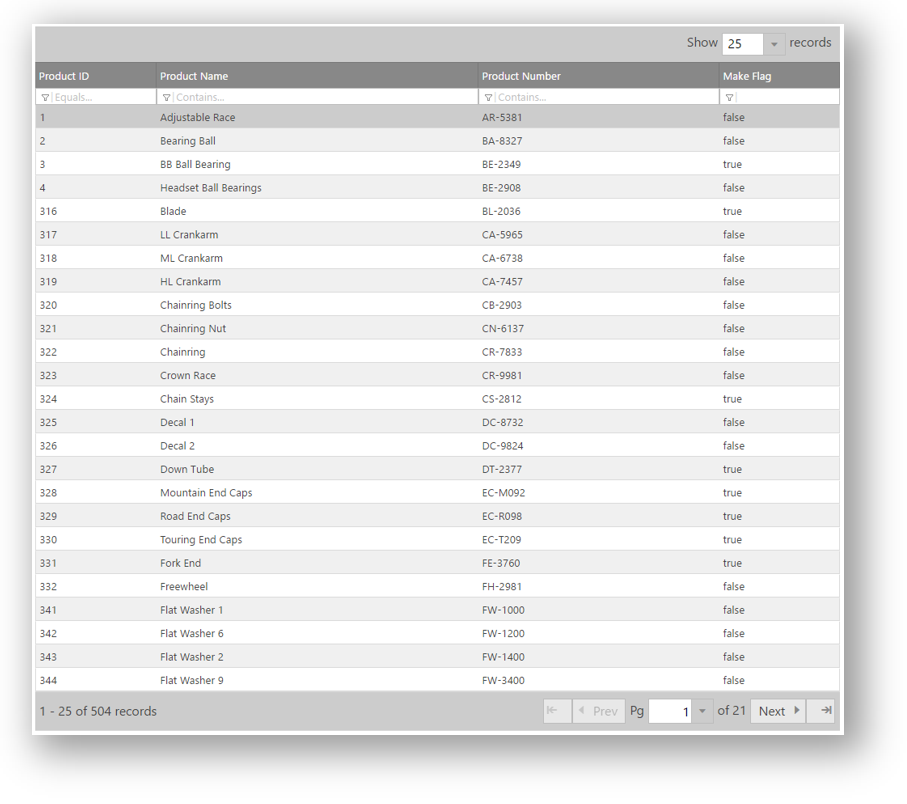
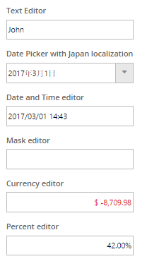
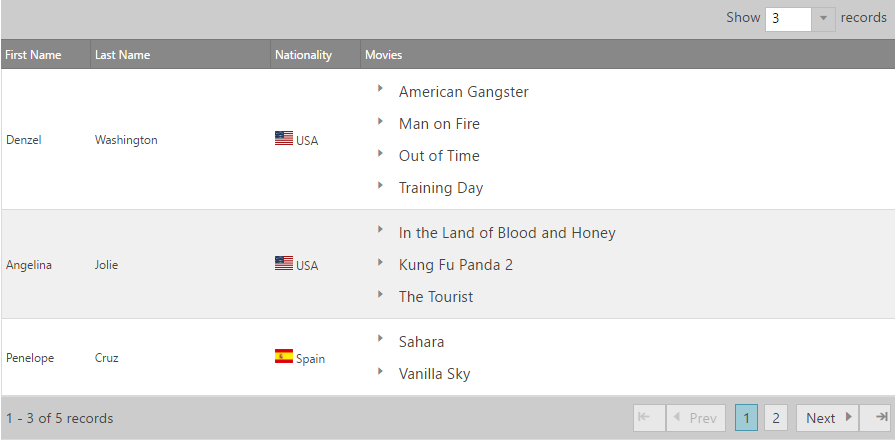
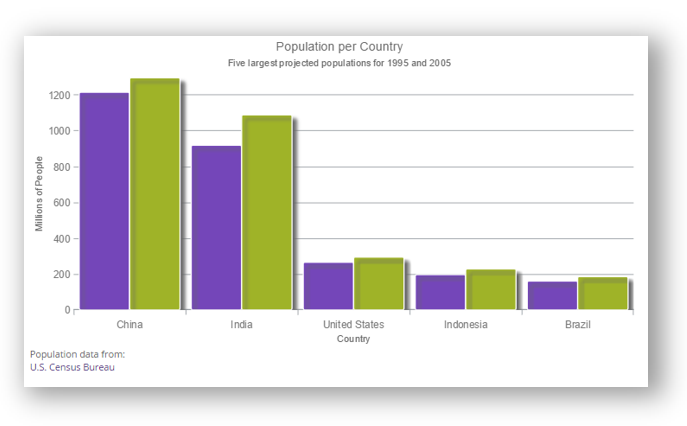
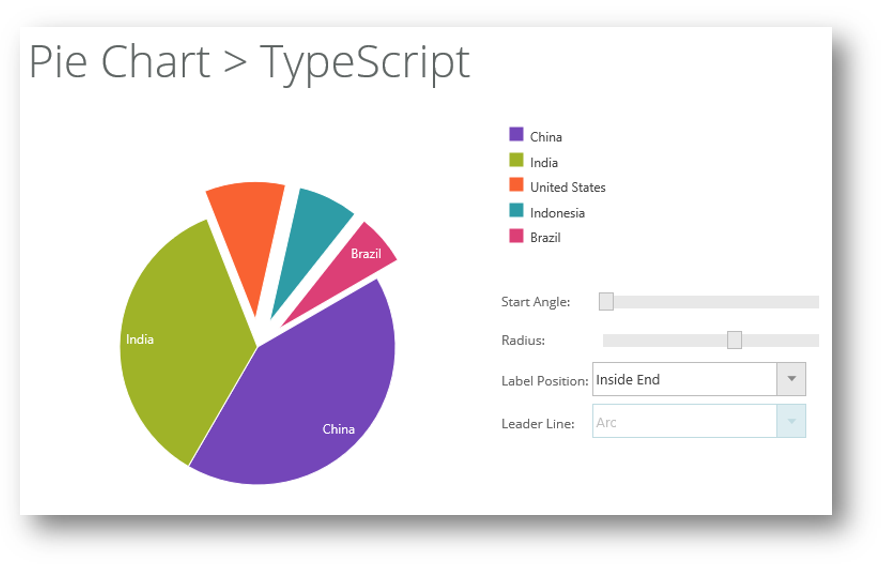
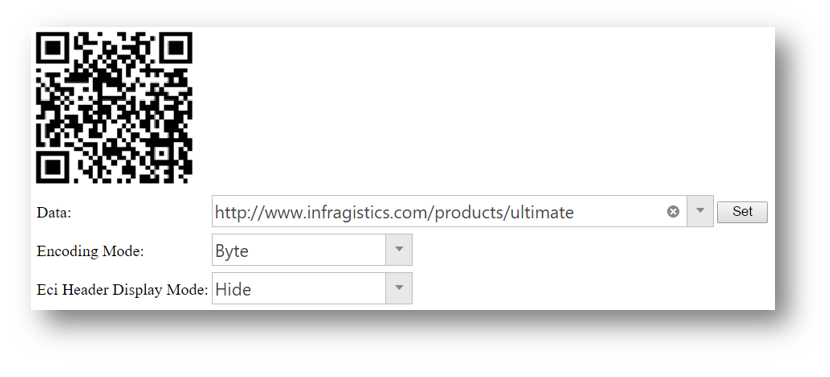
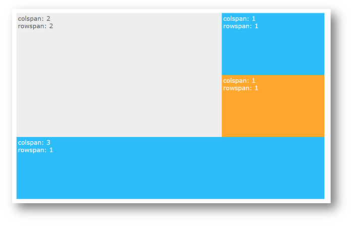
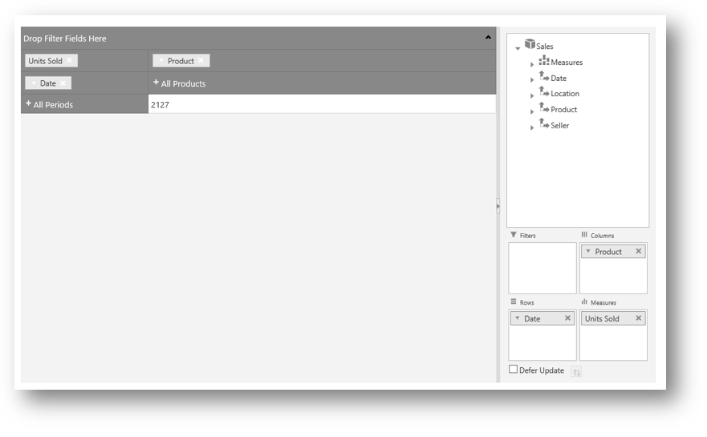
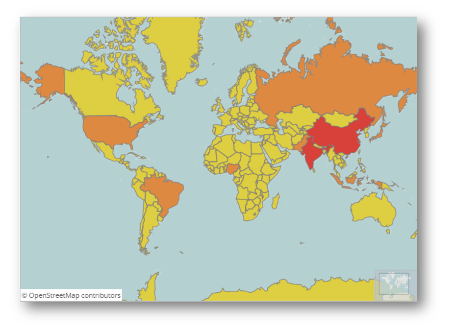
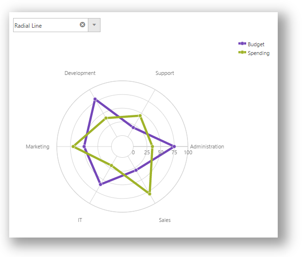

# TypeScript サンプル

## トピックの概要
このトピックでは、\{environment:ProductName\} コントロールと TypeScript のサンプルについて説明します。

### このトピックの内容

このトピックは、以下のセクションで構成されます。
-   [要件](#requirements)
-   [グリッド サンプル](#grid_sample)
    -   [プレビュー](#grid_sample_preview)
    -   [詳細](#grid_sample_details)
-   [エディター サンプル](#editors_sample)
    -   [プレビュー](#editors_sample_preview)
    -   [詳細](#editors_sample_details)
-   [タイル マネージャー サンプル](#tile_manager_sample)
    -   [プレビュー](#tile_manager_sample_preview)
    -   [詳細](#tile_manager_sample_details)
-   [ダイアログ ウィンドウ サンプル](#dialog_window_sample)
	-   [プレビュー](#dialog_window_sample_preview)
	-   [詳細](#dialog_window_sample_details)
-   [テンプレート エンジンのサンプル](#templating_engine_sample)
    -   [プレビュー](#templating_engine_preview)
    -   [詳細](#templating_engine_steps)
-   [データ チャート サンプル](#data_chart_sample)
	-   [プレビュー](#data_chart_preview)
    -   [詳細](#data_chart_details)
-   [円チャート サンプル](#pie_chart_sample)
    -   [プレビュー](#pie_chart_preview)
    -   [詳細](#pie_chart_details)
-   [ツリー サンプル](#tree_sample)
    -   [プレビュー](#tree_sample_preview)
    -   [詳細](#tree_sample_details)
-   [バーコード サンプル](#barcode_sample)
    -   [プレビュー](#barcode_preview)
    -   [詳細](#barcode_details)
-   [レイアウト マネージャー サンプル](#layout_manager_sample)
    -   [プレビュー](#layout_manager_preview)
    -   [詳細](#layout_manager_details)
-   [ピボット ビュー サンプル](#pivot_view_sample)
    -   [プレビュー](#pivot_view_preview)
    -   [詳細](#pivot_view_details)
-   [マップ サンプル](#map_sample)
    -   [プレビュー](#map_sample_preview)
    -   [詳細](#map_sample_details)
-   [ローダー サンプル](#loader_sample)
    -   [プレビュー](#loader_sample_preview)
    -   [詳細](#loader_sample_details)
-   [関連コンテンツ](#related_content)

### <a id="requirements"></a>要件
これらのサンプルを実行するには、以下が必要となります。
-   必要な \{environment:ProductName\} の JavaScript と CSS ファイル
-   必要な \{environment:ProductName\} TypeScript の定義

### <a id="grid_sample"></a>グリッド サンプル
このサンプルは、`igGrid` を TypeScript で使用する方法を紹介します。

#### <a id="grid_sample_preview"></a>プレビュー
以下のスクリーンショットは最終結果のプレビューです。



#### <a id="grid_sample_details"></a>詳細
このサンプルでは、ページング、フィルター、並べ替えなどの機能を持つ igGrid を TypeScript で作成する方法を紹介します。

**HTML の場合:**
```html
	<table id="grid1"></table>
```
igGrid を生成するために adventureWorks データソースを使用します。

```js
var adventureWorks = [
    { "ProductID": 1, "Name": "Adjustable Race", "ProductNumber": "AR-5381", "MakeFlag": false, "FinishedGoodsFlag": false, "Color": null, "SafetyStockLevel": 1000, "ReorderPoint": 750, "StandardCost": 0.0000, "ListPrice": 0.0000, "Size": null, "SizeUnitMeasureCode": null, "WeightUnitMeasureCode": null, "Weight": null, "DaysToManufacture": 0, "ProductLine": null, "Class": null, "Style": null, "ProductSubcategoryID": null, "ProductModelID": null, "SellStartDate": "\/Date(896648400000)\/", "SellEndDate": null, "DiscontinuedDate": null, "rowguid": "694215b7-08f7-4c0d-acb1-d734ba44c0c8", "ModifiedDate": "\/Date(1078992096827)\/" }, 
    { "ProductID": 2, "Name": "Bearing Ball", "ProductNumber": "BA-8327", "MakeFlag": false, "FinishedGoodsFlag": false, "Color": null, "SafetyStockLevel": 1000, "ReorderPoint": 750, "StandardCost": 0.0000, "ListPrice": 0.0000, "Size": null, "SizeUnitMeasureCode": null, "WeightUnitMeasureCode": null, "Weight": null, "DaysToManufacture": 0, "ProductLine": null, "Class": null, "Style": null, "ProductSubcategoryID": null, "ProductModelID": null, "SellStartDate": "\/Date(896648400000)\/", "SellEndDate": null, "DiscontinuedDate": null, "rowguid": "58ae3c20-4f3a-4749-a7d4-d568806cc537", "ModifiedDate": "\/Date(1078992096827)\/" } ...
]
```

グリッドを TypeScript で初期化します。

**TypeScript の場合:**
```typescript
/// <reference path="http://www.igniteui.com/js/typings/jqueryui.d.ts" />
/// <reference path="http://www.igniteui.com/js/typings/jquery.d.ts" />
/// <reference path="http://www.igniteui.com/js/typings/igniteui.d.ts" />
declare var adventureWorks: any;
$(function () {
    $("#grid1").igGrid({
        width: "100%",
        columns: [
            { headerText: "Product ID", key: "ProductID", dataType: "number", width: "15%" },
            { headerText: "Product Name", key: "Name", dataType: "string", width: "40%" },
            { headerText: "Product Number", key: "ProductNumber", dataType: "string", width: "30%" },
            { headerText: "Make Flag", key: "MakeFlag", dataType: "bool", width: "15%" }
        ],
        dataSource: adventureWorks,
        features: [
            {
                name: "Paging"
            },
            {
                name: "Sorting"
            },
            {
                name: "Filtering"
            }
        ],
	});
});
```

### <a id="editors_sample"></a>エディター サンプル
このサンプルは、`igEditors` を TypeScript で使用する方法を紹介します。

#### <a id="editors_sample_preview"></a>プレビュー
以下のスクリーンショットは最終結果のプレビューです。



#### <a id="editors_sample_details"></a>詳細
HTML を作成 - テキスト エディター、日付エディター、ローカライズ可能な日付ピッカー、マスク エディター、通貨エディター、およびパーセンテージ エディターを作成する方法を紹介します。

**HTML の場合:**
```html
<div id="editors">
	<div>
		<h4>
			Text Editor
		</h4>
		<div id="textEditor"></div>
	</div>
	<div>
		<h4>
			Date Picker with Japan localization
		</h4>
		<div id="jaDatePicker"></div>
	</div>
	<div>
		<h4>
			Date and Time editor
		</h4>
		<div id="dateTimeEditor"></div>
	</div>
	<div>
		<h4>
			Mask editor
		</h4>
		<div id="maskEditor"></div>
	</div>
	<div>
		<h4>
			Currency editor
		</h4>
		<div id="currencyEditor"></div>
	</div>
	<div>
		<h4>
			Percent editor
		</h4>
		<div id="percentEditor"></div>
	</div> 
</div>
```
エディターを TypeScript で初期化します。

**TypeScript の場合:**
```typescript
/// <reference path="http://www.igniteui.com/js/typings/jquery.d.ts" />
/// <reference path="http://www.igniteui.com/js/typings/jqueryui.d.ts" />
/// <reference path="http://www.igniteui.com/js/typings/igniteui.d.ts" />

$(function () {
    $("#textEditor").igTextEditor({
        width: "200",
        value: "John"
    });

    $("#dateTimeEditor").igDateEditor({
        width: "200",
        dateInputFormat: "dateTime",
        value: new Date()
    });

    $("#jaDatePicker").igDatePicker({
        width: "200",
        value: new Date(),
        readOnly: true,
        dropDownOnReadOnly: true,
        dateDisplayFormat: "dateLong",
        regional: "ja"
    });

    $("#currencyEditor").igCurrencyEditor({
        width: "200",
        value: -8709.98,
        negativePattern: "$ -n",
        positivePattern: "$ n",
        regional: "en-US"
    });

    $("#maskEditor").igMaskEditor({
        width: "200",
        inputMask: 'AaaL/aa',
        dataMode: 'rawTextWithRequiredPromptsAndLiterals'
    });

    $("#percentEditor").igPercentEditor({
        width: "200",
        value: "42",
        displayFactor: 1
    });
});
```

### <a id="tile_manager_sample"></a>タイル マネージャー サンプル
このサンプルは、`igTileManager` を TypeScript で使用する方法を示します。

#### <a id="tile_manager_sample_preview"></a>プレビュー
以下のスクリーンショットは最終結果のプレビューです。


#### <a id="tile_manager_sample_details"></a>詳細

HTML を作成 - 車メーカーを持つ 3 つのタブがあり、選択した車の写真を読み込む `igTileManager` があります。

**HTML の場合:**
```html
<h1 class="hOne">Infragistics Car Dealership</h1>
<h3>Choose a car brand to browse</h3>
<div id="car-tabs">
    <ul>
        <li><a href="#magarcedesDashboard">Magarcedes</a></li>
        <li><a href="#hoidaDashboard">Hoida</a></li>
        <li><a href="#pausheDashboard">Paushe</a></li>
    </ul>

    <div id="magarcedesDashboard" class="dashboard"></div>
    <div id="hoidaDashboard" class="dashboard"></div>
    <div id="pausheDashboard" class="dashboard"></div>
</div>
```

​<a id="tile_manager_steps_ds"></a>データソースの作成 - クラス `CarData` および `Info`、3 つの 車メーカーのデータを初期化します。すべてを `Cars` 配列に保存します。


**TypeScript の場合:**
```typescript
/// <reference path="../../js/typings/jquery.d.ts" />
/// <reference path="../../js/typings/jqueryui.d.ts" />
/// <reference path="../../js/typings/igniteui.d.ts" />

class Info {
    description: string
    constructor(_description: string) {
        this.description = _description;
    }
}

class CarData {
    name: string;
    picture: string;
    priceRange: string;
    extras: Info[];
    constructor(_name: string, _picture: string, _priceRange: string, _extras: Info[]) {
        this.name = _name;
        this.picture = _picture;
        this.priceRange = _priceRange;
        this.extras = _extras;
    }

    addExtra(_extra) {
        this.extras.push(_extra);
    }
}

var Magarcedes: CarData[] = [];
Magarcedes.push(new CarData("2013 LSL AMG", "../../images/samples/tile-manager/car-dealership/shutterstock_139519967.jpg",
    "$199,500 - $206,000", [new Info("0-100 in 3.8 seconds"), new Info("Top speed: 317 km/h")]));
...

var Hoida: CarData[] = [];
Hoida.push(new CarData("2013 Candy", "../../images/samples/tile-manager/car-dealership/shutterstock_57034834.jpg",
    "$21,661 - $29,404", [new Info("Gas I4 2.5L engine"), new Info("Highway fuel efficiency 35 mpg")]));
...

var Paushe: CarData[] = [];
Paushe.push(new CarData("2013 CST", "../../images/samples/tile-manager/car-dealership/shutterstock_38288989.jpg",
    "$39,095 - $59,090", [new Info("Available All Wheel Drive"), new Info("Available touch-screen glide-up navigation with voice recognition"),
        new Info("Leather seating surfaces"), new Info("Adaptive Remote Start")]));
...

var Cars: CarData[][] = [];
Cars.push(Magarcedes);
Cars.push(Hoida);
Cars.push(Paushe);
```

​<a id="tile_manager_steps_tm"></a>igTileManager の作成- `igTileManager` とタブを作成します。次に最初の車メーカーをあらかじめ選択し、タブが選択されたときに `igTileManager` データソースで更新するようタブを設定します。

**TypeScript の場合:**
```typescript
$(function () {
    var activated: boolean[] = [false, false, false, false],
    options: IgTileManager = {
            columnWidth: 210,
            columnHeight: 210,
            marginLeft: 10,
            marginTop: 10,
            dataSource: Cars,
            items: [
                { rowIndex: 0, colIndex: 0, rowSpan: 2, colSpan: 2 },
                { rowIndex: 0, colIndex: 2, rowSpan: 1, colSpan: 1 },
                { rowIndex: 1, colIndex: 2, rowSpan: 1, colSpan: 1 },
                { rowIndex: 2, colIndex: 0, rowSpan: 1, colSpan: 1 },
                { rowIndex: 2, colIndex: 1, rowSpan: 1, colSpan: 1 },
                { rowIndex: 2, colIndex: 2, rowSpan: 1, colSpan: 1 }
            ],
            maximizedTileIndex: 0,
            maximizedState: '<figure><figcaption>${name}</figcaption></figure><ul><li>Price: ${priceRange}</li>' +
            '{{each ${extras} }}<li>${extras.description}</li>{{/each}}</ul>',
            minimizedState: '<figure><figcaption>${name}</figcaption>'
        };

    // ページの読み込みで表示されるタブの初めての初期化
    options.dataSource = Cars[0];
    activated[0] = true;
    $('#magarcedesDashboard').igTileManager(options);

    var tabOptions: JQueryUI.TabsOptions = {
        activate: function (event, ui) {
            var index = ui.newTab.index();
            if (!activated[index]) {
                options.dataSource = Cars[index];
                ui.newPanel.igTileManager(options);
                activated[index] = true;
            } else {
                ui.newPanel.igTileManager('reflow');
            }
        }
    }

    $('#car-tabs').tabs(tabOptions);
});
```

### <a id="dialog_window_sample"></a>ダイアログ ウィンドウ サンプル
このサンプルは、`igDialog` を TypeScript で使用する方法を紹介します。

#### <a id="dialog_window_sample_preview"></a>プレビュー
以下のスクリーンショットは最終結果のプレビューです。


#### <a id="dialog_window_sample_details"></a>詳細
HTML を作成 - `igDialog` で Infragistics サイトを表示します。

**HTML の場合:**
```html
<button id="openDialog"></button>

    <div id="dialog">
            <iframe src="http://www.infragistics.com" frameborder="0" width= "100%" height="100%"></iframe>
    </div>
```

<a id="dialog_window_steps_ts"></a>igDialog を作成 - `igDialog` を閉じた状態で作成します。ボタンの `click` イベントにイベント ハンドラーをアタッチすると、ボタンをクリックしたときにモーダル ダイアログが表示されます。

**TypeScript の場合:**
```typescript
$(function () {

    // Initialize the open button with igButton
    $("#openDialog").igButton({ labelText: "Open Dialog" });

    // Initialize the igDialog
    $("#dialog").igDialog({
        state: "closed",
        modal: true,
        draggable: false,
        resizable: false,
        height: 500,
        width: 400
    });

    $("#openDialog").on({
        click: function (e) {
            // Open the igDialog
            $("#dialog").igDialog("open");
        }
    });
});
```

### <a id="templating_engine_sample"></a>テンプレート エンジンのサンプル
このサンプルは、`igTemplatingEngine` を TypeScript で使用する方法を紹介します。

#### <a id="templating_engine_preview"></a>プレビュー
以下のスクリーンショットは最終結果のプレビューです。



####<a id="templating_engine_steps"></a>詳細
HTML を作成 - このサンプルは、TypeScript で Infragistics テンプレート エンジンを使用してネストされたテンプレートを使用する方法を紹介します。この例では、各俳優の映画コレクションが繰り返され、映画データがツリーで表示されます。

**HTML の場合:**
```html
<script id="colTmpl" type="text/template">
    <div class='tree'>
        <ul>
            {{each ${movies} }}
            <li>
</li>
                ${movies.name}
                <ul>
                    <li>Genre: ${movies.genre}</li>
                    <li>Year: ${movies.year}</li>
                    <li>
</li>
                        <a>
                            <span class='ratingLabel' style='float:left'>Rating:</span>
                            <span class='rating'>${movies.rating}</span>
                        </a>
                    </li>
                    <li class='clear'>Languages: ${movies.languages}</li>
                    <li>Subtitles: ${movies.subtitles}</li>
                </ul>
            {{/each}}
        </ul>
    </div>
</script>

<div id="resultGrid"></div>
```

`Movie` および `Actor` クラスを追加し、映画および俳優のデータを初期化します。

**TypeScript の場合:**
```typescript
/// <reference path="http://www.igniteui.com/js/typings/jquery.d.ts" />
/// <reference path="http://www.igniteui.com/js/typings/jqueryui.d.ts" />
/// <reference path="http://www.igniteui.com/js/typings/igniteui.d.ts" />

class Movie {
    name: string;
    year: number;
    genre: string;
    rating: number;
    languages: string;
    subtitles: string;
    constructor(inName: string, inYear: number, inGenre: string, inRating: number, inLanguage: string, inSubs: string) {
        this.name = inName;
        this.year = inYear;
        this.genre = inGenre;
        this.rating = inRating;
        this.languages = inLanguage;
        this.subtitles = inSubs;
    }
}

class Actor {
    firstName: string;
    lastName: string;
    nationality: Object;
    movies: Movie[];
    constructor(inFirstName: string, inLastName: string, inNationality: Object, inMoviesArray: Movie[]) {
        this.firstName = inFirstName;
        this.lastName = inLastName;
        this.nationality = inNationality;
        this.movies = inMoviesArray;
    }
}

var moviesDWashington: Movie[] = [];
moviesDWashington.push(new Movie("American Gangster", 2007, "Biography, Crime, Drama", 7.9, "English, German", "Japanese, English"));

var moviesAJolie: Movie[] = [];
moviesAJolie.push(new Movie("In the Land of Blood and Honey", 2011, "Drama, Romance, War", 3.2, "English", "English, French"));

var moviesPCruz: Movie[] = [];
moviesPCruz.push(new Movie("Sahara", 2005, "Action, Adventure, Comedy", 5.9, "English, Spanish", "Japanese, French"));

var moviesGClooney: Movie[] = [];
moviesGClooney.push(new Movie("Ocean's Thirteen", 2007, "Crime, Thriller", 6.9, "English", "Spanish, French"));

var moviesJRoberts: Movie[] = [];
moviesJRoberts.push(new Movie("Eat Pray Love", 2010, "Drama, Romance", 5.3, "English, German", "Spanish, French"));

var actors: Actor[] = [];
actors.push(new Actor("Denzel", "Washington", { key: "USA", value: "USA" }, moviesDWashington));
```

次に `igGrid` および `igTree` コントロールを初期化します。

**TypeScript の場合:**
```typescript
$(function () {
    var i = 0, currentValue, limit,
        imagesRoot = "http://www.igniteui.com/images/samples/templating-engine/multiConditionalColTemplate";

    $("#resultGrid").igGrid({
        dataSource: actors,
        width: "100%",
        autoGenerateColumns: false,
        columns: [
            { headerText: "First Name", key: "firstName", width: 100 },
            { headerText: "Last Name", key: "lastName", width: 200 },
            { headerText: "Nationality", key: "nationality", width: 100, template: " ${nationality.value} " },
            { headerText: "Movies", key: "movies", width: 500, template: $("#colTmpl").html() },
        ],
        rendered: function () {
            initializeInnerControls();
        },
        features: [
            {
                name: "Paging",
                type: "local",
                pageSize: 3,
                pageSizeChanged: function () {
                    initializeInnerControls();
                },
                pageIndexChanged: function () {
                    initializeInnerControls();
                }
            }
        ]
    });

    function initializeInnerControls() {
        $(".tree").igTree({ hotTracking: false });
        limit = $('.rating').length;
        for (i = 0; i < limit; i++) {
            currentValue = parseFloat($($('.rating')[i]).html());
            $($('.rating')[i]).igRating({
                voteCount: 10,
                value: currentValue,
                valueAsPercent: false,
                precision: "exact"
            });
        }
    }
});
```

### <a id="data_chart_sample"></a>データ チャート サンプル
このサンプルでは、データ構成のクラス ベースの方法を使用して TypeScript でデータ チャートを作成する方法を紹介します。
#### <a id="data_chart_preview"></a>プレビュー
以下のスクリーンショットは最終結果のプレビューです。



#### <a id="data_chart_details"></a>詳細

HTML を作成します。

**HTML の場合:**
```html
<div id="data-chart"></div>

<div class="USCensus-attribution">
	Population data from:<br>
	<a href="http://www.census.gov/" target="_blank">U.S. Census Bureau</a>
</div>
```

TypeScript でデータ ソースおよび `igDataChart` を作成します。

**TypeScript の場合:**
```typescript
/// <reference path="http://www.igniteui.com/js/typings/jquery.d.ts" />
/// <reference path="http://www.igniteui.com/js/typings/jqueryui.d.ts" />
/// <reference path="http://www.igniteui.com/js/typings/igniteui.d.ts" />

class CountryPopulation {
    countryName: string;
    population2005: number;
    population1995: number;
    constructor(inName: string, populationIn1995: number, populationIn2005: number) {
        this.countryName = inName;
        this.population2005 = populationIn2005;
        this.population1995 = populationIn1995;
    }

}

var samplePopulation: CountryPopulation[] = [];
samplePopulation.push(new CountryPopulation("China", 1216,  1297));
samplePopulation.push(new CountryPopulation("India", 920, 1090));
samplePopulation.push(new CountryPopulation("United States", 266, 295));
samplePopulation.push(new CountryPopulation("Indonesia", 197, 229));
samplePopulation.push(new CountryPopulation("Brazil", 161, 186));

$(function () {
    $("#data-chart").igDataChart({
        width: "80%",
        height: "400px",
        title: "Population per Country",
        subtitle: "Five largest projected populations for 1995 and 2005",
        dataSource: samplePopulation,
        axes: [
            {
                name: "NameAxis",
                type: "categoryX",
                title: "Country",
                label: "countryName"
            },
            {
                name: "PopulationAxis",
                type: "numericY",
                minimumValue: 0,
                title: "Millions of People",
            }
        ],
        series: [
            {
                name: "1995Population",
                title: "1995",
                type: "column",
                isDropShadowEnabled: true,
                useSingleShadow: false,
                shadowColor: "#666666",
                isHighlightingEnabled: true,
                isTransitionInEnabled: true,
                xAxis: "NameAxis",
                yAxis: "PopulationAxis",
                valueMemberPath: "population1995",
                showTooltip: true
            },
            {
                name: "2005Population",
                title: "2005",
                type: "column",
                isDropShadowEnabled: true,
                useSingleShadow: false,
                shadowColor: "#666666",
                isHighlightingEnabled: true,
                isTransitionInEnabled: true,
                xAxis: "NameAxis",
                yAxis: "PopulationAxis",
                valueMemberPath: "population2005",
                showTooltip: true
            },
            {
                name: "categorySeries",
                type: "categoryToolTipLayer",
                useInterpolation: false,
                transitionDuration: 150
            },
            {
                name: "crosshairLayer",
                title: "crosshair",
                type: "crosshairLayer",
                useInterpolation: false,
                transitionDuration: 500
            }
        ]
    });
})
```

### <a id="pie_chart_sample"></a>円チャート サンプル
このサンプルでは、凡例および複数のレイアウト オプションを持つ円チャート コントロールを TypeScript で作成する方法を紹介します。
#### <a id="pie_chart_preview"></a>プレビュー
以下のスクリーンショットは最終結果のプレビューです。



#### <a id="pie_chart_details"></a>詳細

HTML を作成 - ラベル位置、線、角度、半径、および凡例を含む複数のオプション設定が可能な円チャートを作成します。

**HTML の場合:**
```html
<div id="pieChart"></div>
    <div id="legend"></div>

    
| Start Angle: |  |
| --- | --- |
| Radius: |  |
| Label Position: | None Center Inside End Outside End Best Fit |
| Leader Line: | Straight Arc Spline |

```

データ ソースを作成 - `PieChartCountryPopulation` クラスを追加し、国人口データを初期化します。`PieChartCountryPopulation` 配列に保存されます。

**TypeScript の場合:**
```typescript
/// <reference path="../../js/typings/jquery.d.ts" />
/// <reference path="../../js/typings/jqueryui.d.ts" />
/// <reference path="../../js/typings/igniteui.d.ts" />

class PieChartCountryPopulation {
    countryName: string;
    population2008: number;
    constructor(inName: string, populationIn2008: number) {
        this.countryName = inName;
        this.population2008 = populationIn2008;
    }
}

var pieChartSample: PieChartCountryPopulation[] = [];
pieChartSample.push(new PieChartCountryPopulation("China", 1333));
pieChartSample.push(new PieChartCountryPopulation("India", 1140));
pieChartSample.push(new PieChartCountryPopulation("United States", 304));
pieChartSample.push(new PieChartCountryPopulation("Indonesia", 228));
pieChartSample.push(new PieChartCountryPopulation("Brazil", 192));
```

igPieChart を作成 - レイアウトを構成するために、`igPieChart`、その他の必要なコントロール (`igCombo`、`slider`、など) を作成します。

```typescript
$(function () {
    $('#pieChart').igPieChart({
        dataSource: pieChartSample,
        width: "430px",
        height: "430px",
        dataLabel: 'countryName',
        dataValue: 'population2008',
        explodedSlices: [2, 3, 4],
        radiusFactor: .6,
        startAngle: -30,
        labelsPosition: "outsideEnd",
        leaderLineType: "straight",
        labelExtent: 40,
        legend: { element: 'legend', type: "item" }
    });

    $("#angle").slider({
        slide: function (event, ui) {
            $("#pieChart").igPieChart("option", "startAngle", ui.value);
        },
        min: 0,
        max: 360
    });

    $("#radius").slider({
        slide: function (event, ui) {
            $("#pieChart").igPieChart("option", "radiusFactor", ui.value / 1000.0);
        },
        min: 0,
        max: 1000,
        value: 600
    });

    $("#labelPosition").igCombo({
        enableClearButton: false,
        mode: "dropdown",
        selectionChanged: function (evt, ui) {
            if ($.isArray(ui.items) && ui.items[0] != undefined) {
                $("#pieChart").igPieChart("option", "labelsPosition", ui.items[0].data.value);

                $("#labelExtent").slider("option", "disabled", ui.items[0].data.value != "outsideEnd");
                $("#leaderLine").igCombo("option", "disabled", ui.items[0].data.value != "outsideEnd" ? true : false);
            }
        }
    });

    $("#leaderLine").igCombo({
        enableClearButton: false,
        mode: "dropdown",
        selectionChanged: function (evt, ui) {
            if ($.isArray(ui.items) && ui.items[0] != undefined) {
                $("#pieChart").igPieChart("option", "leaderLineType", ui.items[0].data.value);
            }
        }
    });
});
```

### <a id="tree_sample"></a>ツリー サンプル
このサンプルは、`igTree` を TypeScript で使用する方法を紹介します。

#### <a id="tree_sample_preview"></a>プレビュー
以下のスクリーンショットは最終結果のプレビューです。


#### <a id="tree_sample_details"></a>詳細
HTML を作成 - フォルダーおよびファイルを含むファイル エクスプローラーを表す `igTree` を作成します。

**HTML の場合:**
```html
<div id="tree"></div>
```

データ ソースを作成 - フォルダー、サブフォルダー、およびファイルを含む階層構造を作成します。

**TypeScript の場合:**
```typescript
/// <reference path="../../js/typings/jquery.d.ts" />
/// <reference path="../../js/typings/jqueryui.d.ts" />
/// <reference path="../../js/typings/igniteui.d.ts" />

class FileType {
    name: string;
    type: string;
    imageUrl: string;
    folder: FileType[];
    constructor(inName: string, inType: string, inImageUrl: string, inFolder: FileType[]) {
        this.name = inName;
        this.type = inType;
        this.imageUrl = inImageUrl;
        this.folder = inFolder;
    }
}

function createSubfolderFiles(parentFolder: FileType, subFolders: string[], files: string[][],
    folderPicture: string, filePicture: string) {
    var fileIndex, subFolderIndex;
    for (subFolderIndex = 0; subFolderIndex < subFolders.length; subFolderIndex++) {
        parentFolder.folder.push(new FileType(subFolders[subFolderIndex], "Folder", folderPicture, []));

        for (fileIndex = 0; fileIndex < files[subFolderIndex].length; fileIndex++) {
            parentFolder.folder[subFolderIndex].folder.push(new FileType(files[subFolderIndex][fileIndex], "File", filePicture, []));
        }
    }
}

var folderMusic = new FileType("Music", "Folder", "../../images/samples/tree/book.png", []);
var musicSubFolders = ["Y.Malmsteen", "WhiteSnake", "AC/DC", "Rock"];
var musicFiles = [["Making Love", "Rising Force", "Fire and Ice"], ["Trouble", "Bad Boys", "Is This Love"],
    ["ThunderStruck", "T.N.T.", "The Jack"], ["Bon Jovi - Always"]];
createSubfolderFiles(folderMusic, musicSubFolders, musicFiles, "../../images/samples/tree/book.png", "../../images/samples/tree/music.png");

...

var folderDeleted = new FileType("Deleted", "Folder", "../../images/samples/tree/bin_empty.png", []);
var folderComputer = new FileType("Computer", "Folder", "../../images/samples/tree/computer.png", []);
folderComputer.folder.push(folderMusic);
folderComputer.folder.push(folderDocuments);
folderComputer.folder.push(folderPictures);
folderComputer.folder.push(folderNetwork);
folderComputer.folder.push(folderDeleted);

var files = [folderComputer];
```

`igTree` を作成 - `igTree` を作成し、生成されたデータ ソースにバインドします。

**TypeScript の場合:**
```typescript
$(function () {
    var options: IgTree = {
        checkboxMode: 'triState',
        singleBranchExpand: true,
        dataSource: $.extend(true, [], files),
        initialExpandDepth: 0,
        pathSeparator: '.',
        bindings: {
            textKey: 'name',
            valueKey: 'type',
            imageUrlKey: 'imageUrl',
            childDataProperty: 'folder'
        },
        dragAndDrop: true,
        dragAndDropSettings: {
            allowDrop: true,
            customDropValidation: function (element) {
                // Validates the drop target
                var valid = true,
                    droppableNode = $(this);

                if (droppableNode.is('a') && droppableNode.closest('li[data-role=node]').attr('data-value') === 'File') {
                    valid = false;
                }

                return valid;
            }
        }
    }

    $("#tree").igTree(options);
});
```

### <a id="barcode_sample"></a>バーコード サンプル
このサンプルでは、バーコードの作成時の TypeScript の使用方法およびその設定の構成を紹介します。
#### <a id="barcode_preview"></a>プレビュー
以下のスクリーンショットは最終結果のプレビューです。



#### <a id="barcode_details"></a>詳細

HTML を作成 - Infragistics サイトへのハイパーリンクを含むデータに基づいてバーコードを作成します。バーコード モードを変更するには、`エンコード モード`および `ECI ヘッダーの表示モード`を使用します。

**HTML の場合:**
```html

|  |
| --- |
| Data: |
| Encoding Mode: |
| Eci Header Display Mode: |

```
データ ソースを作成 - `IGProducts` クラスを追加し、 Infragistics 製品データを初期化します。すべてが `igProductsData` 配列に保存されます。

**TypeScript の場合:**
```typescript
/// <reference path="../../js/typings/jquery.d.ts" />
/// <reference path="../../js/typings/jqueryui.d.ts" />
/// <reference path="../../js/typings/igniteui.d.ts" />

class IGProducts {
    id: number;
    name: string;
    constructor(productId: number, productName: string) {
        this.id = productId;
        this.name = productName;
    }
}

var igProductsData: IGProducts[] = [];
igProductsData.push(new IGProducts(1, "http://www.infragistics.com/products/ultimate"));
igProductsData.push(new IGProducts(2, "http://www.infragistics.com/products/professional"));
igProductsData.push(new IGProducts(3, "http://www.infragistics.com/products/jquery"));

```
igBarcode を作成 - レイアウトを構成するために、`igBarcode`、その他の必要なコントロール (`igCombo`、など) を作成します。

```typescript
$(function () {
    $("#barcode").igQRCodeBarcode({
        height: "300px",
        width: "100%",
        data: "http://www.infragistics.com/products/jquery/samples",
    });

    $("#dataInput").igTextEditor({
        width: "300px",
        value: "http://www.infragistics.com/products/jquery/help"
    });

   $("#setButton").click(function () {
        $("#barcode").igQRCodeBarcode("option", "data", $("#dataInput").igTextEditor("value"));
    });

	$('#combo').igCombo({
		dataSource: igProductsData,
		textKey: 'Name',
		valueKey: 'ID',
		width: "500px",
		initialSelectedItems: [{
			index: 0
		}]
	});

    $("#encodingMode").igCombo({
        enableClearButton: false,
        mode: "dropdown",
        selectionChanged: function (evt, ui) {
            if ($.isArray(ui.items) && ui.items[0] != undefined) {
                $("#barcode").igQRCodeBarcode("option", "encodingMode", ui.items[0].data.value);
            }
        }
    });

    $("#eciHeaderDisplayMode").igCombo({
        enableClearButton: false,
        mode: "dropdown",
        selectionChanged: function (evt, ui) {
            if ($.isArray(ui.items) && ui.items[0] != undefined) {
                $("#barcode").igQRCodeBarcode("option", "eciHeaderDisplayMode", ui.items[0].data.value);
            }
        }
    });
});
```

### <a id="layout_manager_sample"></a>レイアウト マネージャー サンプル
このサンプルでは、レイアウト マネージャーのグリッド レイアウトを構成する方法を紹介します。定義済みサイズのグリッドで項目を任意の位置に配置する機能も紹介します。
#### <a id="layout_manager_preview"></a>プレビュー
以下のスクリーンショットは最終結果のプレビューです。



#### <a id="layout_manager_details"></a>詳細

HTML を作成 - コンテンツを体系化し、さまざまなコンテナー レイアウトの設定が可能なグリッド レイアウトのレイアウト マネージャーを作成します。

**HTML の場合:**
```html
..
<style type="text/css">
        ul {
            list-style-type: none;
            font-family: Verdana;
        }

        #layout {
            position: relative;
        }

        .ig-layout-item {
            font-size: 20px;
        }

        @media all and (max-width: 480px) {
            .ig-layout-item {
                font-size: 16px;
            }
        }
    </style>
</head>
<body>
    <div id="layout"></div>
</body>
..
```
`igLayoutManager` を作成 - レイアウトの構造を構成するために、`items` および `gridLayout` オプションを変更します。

**TypeScript の場合:**
```typescript
/// <reference path="../../js/typings/jquery.d.ts" />
/// <reference path="../../js/typings/jqueryui.d.ts" />
/// <reference path="../../js/typings/igniteui.d.ts" />

$(function () {
	options: IgLayoutManager = {
		layoutMode: "grid",
        width: "100%",
        height: "600px",
        gridLayout: { cols: 3, rows: 3 },
        items: [
            { rowSpan: 2, colSpan: 2, colIndex: 0, rowIndex: 0 },
            { rowSpan: 1, colSpan: 1, rowIndex: 0, colIndex: 2 },
            { rowSpan: 1, colSpan: 1, rowIndex: 1, colIndex: 2 },
            { rowSpan: 1, colSpan: 3, colIndex: 0, rowIndex: 2 }
        ],
		itemRendered: function(evt, ui){
			args.item.append("<ul><li>colspan: " + args.itemData.colSpan + "</li><li>rowspan: " + args.itemData.rowSpan + "</li></ul></span>");

			// get the element
			if (args.itemData.colSpan == 2 && args.itemData.rowSpan == 2) {
				args.item.css("background-color", "#eee");
				args.item.css("color", "#555");
			} else if (args.itemData.rowSpan == 1 && args.itemData.colSpan == 1) {
				if (args.itemData.rowIndex == 0) {
					args.item.css("background-color", "#2CBDF9");
					args.item.css("color", "#FFF");
				} else {
					args.item.css("background-color", "#FFA72D");
					args.item.css("color", "#FFF");
				}
			} else {
				args.item.css("background-color", "#2CBDF9");
				args.item.css("color", "#FFF");
			}
		}
	};

    $('#layout').igLayoutManager(options);
});

```

### <a id="pivot_view_sample"></a>ピボット ビュー サンプル
このサンプルでは、TypeScript を使用して igPivotView を作成する方法、そしてクラス ベースのアプローチでデータを割り当てる方法も紹介します。
#### <a id="pivot_view_preview"></a>プレビュー
以下のスクリーンショットは最終結果のプレビューです。



#### <a id="pivot_view_details"></a>詳細

HTML を作成 - `igPivotGrid`、`igPivotDataSelector`、および `igSplitter` の 3 つのコンポーネントを含むピボット グリッド ビューを作成します。

**HTML の場合:**
```html
<div id="pivotView"></div>
```
`igPivotView` を作成 - ピボット グリッドで多次元 (OLAP) データを操作するツールを提供します。

**TypeScript の場合:**
```typescript
/// <reference path="../../js/typings/jquery.d.ts" />
/// <reference path="../../js/typings/jqueryui.d.ts" />
/// <reference path="../../js/typings/igniteui.d.ts" />

class SelectorProduct {
    ProductCategory: string;
    SellerName: string;
    Country: string;
    City: string;
    Date: string;
    UnitPrice: number;
    UnitsSold: number;
    constructor(public category, public sellerName, public country, public city,
        public date, public unitPrice, public unitsSold) {
        this.ProductCategory = category;
        this.SellerName = sellerName;
        this.Country = country;
        this.City = city;
        this.Date = date;
        this.UnitPrice = unitPrice;
        this.UnitsSold = unitsSold;
    }
}

var dataView: SelectorProduct[] = [];
dataView.push(new SelectorProduct("Clothing", "Stanley Brooker", "Bulgaria", "Plovdiv", "01/01/2012", 12.81, 282));
dataView.push(new SelectorProduct("Clothing", "Elisa Longbottom", "US", "New York", "01/05/2013", 49.57, 296));
dataView.push(new SelectorProduct("Bikes", "Lydia Burson", "Uruguay", "Ciudad de la Costa", "01/06/2011", 3.56, 68));
dataView.push(new SelectorProduct("Accessories", "David Haley", "UK", "London", "04/07/2012", 85.58, 293));
dataView.push(new SelectorProduct("Components", "John Smith", "Japan", "Yokohama", "12/08/2012", 18.13, 240));
dataView.push(new SelectorProduct("Clothing", "Larry Lieb", "Uruguay", "Ciudad de la Costa", "05/12/2011", 68.33, 456));
dataView.push(new SelectorProduct("Components", "Walter Pang", "Bulgaria", "Sofia", "02/19/2013", 16.05, 492));

function saleValueCalculator(items, cellMetadata) {
        var sum = 0;
        $.each(items, function (index, item) {
            sum += item.UnitPrice * item.UnitsSold;
        });
        return (Math.round(sum * 10) / 10).toFixed(2);
};

dataSource = new $.ig.OlapFlatDataSource({
    dataSource: dataView,
    metadata: {
        cube: {
            name: "Sales",
            caption: "Sales",
            measuresDimension: {
                caption: "Measures",
                measures: [ //for each measure, name and aggregator are required
                    {
                        caption: "Units Sold", name: "UnitsSold",
                        aggregator: $.ig.OlapUtilities.prototype.sumAggregator('UnitsSold')
                    },
                    {
                        caption: "Unit Price", name: "UnitPrice",
                        aggregator: $.ig.OlapUtilities.prototype.sumAggregator('UnitPrice')
                    },
                    {
                        caption: "Sale Value", name: "SaleValue", aggregator: saleValueCalculator
                    }]
            },
            dimensions: [ // for each dimension
                {
                    caption: "Date", name: "Date", /*displayFolder: "Folder1\\Folder2",*/ hierarchies: [
                        $.ig.OlapUtilities.prototype.getDateHierarchy(
                            "Date", // the source property name
                            ["year", "quarter", "month", "date"], // the date parts for which levels will be generated (optional)
                            "Dates", // The name for the hierarchy (optional)
                            "Date", // The caption for the hierarchy (optional)
                            ["Year", "Quarter", "Month", "Day"], // the captions for the levels (optional)
                            "All Periods") // the root level caption (optional)
                    ]
                },
                {
                    caption: "Location", name: "Location", hierarchies: [{
                        caption: "Location", name: "Location", levels: [
                            {
                                name: "AllLocations", caption: "All Locations",
                                memberProvider: function (item) { return "All Locations"; }
                            },
                            {
                                name: "Country", caption: "Country",
                                memberProvider: function (item) { return item.Country; }
                            },
                            {
                                name: "City", caption: "City",
                                memberProvider: function (item) { return item.City; }
                            }]
                    }]
                },
                {
                    caption: "Product", name: "Product", hierarchies: [{
                        caption: "Product", name: "Product", levels: [
                            {
                                name: "AllProducts", caption: "All Products",
                                memberProvider: function (item) { return "All Products"; }
                            },
                            {
                                name: "ProductCategory", caption: "Category",
                                memberProvider: function (item) { return item.ProductCategory; }
                            }]
                    }]
                },
                {
                    caption: "Seller", name: "Seller", hierarchies: [{
                        caption: "Seller", name: "Seller", levels: [
                            {
                                name: "AllSellers", caption: "All Sellers",
                                memberProvider: function (item) { return "All Sellers"; }
                            },
                            {
                                name: "SellerName", caption: "Seller",
                                memberProvider: function (item) { return item.SellerName; }
                            }]
                    }]
                }]
        }
    },

    rows: "[Date].[Dates]",
    columns: "[Product].[Product]",
    measures: "[Measures].[UnitsSold]"
});

$(function () {
    $("#pivotView").igPivotView({
        dataSource: dataSource
    });
});

```

### <a id="map_sample"></a>マップ サンプル
このサンプルでは、TypeScript を使用して、地理図形シリーズで世界の国のデータベースおよびシェープ ファイルをマップコントロールにバインドする方法を紹介します。

#### <a id="map_sample_preview"></a>プレビュー
以下のスクリーンショットは最終結果のプレビューです。



#### <a id="map_sample_details"></a>詳細

HTML を作成 - 国をホバーしたときにツールチップを表示するマップを作成します。

**HTML の場合:**
```html
<script id="geoShapeTooltip" type="text/x-jquery-tmpl">
	<table id="tooltipTable">
		<tr>
			<th colspan="2">${item.fieldValues.NAME}, ${item.fieldValues.REGION}</th>
</tr>
		<tr>
			<td>Population:</td>
			<td>${item.fieldValues.POP2005}</td>
</tr>
	</table>
</script>

<div id="map"></div>
```
`igMap` を初期化して地理図形シリーズを定義します。

**TypeScript の場合:**
```typescript
/// <reference path="http://www.igniteui.com/js/typings/jquery.d.ts" />
/// <reference path="http://www.igniteui.com/js/typings/jqueryui.d.ts" />
/// <reference path="http://www.igniteui.com/js/typings/igniteui.d.ts" />

class ColorPicker {
    brushes: string[];
    interval: number;
    constructor(_min: number, _max: number) {
        this.brushes = ["#d9c616", "#d96f17", "#d1150c"];
        this.interval = (_max - _min) / (this.brushes.length - 1);
    }

    getColorByIndex(val) {
        var index = Math.round(val / this.interval);
        if (index < 0) {
            index = 0;
        } else if (index > (this.brushes.length - 1)) {
            index = this.brushes.length - 1;
        }
        return this.brushes[index];
    }
}

var colorPicker = new ColorPicker(100000, 500000000);

$(function () {
    $("#map").igMap({
        width: "700px",
        height: "500px",
        windowRect: { left: 0.1, top: 0.1, height: 0.7, width: 0.7 },
        overviewPlusDetailPaneVisibility: "visible",
        overviewPlusDetailPaneBackgroundImageUri: "http://www.igniteui.com/images/samples/maps/world.png",
        series: [{
            type: "geographicShape",
            name: "worldCountries",
            markerType: "none",
            shapeMemberPath: "points",
            shapeDataSource: 'http://www.igniteui.com/data-files/shapes/world_countries_reg.shp',
            databaseSource: 'http://www.igniteui.com/data-files/shapes/world_countries_reg.dbf',
            opacity: 0.8,
            outlineThickness: 1,
            showTooltip: true,
            tooltipTemplate: "geoShapeTooltip",
            shapeStyleSelector: {
                selectStyle: function (s, o) {
                    var pop = s.fields.item("POP2005");
                    var popInt = parseInt(pop);
                    var colString = colorPicker.getColorByIndex(popInt); //getColorValue(popInt);
                    return {
                        fill: colString,
                        stroke: "gray"
                    };
                }
            }
        }]
    });
    $("#map").find(".ui-widget-content").append("<span class='copyright-notice'><a href='http://www.openstreetmap.org/copyright'>© OpenStreetMap contributors</a>");
});
```

### <a id="loader_sample"></a>ローダー サンプル
このサンプルでは、TypeScript で Infragistics ローダーを使用して複数のコンポーネントと機能の読み込みを紹介します。表示されるデータ チャートの型がコンボ ボックスから選択されます。データ チャートの凡例も含まれています。

#### <a id="loader_sample_preview"></a>プレビュー
以下のスクリーンショットは最終結果のプレビューです。



#### <a id="loader_sample_details"></a>詳細

HTML を作成します。

**HTML の場合:**
```html
<div class="selectionOptions">
	<select id="seriesType">
		<option value="radialLine" selected="selected">Radial Line</option>
		<option value="radialColumn">Radial Column</option>
		<option value="radialPie">Radial Pie</option>
	</select>
</div>

<div id="chart"></div>
<div id="legend"></div>
```

TypeScript でデータ、`igLoader`、`igDataChart`、および `igCombo` を作成します。

**TypeScript の場合:**
```typescript
/// <reference path="http://www.igniteui.com/js/typings/jquery.d.ts" />
/// <reference path="http://www.igniteui.com/js/typings/jqueryui.d.ts" />
/// <reference path="http://www.igniteui.com/js/typings/igniteui.d.ts" />

class DepartmentData {
    label: string;
    budget: number;
    spending: number;
    constructor(_label: string, _budget: number, _spending: number) {
        this.label = _label;
        this.budget = _budget;
        this.spending = _spending;
    }
}

var companyData: DepartmentData[] = [];
companyData.push(new DepartmentData("Administration", 75, 35));
companyData.push(new DepartmentData("Sales", 30, 80));
companyData.push(new DepartmentData("IT", 60, 20));
companyData.push(new DepartmentData("Marketing", 50, 70));
companyData.push(new DepartmentData("Development", 80, 40));
companyData.push(new DepartmentData("Support", 20, 45));

$.ig.loader({
    scriptPath: "http://www.igniteui.com/igniteui/js/",
    cssPath: "http://www.igniteui.com/igniteui/css/",
    resources: "igDataChart.Radial,igCombo, igChartLegend"
});

// jQuery's ready event can be used with the loader.
// The loader calls holdReady until all JS and CSS files are loaded.
$(function () {

    $("#chart").igDataChart({
        width: "500px",
        height: "500px",
        dataSource: companyData,
        legend: { element: "legend" },
        axes: [{
            name: "angleAxis",
            type: "categoryAngle",
            label: "label",
            interval: 1
        }, {
                name: "radiusAxis",
                type: "numericRadius",
                innerRadiusExtentScale: .1,
                maximumValue: 100,
                minimumValue: 0,
                interval: 25,
                radiusExtentScale: .6
            }],
        series: [{
            name: "series1",
            title: 'Budget',
            type: "radialLine",
            angleAxis: "angleAxis",
            valueAxis: "radiusAxis",
            valueMemberPath: "budget",
            thickness: 5,
            markerType: "circle"
        }, {
                name: "series2",
                title: 'Spending',
                type: "radialLine",
                angleAxis: "angleAxis",
                valueAxis: "radiusAxis",
            valueMemberPath: "spending",
                thickness: 5,
                markerType: "circle"
            }],
        horizontalZoomable: true,
        verticalZoomable: true,
        windowResponse: "immediate"
    });

    $("#seriesType").igCombo({
        selectionChanged: function (evt, ui) {
            if (ui.items[0].data.value != undefined) {
                $("#chart").igDataChart("option", "series", [{
                    name: "series1", remove: true
                }, {
					name: "series2", remove: true
				}, {
					name: "series1",
					title: "Budget",
					type: ui.items[0].data.value,
					angleAxis: "angleAxis",
					valueAxis: "radiusAxis",
					valueMemberPath: "budget",
					thickness: 5,
					markerType: "circle"
				}, {
					name: "series2",
					title: 'Spending',
					type: ui.items[0].data.value,
					angleAxis: "angleAxis",
					valueAxis: "radiusAxis",
					valueMemberPath: "spending",
					thickness: 5,
					markerType: "circle"
				}]);
            }
        }
    });
});
```

### <a id="related_content"></a>関連コンテンツ
以下のトピックでは、このトピックに関連する追加情報を提供しています。

[TypeScript で \{environment:ProductName\} を使用](Using-Ignite-UI-with-TypeScript.html) - このトピックでは、\{environment:ProductName\} の型定義を TypeScript で使用する方法の概要を説明します。
