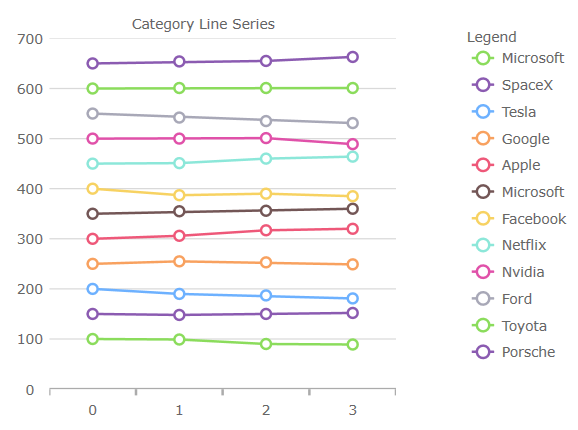
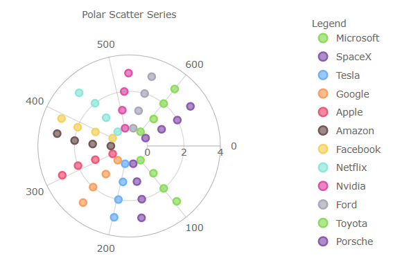

# 2021 Volume 1 の新機能

このトピックは、&#123;environment:ProductFamilyName&#125;™ 2021 Volume 1 リリースの新機能について説明します。

## チャート機能

このリリースでは、すべてのチャート コンポーネント、例えば、データ チャート、カテゴリ チャート、およびファイナンシャル チャートに、いくつかの新しく改善されたビジュアル デザインと構成オプションが導入されています。

### チャート デフォルト値のデザイン更新 (i.e.1-6):

* すべてのチャートのシリーズ/マーカーの新しい色パレット

  | 
------------- | -------------
  | 

* 棒/縦棒/ウォーターフォール シリーズを、角丸ではなく角が四角になるように変更しました。 

* 散布高密度シリーズの最小/最大ヒート プロパティの色を変更しました。 

* ファイナンシャル/ウォーターフォール シリーズのビジュアルの負の塗りつぶしの色を変更しました。

* マーカーの厚さを 1 px から 2 px に変更しました。

* PointSeries、BubbleSeries、ScatterSeries、PolarScatterSeries のマーカーのアウトラインに一致するようにマーカーの塗りつぶしを変更しました。 

[`MarkerFillMode`](&#123;environment:jQueryApiUrl&#125;/ui.igDataChart#options:markerFillMode) プロパティを Normal に設定すると、この変更を元に戻すことができます。

* TimeXAxis および OrdinalTimeXAxis のラベリングを圧縮しました。 

* 新しいマーカー プロパティ:

    - [`MarkerFillMode`](&#123;environment:jQueryApiUrl&#125;/ui.igDataChart#options:markerFillMode) - マーカーがアウトラインに依存するように、'MatchMarkerOutline' に設定できます。
    - [`MarkerFillOpacity`](&#123;environment:jQueryApiUrl&#125;/ui.igDataChart#options:markerFillOpacity) - 0〜1 の値に設定できます。
    - [`MarkerOutlineMode`](&#123;environment:jQueryApiUrl&#125;/ui.igDataChart#options:markerOutlineMode) - マーカーのアウトラインが塗りブラシの色に依存するように、'MatchMarkerBrush' に設定できます。

* 新シリーズ [`OutlineMode`](&#123;environment:jQueryApiUrl&#125;/ui.igDataChart#options:series.outlineMode) プロパティ:

シリーズ アウトラインの表示を切り替えるように設定できます。データ チャートの場合、プロパティはシリーズ上にあることに注意してください。

* 新しいプロット エリア マージン プロパティ:

    プロット領域のマージン プロパティは、チャートがデフォルト ズーム レベルにある場合、ビューポートのブリード オーバー領域を定義します。一般的な使用例では、軸と最初/最後のデータ ポイントの間にスペースを提供します。以下にリストされている [`ComputedPlotAreaMarginMode`](&#123;environment:jQueryApiUrl&#125;/ui.igDataChart#options:computedPlotAreaMarginMode) は、マーカーが有効になっているときに自動的にマージンを設定することに注意してください。その他は、厚さを表す `Double` を指定するように設計されており、PlotAreaMarginLeft などがチャートの 4 辺すべてにスペースを調整します。これらの新しいプロパティが追加されました:

    - [`PlotAreaMarginLeft`](&#123;environment:jQueryApiUrl&#125;/ui.igDataChart#options:plotAreaMarginLeft)
    - [`PlotAreaMarginTop`](&#123;environment:jQueryApiUrl&#125;/ui.igDataChart#options:plotAreaMarginTop)
    - [`PlotAreaMarginRight`](&#123;environment:jQueryApiUrl&#125;/ui.igDataChart#options:plotAreaMarginRight)
    - [`PlotAreaMarginBottom`](&#123;environment:jQueryApiUrl&#125;/ui.igDataChart#options:plotAreaMarginBottom)
    - [`ComputedPlotAreaMarginMode`](&#123;environment:jQueryApiUrl&#125;/ui.igDataChart#options:computedPlotAreaMarginMode)

* 新しい強調表示プロパティ:

シリーズの強調表示にいくつかの構成が追加されました。以前のリリースでは、強調表示はホバー時にフェードするように制限されていました。これらの新しいプロパティが追加されました:

- [`HighlightingMode`](&#123;environment:jQueryApiUrl&#125;/ui.igDataChart#options:highlightingMode) - ホバーされたシリーズとホバーされていないシリーズをフェードまたは明るくするかを設定します。
- [`HighlightingBehavior`](&#123;environment:jQueryApiUrl&#125;/ui.igDataChart#options:highlightingBehavior) - 真上または最も近い項目など、マウスの位置に応じてシリーズを強調表示するかどうかを設定します。

* 次のシリーズの強調表示を追加しました:

- 積層型
- 散布図
- 極座標
- ラジアル 
- 図形

* 次のシリーズに注釈レイヤーを追加しました:

- 積層型
- 散布図
- 極座標
- ラジアル
- 図形

* 積層型シリーズ内の個々の積層フラグメントのデータ ソースをオーバーライドするためのサポートが追加されました。

* 積層型、散布、範囲、極座標、ラジアル、シェイプ シリーズにカスタム スタイルのイベントを追加しました。

* 表示された最初のラベルに基づいてチャートの水平マージンを自動的に拡張するサポートが追加されました。 

### チャート凡例の機能:

* [`LegendHighlightingMode`](&#123;environment:jQueryApiUrl&#125;/ui.igDataChart#options:legendHighlightingMode) - 凡例項目にカーソルを合わせると、シリーズの強調表示が有効になります。

### 地理マップの機能 (CTP):

* マップの表示を折り返すためのサポートが追加されました (水平方向に無限にスクロールできます)。  

* 座標原点を折り返しながら、一部のマップ シリーズの表示をシフトするためのサポートが追加されました。  

* シェイプ シリーズの強調表示のサポートが追加されました。 

* シェイプ シリーズの強調表示のサポートが追加されました。 

