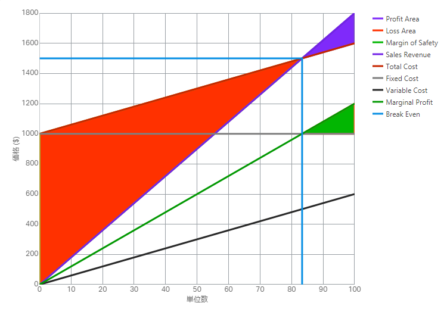
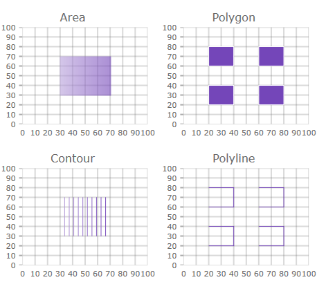

import ApiLink from 'docs-template/components/mdx/ApiLink.astro';

# 2017 Volume 2 の新機能

このトピックでは、&#123;environment:ProductFamilyName&#125;™ 2017 Volume 2 リリースのコントロールと新機能および拡張機能を紹介します。


## 概要

以下の表に 2017 Volume 2 の新機能の概要を示します。追加の詳細は以下のとおりです。

機能 | 説明
---|---
[新規のバンドル ファイル](#bundledFiles)| Excel、スプレッドシート、およびスケジューラの新規のバンドル ファイルがあります。
[新しいローカライズおよびグローバリゼーション設定](#localization) | ローカライズおよびグローバリゼーション オプションをすべてのローカライズ可能なコンポーネントに設定できます。ページのすべてのコントロールで設定するか、コントロールごとに設定できます。初期化またはランタイムに設定できます。
.NET Core 2.0 サポート | IgniteUI MVC ラッパーは .NET Core 2.0 および Razor Pages で使用可能になりました。

### スプレッドシート
機能 | 説明
---|---
[編集](#spreadsheetEditing)| スプレッドシート コンテンツの編集。
[MVC ラッパー](#spreadsheetMVCWrapper)| スプレッドシート コントロールの MVC ラッパー。

### エディター

機能 | 説明
---|---
[キーボードの制御](#suppressKeyboard)| ドロップダウン ボタンがクリック/タップされたときにスクリーン キーボードが表示されないようにします。

### igDateEditor/igDatePicker

機能 | 説明
---|---
[スピン デルタをオブジェクトとして構成](#spinDeltaObject)| スピン デルタを各時間間隔の指定値を定義するオブジェクトとして構成できます。

### igValidator

機能 | 説明
---|---
[すべてのルールの実行](#execute-all-rules)| 新しいオプションは、複数のルールを実行し、複数のエラー メッセージを表示できます。

### igShapeChart

機能 | 説明
---|---
[igShapeChart - 新しいコントロール](#igshapechart-control)| 軽量かつ高速な新しいチャート

### igDataChart

機能 | 説明
---|---
[TimeXAxis - 軸](#time-x-axis)| igDataChart の新しい軸タイプ
[新しいシリーズ タイプ](#new-series)| igDataChart に新しいシリーズ タイプが追加されました。

### igGrid

機能 | 説明
---|---
[物理セル結合](#cell-merging) | igGrid のセル結合機能は物理セル結合をサポートします。

### igScheduler

機能 | 説明
---|---
[週表示](#weekView)| 時間帯の垂直リストで描画してアクティビティを可視化します。|
[日表示](#dayView)| 時間帯の垂直リストで描画してアクティビティを可視化します。時間帯の期間を構成できます。|
[定期的な予定](#recurrentActivity)| 特定の定期的なパターンでアクティビティを繰り返す場合に使用します。たとえば、各日の特定の時間、または各月の特定の日などです。
[スケジューラ MVC ラッパー](igscheduler-configure-asp-net-mvc.html) | `igScheduler` の ASP.NET MVC ラッパー。

## 全般

### <a id="bundledFiles"></a> 新規のバンドル ファイル

17.2 リリースには、Excel、スプレッドシート、およびスケジューラの新規のバンドル ファイルが含まれています。各必須リソースを読み込むか、igLoader を使用する代わりにバンドル ファイルを使用できます。Excel、スプレッドシート、またはスケジューラを実行するには、以下のバンドル リソースを読み込む必要があります。

igExcel を使用した igGrid の Excel エクスポート

```
<script type="text/javascript" src="igniteui/js/infragistics.core.js"></script>
<script type="text/javascript" src="igniteui/js/infragistics.lob.js"></script>
<script type="text/javascript" src="igniteui/js/infragistics.excel-bundled.js"></script>
<script type="text/javascript" src="igniteui/js/modules/infragistics.gridexcelexporter.js"></script>
```

igSpreadsheet

```
<script src="igniteui/js/infragistics.core.js"></script>
<script src="igniteui/js/infragistics.lob.js"></script>
<script src="igniteui/js/infragistics.excel-bundled.js"></script>
<script src="igniteui/js/infragistics.spreadsheet-bundled.js"></script>
```

igScheduler

```
<script src="igniteui/js/infragistics.core.js"></script>
<script src="igniteui/js/infragistics.lob.js"></script>
<script src="igniteui/js/infragistics.scheduler-bundled.js"></script>
```

### <a id='localization'></a> 新しいローカライズおよびグローバリゼーション設定

ページですべてのローカライズ可能なコンポーネントまたはコントロールごとに現在の言語/地域設定をランタイムに変更するために以下の新しいオプションおよびメソッドを追加しました。

#### グローバル設定および API
##### 設定

オプション名 | 説明| デフォルト値
------------|----------- |--------------
$.ig.util.language | 初期化ですべてのコントロールに使用されるグローバル言語を取得または設定します。 | en
$.ig.util.regional | 初期化ですべてのコントロールに使用されるグローバル地域設定を取得または設定します。 | en-US

##### API

メソッド名 | 説明
------------|-----------
$.ig.util.changeGlobalLanguage | ページのすべてのコントロールの言語を変更します。
$.ig.util.changeGlobalRegional  | ページのすべてのコントロールの地域設定を変更します。


#### コントロール固有の設定

オプション名 | 説明| デフォルト値
-------------|------------| -------------
language | ウィジェットのロケール言語設定を取得または設定します。| en
regional | ウィジェットの地域設定を取得または設定します。 | en-US
locale | ウィジェットのロケール設定を取得または設定します。 | null

## スプレッドシート

### <a id="spreadsheetEditing"></a> スプレッドシート コンテンツの編集

製品の 17.2 バージョンはスプレッドシートのセルに編集のサポートを追加します。スプレッドシート コンテンツの編集で使用可能な新しい API イベント、メソッド、およびオプションがあります。

新しいイベント:
-   <ApiLink type="igspreadsheet" member="editModeEntering" section="events" label="editModeEntering" /> - Spreadsheet が <ApiLink type="igspreadsheet" member="activeCell" section="options" label="activeCell" /> のインプレース編集を開始しようとするときに呼び出されます。
-   <ApiLink type="igspreadsheet" member="editModeEntered" section="events" label="editModeEntered" /> - Spreadsheet が <ApiLink type="igspreadsheet" member="activeCell" section="options" label="activeCell" /> のインプレース編集を開始したときに呼び出されます。
-   <ApiLink type="igspreadsheet" member="editModeExiting" section="events" label="editModeExiting" /> - Spreadsheet が <ApiLink type="igspreadsheet" member="activeCell" section="options" label="activeCell" /> のインプレース編集を終了しようとするときに呼び出されます。
-   <ApiLink type="igspreadsheet" member="editModeExited" section="events" label="editModeExited" /> - Spreadsheet が <ApiLink type="igspreadsheet" member="activeCell" section="options" label="activeCell" /> のインプレース編集を終了したときに呼び出されます。
-   <ApiLink type="igspreadsheet" member="editModeValidationError" section="events" label="editModeValidationError" /> - Spreadsheet が編集モードを終了し、<ApiLink type="igspreadsheet" member="activeCell" section="options" label="activeCell" /> の新しい値がセルの <ApiLink pkg="ig" type="excel.DataValidationRule" label="ig.excel.DataValidationRule" /> の条件に基づいて有効ではない場合に発生されます。 


新しいメソッド:
-   <ApiLink type="igspreadsheet" member="getIsInEditMode" section="methods" label="getIsInEditMode()" /> - コントロールが現在 <ApiLink type="igspreadsheet" member="activeCell" section="options" label="activeCell" /> の値を編集しているかどうかを示します。
-   <ApiLink type="igspreadsheet" member="getCellEditMode" section="methods" label="getCellEditMode()" /> - 現在の編集モード状態を示すために使用する列挙体を返します。

新しいオプション:
-   <ApiLink type="igspreadsheet" member="isFixedDecimalEnabled" section="options" label="isFixedDecimalEnabled" /> - 編集モードで整数が入力されたときに固定小数位が自動的に追加されるかどうかを示します。
-   <ApiLink type="igspreadsheet" member="fixedDecimalPlaceCount" section="options" label="fixedDecimalPlaceCount" /> - 編集モードで入力された整数に使用される小数位。

#### 関連トピック
-   [igSpreadsheet の概要](/igspreadsheet-overview)
-   [編集 API (igSpreadsheet)](/igspreadsheet-editing) 

#### 関連サンプル
-   [概要](&#123;environment:SamplesUrl&#125;/spreadsheet/overview)
-   [表示の構成](&#123;environment:SamplesUrl&#125;/spreadsheet/create-view-save)
-   [エクセル ファイルからデータをインポート](&#123;environment:SamplesUrl&#125;/spreadsheet/loading-data)

## エディター

### <a id="suppressKeyboard"></a> キーボードの制御

<ApiLink type="igtexteditor" member="suppressKeyboard" section="options" label="suppressKeyboard" /> オプションは、ドロップダウン ボタンがクリックまたはタップされたとき、デバイスで利用可能な場合に画面にキーボードの表示を回避します。このオプションは最初のフォーカスを回避するか、ドロップダウン ボタンがクリックまたはタップされたときにフォーカスを解除します。

## igDateEditor/igDatePicker

### <a id="spinDeltaObject"></a> スピン デルタをオブジェクトとして構成

<ApiLink type="igdateeditor" member="spinDelta" section="options" label="spinDelta" /> オプションを各時間間隔の指定値を定義するオブジェクトとして構成できます。
クライアント側ウィジェットのデルタに有効な値は正の整数で、浮動小数点数の分数が無視されます。
MVC ラッパーのデルタの有効な値は整数です。

このオプションは以下の形式が有効です。

```
$("#editor").igDateEditor({
    value: new Date(2017, 11, 8, 1, 1, 1),
    dateInputFormat: "dateTime",
    spinDelta: {
        year: 4,
        month: 3,
        day: 10,
        hours: 12,
        minutes: 15,
        seconds: 10,
        milliseconds: 100
    }
});
```

MVC の場合:
```
@(Html.Infragistics()
	.DateEditor()
	.Value(new DateTime(2017, 11, 8, 1, 1, 1))
    .DateInputFormat("dateTime")
    .SpinDelta(deltas =>
    {
        deltas.Year(4);
        deltas.Month(3);
        deltas.Day(10);
        deltas.Hours(12);
        deltas.Minutes(15);
        deltas.Seconds(10);
        deltas.Milliseconds(100);
    })
	.Render())
```

## igValidator 

### <a id="execute-all-rules"></a> すべてのルールの実行

`igValidator` は、ルールが失敗した場合も複数のルールを実行し、複数のエラー メッセージを表示する新しい <ApiLink type="igValidator" member="executeAllRules" section="options" label="executeAllRules" /> オプションをサポートします。


<ApiLink type="igValidator" member="error" section="events" label="error" /> または <ApiLink type="igValidator" member="validated" section="events" label="validated" /> などのエラーに関連するイベントは `ui.rules` および `ui.messages` 配列引数を提供します。これは失敗したルールおよびそのメッセージを示します。

この実行処理の変更で、ルールが空値の場合も実行するかどうかを指定し、<ApiLink type="igValidator" member="custom" section="options" label="custom" /> ルールも値なしで実行できます。 `required` オプションに関係なく外部の要件に基づく検証が空の値に適用できます。

#### 関連トピック
-   [入力規則](/igvalidator-validation-rules)

## <a id="igshapechart-control"></a> igShapeChart

`igShapeChart` は軽量で高パフォーマンスなチャートです。このチャートは散布 X/Y ポイント、シェープ ファイルまたは X/Y ポイントの配列の配列を使用して定義されるカスタム図形のデータを表示するために構成できます。`igShapeChart` コントロールはスマートなデータ アダプターを使用してバインドされるデータを解析して描画する適切なビジュアライゼーションを選択します。ただし、以下の値に `chartType` プロパティを設定すると、`igShapeChart` が使用するチャート タイプを指定できます: `Area`、`Bubble`、`Contour`、`HighDensity`、`Point`、`Line`、`Spline`、`Polygon`、または `Polyline`。


また、このチャートは、`FixedCost`、`VariableCost`、`SalesRevenue`、および `SalesUnits` データ列を持つデータ項目が 1 つあれば損益分岐点データを描画できます。



#### 関連トピック
-   [igShapeChart の概要](/shapechart-overview)
-   [ShapeChart を使用した作業の開始](/shapechart-getting-started-with-shapechart) 

## igDataChart

### <a id="time-x-axis"></a> TimeXAxis

このリリースでは、時間 X 軸を igDataChart に追加しました。この軸はデフォルトで、ユーザーのズームによって動的に変更されるラベル書式設定を自動的にデータに適用します。また、軸ブレークを構成すると、特定の範囲内の日付を除外できます。たとえば、週末、またはその他の必須ではない日付の範囲を非表示できます。軸は、デフォルトのラベル書式設定スキーマをオーバーライドして表示される日付範囲でラベルの構成をカスタマイズできます。

#### 関連トピック
-   [TimeXAxis の構成 (igDataChart)](/igdatachart-configuring-timexaxis)

### <a id="new-series"></a> 新しいシリーズ タイプ

以下のシリーズ タイプを igDataChart コントロールで使用できます。

* [散布エリア シリーズ](../../02_Controls/igDataChart/04_Configuring/05_Triangulation Series/00_TriangulationSeries_Area_Series.mdx)
* [散布等高線シリーズ](../../02_Controls/igDataChart/04_Configuring/05_Triangulation Series/01_TriangulationSeries_Contour_Series.mdx)
* [散布ポリライン シリーズ](../../02_Controls/igDataChart/04_Configuring/06_Shape Series/01_ShapeSeries_Polyline_Series.mdx)
* [散布多角形シリーズ](../../02_Controls/igDataChart/04_Configuring/06_Shape Series/00_ShapeSeries_Polygon_Series.mdx)



## igScheduler

### <a id="weekView"></a> 週表示
このビューは時間帯の垂直リストで描画してアクティビティを可視化します。`weekViewDiplayMode` プロパティを使用してすべての 7 曜日を表示するか、稼動日のみを表示できます。
24 時間または稼働時間のみの表示も構成できます。

### <a id="dayView"></a> 日表示
時間帯の垂直リストで描画してアクティビティを可視化します。各アクティビティは、開始時刻と終了時刻の間の時間帯のみ使用します。
このビューには 7 日まで表示できます。日表示は、24 時間すべてまたは稼働時間のみの表示が構成できます。

### <a id="recurrentActivity"></a> 定期的な予定
アクティビティの定期的な予定は特定の定期的なパターンでアクティビティを繰り返す場合に使用します。

## igGrid

### <a id="cell-merging"></a> igGrid の物理セル結合

igGrid のセル結合機能は物理セル結合をサポートします。結合モードは <ApiLink type="iggridcellmerging" member="mergeType" section="options" label="*mergeType*" /> オプションで指定されます。

**物理セル結合を有効にする**

```js
$("#grid").igGrid({
 features: [
 	{
   	 	name: "Sorting"
    },
 	{
    	name: "CellMerging",
        mergeType: "physical"
    }
 ]
});

```
このモードで、セルの DOM 要素が相対する rowSpan 属性を持つ 1 つのセルに物理的に結合されます。「ビジュアル」結合モードで、DOM セルは DOM 構造を変更せずに CSS を使用して可視化的に結合されます。

以下のオプションが結合動作の詳細なカスタマイズ化を可能にするために追加されました。

 オプション名 | 説明 | デフォルト値
-------------|-------------|---------------
<ApiLink type="iggridcellmerging" member="mergeOn" section="options" label="mergeOn" /> | 結合がいつ適用されるかを定義します。 | "sorting"
<ApiLink type="iggridcellmerging" member="mergeStrategy" section="options" label="mergeStrategy" /> | 結合が基準にするルールを定義します。 | "duplicate"
<ApiLink type="iggridcellmerging" member="columnSettings" section="options" label="columnSettings" /> | 非表示オプションを列ごとに指定する列設定のリスト。 | [ ]

#### 関連トピック
- [セル結合の概要 (igGrid)](../../02_Controls/igGrid/03_Features/07_Cell Merging/00_igGrid_CellMerging_Overview.mdx): このトピックは、`igGrid` コントロールのセル結合機能とその機能性について説明します。`igGrid` においてセル結合を有効にし構成する方法のコード例が含まれます。