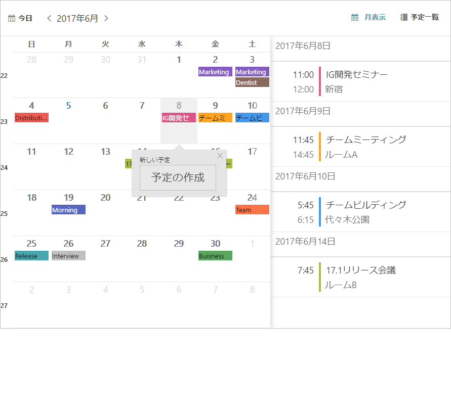
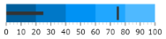

# 2017 Volume 1 の新機能

import ApiLink from 'docs-template/components/mdx/ApiLink.astro';

# 2017 Volume 1 の新機能

このトピックでは、\{environment:ProductFamilyName\}™ 2017 Volume 1 リリースのコントロールと新機能および拡張機能を紹介します。

## 新機能の概要

以下の表に 2017 Volume 1 の新機能の概要を示します。追加の詳細は以下のとおりです。

### igSpreadsheet

機能 | 説明
---|---
[igSpreadsheet - 新しいコントロール](#spreadsheet)| igSpreadsheet は、最新のあらゆるブラウザーで Excel ドキュメントを視覚化する jQuery ウィジェットです。

### igScheduler

機能 | 説明
---|---
[igScheduler - 新しいコントロール](#scheduler)| igScheduler は、時間範囲および関連アクティビティを表示し、管理するスケジュール ソリューションを提供する jQuery ウィジェットです。

### igDataSource

機能 | 説明
---|---
[テキストでフィルターする](#filterbytext)| igDataSource コンポーネントは、すべてのフィールドで特定の単語または句を検索する方法を提供します。

### igGrid

機能 | 説明
---|---
[データ処理](#griddatehandling)| igGrid は、別のタイム ゾーンにあるクライアントで日付値の表示および編集を制御する方法を提供します。
[キャプションのカスタマイズ化](#gridcaption)| igGrid の新しいキャプションはよりカスタマイズしやすくなりました。
[GroupBy 集計](#groupSummaries)| GroupBy 機能により集計行を各グループのデータ アイランドの下に表示できるようになりました。

### igCombo

機能 | 説明
---|---
[Knockout の Disable ハンドラー](#comboKnockoutDisable)| Knockout の Disable バインディング ハンドラーがコンボで実装されます。

### Editors

機能 | 説明
---|---
[Knockout の Disable ハンドラー](#editorsKnockoutDisable)| Knockout の Disable バインディング ハンドラーがエディターで実装されます。

### igNumericEditor

機能 | 説明
---|---
[10 進数の丸み](#roundDecimals)| 数値エディターに小数部を持つ値の丸みを許可する新しい <ApiLink type="ignumericeditor" member="roundDecimals" section="options" label="roundDecimals" /> オプションを追加しました。

### igDateEditor/igDatePicker

機能 | 説明
---|---
[データ処理](#dateHandling)| データ変換を処理する際にエディターの設定が必要です。

### igDatePicker

機能 | 説明
---|---
[日付の選択オプション MVC ラッパー](#pickerOptionsWrapper) | DatePicker MVC ラッパーを使用する場合に、日付の選択オプションの追加のラッパーが利用できます。

### igDataChart

機能 | 説明
---|---
[ズームを有効にするオプション](#zoomEnablingProperties) | <ApiLink type="igDataChart" member="isHorizontalZoomEnabled" section="options" label="isHorizontalZoomEnabled" /> および <ApiLink type="igDataChart" member="isHorizontalZoomEnabled" section="options" label="isVerticalZoomEnabled" /> と呼ばれる新しいオプションが追加されました。水平軸または垂直軸でズームを許可するかどうかを制御します。

### igMap

機能 | 説明
---|---
[OpenStreet タイル パス](#tilePathProperty) | OpenStreet タイル ソースで <ApiLink type="igMap" member="backgroundContent.tilePath" section="options" label="tilePath" /> オプションが <ApiLink type="igMap" member="backgroundContent" section="options" label="backgroundContent" /> オプションに追加されました。

### igRadialGauge, igLinearGauge, igBulletGraph
機能 | 説明
---|---
[デザインの更新](#gaugeDesignChanges) | ゲージのビジュアルが更新されました。

## <a id="spreadsheet"></a>igSpreadsheet

2017.1 バージョンで igSpreadsheet コントロールを追加しました。最新のあらゆるブラウザーで Excel ドキュメントを視覚化する jQuery ウィジェットです。MVC バージョンでは、コントロールの以下の領域と機能が使用できます。

-   構成可能なコンポーネント領域
    -   数式バー
    -   コンテキスト メニュー
    -   タブ バー領域
    -   ヘッダー

-   コントロールの変更

    -   選択
    -   サイズ変更
    -   非表示
    -   ペインのフリーズ
    -   ペインの分割
    -   ズーム

-   データの変更
    -   セル、列、行の挿入と削除
    -   元に戻す / やり直し
    -   コピー / 貼り付け
    -   データ検証
    -   ワークシート
    -   ハイパーリンク

-   外観の構成
    -   グリッド線
    -   セルの配置
    -   セルの境界線
    -   フォント スタイル


#### 関連トピック
-   [igSpreadsheet の概要](/igspreadsheet-overview)
-   [igSpreadsheet の追加](/adding-igspreadsheet)
-   [igSpreadsheet の構成](configuring-igspreadsheet.html)


#### 関連サンプル
-   [概要](\{environment:SamplesUrl\}/spreadsheet/overview)
-   [表示の構成](\{environment:SamplesUrl\}/spreadsheet/create-view-save)
-   [エクセル ファイルからデータをインポート](\{environment:SamplesUrl\}/spreadsheet/loading-data)

## <a id="igScheduler"></a> igScheduler
### 新しいコントロール

`igScheduler`™ コントロールは、時間範囲および関連アクティビティを表示し、管理するスケジュール ソリューションを提供します。

### サポートされる機能
-   予定の作成、編集、削除
    -   月表示で構成可能な予定表示モード (インジケーターまたはイベントの件名)
    -   予定を色付きリソースへの割り当て
-   別のビューの使用 (月表示および予定一覧ビュー)
    -   月表示および予定一覧ビューの間の切り替え
    -   月表示での予定一覧ビュー
    -   構成可能な予定一覧ビューの日の表示範囲
-   終日イベントのサポート
-   デスクトップ、タブレット、および携帯レイアウト
-   レスポンシブ デザイン
    -   デスクトップ環境に最適化された UI
-   リソースの色スキーマ サポート
-   キーボード ナビゲーション サポート
-   ローカライズのサポート



#### 関連トピック
-   [igScheduler の概要](/igScheduler-overview)
-   [igScheduler の構成](/igscheduler-configuring)
-	[igScheduler の追加](/igscheduler-adding-igscheduler)
-	[igScheduler の構成](/igscheduler-configuring)
-	[igScheduler のスタイル設定](/igscheduler-using-themes)
-	[アクセシビリティの遵守 (igScheduler)](/igscheduler-accessibility-compliance)
-	[既知の問題と制限 (igScheduler)](/igscheduler-known-limitations)

#### 関連サンプル

-   [igScheduler 予定一覧ビュー](\{environment:SamplesUrl\}/scheduler/agenda-view)
-   [igScheduler 予定インジケーター](\{environment:SamplesUrl\}/scheduler/appointment-indicators)

## igDataSource

### <a id="filterbytext"></a> テキストでフィルタリング

igDataSource コンポーネントは、<ApiLink pkg="ig" type="datasource" member="filterByText" section="methods" label="filterByText" /> メソッドによってすべてのフィールドで特定の単語または句を検索する方法を提供します。

#### 関連トピック
-   [igDataSource の概要](/igdatasource-igdatasource-overview)

#### 間連サンプル
-   [簡易なフィルタリング](\{environment:SamplesUrl\}/grid/simple-filtering)

## igGrid

### <a id="griddatehandling"></a> データ処理

<ApiLink type="iggrid" member="enableUTCDates" section="options" label="enableUTCDates" /> オプションが変更しました。日付のシリアル化のみに影響します。 日付はローカル時間およびゾーン値の代わりにクライアント側の日付を [UTC ISO 8061](https://en.wikipedia.org/wiki/ISO_8601#UTC) 文字列としてのシリアル化されます。

日付の表示を処理するには、新しい <ApiLink type="iggrid" member="columns.dateDisplayType" section="options" label="dateDisplayType" /> オプションはグリッドの列定義に設定できます。`date` 型の列のみに影響します。

#### 関連トピック
-   [17.1 の enableUTCDates オプションの移行](/migrating-enableUTCDates-option-in-17-1)

### <a id="gridcaption"></a> グリッドのキャプション

カスタマイズするために igGrid のキャプションで HTML 要素を描画できます。初期化を制御するイベントも追加しました。

### <a id="groupSummaries"></a> GroupBy 集計

GroupBy 集計機能は、そのアイランドにあるデータ列の集計情報を表示するグループ データ アイランドの上下に追加の集計行を表示します。集計行は、関連するグループが展開された場合のみ表示されます。


#### 関連トピック
-   [GroupBy 集計の機能概要 (igGrid)](/iggrid-groupby-summaries)

#### 関連サンプル
-   [集計とグループ化](\{environment:SamplesUrl\}/grid/grouping)

## igCombo

### <a id="comboKnockoutDisable"></a> Knockout の Disable ハンドラー

開発者がコンボ コントロールに Knockout の [`disabled`](http://knockoutjs.com/documentation/disable-binding.html) バインディング ハンドラーを適用したい場合、ハンドラーは動作せず、自動的に有効/無効にしません。コンボにコントロールの有効化/無効化を処理する特別なロジックがあります。そのため、Knockout `disabled` ハンドラーを使用時に予期される動作を実装する追加の `igComboDisable` バインディング ハンドラーが作成されます。

#### 関連トピック
-   [Knockout サポートの構成 (igCombo)](/igcombo-knockoutjs-support#)

## エディター

### <a id="editorsKnockoutDisable"></a> Knockout の Disable ハンドラー

開発者がエディターに Knockout の [`disabled`](http://knockoutjs.com/documentation/disable-binding.html) バインディング ハンドラーを適用したい場合、ハンドラーは動作せず、自動的に有効/無効にしません。エディターにコントロールの有効化/無効化を処理する特別なロジックがあります。そのため、Knockout `disabled` ハンドラーを使用時の予期される動作を実装する追加の `igEditorDisable` バインディング ハンドラーが作成されます。

#### 関連トピック
-   [Knockout サポートの構成 (エディター)](../../02_Controls/igEditors/Config/02_Configuring Knockout Support (Editors).mdx)

## igNumericEditor

### <a id="roundDecimals"></a> 10 進数の丸み

製品の以前バージョンで、ユーザーが `maxDecimals` オプションで定義される数より大きい小数位がある値を数値エディターに入力すると、値が切り捨てられます。つまり、`maxDecimals` が `3` に設定されるエディターが `123.4567` の値を受けると、`123.456` に切り捨てられます。製品の 17.1 バージョンで新しい <ApiLink type="ignumericeditor" member="roundDecimals" section="options" label="roundDecimals" /> オプションを追加しました。デフォルトで有効で、JavaScript の `Math.round()` 関数を使用して数値を丸めます。`123.4567` の値は丸めて、エディターで `123.457` として表示されます。<ApiLink type="ignumericeditor" member="roundDecimals" section="options" label="roundDecimals" /> オプションが無効な場合、値を切り捨て、以前のバージョンと同じように `123.456` を表示します。

## igDateEditor/igDatePicker

### <a id="dateHandling"></a> データ処理

エディターの日付をクライアントからサーバーへ、またはサーバーからクライアントへ転送する場合、オプション <ApiLink type="igdateeditor" member="enableUTCDates" section="options" label="enableUTCDates" /> および <ApiLink type="igdateeditor" member="displayTimeOffset" section="options" label="displayTimeOffset" /> を使用してエディターを構成し、適切に日付を転送します。

#### 関連トピック
-   [17.1 の enableUTCDate オプションの移行](/igDateEditor-migrating-date-handling-in-17-1)
-   [Ignite UI コントロールを異なるタイム ゾーンで使用](/Using-igniteui-controls-in-different-time-zones)

## igDatePicker

### <a id="pickerOptionsWrapper"></a> 日付の選択オプション MVC ラッパー

追加の MVC ラッパーを使用して DatePicker MVC ラッパーが日付の選択オプションの定義を許可するよう拡張されます。新しいラッパーは、すべての jQuery UI 日付の選択オプションを含み、igDatePicker に適用することができます。以下は、MVC で構成する方法です。

```
@(Html.Infragistics()
	.DatePicker()
	.DropDownAnimationDuration(1000)
	.DatePickerOptions(options => {
		 options.DefaultDate("+8");
		 options.MinDate("-5d");
		 options.MaxDate("+10d");

		 options.FirstDay(FirstWeekDay.Monday);
		 options.ShowWeek(true);

		 options.ShowOtherMonths(true);
		 options.SelectOtherMonths(true);

		 options.ChangeMonth(true);
		 options.ChangeYear(true);
		 options.AddClientEvent("onChangeMonthYear", "onChangeMonthYearHandler");

		 options.ShowButtonPanel(true);
		 options.GoToCurrent(true);

		 options.ShowAnim(AnimationEffect.Show);

		 options.AddClientEvent("onSelect", "onSelectHandler");
		 options.AddClientEvent("onClose", "onCloseHandler");
	})
	.Render())
```

## igDataChart
### <a id="zoomEnablingProperties"></a> ズームを有効にするオプション

<ApiLink type="igDataChart" member="isHorizontalZoomEnabled" section="options" label="isHorizontalZoomEnabled" /> および <ApiLink type="igDataChart" member="isVerticalZoomEnabled" section="options" label="isVerticalZoomEnabled" /> と呼ばれる新いオプションが追加されました。既存の <ApiLink type="igDataChart" member="horizontalZoomable" section="options" label="horizontalZoomable" /> および <ApiLink type="igDataChart" member="verticalZoomable" section="options" label="verticalZoomable" /> オプションは非推奨になりました。 非推奨のオプションは後方互換性のために残されています。

## igMap
### <a id="tilePathProperty"></a> OpenStreet のタイル パス

Open Street Map は、`backgroundContent` オブジェクトの `tilePath` オプションを使用してカスタム タイル ソースを使用できます。

**JavaScript の場合**

	$(function () &#123;
            $("#map").igMap(&#123;
                width: "700px",
                height: "500px",
                windowRect: &#123; left: 0.1, top: 0.1, height: 0.7, width: 0.7 &#125;,
                // specifies imagery tiles from OpenStreetMap
                backgroundContent: &#123;
                    type: "openStreet",
                    tilePath: "tile.openstreetmap.org/&#123;Z&#125;/&#123;X&#125;/&#123;Y&#125;.png"
                &#125;
            &#125;);
        &#125;);
		
この変更の前は `tilePath` は Bing Maps のみに適用可能でした。変更後は Open Street Maps でも使用可能となります。

プロトコル指定子 (*http:* または *https:*) を URL から解除すると、コントロールがホストの web サイトのプロトコルを検出、使用できます。`tilePath` オプションで明示的に設定してコントロールのプロトコルを設定できます。

**JavaScript の場合**

    tilePath: "https://tile.openstreetmap.org/&#123;Z&#125;/&#123;X&#125;/&#123;Y&#125;.png"

`{Z}`、`{X}`、および `{Y}` トークンは、タイル描画で各タイルのズーム、水平位置、および垂直位置で置き換えられます。

## igRadialGauge, igLinearGauge, igBulletGraph
### <a id="gaugeDesignChanges"></a> デザインの更新

`infragistics.theme.css` を含む場合、igRadialGauge、 igLinearGauge および igBulletGraph に新しいスタイル設定があります。新しいスタイル設定は以下のようです:

#### igRadialGauge:


#### igLinearGauge:


#### igBulletGraph:

