---
title: "2016 Volume 2 の新機能"
slug: whats-new-in-2016-volume2
---

#2016 Volume 2 の新機能

このトピックでは、&#123;environment:ProductFamilyName&#125;™ 2016 Volume 2 リリースのコントロールと新機能および拡張機能を紹介します。

##新機能

以下の表に 2016 Volume 2 の新機能の概要を示します。追加の詳細は以下のとおりです。

### 全般

機能 | 説明
---|---
&#123;environment:ProductName&#125; OSS | &#123;environment:ProductName&#125; ツールセットの一部がオープンソースになりました。 [GitHub](https://github.com/IgniteUI/ignite-ui) でリポジトリを参照してください。|
Angular 2 (RTM) 用の &#123;environment:ProductName&#125; ディレクティブ | &#123;environment:ProductName&#125; ウィジェットは Angular 2 のコンポーネント ラッパーがあります。詳細については、 [&#123;environment:ProductName&#125; Angular 2 GitHub](https://github.com/IgniteUI/igniteui-angular-wrappers) ページを参照してください。|
React (CTP)用の &#123;environment:ProductName&#125; コンポーネント | &#123;environment:ProductName&#125; ウィジェットは [React](https://facebook.github.io/react/) のコンポーネント ラッパーがあります。詳細については、[&#123;environment:ProductName&#125; Components for React](https://github.com/IgniteUI/igniteui-react) ページを参照してください。|
ASP.NET Core 1.0 MVC ヘルパー | &#123;environment:ProductName&#125; MVC ヘルパーで ASP.NET Core 1.0 がサポートされるようになりました。[&#123;environment:ProductName&#125; コントロールを ASP.NET Core 1.0 で使用](Using-IgniteUI-Controls-in-ASP.NET-Core-1.0-project.html) トピックを参照してください。|
ASP.NET Core 1.0 MVC タグ ヘルパー | &#123;environment:ProductName&#125; ASP.NET Core 1.0 MVC タグ ヘルパーを提供します。[&#123;environment:ProductName&#125; タグ ヘルパーの使用](Using-Ignite-UI-Tag-Helpers.html) トピックを参照してください。|
[新しい Javascript ファイル分割](#javascript-file-breakdown) | 変更の主要な目的は、特定の機能をロードするときに必要なコードの量を縮小することです。 |
DPI スケール | デフォルトで 高DPI スケールを有効にすることにより、コンポーネントに鮮明でクリアな外観を実現できます。デフォルトで 高DPI スケールを有効にしたコンポーネントは、igDataChart、igPieChart、igFunnelChart、igDoughnutChart、igRadialGauge、igLinearGauge、igBulletGraph、igSparkline、igRadialMenu です。 |
標準モジュール サポート | すべての IgniteUI JavaScript ファイルは AMD モジュール定義が含まれます。したがって、ファイルは Require.JS、System.JS など、標準モジュール ローダーを使用してロードできます。|
[&#123;environment:ProductName&#125; NuGet パッケージ](#ignite-ui-nuget-packages) | .NET Core アプリケーションを作成するためのパッケージをはじめとして、新しい &#123;environment:ProductName&#125; NuGet パッケージを提供します。|

### igCategoryChart

機能 | 説明
---|---
[新しいコントロール](#igcategorychart)| 簡易な API を使用して簡単にカテゴリ データ表示を構成します。 |

### igDataChart

機能 | 説明
---|---
[新しいプロパティ](#new-chart-property) | 単一視覚要素に統合ざれた列の配置ロジックを決定するための、新しい ConsolidatedColumnVerticalPosition プロパティを提供しています。| 
[機能向上](#performance-enhancements)| Infragistics 2016 volume 2 リリースでは、igDataChart コントロールのパフォーマンスを改善しました。 |
[デザインの更新](#design-changes) | igDataChart、igPieChart、igFunnelChart、igDoughnutChart、igRadialGauge、igLinearGauge、igBulletGraph および igSparkline コントロールのデフォルト値を更新しました。|
[ファイル サイズの縮小](#file-size-reduction) | カテゴリ チャートの読み込みに必要なサイズを縮小しました。また、igDataChart コントロールをモジュール化しました。|

### igDataSource

機能 | 説明
---|---
新しいグループ化機能| igDataSource はグループ化をサポートしグループ化の展開および縮小状態を保持します。 |
並べ替えパフォーマンスの最適化 | ローカルの並べ替えが 10 倍まで高速化されています。 |

### igFunnelChart

機能 | 説明
---|---
[ラベルのスタイル設定](#funnel-styling) | ファンネル チャートの内部ラベル及び外部ラベルの色を指定できるようになりました。

### igGrid

機能 | 説明
---|---
[Group By の向上](#groupby-improvements) | Group By には仮想化サポートおよび行の展開/縮小のための API を追加しました。 |
並べ替えパフォーマンスの最適化 | ローカルの並べ替えが 10 倍まで高速化されています。 |
[複数行レイアウトでのインライン編集](#mrl-inline-editing)| 複数行レイアウト機能が行およびセルのインライン編集をサポートします。 |
複数列ヘッダーの縮小可能な列グループ | 縮小可能な列グループは、複数列ヘッダーをより小さいデータ セットに縮小/展開する方法を提供します。 |
列セッター | 列のコレクションをランタイムで変更できるようになりました。 |
igGrid モーダル ダイアログの拡張性| ダイアログを含むグリッド機能 (更新、フィルター、並べ替え、非表示、GroupBy、列移動) に、カスタムのダイアログ実装を可能にする、新しい `dialogWidget` オプションを追加しました。 - [サンプル](&#123;environment:SamplesUrl&#125;/grid/custom-modal-dialog)または[トピック](Extending_igGrid_Modal_Dialog.html)を参照してください。 |
リアルタイム データにバインド サンプル| igGrid をリアルタイム データにバインドすることを紹介するサンプルが追加されました - [サンプルの表示](&#123;environment:SamplesUrl&#125;/grid/binding-real-time-data) |
パフォーマンス オプション サンプル| igGrid のパフォーマンス オプションを紹介するサンプルが追加されました - [サンプルの表示](&#123;environment:SamplesUrl&#125;/grid/grid-performance). |

### igPieChart

機能 | 説明
---|---
[スライスの選択](#slice-selection) | igPieChart コントロールでスライスの選択が可能になりました。| 
[新しいイベント](#pie-event)| ラベルをクリックすると発生する新しいイベント。 |
[ラベルの色付け](#pie-label-coloring) | 円チャートの内部ラベル及び外部ラベルの色を指定できるようになりました。|
[データ パス オプション名の変更](#pie-data-path-renaming) | valueMemberPath および labelMemberPath オプションの名前を変更しました。|

### igScroll

機能 | 説明
---|---
[新しいコントロール](#igscroll)| igScroll™ コントロールがさまざまなブラウザーとデバイスで一貫性のあるエクスペリエンスを提供します。 |

### igZoombar

機能 | 説明
---|---
カスタム コンポーネントとの統合| igZoombar は、サードパーティーのカスタム コンポーネント用のプラッグ可能な統合機能を公開します。[igZoombar のカスタム コンポーネントとの統合](igZoombar-Integration-with-Custom-Components.html) トピックを参照してください。|

## igCategoryChart

###  新しいコントロール

Infragistics 2016 Volume 2 リリースでは、カテゴリ チャートという新しいコントロールを提供します。簡易な API を使用して、チャートにカテゴリ データの表示を簡単に構成できます。データ (コレクションまたはコレクションのコレクション) をバインドするのみで作業を開始します。

スマート データ アダプターを使用して、データは分析されて適切なビジュアライゼーションが描画されます。たとえば ｃhartType を Auto に設定した場合、大きなデータセットで折れ線チャートを描画する間、コントロールは小さなデータセットを提供して列チャートがプロットされるかどうかを決定します。

一方、 chartType を line、area、column、point、spline、splineArea、stepArea、stepLine または waterfall に設定して、チャート タイプを明示的に指定することも可能です。

その他のカテゴリチャート コントロールの直感的な動作の例は、明示的にラベルを設定する必要がないことです。カテゴリ チャートは、最初の適切な文字列プロパティを使用し、ラベルに使用します。

コントロールは簡単に構成できるよう構築されており、エンジンとして igDataChart コントロールを使用しています。つまり、高パフォーマンスでパワフルなデータ チャートの利点を備えています。

#### 関連トピック:
-   [igCategoryChart の概要](/controls/igcategorychart/categorychart-overview)

### 新しい JavaScript ファイルの分割

igDataChart、igPieChart、igFunnelChart、igDoughnutChart、igRadialGauge、igLinearGauge、igBulletGraph および igMap コントロールのすべては、必要とする js ファイルで重要な変更が導入されました。変更の主要な目的は、特定の機能をロードするときに必要なコードの量を縮小することです。機能によって正確な順序で必要なファイルのみを含む、結合されたファイルをダウンロードするために、スクリプト コンバイナーを更新しました。必要な機能に基づいて適切なファイルの読み込みが可能な igLoader も更新しました。

手動でファイルを読み込む場合、以下のファイルが必要になります。

igDataChart、igCategoryChart、igPieChart、igFunnelChart、igDoughnutChart、igRadialGauge、igLinearGauge、igBulletGraph および igMap の場合は最初に次のファイルを追加します。

* infragistics.util.js

* infragistics.util.jquery.js

* infragistics.ext_core.js

* infragistics.ext_collections.js

* infragistics.ext_ui.js

* infragistics.dv_core.js

igDataChart、igCategoryChart、igPieChart、igDoughnutChart、igRadialGauge、igLinearGauge、igBulletGraph および igMap の場合は次のファイルを追加します。

* infragistics.dv_geometry.js

igRadialGauge を読み込む場合:

* infragistics.radialgauge.js

* infragistics.ui.radialgauge.js

igLinearGauge を読み込む場合:

* infragistics.lineargauge.js

* infragistics.ui.lineargauge.js

igBulletGraph を読み込む場合:

* infragistics.bulletgraph.js

* infragistics.ui.bulletgraph.js

igPieChart を読み込む場合:

* infragistics.piechart.js

* infragistics.dvcommonwidget.js

* infragistics.ui.piechart.js

igDoughnutChart を読み込む場合、円チャートに必要なファイルに加えて次のファイルも追加します。

* infragistics.doughnutchart.js

* infragistics.ui.doughnutchart.js

igFunnelChart を読み込む場合:

* infragistics.funnelchart.js

* infragistics.ui.funnelchart.js

igDataChart または igMap の機能を読み込む場合:

* infragistics.datachart_core.js

igMap を読み込む場合:

* infragistics.ext_text.js

* infragistics.ext_io.js

* infragistics.ext_web.js

* infragistics.dv_geo.js

* infragistics.datachart_scatter.js

* infragistics.dvcommonwidget.js

* infragistics.geographicmap.js

* infragistics.ui.geographicmap.js

igDataChart を読み込む場合、必要なチャート機能を読み込んでから次のファイルを追加します:

* infragistics.datachart.js

* infragistics.ui.chart.js

チャートに任意のカテゴリ シリーズ (柱状、エリア、折れ線、スプラいン、splineArea、stepLine、stepArea、ポイント、ウォーターフォール) を読み込む場合:

* infragistics.datachart_categorycore.js

* infragistics.datachart_category.js

垂直カテゴリシリーズ (棒) を読み込む場合:

* infragistics.datachart_categorycore.js

* infragistics.datachart_category.js

* infragistics.datachart_verticalcategory.js

チャートに散布シリーズ ( 散布、scatterLine、scatterSpline、highDensityScatter、バブル) を読み込む場合:

* infragistics.datachart_scatter.js

範囲カテゴリシリーズ (rangeColumn、rangeArea) を読み込む場合:

* infragistics.datachart_categorycore.js

* infragistics.datachart_rangecategory.js

範囲カテゴリシリーズ (rangeColumn、rangeArea) を読み込む場合:

* infragistics.datachart_extendedaxes.js

* infragistics.datachart_polar.js

極座標シリーズ (radialColumn, radialLine, radialPie, radialArea) の場合:

* infragistics.datachart_extendedaxes.js

* infragistics.datachart_radial.js

積層シリーズの場合:

* infragistics.datachart_categorycore.js

* infragistics.datachart_category.js

* infragistics.datachart_stacked.js

注釈レイヤー (crosshairLayer, itemToolTipLayer, categoryToolTipLayer, categoryHighlightLayer)  の場合:

* infragistics.datachart_annotation.js

チャート凡例の場合:

* infragistics.legend.js

* infragistics.ui.chartlegend.js

新しい igCategoryChart コントロールを読み込む場合、データ チャートにカテゴリ シリーズをロードするのに必要なファイルに加えて以下のファイルも追加します。

* infragistics.dv_dataseriesadapter.js

* infragistics.categorychart.js

* infragistics.dvcommonwidget.js

* infragistics.ui.basechart.js

* infragistics.ui.categorychart.js

### &#123;environment:ProductName&#125; NuGet パッケージ

2016 volume 2 リリースより、3 つの &#123;environment:ProductName&#125; NuGet パッケージが新規追加されました。これらのパッケージでアプリケーションをより速くセットアップできるため、生産性の向上につながります。パッケージは、プロジェクトに必要な &#123;environment:ProductName&#125; ファイルおよび参照を自動的に追加します。

新しい ASP.NET では、ほとんどのモジュールが NuGet パッケージとしてラップされています。そのため、ASP.NET Core 上に構築されている新しい  MVC ラッパーも NuGet パッケージとして提供されます。

NuGet パッケージが製品インストーラーでインストールされる際、新しいローカル フィードが作成されます。そのため、NuGet パッケージ マネージャーを設定する必要はありません。次回 Visual Studio を実行した際にローカル NuGet フィード Infragistics (ローカル) が表示されます。

#### 関連トピック:
- [Using &#123;environment:ProductName&#125; パッケージの使用](/general-and-getting-started/using-ignite-ui-nuget-packages)

## igDataChart

###  新しいチャート オプション

本リリースでは、単一視覚要素に統合ざれた列の配置ロジックを決定するための、新しい consolidatedColumnVerticalPosition オプションを提供します。

プロパティは以下の値を含みます。

*Minimum* - 統合された項目は最小値を使用して配置されます。

*Maximum* - 統合された項目は最大値を使用して配置されます。

*Median* - 統合された項目は中央値を使用して配置します。

*RelativeMinimum* - 統合された項目が相対する軸の参照値に一番近い値を使用して配置します。

*RelativeMaximum* - 連結された項目が相対する軸の参照値に一番遠い値を使用して配置します。

#### 関連トピック:
- [シリーズ タイプ](/controls/igdatachart/overview/series-types)

###  機能向上
igDataChart コントロールのパフォーマンスを著しく向上しました。
igDataChart の 16.1 と 16.2 の違いは、データセットが 5 万ポイントを含み、バインドされたデータの最後に 10 ミリ秒ごとに新しいデータ ポイントを追加してからデータの初めからポイントを取り除く、というライブ更新において明確です。

**Chrome:**

16.1: 70fps (1 秒あたりのフレーム数)

16.2: 144fps

**Edge:**

16.1 55fps

16.2: 105fps

**Internet Explorer:**

16.1: 44fps

16.2: 100fps

上記のデータから、この raw インプット シナリオでは、16.2 の igDataChart が 16.1 と比べておおよそ 2 倍速くなっていることが明らかになっています。

###  デザインの更新
Infragistics 2016 volume 2 リリースでは、igDataChart、igPieChart、igFunnelChart、igSparkline、igRadialGauge、igLinearGauge、igBulletGraph コントロールのデフォルト値を更新しました。 

以下のスクリーンショットで新しいデフォルト値と以前のデフォルト値を比較します。

#### 柱状チャート

**現在**  

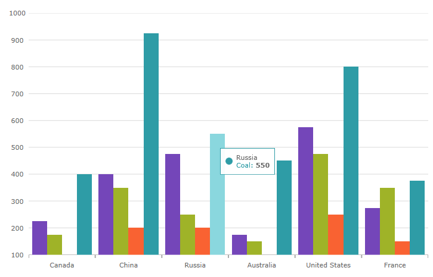

**以前**

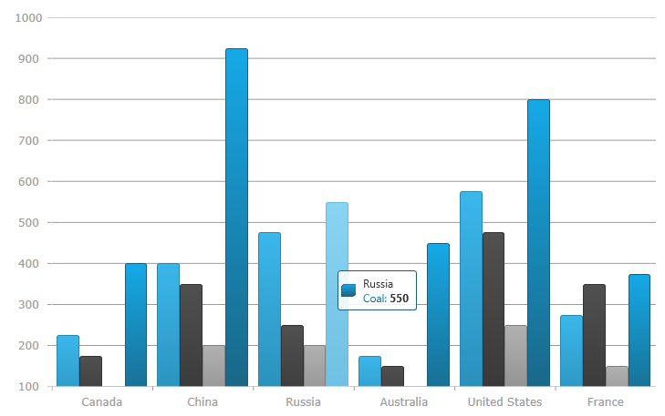

#### 凡例

**現在**

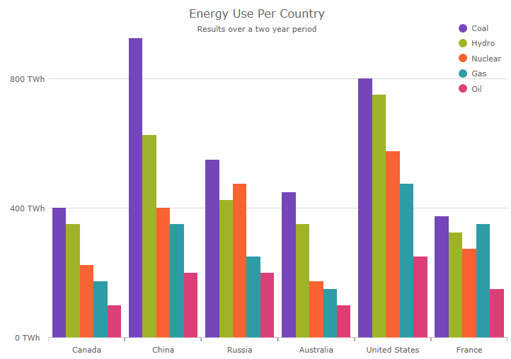

**以前**

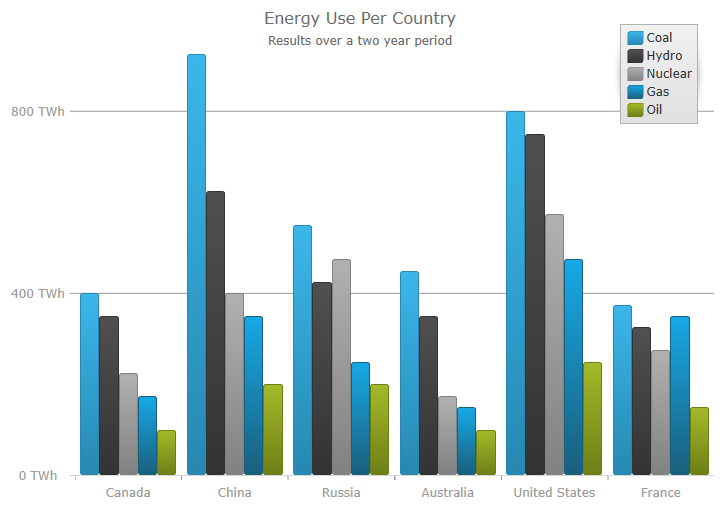

#### 積層型エリア

**現在**

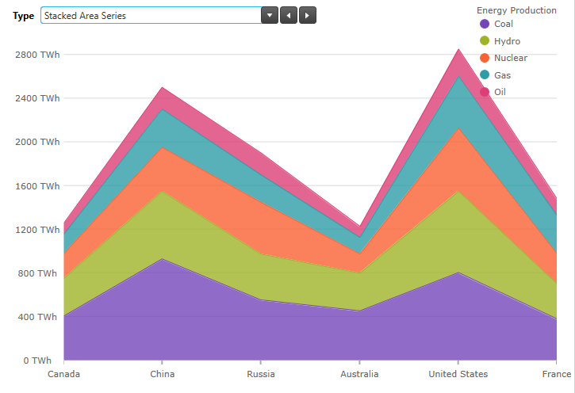

**以前**

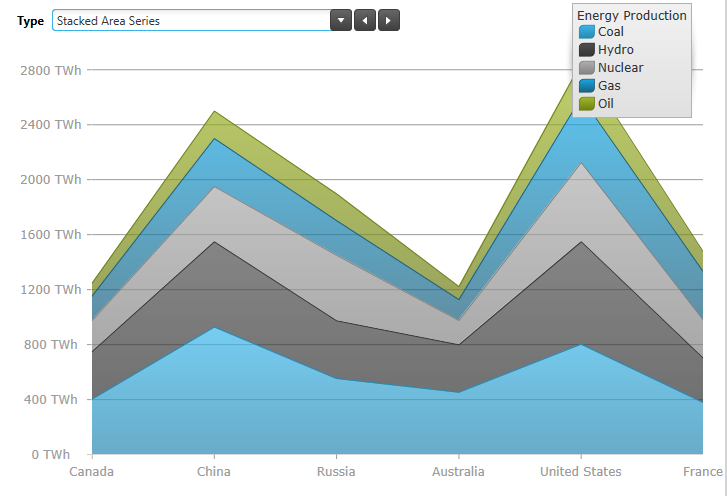

#### 財務チャート

**現在**

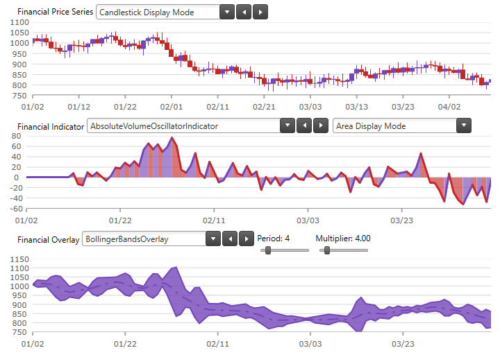

**以前**

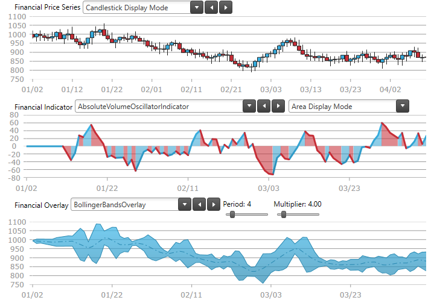

#### 円チャート

**現在**

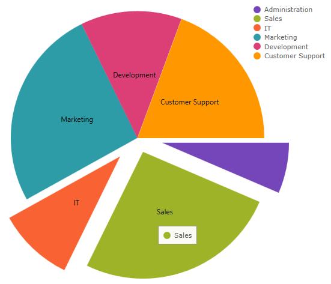

**以前**

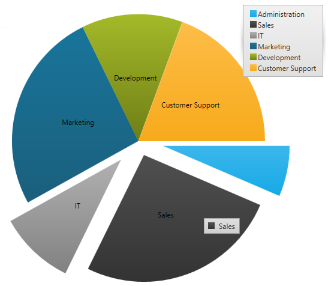

#### ファンネル チャート

**現在**

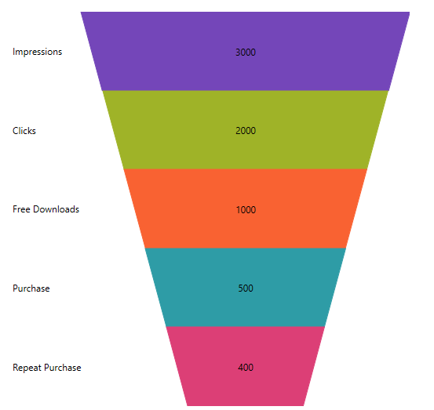

**以前**

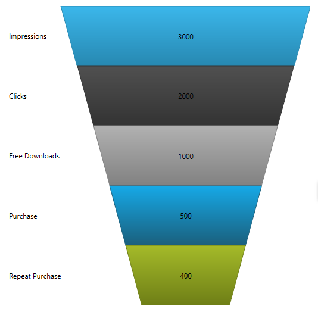

#### ドーナツ型チャート

**現在**

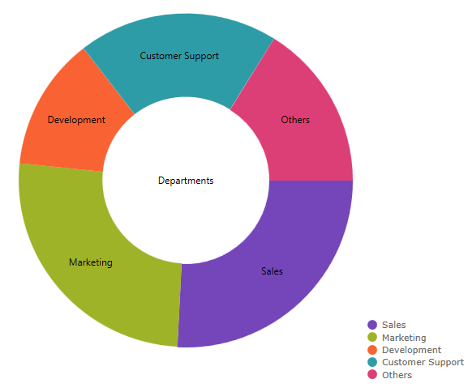

**以前**

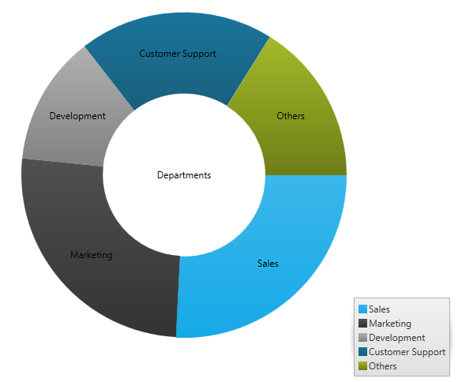

#### ラジアル ゲージ

**現在**

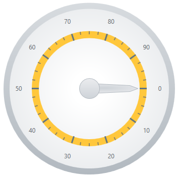

**以前**

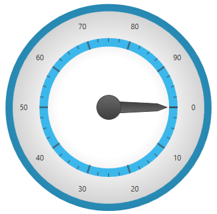

#### リニア ゲージ

**現在**

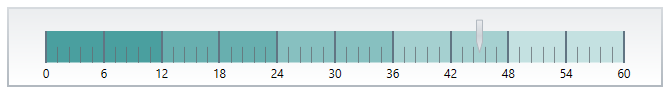

**以前**

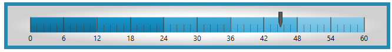

#### ブレット グラフ

**現在**

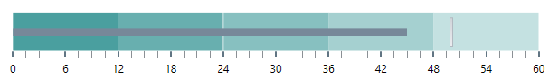

**以前**

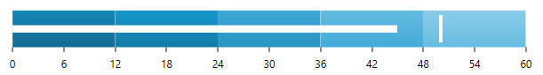

#### スパークライン

**現在**

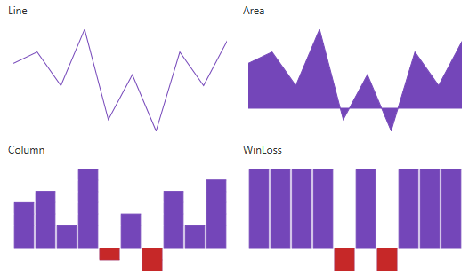

**以前**

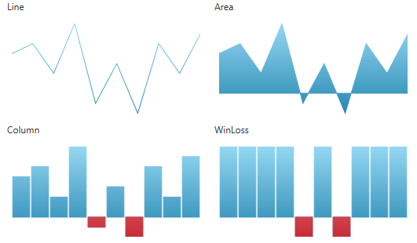

###  ファイル サイズの縮小
16.2 と 16.1 を比べて、カテゴリ シリーズを igDataChart (柱状、アリア、折れ線、スプライン、splineArea、stepLine、stepArea、ウォーターフォール) にロードするために必要なファイルのサイズは 24% 縮小されました。

さらに、igDataChart の機能を個別のモジュールに分割し必要な機能のみをロードできる詳細な制御が可能になりました。したがって、ペイロード サイズも縮小されます。チャート機能モジュールが重複しなくなったため、複数の機能セットをロードするときのペイロード サイズを抑えることができます。

## igFunnelChart
###  新しいスタイル設定のプロパティ 

[`textColor`](&#123;environment:jQueryApiUrl&#125;/ui.igfunnelchart#options:textColor) および [`outerLabelTextColor`](&#123;environment:jQueryApiUrl&#125;/ui.igfunnelchart#options:outerLabelTextColor) オプションを使用して、ラベルがスライスの内、または外に表示されることにとって、異なる色を設定できます。さらに、[`textStyle`](&#123;environment:jQueryApiUrl&#125;/ui.igfunnelchart#options:textStyle)   および [`outerLabelTextStyle`](&#123;environment:jQueryApiUrl&#125;/ui.igfunnelchart#options:outerLabelTextStyle) オプションを使用して、内部ラベルと外部ラベルのテキストをスタイル設定できます。
以下のスクリーンショットでは、内部ラベルと外部ラベルのテキストおよびスタイルを変更する方法を示します。

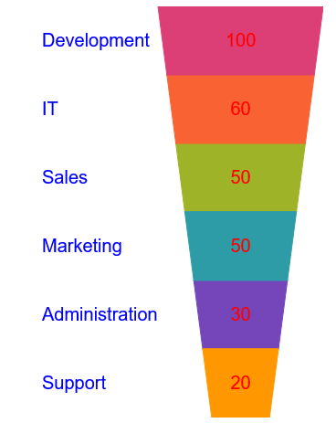

**関連トピック:** 

- [`textColor`](&#123;environment:jQueryApiUrl&#125;/ui.igfunnelchart#options:textColor) 

- [`outerLabelTextColor`](&#123;environment:jQueryApiUrl&#125;/ui.igfunnelchart#options:outerLabelTextColor) 

- [`textStyle`](&#123;environment:jQueryApiUrl&#125;/ui.igfunnelchart#options:textStyle) 

- [`outerLabelTextStyle`](&#123;environment:jQueryApiUrl&#125;/ui.igfunnelchart#options:outerLabelTextStyle)

## igGrid

###  Group By の向上

Group By の仮想化の統合機能が向上しました。
仮想化フレーム間でグループ化された行展開状態を保持し、エンドユーザー エクスペリエンスを向上します。
グループの行を [`expand`](&#123;environment:jQueryApiUrl&#125;/ui.iggridgroupby#methods:expand) し [`collapse`](&#123;environment:jQueryApiUrl&#125;/ui.iggridgroupby#methods:collapse) するための API メソッドが 2 つ追加されました。
ローカル グループ化パフォーマンスを最適化し 10 倍まで高速化しています。

#### 関連トピック
-   [列のグループ化の概要 (igGrid)](/controls/iggrid/features/columns/grouping/groupby-overview#api-usage)

#### 関連サンプル
-   [連続仮想化](&#123;environment:SamplesUrl&#125;/grid/virtualization-continuous)
-   [グループ化 API](&#123;environment:SamplesUrl&#125;/grid/grouping-api)

###  複数行レイアウトでのインライン編集

複数行レイアウトが構成されている場合、更新機能が行およびセルの編集モードで機能します。[`navigationIndex`](&#123;environment:jQueryApiUrl&#125;/ui.iggrid#options:columns.navigationIndex) オプションを使用して編集モードのエディターの順序を構成します。

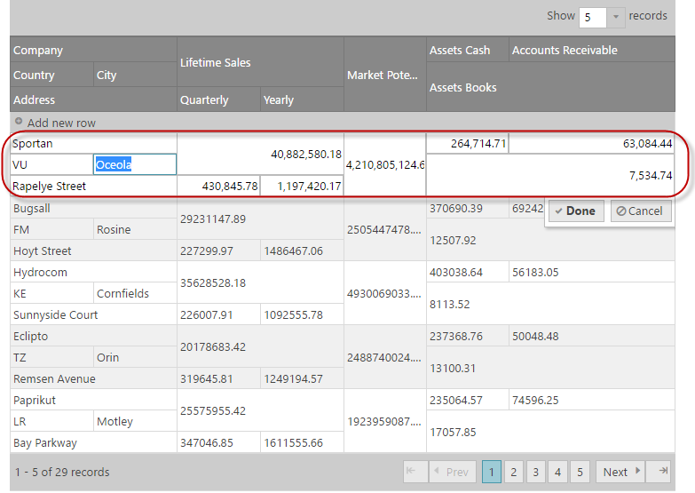

#### 関連トピック
-   [グリッドの複数行レイアウト](/controls/iggrid/features/multirowlayout#features-integration)

#### 関連サンプル
-   [複数行レイアウトのインライン編集](&#123;environment:SamplesUrl&#125;/grid/multi-row-layout-inline-editing)

## igPieChart

###  スライスの選択

igPieChart コントロールでスライスの選択が可能になりました。この機能はデフォルトで有効です。オプションを設定して単一および複数選択をサポートします。また、 [`selectionMode`](&#123;environment:jQueryApiUrl&#125;/ui.igPieChart#options:selectionMode) オプションを設定して単一および複数選択をサポートします。また、 [`selectedItem`](&#123;environment:jQueryApiUrl&#125;/ui.igPieChart#options:selectedItem) または [`selectedItems`](&#123;environment:jQueryApiUrl&#125;/ui.igPieChart#options:selectedItems) オプションを使用して選択されたスライスに関連付けられたデータ項目を取得します。

選択イベントも追加しました。一部はキャンセル可能なもので、特定のスライス選択の無効化が可能です。イベントは以下の通りです。

* [`selectedItemChanging`](&#123;environment:jQueryApiUrl&#125;/ui.igPieChart#events:selectedItemChanging)
* [`selectedItemChanged`](&#123;environment:jQueryApiUrl&#125;/ui.igPieChart#events:selectedItemChanged)
* [`selectedItemsChanging`](&#123;environment:jQueryApiUrl&#125;/ui.igPieChart#events:selectedItemsChanging)
* [`selectedItemsChanged`](&#123;environment:jQueryApiUrl&#125;/ui.igPieChart#events:selectedItemsChanged)

選択されたスライスは異なるスタイルで表示されるため特定しやすくなっています。以下のスクリーンショットでは、Marketing スライスが選択されています。

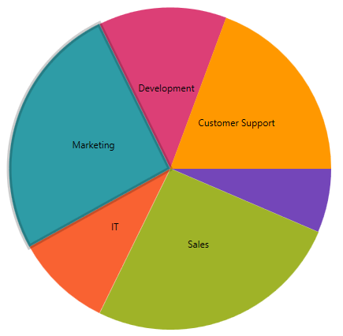

#### 関連トピック:
[igPieChart](/controls/igpiechart/igpiechart)

###  円チャートの新しいイベント

igPieChart コントロールには、スライスをクリックすると発生する [`labelClick`](&#123;environment:jQueryApiUrl&#125;/ui.igPieChart#events:labelClick) があります。

#### 関連トピック:
[igPieChart の概要](/controls/igpiechart/overview)

###  ラベルの色付け

次のオプションを設定して、ラベルをスライス内または外のどちらに表示するかに基づいて異なる色を指定できます。
- [`labelInnerColor`](&#123;environment:jQueryApiUrl&#125;/ui.igPieChart#options:labelInnerColor)
- [`labelOuterColor`](&#123;environment:jQueryApiUrl&#125;/ui.igPieChart#options:labelOuterColor)

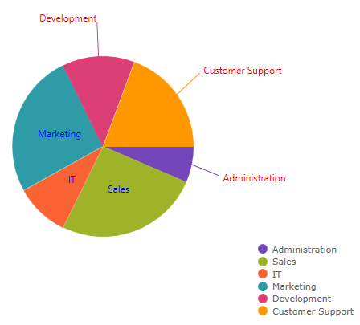

#### 関連トピック:

- [`labelInnerColor`](&#123;environment:jQueryApiUrl&#125;/ui.igPieChart#options:labelInnerColor)
- [`labelOuterColor`](&#123;environment:jQueryApiUrl&#125;/ui.igPieChart#options:labelOuterColor)

###  データ パス オプション名の変更
 [`valueMemberPath`](&#123;environment:jQueryApiUrl&#125;/ui.igPieChart#options:valueMemberPath)  および [`labelMemberPath`](&#123;environment:jQueryApiUrl&#125;/ui.igPieChart#options:labelMemberPath) オプションに代わって、igPieChart コントロールに新しいオプションを追加しました。 新規のオプションは [`dataValue`](&#123;environment:jQueryApiUrl&#125;/ui.igPieChart#options:dataValue) および [`dataLabel`](&#123;environment:jQueryApiUrl&#125;/ui.igPieChart#options:dataLabel) です。 新しいオプションの追加により、 [`valueMemberPath`](&#123;environment:jQueryApiUrl&#125;/ui.igPieChart#options:valueMemberPath)  および [`labelMemberPath`](&#123;environment:jQueryApiUrl&#125;/ui.igPieChart#options:labelMemberPath) は非推奨となります。

## igScroll

###  新しいコントロール

igScroll は、デスクトップ、ハイブリッド、およびモバイル環境でカスタム スクロールバーを有効にするスタンドアロン jQueryUI ウィジェットです。
すべてのデバイスのスクロール コンテナー間で一貫性のあるスクロール エクスペリエンスを作成できます。

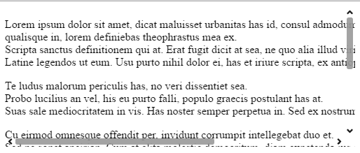

#### 関連トピック
-   [igScroll の概要](/controls/igscroll/overview)
-   [igScroll の構成](Configuring-igScroll.html)

#### 関連サンプル
-   [基本的な使用方法](&#123;environment:SamplesUrl&#125;/scroll/basic-usage)
-   [複数のコンテナーを一度にスクロール](&#123;environment:SamplesUrl&#125;/scroll/scrolling-multiple-containers)
-   [構成オプション](&#123;environment:SamplesUrl&#125;/scroll/configuration-options)

## igValidator

###  クレジット カードの検証を追加

[`creditCard`](&#123;environment:jQueryApiUrl&#125;/ui.igValidator#options:creditCard) オプションおよび入力規則を追加しました。

#### 関連トピック:
[Validation Rules](/controls/igvalidator/validation-rules)

## igEditors

###  EmailAddress および Compare Data Annotation 検証属性の追加

機能 | 説明
---|---
EmailAddress | テキスト エディターを標準の MVC 電子メールパターンで検証します。|
Compare | 関連付けられたエディターを比較する場合に使用します。たとえば、パスワード フィールドのパスワードが一致するかどうかという場面で使用されます。|