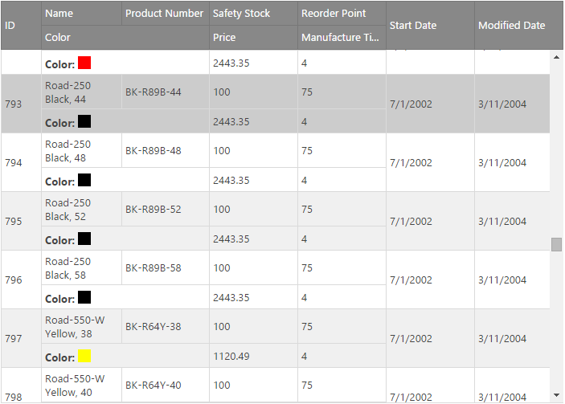
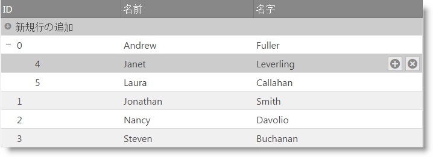
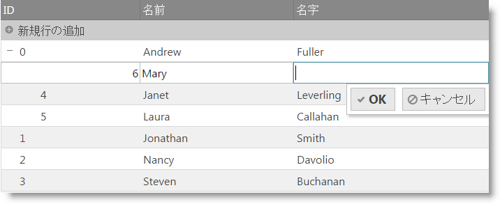
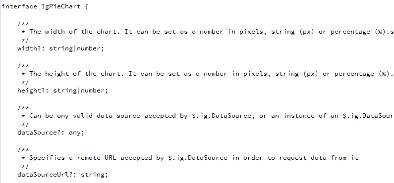
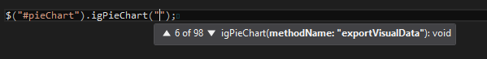
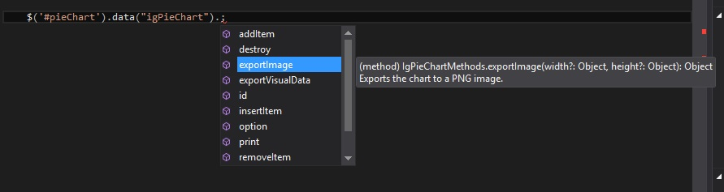

import ApiLink from 'docs-template/components/mdx/ApiLink.astro';

# 2016 Volume 1 の新機能

このトピックでは、&#123;environment:ProductFamilyName&#125;™ 2016 Volume 1 リリースのコントロールと新機能および拡張機能を紹介します。

## 新機能:

以下の表に 2016 Volume 1 の新機能の概要を示します。追加の詳細は以下のとおりです。

### 全般

機能|説明
---|---
新しい Bootstrap 4 テーマ|新しい Bootstrap 4 互換性のあるテーマが &#123;environment:ProductName&#125; に含まれます - [サンプルの表示](&#123;environment:SamplesUrl&#125;/themes/bootstrap4-default)。
Angular 2 コンポーネント (CTP) |&#123;environment:ProductName&#125; ウィジェットは Angular 2 のコンポーネント ラッパーがあります。詳細については、[&#123;environment:ProductName&#125; Angular 2 GitHub](https://github.com/IgniteUI/igniteui-angular-wrappers) ページを参照してください。|
新しいスケール可能なフォント アイコン|デフォルトの Infragistics テーマは画像アイコンの代わりに [jQuery UI フォント アイコン](https://github.com/mkkeck/jquery-ui-iconfont) を使用します。 |
Modernizr 3.x サポート|&#123;environment:ProductName&#125; は、Modernizr ライブラリを使用してタッチ環境を検出します。詳細については、[&#123;environment:ProductName&#125; コントロールのタッチ サポート](/touch-support-for-igniteui-for-jquery-controls)を参照してください。[Mordernizr 3.x](https://modernizr.com/) は、以前の Modernizr バージョンもサポートされます。 |

### igTileManager

機能|説明
---|---
スプリッター オプション|`splitterOptions` は `showSplitter` オプションに代わります。表示および非表示、その他複数のオプションが追加されました。スプリッターを縮小可能に構成し、collapsed/expanded イベントにアタッチできます。新しいオプションの使用は次のサンプルを参照ください - [サンプルの表示](&#123;environment:SamplesUrl&#125;/tile-manager/collapsible-splitter)。

### igDataSource

機能|説明
---|---
新しいフィールド オプション - `mapper`|dataType="object" のフィールドの場合、複合オブジェクトから複合データ抽出で使用する <ApiLink type="iggrid" member="columns.mapper" section="options" label="mapper" /> 関数の設定を許可します。その戻り値は特定のフィールドに実行されるすべてのデータ操作で使用されます。  詳細については、次のトピックを参照してください: [igDataSource 概要](/igdatasource-igdatasource-overview#schema-fields-mapper)|

### igGrid

機能|説明
---|---
新しい列オプション - mapper|dataType="object" の列の場合、複合オブジェクトから複合データ抽出で使用する、mapper 関数の設定を許可します。その戻り値は、その列に対するすべてのデータ操作（更新、フィルター、並べ替えなど）で使用されます - [サンプルの表示](&#123;environment:SamplesUrl&#125;/grid/handling-complex-objects)。  詳細については、次のトピックを参照してください: [列およびレイアウト](/iggrid-columns-and-layout#defining-mapper)|
ColumnFixing 機能は、パーセンテージで設定されるグリッド幅で使用できます。|ColumnFixing 機能は、グリッドの幅がパーセンテージで設定される場合に使用できるようになりました。 **注**: 列幅は依然としてピクセル単位で定義します。明示的に設定するか、<ApiLink type="iggrid" member="defaultColumnWidth" section="options" label="defaultColumnWidth" /> オプションを使用できます。|
[複数行レイアウト機能](#multi-row-layout)|複数行レイアウト機能は、複数の列および行にまたがるセルを含む多数の行で構成される複雑なグリッド レコード レイアウトを作成できます。 |
[チェックボックスの外観](#checkbox-appearance)|チェックマークが表示モードで操作できないことを示すためにチェックボックス列の外観が変更されました。 |
Excel からの貼り付けサンプル|Excel クリップボード データを igGrid に貼り付けることを紹介するサンプルが追加されました - [サンプルの表示](&#123;environment:SamplesUrl&#125;/grid/paste-from-excel)。 |

### igTreeGrid

機能|説明
---|---
[向上された更新機能](#treegrid-updating) |igTreeGrid の更新機能に、ルートおよび子レベル行を追加するための UI を導入しました。

### TypeScript サポート

サポートされる TypeScript のバージョンは 1.4 およびそれ以降です。

機能|説明
---|---
[共用体型のサポート](#union-types) |タイプ チェックを向上するためにウィジェット メンバーは共用体型をサポートします。
[Intellisense の機能向上](#intellisense-improvements) |Intellisense はオプションおよびメソッドで機能が向上しました。
[メンバーの説明](#member-descriptions) |すべてのメンバーに説明があります。

## igGrid

### 複数行レイアウト機能

複数行レイアウト機能は、複数の列および行にまたがるセルを含む多数の行で構成される複雑なグリッド レコード レイアウトを作成できます。この構造は、列が多くあるため水平スクロールバーが必要なグリッド、または表以外の表示の方が必要なグリッドの代替描画オプションを提供します。
複数行レイアウトの初期化は、igGrid の列コレクションにより実行できます。列の位置およびサイズを指定する 4 つの新しいプロパティが列定義に追加されました - <ApiLink type="iggrid" member="columns.rowIndex" section="options" label="rowIndex" />、<ApiLink type="iggrid" member="columns.columnIndex" section="options" label="columnIndex" />、<ApiLink type="iggrid" member="columns.rowSpan" section="options" label="rowSpan" /> および <ApiLink type="iggrid" member="columns.colSpan" section="options" label="colSpan" />。

 
#### 関連トピック
-   [グリッドの複数行レイアウト](/iggrid-multirowlayout)

#### 関連サンプル
-   [複数行レイアウト](&#123;environment:SamplesUrl&#125;/grid/multi-row-layout)

### チェックボックスの外観
チェックボックス列の外観が変更されました。グリッドが表示モードにある場合、四角ボックスが描画されません。プレーン チェックマークのみが表示されます。この変更はユーザー エクスペリエンスの向上です。切り替えるためにクリックできないため、クリック可能として表示されません。

#### 関連トピック
-   [列のチェックボックスのレンダリング](/iggrid-columns-and-layout#checkboxes)

#### 関連サンプル
-   [チェックボックス列](&#123;environment:SamplesUrl&#125;/grid/checkbox-column)

## igTreeGrid

### 向上された更新機能

[新規行の追加] がユーザー インターフェイスで有効になりました。更に TreeGrid 更新機能の新しいレコードの追加はルート レベルおよび指定したレベルに子レコードをサポートします。行の追加は UI および API により実行できます。
行がマウスでホバーされるか、タッチ デバイスで行がスワイプされたとき、子行の追加ボタンは行の削除ボタンの隣に表示されます。

[新規行の追加] UI は親の隣にインラインで描画されます。

#### 関連トピック
-   [更新 (igTreeGrid)](/igtreegrid-updating)

#### 関連サンプル
-   [更新](&#123;environment:SamplesUrl&#125;/tree-grid/updating)

## TypeScript サポート

### 共用体型のサポート

TypeScript 1.4 で追加された[共用体型](https://github.com/Microsoft/TypeScript/blob/master/doc/spec.md#3.4)は、変数またはメンバーが複数型のセットの 1 つの型に設定することを可能にします。以前、`any` 型として宣言されたメンバーは、特定の型のセットを宣言するために共用体型を使用するようになりました。 

### Intellisense の向上

オプションおよびメソッドの Intellisense がウィジェットのすべてのオーバーロードを表示するために向上されました。

#### オプションのオーバーロード

getter および setter を含むすべての利用可能なオプションが Intellisense にリストされます。

#### メソッドのオーバーロード

パラメーターを含むすべての利用可能なメソッドが Intellisense にリストされます。

#### ウィジェットの `data` にメソッドの Intellisense があります
jQuery UI 構文でウィジェットのメソッドをウィジェットの data から起動できます: $(".selector").data('widgetName')。&#123;environment:ProductName&#125; TypeScript ディレクティブでも可能になりました。

### メンバーの説明

ウィジェットのオプション、イベント、およびメソッドに説明を追加しました。ウィジェットのユーザビリティを向上するために Intellisense で説明が表示されます。

