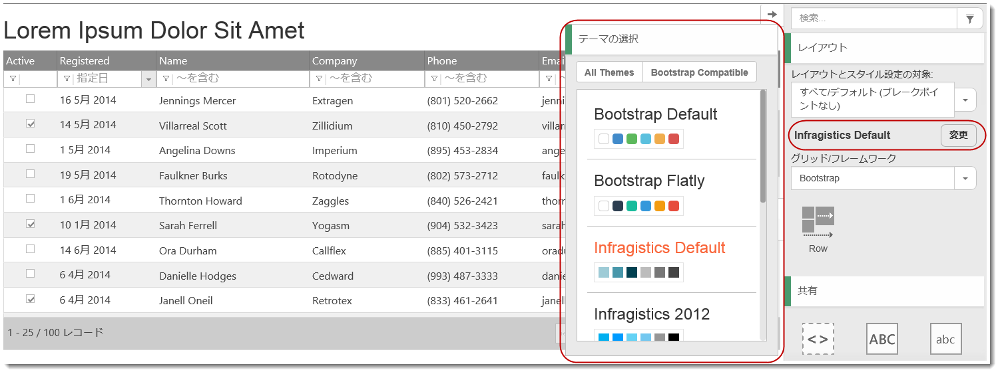
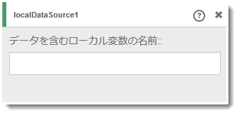
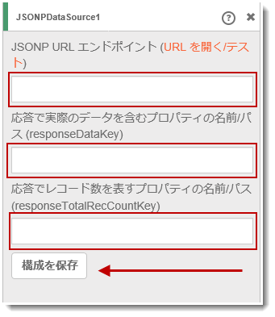
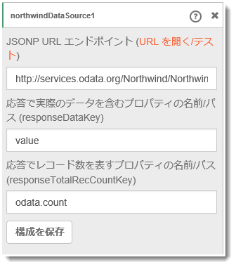
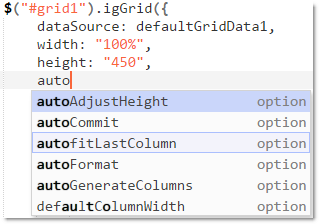
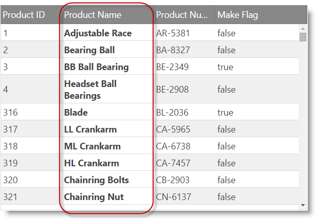
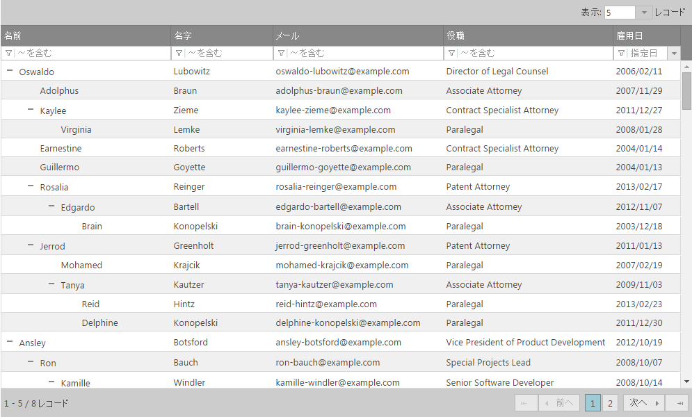
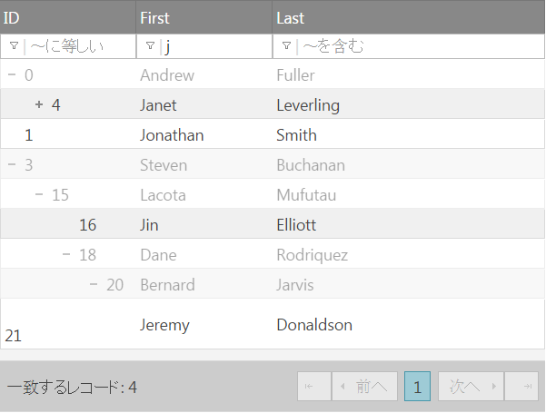
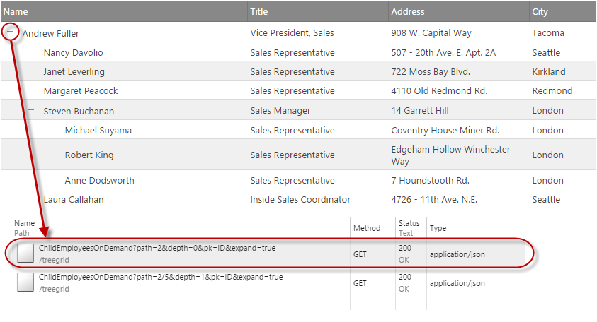

import ApiLink from 'docs-template/components/mdx/ApiLink.astro';

# 2015 Volume 1 の新機能

このトピックでは、&#123;environment:ProductFamilyName&#125;™ 2015 Volume 1 リリースのコントロールと新機能および拡張機能を紹介します。

## 新機能の概要

以下の表に 2015 Volume 1 の新機能の概要を示します。追加の詳細は以下のとおりです。

### 全般

機能|説明
---|---
[新しい &#123;environment:ProductName&#125; ヘルプ ビューアー](#help-viewer)|&#123;environment:ProductName&#125; の新しいヘルプ ビューアーを公開しました。

### &#123;environment:ProductName&#125; ページのデザイナー

機能|説明
---|---
[設定不要のテーマ サポート](#page-designer-theming-support) |その他の &#123;environment:ProductName&#125; テーマおよび定義済みのテーマ ピッカーで選択可能な Bootstrap テーマのサポートを追加しました。
[改良されたデータ ソース エクスペリエンス](#page-designer-datasource-expirience) |JSONP データ ソースおよびローカル データ ソースの明示的サポートと、新しいデータ ソース エディターを追加しました。
[Ace に対する IntelliSense サポート](#page-designer-intellisense-support) |デザイナーがコード ビューであるときに、ユーザーが入力を開始すると、IntelliSense を表示するサポートが追加されました。
[リモート データ ソース - ユーザー フレンドリなエラー](#page-designer-remote-dataSource) |リモート データ ソースへの接続中にWeb デザイナーで、発生する可能性のある問題に関する詳細な情報を表示する、ユーザー インターフェイスが利用できるようになりました

### Infragistics JavaScript Excel ライブラリ

機能|説明
---|---
[新しいライブラリ (RTM)](#new-javascript-excel-library)|ブラウザーでの Excel 文書の作成、読み込み、編集に使用できる純粋な JavaScript ベースのクライアント サイドの Excel ライブラリです。

### igGrid

機能|説明
---|---
[JavaScript Excel グリッド エクスポーター (CTP)](#grid-excel-exporter)|サーバーとの送信なしで表示されるデータを Excel ファイルにエクスポートできます。
列固定と列移動との互換性|グリッドで列固定と列移動の両方を有効にすることができるようになりました。
向上された列固定 API|グリッドで列を特定の位置に固定するには、グリッドで列のターゲット キーを移動先に提供します。
選択機能の向上|複数の領域選択は、Ctrl + マウス ドラッグを使用して実行できます。非連続の選択領域は可能です。
ページングの永続化|persist オプションは Paging 機能に追加されました。
[レスポンシブ機能の向上](#grid-responsive-feature-improvements)|新しい単一列テンプレート モードが追加されました。
[列のスタイル設定](#grid-column-styling)|igGrid の列構成でカスタム ヘッダーおよび列 CSS クラスを指定するための新しい設定を追加しました。

### igTreeGrid

機能|説明
---|---
[新しいコントロール (RTM)](#tree-grid)|igTreeGrid™ コントロールは RTM になりました。igTreeGrid™ コントロールでは、一般的なデータ スキーマを使用して階層データを一連の列に入れ見えるようにすることができます。
[ツリー固有のフィルター](#tree-grid-filtering)|igTreeGrid は、グリッドでフィルター結果のコンテキストを表示する特別なフィルター視覚化があります。
ツリー固有のページング|グリッドでデータをページングするとき、ルート レベルまたはすべての表示可能なレベルで表示可能なデータをページングするオプションがります。
拡張された展開オプション|ツリー グリッドは構成可能な展開インジケーターを提供します。最初のデータ列または単独列に描画できます。展開インジケーターは、カスタム視覚化のために別のルック アンド フィールでもカスタマイズできます。
仮想化|igTreeGrid は連続仮想化を含みます。これにより、高いパフォーマンスのエクスペリエンスを維持しながら、グリッドを階層データの大きなセットにバインドできます。
[リモート ロード オン デマンド](#tree-grid-remote-load-on-demand)|グリッドにデータの大きなセットが描画される場合に、一度にデータの小さなセットの入ったページのみを提供したいことがあります。リモート ロード オン デマンドを使用すると、igTreeGrid でユーザーの要求に応じて全データの一部分のみをグリッドに追加できます。
ローカル ロード オン デマンド|グリッドの高いパフォーマンスをさらに維持するために、igTreeGrid には展開されたノードのみをブラウザーに描画することを保証するローカル ロード オン デマンドがあります。ユーザーが親ノードを展開すると、ページで新しい要素がその場で作成され、ユーザーに表示する新しいデータをサポートします。

### igCombo

機能|説明
---|---
[書き換えられたコントロール](#combo)|15.1 では、優れた UX と信頼性を最優先に構築した新しいコンボを発表されました。
スタイリングの改善|新しいコンボは、配置とサイズ設定にインライン CSS スタイリングを使用しないため、ブラウザーの描画最適化機能を一層活用できます。
デフォルトの改善|設定なしでよりよい UX を提供できるように、一部の領域でデフォルトを変更しました。これは、エンド ユーザーに最適なエクスペリエンスを提供するためにプログラムが必要なコードも削減します。
新しいキーボード操作|古いコンボも基本的な操作を備えていましたが、キーボードでできる操作を大幅に拡張しました。マウスとキーの間を交互に行き来せずに、ナビゲート、選択、展開などをエンド ユーザーは一層効率的に自然に実行することができます。
改善された信頼性|コンボのサイズを 44% 削減したため、コードの複雑性が減少し、オートメーション コード カバレッジが一層高くなりました。
API 改善|また、この機会に、改善の余地のある API 選択を再考し、API の発見可能性と分かりやすさを改善しました。
[Knockout 拡張機能の改善](#combo_ko)|現在、igCombo は完全な Knockout 拡張機能を備え、Knockout 監視可能コレクションと igCombo リストの間の TwoWay データ バインディング、ならびにコンボで選択した項目の TwoWay データ バインディングをサポートします。

### モバイル コントロール

機能|説明
---|---
jQuery Mobile 1.4+ サポート |&#123;environment:ProductName&#125; モバイル コントロールは、jQuery Mobile 1.4+ の最新バージョンと互換性があります。

## 全般

### 新しい &#123;environment:ProductName&#125; ヘルプ ビューアー

&#123;environment:ProductName&#125; の新しいヘルプ ビューアーを公開しました。これにより、各トピックのナビゲートと共有が一層容易になり、製品バージョン（14.1 以降）をトピック内で直接容易に切り替えることもできるようになりました。
一層使いやすいエクスペリエンスだけでなく、実際のトピック自体も Markdown の GitHub で使用可能になりました。GitHub のプル要求によって、トピックに関する問題を容易にレポートでき、トピックに対して追加や変更を送信することもできます。

#### 関連コンテンツ

-   [GitHub の &#123;environment:ProductName&#125; ヘルプ トピック](https://github.com/IgniteUI/help-topics)

## &#123;environment:ProductName&#125; ページのデザイナー

### テーマ サポート
リストからテーマを選択すると、デザイン表面にすでにドロップされているすべてのコンポーネントのテーマが変更されます。 

### データ ソース エクスペリエンスの改善
ページ デザイナーには、ローカル、リモート、Northwind の 3 つの事前定義されたデータ ソース型があります。ローカル型とリモート型はいずれも構成設定のための異なるガイドを提供します。NorthWind データ ソースは、特定の列を持つ Customers を要求する Northwind odata サービスをポイントするように事前定義された構成を持つリモート データ ソースです。 

#### ローカル データ ソース

#### リモート データ ソース

#### NorthWind データ ソース

### Ace に対する IntelliSense サポート
Web デザイナーは、デザイナーがコードモードでカーソルがコンポーネントの内部にあるときに、IntelliSense をサポートするようになりました。ユーザーが入力を開始すると、ウィジェットに関係する事前定義されたオプションに基づく示唆が提供されます。

### リモート データ ソース - ユーザー フレンドリーなエラー
データ ソースをリモート データにバインドする場合、リモート要求からのエラーが発生することがあります。リモート データ ソースへの接続中にWeb デザイナーでは、発生する可能性のある問題に関する詳細な情報を表示するユーザー インターフェイスを利用できるようになりました。ユーザーは、応答状態、エラー、データ型、コンテンツに関する重要な情報を得ることができます。ブラウザー ツールを使用して問題を調査する必要はありません。

## Infragistics JavaScript Excel ライブラリ

### 新しいライブラリ (RTM)

14.2では、「クライアント サイド Excel ライブラリ」の最初のバージョンを CTP しました。現在は「Infragistics JavaScript Excel ライブラリ」という名前に変更されています。RTM バージョンではファイル サイズが小さくなり、ブラウザー互換性が強化されました。

#### 関連トピック

-   [Infragistics JavaScript Excel ライブラリの理解](../../09_JavaScript Excel Library/00_Understanding/~Understanding_the_Infragistics_JavaScript_Excel_Library.mdx)
-   [&#123;environment:ProductName&#125; JavaScript Excel ライブラリの使用](../../09_JavaScript Excel Library/01_Using/~Using_The_JavaScript_Excel_Library.mdx)

#### 関連サンプル

-   [Excel の表](&#123;environment:NewSamplesUrl&#125;/javascript-excel-library/excel-table)
-   [Excel の書式設定](&#123;environment:NewSamplesUrl&#125;/javascript-excel-library/excel-formatting)
-   [Excel の数式](&#123;environment:NewSamplesUrl&#125;/javascript-excel-library/excel-formulas)

## igGrid

### JavaScript Excel グリッド エクスポーター (CTP)

igGridExcelExporter コンポーネントにより、igGrid から Microsoft Excel ドキュメントにデータをエクスポートできます。エクスポートは、テーマとワークブックのカスタマイズをサポートし、並べ替え、フィルタリング、ページングなどの機能によりグリッドで操作されたデータを反映します。以下のスクリーンショットは、エクスポートされた igGrid の Excel での実際の表示を示しています。

#### 関連トピック

-   [Grid Excel エクスポーターの概要](../../02_Controls/igGrid/05_igGridExcelExporter Overview.mdx)

#### 関連サンプル

-   [基本グリッドを Excel にエクスポート](&#123;environment:NewSamplesUrl&#125;/grid/export-basic-grid)
-   [機能とグリッドを Excel にエクスポート](&#123;environment:NewSamplesUrl&#125;/grid/export-feature-rich-grid)
-   [グリッド Excel エクスポートのカスタマイズ](&#123;environment:NewSamplesUrl&#125;/grid/export-client-events)
-   [進行状況インジケーターとグリッドを Excel にエクスポート](&#123;environment:NewSamplesUrl&#125;/grid/export-grid-loading-indicator)

### レスポンシブ機能の向上

新しいオプション <ApiLink type="iggridresponsive" member="singleColumnTemplate" section="options" label="singleColumnTemplate" /> はレスポンシブ ウェブ デザイン モードに追加され、特定のプロファイルに単一列テンプレートを定義できます。

#### 関連サンプル

-   [レスポンシブ単一列テンプレート](&#123;environment:NewSamplesUrl&#125;/grid/responsive-single-column-template)

### 列のスタイル設定
新しい <ApiLink type="iggrid" member="columns.columnCssClass" section="options" label="columnCssClass" /> および <ApiLink type="iggrid" member="columns.headerCssClass" section="options" label="headerCssClass" /> 列設定を使用して、以下のスクリーンショットに示すように CSS クラスをヘッダーと列データ セルの両方に適用できます。

## igTreeGrid

### 新しいコントロール (RTM)

`igTreeGrid`™ コントロールでは、一般的なデータ スキーマを使用して、一連の列で階層データを見えるようにすることができます。

RTM でサポートされる機能

-   列の固定
-   非表示
-   フィルタリング
-   並べ替え
-   更新
-   ページング
-   選択
-   ツールチップ
-   複数列ヘッダー

#### 関連トピック

-   [概要 (igTreeGrid)](/igtreegrid-overview)

#### 関連サンプル

-   [JSON のバインド](&#123;environment:NewSamplesUrl&#125;/tree-grid/json-binding)
-   [貸借対照表](&#123;environment:NewSamplesUrl&#125;/tree-grid/balance-sheet)

### ツリー固有のフィルタリング

igTreeGrid 固有のフィルタリングにより、一致する結果をユーザーに表示する方法を細かく制御できます。新しい <ApiLink type="igtreegridfiltering" member="displayMode" section="options" label="displayMode" /> プロパティは、フィルター処理された結果のグリッドで表示される状態を制御します。デフォルトは `"showWithAncestors"` で、一致を完全な不透明で描画し、その親ノードをそれより低い不透明度で描画します (以下の画像参照)。 
使用可能なその他のモードに `showWithAncestorsAndDescendants` があります。これはデフォルトに加えて、子レコードがフィルタリング条件に一致しない場合でも、子レコードも描画します。

#### 関連トピック

-   [フィルタリング (igTreeGrid)](/igtreegrid-filtering)

#### 関連サンプル

-   [ファイル エクスプローラー](&#123;environment:NewSamplesUrl&#125;/tree-grid/file-explorer)

### リモート ロード オン デマンド

ロード オン デマンド機能は、ユーザーがツリー グリッドのノードを展開するときにサーバーから子ノードのデータを要求します。このタイプの操作により、ページの読み込みやツリー グリッド バインディングがより速くなり、初期フットプリントが軽くなります。結果として最新のデータを提供できる可能性が広がります。

#### 関連トピック

-   [ロード オン デマンド (igTreeGrid)](/igtreegrid-load-on-demand)

#### 関連サンプル

-   [ロード オン デマンド](&#123;environment:NewSamplesUrl&#125;/tree-grid/load-on-demand)

## igCombo

### 書き換えられたコントロール

約 4 年前に出荷されたオリジナルの jQuery ベースのコンボはすぐれた機能を持っていましたが、年月の経過につれて、古さも目につき始めました。15.1 では、優れた UX と信頼性を最優先に構築した新しいコンボを発表しました。コンボを大きく改善する一方で、API 変更は最小限にとどめたため、最小限の削除と置換で新しいコンボのメリットを活用することができます。

#### 関連トピック

-   [igCombo の概要](/igcombo-overview)
-   [新しいコンボへの移行](/igcombo-migrating-to-the-new-combo)

#### 関連サンプル

-   [JSON のバインド](&#123;environment:NewSamplesUrl&#125;/combo/json-binding)
-   [選択およびチェックボックス](&#123;environment:NewSamplesUrl&#125;/combo/selection-and-checkboxes)
-   [フィルタリング](&#123;environment:NewSamplesUrl&#125;/combo/filtering)
-   [ロード オン デマンド](&#123;environment:NewSamplesUrl&#125;/combo/load-on-demand)
-   [キーボード ナビゲーション](&#123;environment:NewSamplesUrl&#125;/combo/keyboard-navigation)

### 書き換えられた Knockout 拡張機能

igCombo の Knockout 拡張機能は、新しい igCombo の要件に応じて調整されました。オプションの一部が削除され、新しいオプションが導入されました。すべての変更は、igCombo が Knockout View-Model にバインドされる際に、ユーザーが igCombo を容易に構成できることを目的にしています。  

#### 関連サンプル

-   [KnockoutJS のバインド](&#123;environment:NewSamplesUrl&#125;/combo/bind-combo-with-ko)
