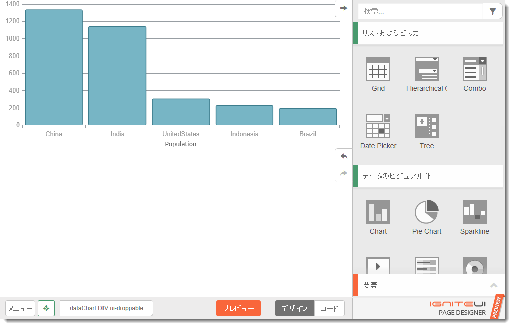
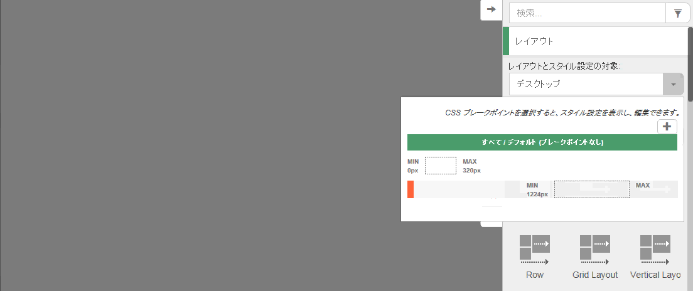
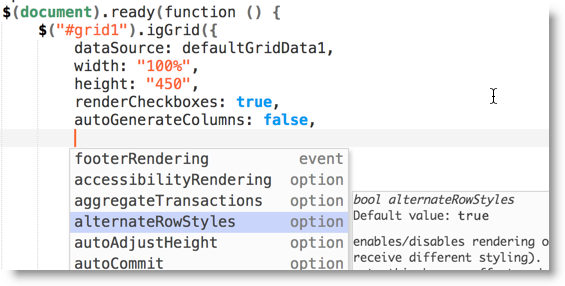
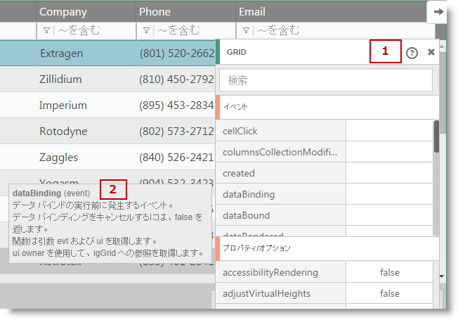
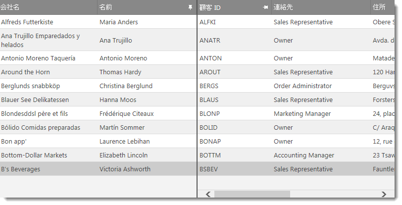
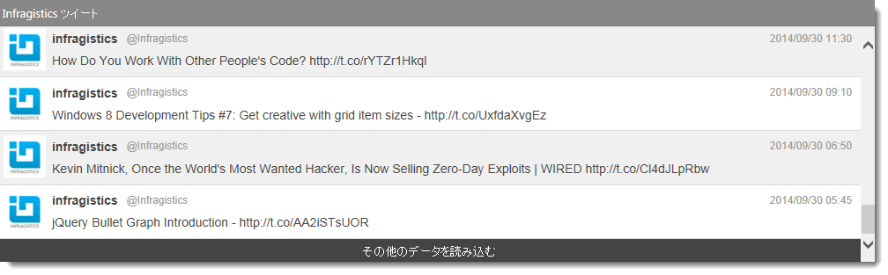
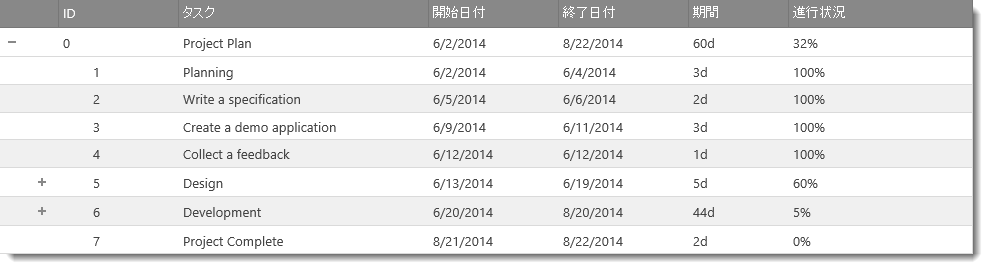
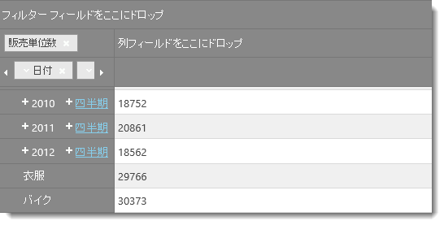
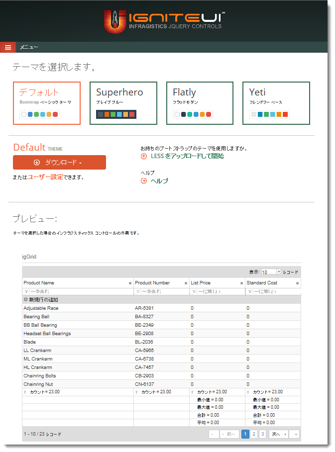
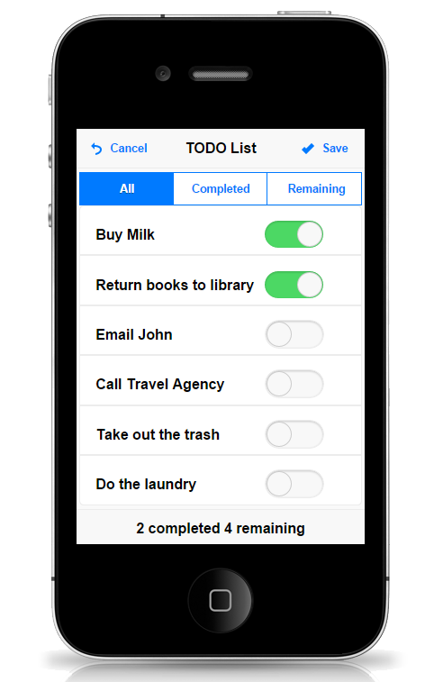

#2014 Volume 2 の新機能

このトピックでは、&#123;environment:ProductFamilyName&#125;™ 2014 Volume 2 リリースのコントロールと新機能および拡張機能を紹介します。

##新機能の概要

以下の表に 2014 Volume 2 の新機能の概要を示します。追加の詳細は以下のとおりです。

### 全般

機能|説明
---|---
[AngularJS ディレクティブ](#angular-directives)|&#123;environment:ProductName&#125; コントロールに、AngularJS のカスタム ディレクティブが組み込まれました。

### &#123;environment:ProductName&#125; ページ デザイナー

機能|説明
---|---
[HTML5 に対応する WYSIWYG](#wysiwyg)|&#123;environment:ProductName&#125; コントロールを使用する最新 Web 用ドラッグ アンド ドロップ UI デザイン領域。
レスポンシブな Web デザイン (RWD)|レスポンシブなデザインを簡単に作成するために、ブレークポイントを可視化し管理します。
クリーンなコード エディター|プロジェクトに組み込むための、クリーンなコードを確認、編集、コピーします。
簡単なデータ アクセス|コントロールをデータに接続するための、&#123;environment:ProductName&#125; のデータ ソースのコンポーネントが簡単に構成できます。
API の統合ヘルプ|コンポーネント エディターとコード エディターで API メンバーについてのヘルプを参照してください。

### クライアント サイドの Excel ライブラリ

機能|説明
---|---
[新しいライブラリ (CTP)](#new-library)|ブラウザーでの Excel 文書の作成、読み込み、編集に使用できる純粋な JavaScript ベースのクライアント サイドの Excel ライブラリです。

### igGrid

機能|説明
---|---
[行仮想化と連動する列固定](#column-fixing-row-virtualization)|グリッドで列固定と行仮想化の両方を有効にすることができるようになりました。
[オン デマンドの行追加 (RTM)](#append-rows-on-demand)|ロード オン デマンド機能は RTM であるため、オン デマンドの行追加と名前を変更しました。
[選択機能の向上](#selection-feature-improvements)|選択機能のコードベースを完全に作り直しました。

### igTreeGrid

機能|説明
---|---
[新しいコントロール (CTP)](#new-control)|igTreeGrid™ コントロールでは、一般的なデータ スキーマを使用して階層データを一連の列に入れ見えるようにすることができます。

### igPivotGrid

機能|説明
---|---
[ツリー レイアウト](#tree-layout)|`igPivotGrid`™ コントロールにより、行階層をツリー構造で表示できるようになりました。

### テーマ

機能|説明
---|---
[Bootstrap でのテーマ化](#bootstrap-theming)|&#123;environment:ProductName&#125; コントロールは、Bootstrap でのテーマ化をサポートします。
[新しいテーマ (RTM)](#new-theme)|iOS 7 スタイルのテーマは現在 RTM 版ですが、iOS テーマという名前に変更されました。このテーマが従来の iOS6 スタイルのテーマに置き換わります。このテーマには、jQuery Mobile 1.4 以降のコントロールのサポートも追加されました。
[jQuery UI 1.11 以降をサポートするために更新されたテーマ](#update-themes)|jQuery UI 1.11 以降のユーザー独自のコントロールをサポートするために、新しいテーマ ファイルが追加されました。

##全般

### AngularJS ディレクティブ

Infragistics の GitHub リポジトリで、最新版の AngularJS ディレクティブのプレビューを公開しました。これらのディレクティブは現在、正式な製品版ですが、RTM 版でもあります。

すべての &#123;environment:ProductName&#125; コントロールはカスタム タグ、コントローラー、またはコントローラー オプションを使用して、宣言によってインスタンス化できます。さらに以下のコントロールは、双方向のデータ バインディングをサポートします。

-   igGrid
-   igCombo
-   igEditors
-   igTree
-   igDataChart

#### 関連コンテンツ

[AngularJS ディレクティブ](../../10_AngularJS Directives/~AngularJS_Directives.mdx)

[GitHub に公開されている AngularJS 用の &#123;environment:ProductName&#125; ディレクティブ](https://github.com/IgniteUI/igniteui-angularjs)

#### 関連サンプル

[AngularJS のサンプル用の &#123;environment:ProductName&#125; ディレクティブ](http://igniteui.github.io/igniteui-angularjs/)

##&#123;environment:ProductName&#125; ページ デザイナー

### HTML5 に対応する WYSIWYG

LOB ページをレイアウトし活性化するために、一般的な HTML 要素、Bootstrap コンポーネント、&#123;environment:ProductName&#125; コンポーネントを活用します。&#123;environment:ProductName&#125; の使用方法の学習や、&#123;environment:ProductName&#125; コントロールを素早く構成してプロジェクトにコピーするには、これが最善の方法です。

**ページ デザイナー： [&#123;environment:DesignerUrl&#125;](&#123;environment:DesignerUrl&#125;)**

### レスポンシブな Web デザイン (RWD)

レスポンシブ CSS ブレークポイントの可視化と編集を行います。ブレークポイントに対して CSS の編集をすぐに開始できます。さらに、Bootstrap の行コンポーネントまたは &#123;environment:ProductName&#125; のレイアウト コンポーネントを使用すると、レスポンシブなページのグリッド レイアウトを簡単に定義することができます。

### クリーンなコード エディター

プロジェクトに必要なクリーンなコードの確認、編集、コピー、およびコンポーネントのオプションの定義に役立つように、世界水準の ACE コード エディターをベースに、クリーンなコード エディターを開発しました。

### 簡単なデータ アクセス

&#123;environment:ProductName&#125; のデータ ソースの各コンポーネントにより、コントロールをデータに接続する操作が簡単になります。カスタム コンポーネント エディターであるページのデザイナーにより、これらのコントロールとデータを簡単に使用できるようになり、これらのコントロールとデータを使用するコンポーネントでのデータ ソースの設定が容易になります。データ ソースは、コンポーネント エディターでリストから選択、またはグリッドのようにデータ ソースをコントロールにドロップするのみです。

### API の統合ヘルプ

デザイナー全体に API ヘルプが組み込まれているため、ヘルプ情報を詳しく調べる必要はありません。コード エディターとコンポーネント エディターにも、API ヘルプが組み込まれています。

1.  &#123;environment:ProductName&#125; のコンポーネントの場合は、コンポーネント エディターで ? リンクをクリックすると、対象のコンポーネントに関する API ドキュメントに直接移動できます。
2.  プロパティやイベント上にホバーすると、関連する API ドキュメントを表示することもできます。

##クライアント サイドの Excel ライブラリ

### 新しいライブラリ (CTP)

Infragistics の新しい Excel ライブラリは、純粋な JavaScript ベースのクライアント サイドのライブラリです。ブラウザーでのExcel 文書の読み込みや Excel 2003 以降の形式での保存をサポートしています。セルの書式とスタイル、数式の解決、結合されたセル、データの入力規則などを、JavaScript から管理できます。

#### 関連トピック

-   [&#123;environment:ProductName&#125; のクライアント サイド Excel ライブラリの概要](../../09_JavaScript Excel Library/00_Understanding/JavaScript_Excel_Library_Overview.mdx)
-   [&#123;environment:ProductName&#125; のクライアント サイド Excel ライブラリの使用](../../09_JavaScript Excel Library/01_Using/~Using_The_JavaScript_Excel_Library.mdx)

## igGrid

### 行仮想化と連動する列固定

列固定に加え、固定式または連続式の仮想化を有効にすることができるようになりました。

### オン デマンドの行追加 (RTM)

従来、ロード オン デマンドと呼ばれていた機能を、オン デマンドの行追加という名前に変更しました。これは、この機能が実行する内容を明確にし、他のコントロールで同じような名前を持つ機能と区別するためです。

#### 関連トピック

[オン デマンドの行追加の概要 (igGrid)](/append-rows-on-demand-overview)

### 選択機能の向上

`igGrid`™ の選択機能を完全に作り直しました。その結果、コードベースが 30% 減少し、グリッド内のすべての行の選択などのリリース集中型の操作の一部が最適化されました。操作完了までの時間が短縮されています。

##igTreeGrid

### 新しいコントロール (CTP)

`igTreeGrid`™ コントロールでは、一般的なデータ スキーマを使用して、一連の列で階層データを見えるようにすることができます。お客様からのフィードバックを歓迎いたします。是非、ご意見をお寄せください。

CTP でサポートされる機能

-   列の固定
-   非表示
-   フィルタリング
-   並べ替え
-   更新
-   ページング
-   サイズ変更
-   選択
-   ツールチップ
-   複数列ヘッダー

#### 関連トピック

-   [igTreeGrid の概要](/igtreegrid-overview)

#### 関連サンプル

-   [ファイル エクスプローラー](&#123;environment:NewSamplesUrl&#125;/tree-grid/file-explorer)
-   [貸借対照表](&#123;environment:NewSamplesUrl&#125;/tree-grid/balance-sheet)

##igPivotGrid

### ツリー レイアウト

`igPivotGrid`™ コントロールにより、行階層をツリー構造で表示できるようになりました。複数の階層が追加されると、各階層のメンバーが一つ前の階層の各メンバーの上または下に一覧表示されます。

#### 関連サンプル

-   [レイアウト モード](&#123;environment:NewSamplesUrl&#125;/pivot-grid/layout-modes)

##テーマ

### Bootstrap でのテーマ化

このリリースでは、Bootstrap のテーマ (Bootstrap で定義されている LESS 変数を使用) のルック アンド フィールを &#123;environment:ProductName&#125; コントロールに適用するメカニズムを追加しました。結果として生成されるテーマは、スタンドアロンとなり Bootstrap の有無にかかわらず使用できます。

製品には、「Bootstrap」 (デフォルトの Bootstrap テーマと同じ)、「Superhero」、「Yeti」、「Flatly」の 4 つのテーマがプリセットされています。これらのテーマは、[bootswatch.com](http://bootswatch.com/) サイトから取得した各テーマに対してコンパイルされます。

テーマの作成やカスタマイズに役立つ新しいサイトもあります。

注:プリセットされた 4 つのテーマと、テーマの生成に使用する LESS ファイルと互換性があるのは、jQuery UI 1.11 以降のコントロールのみです (これは、jQuery UI 1.11 には、コントロールの CSS 構造に関する重大な変更があったためです)。

#### 関連コンテンツ

-   [Bootstrap 用テーマ ジェネレーター](&#123;environment:NewSamplesUrl&#125;/bootstrap-theme-generator)

### 新しいテーマ (RTM)

従来の iOS7 テーマという名前を iOS に変更しました。これが、以前の iOS6 スタイルのテーマと置き換わります。iOS テーマは現在 RTM 版ですが、&#123;environment:ProductName&#125; のモバイル コントロールのサポートが追加されています。

>**注:**モバイル iOS テーマは、jQuery Mobile 1.4.2 以降をサポートしています。igListView コントロールは、jQuery Mobile 1.4 をサポートせず、このテーマとも互換性はありません。

#### 関連サンプル

-   [iOS テーマ](&#123;environment:NewSamplesUrl&#125;/themes/ios)

### jQuery UI 1.11 以降をサポートするために更新されたテーマ

jQuery UI 1.11 以降の独自のコントロールをサポートするために、Infragistics のテーマを更新しました。ただし、jQuery UI には CSS 構造に関する重大な変更があったため、&#123;environment:ProductName&#125; のテーマを使用する際に、jQuery UI のネイティブなコントロールのルック アンド フィールに若干の問題が発生する場合があります。

                    
