---
title: "2013 Volume 2 の新機能"
slug: whats-new-in-2013-volume2
---

# 2013 Volume 2 の新機能

## トピックの概要
### 目的

このトピックは、&#123;environment:ProductName&#125;™ 2013 Volume 2 リリースの新機能の概要について紹介します。

## 新機能
### 新機能の概要表

以下の表に、&#123;environment:ProductName&#125; 2013 Volume 2 リリースの新機能を簡単に説明します。詳細は、概要表の後に記載されています。

<table class="table table-bordered">
	<thead>
		<tr>
            <th>コントロール</th>
            <th>機能</th>
            <th>説明</th>
</tr>
	</thead>
	<tbody>
        <tr>
            <td>&#123;environment:ProductName&#125;</td>
            <td>カスタム ダウンロード</td>
            <td>カスタム ダウンロードを作成する新しいツールが使用できます。使用するコントロールを選択すると、ツールがカスタマイズ、結合、および縮小された JavaScript ファイルとテーマ ファイルを含むダウンロード パッケージを作成します。[ダウンロードのページ](&#123;environment:SamplesUrl&#125;/download) で詳細を参照してください。</td>
</tr>

        <tr>
            <td>[igBulletGraph](#igbulletgraph)</td>
            <td>[新規コントロール](#igbulletgraph-new-control)</td>
            <td>`igBulletGraph` コントロールは、データをブレット グラフ形式で視覚化するコントロールです。</td>
</tr>

        <tr>
            <td rowspan="11">[igDataChart](#igdatachart)</td>
            <td>[タイトルとサブタイトル](#title-subtitle)</td>
            <td>チャートの上セクションにタイトル、サブタイトル、またはその両方を追加できます。</td>
</tr>

        <tr>
            <td>[軸のタイトルとサブタイトル](#axis-title-subtitle)</td>
            <td>コントロールの x 軸および y 軸にタイトル、サブタイトル、またはその両方を追加できます。</td>
</tr>

        <tr>
            <td>[シリーズの強調表示](#series-highting)</td>
            <td>シリーズ全体を強調表示、またはシリーズ内の特定の項目を強調表示することもできます。</td>
</tr>

        <tr>
            <td>[アニメーション化されたトランジション](#animation-transition)</td>
            <td>チャートを最初に読み込んだときに、シリーズをアニメーションで表示できます。</td>
</tr>

        <tr>
            <td>[ホバー操作](#hover-interactions)</td>
            <td>ホバー操作機能を使用して、チャートのシリーズにアノテーションを表示することができます。これらのアノテーションは、カーソルに依存せず、構成可能なホバー操作レイヤーを介して実装されます。</td>
</tr>

        <tr>
            <td>[軸目盛り](#axis-ticks)</td>
            <td>垂直軸および水平軸で目盛を表示できます。</td>
</tr>

        <tr>
            <td>[カラー グラデーション](#color-gradients)</td>
            <td>チャート内にグラデーション カラーを使用することができます。</td>
</tr>

        <tr>
            <td>[デフォルト ツールチップ](#default-tooltips)</td>
            <td>デフォルト ツールチップを使用できます。つまり、プロパティを設定せずにシリーズでツールチップを表示することが可能です。</td>
</tr>

        <tr>
            <td>[ドロップ シャドウ](#drop-shadow)</td>
            <td>影付き効果をシリーズに適用できます。</td>
</tr>

        <tr>
            <td>[新しい CSS スタイル](#new-css-style)</td>
            <td>`igDataChart` コントロールには、新しい CSS スタイルがあります。このスタイルは、チャートを見やすくするために、さまざまな視覚効果を変更する機能があります。</td>
</tr>

        <tr>
            <td>[Knockout のサポート](#knockout-support)</td>
            <td>`igDataChart` コントロール内の Knockout ライブラリをサポートしています。</td>
</tr>

        <tr>
            <td>igDataSource</td>
            <td>日付毎の oData フィルタリング</td>
            <td>`igDataSource` を oData サービスにバインドすると、日付列のフィルタリングが可能になります。</td>
</tr>

        <tr>
            <td>[igDoughnutChart](#igdoughnutchart)</td>
            <td>[新規コントロール](#igdoughnutchart-new-control)</td>
            <td>`igDoughnutChart` は、データをドーナツ型チャート形式で視覚化するコントロールです。</td>
</tr>

        <tr>
            <td rowspan="5">[igGrid](#iggrid)</td>
            <td>[列の固定](#iggrid-column-fixing)</td>
            <td>以前は CTP として配布されていた列固定機能が製品版としてリリースされ、マニュアルも完備しています。この機能はグリッドの右または左の列を固定して、水平方向にスクロールしたときにビューの外に出ないようにします。</td>
</tr>

        <tr>
            <td>[jsRender の結合](#jsrender-integration)</td>
            <td>`igGrid` コントロールは、 jsRender テンプレート エンジンをサポートします。</td>
</tr>

        <tr>
            <td>[RWD モードの垂直柱レンダリング](#vertical-column-rendering)</td>
            <td>垂直柱レンダリング機能は、ブラウザーのビューポートの幅を変更するレスポンシブ Web デザイン (RWD) として、2 つの列でグリッドを描画します。最初の列は列のキャプションを表示し、2 番目の列はデータを表示します。</td>
</tr>

        <tr>
            <td>[機能セレクターの新しいデザイン](#feature-chooser-new-design)</td>
            <td>機能セレクターは、デザインを一新し、タッチ対応デバイスのサポートを強化しました。</td>
</tr>

        <tr>
            <td>[ロードオンデマンド (CTP)](#load-on-demand)</td>
            <td>`igGrid` ロード オン デマンド機能 (現在は CTP の一部) を使用した場合、要求されたデータがビューで必要になるまで、データはグリッドにロードされません。これにより、大きなデータセットの場合にグリッドの性能が大幅に向上します。</td>
</tr>

        <tr>
            <td>[igLayoutManager](#iglayoutmanager)</td>
            <td>[新規コントロール](#iglayoutmanager-new-control)</td>
            <td>igLayoutManager はすでに製品版 (RTM) です。</td>
</tr>

        <tr>
            <td>[igLinearGauge](#iglineargauge)</td>
            <td>[新規コントロール](#iglineargauge-new-control)</td>
            <td>`igLinearGauge` コントロールはリニア ゲージでデータを視覚化します。スケールおよび 1 つ以上の比較範囲と比較したパフォーマンス値をシンプルで簡潔に表示します。</td>
</tr>

        <tr>
            <td>[igMap](#igmap)</td>
            <td>[高密度散布シリーズ](#high-density-scatter-series)</td>
            <td>新しいグラフィック高密度シリーズを使用すると、数百から数百万のデータ ポイントから広がる散布図データを最短の読み込み時間でバインドして表示できます。</td>
</tr>

        <tr>
            <td>[igPieChart](#igpiechart)</td>
            <td>[ラベルの引き出し曲線](#curved-label)</td>
            <td>`igPieChart` のラベル引き出し線に、2 つのタイプの曲線を追加できます。</td>
</tr>

        <tr>
            <td>[igPopover](#igpopover)</td>
            <td>[新規コントロール (CTP)](#igpopover-new-control)</td>
            <td>`igPopover` コントロール (現在は CTP の一部) は、ツールチップに似た機能を DOM 要素に追加します。</td>
</tr>

        <tr>
            <td>[igQRCodeBarcode](#qrcode)</td>
            <td>[新規コントロール](#qrcode-new-control)</td>
            <td>`igQRCodeBarcode` コントロールは、Web アプリケーションで使用する QR (Quick Response) バーコード画像を生成します。</td>
</tr>

        <tr>
            <td>[igRadialGauge](#igradialgauge)</td>
            <td>[新規コントロール](#igradialgauge-new-control)</td>
            <td>`igRadialGauge` は、ゲージを表示するデータ ビジュアライゼーション ツールです。スケール、目盛、ラベル、針、および範囲の数などの複数の視覚要素を含むことができます。</td>
</tr>

        <tr>
            <td>[igTileManager](#igtilemanager)</td>
            <td>[新規コントロール](#igtilemanager-new-control)</td>
            <td>以前は CTP として配布されていた `igTileManager` が製品版としてリリースされ、マニュアルも完備しています。`igTileManager` は、データをタイルに描画して管理できるレイアウト コントロールです。</td>
</tr>

        <tr>
            <td>[igZoombar](#igzoom)</td>
            <td>[新規コントロール](#igzoom-new-control)</td>
            <td>`igZoombar` コントロールは、`igDataChart` と同様に、範囲対応コントロールにズーム機能を提供します</td>
</tr>
    </tbody>
</table>

## igBulletGraph
### 新規コントロール

`igBulletGraph` コントロールは、データをブレット グラフ形式で視覚化するコントロールです。このコントロールはリニアのデザインで、スケールおよびオプションで他の複数の測定との比較を、パフォーマンス バーにシンプルで簡潔に表示します。

#### 関連トピック

-   [igBulletGraph](/igbulletgraph)

#### 関連サンプル

-   [基本構成](&#123;environment:SamplesUrl&#125;/bullet-graph/basic-configuration)

## igDataChart
### タイトルとサブタイトル

チャートの上セクションにタイトル、サブタイトル、またはその両方を追加できます。タイトルまたはサブタイトルを追加すると、チャートのコンテンツがタイトル / サブタイトルのコンテンツに合わせて自動的にサイズ変更されます。

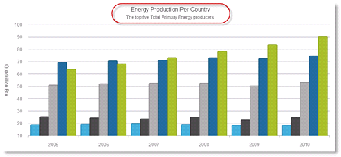

#### 関連トピック

-   [**チャートのタイトル / サブタイトルの構成 (igDataChart)**](/igdatachart-chart-titles-and-subtitles)

#### 関連サンプル

-   [タイトルとサブタイトル](&#123;environment:SamplesUrl&#125;/data-chart/chart-title)

### 軸のタイトルとサブタイトル

コントロールの x 軸および y 軸に、タイトルやサブタイトルを追加できます。

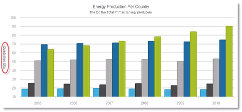

#### 関連トピック

-   [**軸のタイトルの構成 (igDataChart)**](/igdatachart-axis-title)

#### 関連サンプル

-   [軸のタイトルとサブタイトル](&#123;environment:SamplesUrl&#125;/data-chart/axis-title)

### シリーズの強調表示

シリーズ全体を強調表示、またはシリーズ内の特定の項目を強調表示することもできます。

強調表示は、シリーズ固有の機能です。Line シリーズなどの単一図形シリーズでは、折れ線全体が強調表示されます。Column シリーズなどの複数の図形から構成されるシリーズは、各図形 (柱状) が強調表示されます。サポートされるすべてのシリーズで、各マーカーを強調表示できます。

強調表示は、マウスでのみサポートされます。

シリーズの強調表示は、以下のシリーズでサポートされます。

-   カテゴリ シリーズ
-   範囲カテゴリ シリーズ
-   財務物価シリーズ
-   財務指標

#### 関連トピック

-   [シリーズの強調表示の構成 (igDataChart)](/igdatachart-series-highlighting)

#### 関連サンプル

-   [シリーズの強調表示](/igdatachart-series-highlighting#series-highlighting-examples)

### アニメーション化されたトランジション

この機能は、`igDataChart` コントロールの初期化時に、シリーズのアニメーションを可能にします。

#### 関連トピック

-   [トランジション イン アニメーション](/igchart-transitions-in-animations)

#### 関連サンプル

-   [トランジション アニメーション](&#123;environment:SamplesUrl&#125;/data-chart/transition-animation)
-   [トランジション アニメーション (財務)](/igchart-transitions-in-animations#transition-example)

### ホバー操作

ホバー操作機能を使用して、チャートのシリーズにアノテーションを表示することができます。これらのアノテーションは、カーソルに依存せず、構成可能なホバー操作レイヤーを介して実装されます。

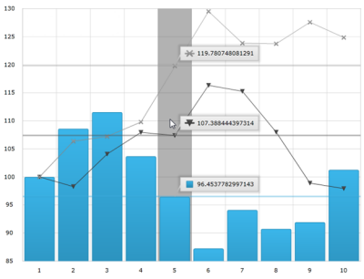

ホバー操作 レイヤーは 、実際にはシリーズ コレクションに追加されるシリーズで、カーソル位置に依存します。`igDataChart` コントロールにホバー操作レイヤーを追加すると、追加されたレイヤー タイプに基づいて十字線およびツールチップのデフォルト動作を無効にします。

#### 関連トピック

-   [**ホバー操作の構成 (igDataChart)**](../../02_Controls/igDataChart/04_Configuring/04_Hover Interactions/~HoverInteractions_Hover_Interactions.mdx)

#### 関連サンプル

-   [**カテゴリ ハイライト レイヤー**](../../02_Controls/igDataChart/04_Configuring/04_Hover Interactions/00_HoverInteractions_Category_Highlight_Layer.mdx#example)
-   [**カテゴリ項目ハイライト レイヤー**](../../02_Controls/igDataChart/04_Configuring/04_Hover Interactions/01_HoverInteractions_Category_Item_Highlight_Layer.mdx#example)
-   [**カテゴリ ツールチップ レイヤー**](../../02_Controls/igDataChart/04_Configuring/04_Hover Interactions/02_HoverInteractions_Category_Tooltip_Layer.mdx#example)
-   [**十字線レイヤー**](../../02_Controls/igDataChart/04_Configuring/04_Hover Interactions/03_HoverInteractions_Crosshair_Layer.mdx#example)
-   [**項目ツールチップ レイヤー**](../../02_Controls/igDataChart/04_Configuring/04_Hover Interactions/04_HoverInteractions_Item_Tooltip_Layer.mdx#example)

### 軸目盛り

チャート プロット領域の外側に軸目盛を表示できます。これにより、各ラベルに目盛が表示できます。また軸のグリッドラインを目盛で置き換えるとチャート外観が簡素化し見やすくなります。

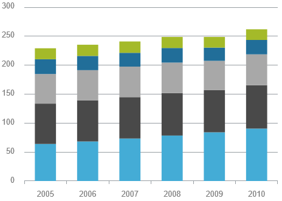

#### 関連トピック

-   [設定可能なビジュアル要素](/igdatachart-visual-elements)

### カラー グラデーション

チャート内にグラデーション カラーを使用することができます。

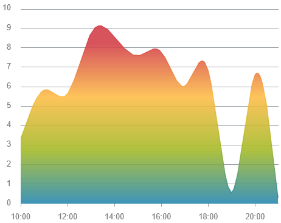

#### 関連トピック

-   [データのビジュアル化でのグラデーション カラーの使用](/using-gradient-colors-in-data-visualizations)

#### 関連サンプル

-   [カラー グラデーション](&#123;environment:SamplesUrl&#125;/data-chart/chart-fill-gradients)

### デフォルト ツールチップ

デフォルト ツールチップを使用できます。つまり、プロパティを設定せずにシリーズでツールチップを表示することが可能です。デフォルト ツールチップ テンプレートは、シリーズ タイプによって情報を最適化します。

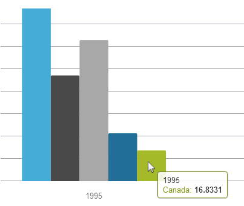

#### 関連トピック

-   [**設定可能なビジュアル要素**](/igdatachart-visual-elements)

#### 関連サンプル

-   [シリーズのツールチップ](/igdatachart-visual-elements#samples)

### ドロップ シャドウ

影付き効果をシリーズのビジュアル表示に適用できます。

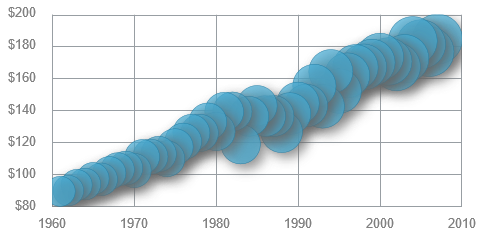

#### 関連トピック

-   [チャート シリーズのスタイル設定 (igDataChart)](/igdatachart-styling-the-chart-series)

### 新しい CSS スタイル

`igDataChart` コントロールには、新しい CSS スタイルがあります。このスタイルは、チャートを見やすくするために、複数のビジュアル変更と設定を行う機能があります。

### 古いスタイル

### 新しいスタイル設定

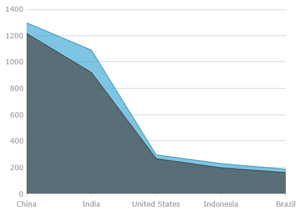

#### 関連トピック

-   新しいデフォルト スタイル (`igDataChart`)

### Knockout のサポート

`igDataChart` コントロール内の Knockout ライブラリをサポートしています。これは Knockout ライブラリとその宣言構文を使いやすくし、`igDataChart` のインスタンス作成と構成を容易にします。

#### 関連トピック

-   [**Knockout サポートの構成 (igDataChart)**](/igdatachart-knockoutjs-support)

## igDoughnutChart
### 新規コントロール

`igDoughnutChart` は、データをドーナツ型チャート形式で視覚化するコントロールです。これは、変数の発生を比例的に示すことが可能です。コントロールの内部半径は構成可能で、ドーナツ型チャート シリーズにはスライスの選択および展開のサポートが内蔵されています。

複数の変数の発生 (複数シリーズの追加) は、同心リングを使用して視覚化できます。チャートは、プロパティを構成する、またはテーマを適用することでスタイル設定できます。

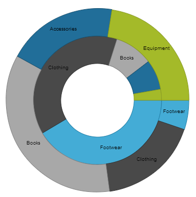

#### 関連トピック

-   [igDoughnutChart](/igdoughnutchart)

#### 関連サンプル

-   [ドーナツ型チャート](&#123;environment:SamplesUrl&#125;/doughnut-chart/overview)

## igGrid
### 列の固定

以前は CTP として配布されていた列固定機能が製品版としてリリースされ、マニュアルも完備しています。この機能はグリッドの右または左の列を固定して、水平方向にスクロールしたときにビューの外に出ないようにします。これは、グリッド インターフェイスから、または列固定機能の API を介してプログラムで実行できます。列固定がアクティブになると、固定した列と固定できる列のヘッダーにはピン固定ボタンが表示されます。

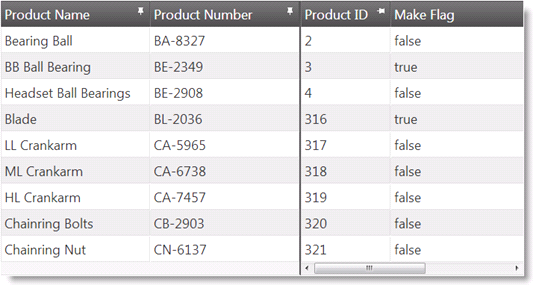

#### 関連トピック

-   [**列固定の概要 (igGrid)**](/iggrid-columnfixing-overview)

#### 関連サンプル

-   [列の固定](&#123;environment:SamplesUrl&#125;/grid/column-fixing)

### jsRender の結合

`igGrid` コントロールは、 jsRender テンプレート エンジンをサポートします。

#### 関連トピック

-   [**jsRender の統合 (igGrid)**](/iggrid-jsrender-integration)

#### 関連サンプル

-   [**jsRender の結合**](&#123;environment:SamplesUrl&#125;/grid/jsrender-integration)

### RWD モードの垂直柱レンダリング

垂直柱レンダリング機能は、ブラウザーのビューポートの幅を変更するレスポンシブ Web デザイン (RWD) として、2 つの列でグリッドを描画します。最初の列は、列のキャプションが存在するヘッダー列です。2 番目の列には、行データが含まれます。

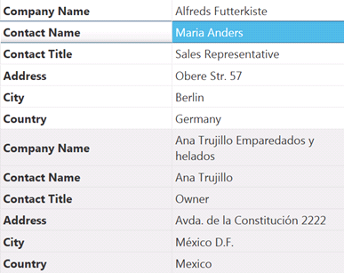

#### 関連トピック

-   [**垂直柱レンダリングの構成 (RWD モード、igGrid)**](/iggrid-responsive-web-design-mode-configuring-vertical-column-rendering)

#### 関連サンプル

-   [**レスポンシブ垂直レンダリング**](&#123;environment:SamplesUrl&#125;/grid/responsive-vertical-rendering)

### 機能セレクターの新しいデザイン

機能セレクターは、デザインを一新し、タッチ対応デバイスのサポートを強化しました。

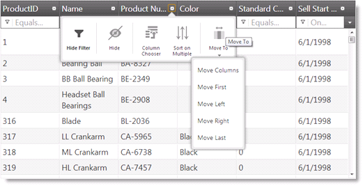

#### 関連トピック

-   [機能セレクター](/iggrid-feature-chooser)

#### 関連サンプル

-   [機能セレクター](&#123;environment:SamplesUrl&#125;/grid/feature-chooser)

### ロードオンデマンド (CTP)

`igGrid` ロード オン デマンド機能 (現在は CTP の一部) を使用した場合、要求されたデータがビューで必要になるまで、データはグリッドにロードされません。これにより、大きなデータセットの場合にグリッドの性能が大幅に向上します。ロード オン デマンドは、Automatic と Manual の 2 つのモードで動作できます。

-   Automatic モードの場合は、グリッドをスクロール ダウンした時に、必要に応じてデータが追加されます。
-   Manual モードの場合は、グリッドの下の [その他のデータを読み込む] ボタンを押した時に、データが追加されます。

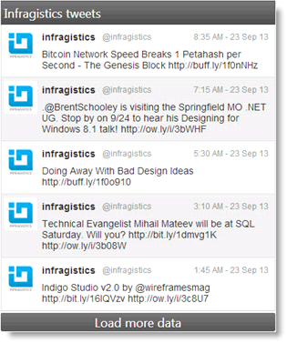

#### 関連サンプル

-   [ロード オン デマンド](&#123;environment:SamplesEmbedUrl&#125;/grid/append-rows-on-demand)

## igLayoutManager
### 新規コントロール

`igLayoutManager` は、ページ要素を定義済み (カスタマイズ可能) のレイアウト パターン (「レイアウト」と呼びます) に配置することで、Web アプリケーションの HTML ページのレイアウト全体を管理するレイアウト コントロールです。

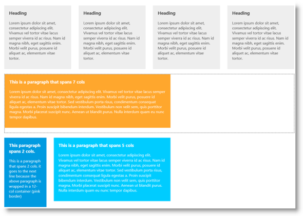

#### 関連トピック

-   [igLayoutManager](/iglayoutmanager-landing-page)

#### 関連サンプル

-   [レスポンシブ列レイアウト](&#123;environment:SamplesUrl&#125;/layout-manager/column-layout-markup)
-   [レスポンシブ フロー レイアウト](&#123;environment:SamplesUrl&#125;/layout-manager/flow-layout)

## igLinearGauge
### 新規コントロール

`igLinearGauge` コントロールはリニア ゲージでデータを視覚化します。
スケールおよび 1 つ以上の比較範囲と比較したパフォーマンス値をシンプルで簡潔に表示します。

#### 関連トピック

-   [igLinearGauge](/iglineargauge)

#### 関連サンプル

-   [基本構成](&#123;environment:SamplesUrl&#125;/linear-gauge/basic-configuration)

## igMap
### 高密度散布シリーズ

新しいグラフィック高密度シリーズを使用すると、数百から数百万のデータ ポイントから広がる散布図データを最短の読み込み時間でバインドして表示できます。

シリーズではデータ ポイントが非常に多いため、散布データを通常のマーカーではなく、小さなドットで表示します。最もデータが集約した領域は、データ ポイントのクラスターを高濃度の色で表します。

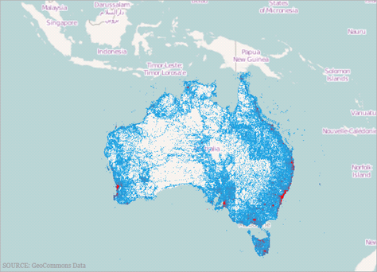

#### 関連トピック

-   [**地理高密度散布シリーズの構成 (igMap)**](/igmap-using-geographic-high-density-scatter-series)

#### 関連サンプル

-   [ギャラリー - 高密度散布シリーズ](&#123;environment:SamplesUrl&#125;/map/geo-high-density-scatter-series)

## igPieChart
### ラベルの引き出し曲線

`igPieChart` のラベル引き出し線に、2 つのタイプの曲線を追加できます。直線または曲線の使用、線のスタイル変更、ラベルと線の端の間のスペースなどを選択できます。

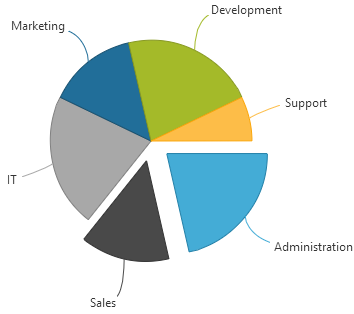

#### 関連サンプル

-   [レイアウトの構成](&#123;environment:SamplesUrl&#125;/pie-chart/layout-configuration)

## igPopover
### 新規コントロール (CTP)

`igPopover` コントロール (現在は CTP の一部) は、ツールチップに似た機能を DOM 要素に追加します。これはツールチップに対して、以下のような各種のカスタム化を可能にします:

-   HTML コンテンツの表示
-   「Left」、「Right」、「Top」、「Bottom」の位置のカスタマイズ
-   ルック アンド フィールのカスタマイズ
-   トリガー (`igPopover` を表示するイベント) のカスタマイズ
-   複数の要素のインスタンス作成
-   タッチ サポート

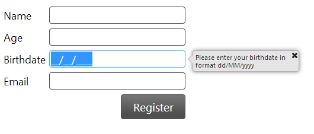

#### 関連サンプル

-   [ベーシック ポップオーバー](&#123;environment:SamplesUrl&#125;/popover/basic-popover)

## igQRCodeBarcode
### 新規コントロール

`igQRCodeBarcode` コントロールは、Web アプリケーションで使用する QR (Quick Response) バーコード画像を生成します。以下のスクリーンショットは、http://www.infragistics.com データをエンコードした `igQRCodeBarcode` コントロールのサンプルを示します。

#### 関連トピック

-   [igQRCodeBarcode](/igqrcodebarcode)

#### 関連サンプル

-   [QR バーコードの基本構成](&#123;environment:SamplesUrl&#125;/barcode/basic-configuration)

## igRadialGauge
### 新規コントロール

`igRadialGauge` は、ゲージを表示するデータ ビジュアライゼーション ツールです。スケール、目盛、ラベル、針、および範囲の数などの複数の視覚要素を含むことができます。このコントロールは、スケールの視覚的な合図である範囲もサポートします。

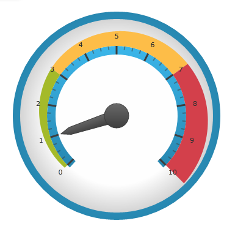

#### 関連トピック

-   [igRadialGauge](/igradialgauge)

#### 関連サンプル

-   [igRadialGauge](&#123;environment:SamplesUrl&#125;/radial-gauge/overview)

## igTileManager
### 新規コントロール

以前は CTP として配布されていた `igTileManager` が製品版としてリリースされ、マニュアルも完備しています。

`igTileManager` は、データをタイルに描画して管理できるレイアウト コントロールです。タイルは、レスポンシブ グリッド レイアウト (グリッド、チャート、マップなどの異なるコンポーネントを持つダッシュボードなど) で表示されます。

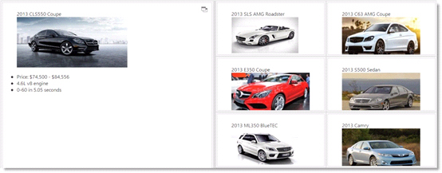

#### 関連トピック

-   [igTileManager](/igtilemanager-landing-page)

#### 関連サンプル

-   [ASP.NET MVC の基本的な使用方法](&#123;environment:SamplesUrl&#125;/tile-manager/aspnet-mvc-helper)
-   [JSON データへのバインド](&#123;environment:SamplesUrl&#125;/tile-manager/bind-json)
-   [項目の構成](&#123;environment:SamplesUrl&#125;/tile-manager/item-configurations)
-   [リード タイルの構成](&#123;environment:SamplesUrl&#125;/tile-manager/leading-tile)

## igZoombar
### 新規コントロール

`igZoombar` コントロールは、範囲対応コントロールにズーム機能を提供します。`igZoombar` には、水平スクロールバー、全範囲の縮小表示、サイズ変更可能なズーム範囲ウィンドウの機能があります。`igZoombar` は、追加設定なしで、`igDataChart` コントロールを統合します。

  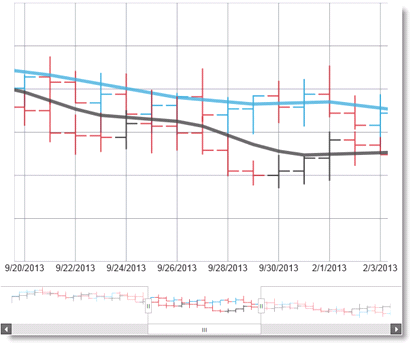

#### 関連トピック

-   [igZoombar](/igzoombar-landingpage)

#### 関連サンプル

-   [ズームバー財務チャート](&#123;environment:SamplesUrl&#125;/zoombar/financial-chart)

 

 

