# 2013 Volume 1 の新機能

## トピックの概要
### 目的

このトピックは、&#123;environment:ProductName&#125;® 2013 Volume 1 リリースの新機能の概要について紹介します。


## 新機能
### 新機能の概要表

以下の表は、&#123;environment:ProductName&#125;® 2013 Volume 1 リリースの新機能をまとめたものです。詳細は、概要表の後に記載されています。

<table class="table table-bordered">
	<thead>
		<tr>
            <th>コントロール</th>
            <th>機能</th>
            <th>説明</th>
</tr>
	</thead>
	<tbody>
        <tr>
            <td>igCombo™</td>
            <td>[Knockout のサポート](/igcombo-knockoutjs-support)</td>
            <td>`igCombo` コントロールにおける Knockout ライブラリのサポートは、開発者が Knockout ライブラリとその宣言構文を使用してツリー コントロールを初期化し構成するための簡単な方法を提供することを目的としています。</td>
</tr>

        <tr>
            <td>igDataChart™</td>
            <td>[新シリーズ](#igdatachart-new-series)</td>
            <td>`igDataChart` は、40 を超えるチャート タイプをサポートし、ポイント、各種スプライン チャート、面チャートおよび集合形式のチャートなど 17 個の新しいチャート タイプがこのリリースで追加されました。</td>
</tr>

        <tr>
            <td>igEditors™</td>
            <td>[Knockout のサポート](#igeditors-knockout-support)</td>
            <td>&#123;environment:ProductName&#125; エディター コントロールにおける Knockout ライブラリのサポートは、開発者が Knockout ライブラリとその宣言構文を使用して &#123;environment:ProductName&#125; エディターを初期化し構成するための簡単な手段を提供することを目的としています。</td>
</tr>

        <tr>
            <td>igFunnelChart™</td>
            <td>[新規コントロール](#igfunnelchart)</td>
            <td>`igFunnelChart`™ は、データをファンネル シェイプで表示するファンネル チャート コントロールです。トップダウンの構成でセクションを表示し、それぞれが最大値から最小値までに及ぶスライス データを表します。</td>
</tr>

        <tr>
            <td rowspan="5">igGrid™</td>
            <td>[列移動機能 (RTM)](#iggrid-column-moving)</td>
            <td>`igGrid`/`igHierarchicalGrid` の列移動機能は RTM です。</td>
</tr>

        <tr>
            <td>[セル結合 (RTM)](#cell-merging-rtm)</td>
            <td>`igGrid`/`igHierarchicalGrid` のセル結合機能は RTM です。</td>
</tr>

        <tr>
            <td>[レスポンス Web デザイン モード](#responsive-web-design)</td>
            <td>`igGrid` レスポンス Web デザイン (RWD) モード機能により、`igGrid` を レスポンス Web デザインのウェブ サイトで構成しやすくなります。</td>
</tr>

        <tr>
            <td>[列の固定化 (CTP)](#column-fixing-ctp)</td>
            <td>`igGrid` 列の固定化機能により、グリッドの左または右に列の表示を固定し常に表示されるようにします。</td>
</tr>

        <tr>
            <td>[Knockout サポート (RTM)](#knockout-support)</td>
            <td>&#123;environment:ProductName&#125; `igGrid` エディター コントロールにおけるKnockout ライブラリのサポートは、開発者が Knockout ライブラリとその宣言構文を使用して &#123;environment:ProductName&#125; グリッドを初期化し構成するための簡単な手段を提供することを目的としています。</td>
</tr>

        <tr>
            <td rowspan="3">igHierarchicalGrid™</td>
            <td>[列移動機能 (RTM)](#hierarchicalgrid-column-moving-features-rtm)</td>
            <td>`igHierarchicalGrid`™ の列移動機能は RTM です。</td>
</tr>

        <tr>
            <td>[セル結合 (RTM)](#hierarchicalgrid-cell-merging-rtm)</td>
            <td>`igHierarchicalGrid`™ のセル結合機能は RTM です。</td>
</tr>

        <tr>
            <td>[Knockout サポート (RTM)](#hierarchicalgrid-knockout-support)</td>
            <td>&#123;environment:ProductName&#125; `igHierarchicalGrid`™ コントロールにおける Knockout ライブラリのサポートは、開発者が Knockout ライブラリとその宣言構文を使用して &#123;environment:ProductName&#125; グリッドを初期化し構成するための簡単な手段を提供することを目的としています。</td>
</tr>

        <tr>
            <td>igListView™</td>
            <td>[縮小可能なグループ](#iglist-collapsible-grouping)</td>
            <td>`igListView`™ 携帯電話リスト コントロールは、縮小可能なグループをサポートします。</td>
</tr>

        <tr>
            <td>igOlapFlatDataSource™</td>
            <td>[新規コンポーネント](#igolapflatdatasource-new-component)</td>
            <td>フラットなデータ コレクション上で OLAP のようなデータ解析を可能にする OLAP データ ソース コンポーネント。</td>
</tr>

        <tr>
            <td>igOlapXmlaDataSource™</td>
            <td>[新規コンポーネント](#igolapxmladatasource-new-component)</td>
            <td>MS SSAS OLAP サーバーとのコミュニケーションを促進する OLAP データ ソース コンポーネント。</td>
</tr>

        <tr>
            <td>igPivotDataSelector™</td>
            <td>[新規コントロール](#igpivotdataselector-new-control)</td>
            <td>`igPivotDataSelector` は、データが [igPivotGrid](/igpivotgrid)™ で可視化されている場合にユーザーがデータ スライスを選択できるインタラクティブな UI コントロール (jQuery UI ウィジェット) です。</td>
</tr>

        <tr>
            <td>igPivotGrid™</td>
            <td>[新規コントロール](#igpivotgrid-new-component)</td>
            <td>`igPivotGrid` コントロールは、ピボット テーブル にデータを表示するためのデータ プレゼンテーション コントロールです。ユーザーは提供されたデータで複雑な解析を実行できます。</td>
</tr>

        <tr>
            <td>igPivotView™</td>
            <td>[新規コントロール](#igpivorview-new-control)</td>
            <td>`igPivotView` は、1 か所でピボット グリッド内の多次元 (OLAP) データを操作するためのすべての必要なツールを提供するコントロールです。</td>
</tr>

        <tr>
            <td>igSparkline™</td>
            <td>[新規コントロール](#igsparkline-new-control)</td>
            <td>`igSparkline`™ は新しいjQUery UI スパークライン コントロールであり、これらの要素が構成およびカスタマイズできるいくつかの視覚要素と対応する機能を持ちます。</td>
</tr>

        <tr>
            <td>igSplitter™</td>
            <td>[新規コントロール](#igsplitter-new-control)</td>
            <td>`igSplitter`™ は、2 つの異なるパネルにレイアウトを分けることにより HTML5 Web アプリケーションおよびサイトでレイアウトを管理するためのコンテナー コントロールです。</td>
</tr>

        <tr>
            <td>igTree™</td>
            <td>[Knockout のサポート](#igtree-knockout-support)</td>
            <td>&#123;environment:ProductName&#125; エディター コントロールにおける Knockout ライブラリのサポートは、開発者が Knockout ライブラリとその宣言構文を使用して &#123;environment:ProductName&#125; エディターを初期化し構成するための簡単な手段を提供することを目的としています。</td>
</tr>

        <tr>
            <td rowspan="3">igUpload™</td>
            <td>[全般的改善](#igupload-general-improvements)</td>
            <td>HTML 5 対応ブラウザでは、`igUpload`™ は [XMLHttpRequest Level 2](http://www.w3.org/TR/XMLHttpRequest2/) を使用してアップロードのステータスを取得します。</td>
</tr>

        <tr>
            <td>[ファイルを MemoryStream として保存](#saving-files-as-memorystream)</td>
            <td>igUpload™ により、ファイルを MemoryStream オブジェクトとして処理できます。</td>
</tr>

        <tr>
            <td>[アップロードする複数ファイルを一度に選択](#selecting-multiple-files)</td>
            <td>`igUpload`™ により、ブラウザのファイルを開くダイアログから、またはドラッグ アンド ドロップによって一度に複数のファイルを選択できます。この機能は HTML 5 が有効なブラウザーで使用できます。</td>
</tr>

        <tr>
            <td>&#123;environment:ProductNameMVC&#125;</td>
            <td>[イベント追加のサポート](#support-adding-events)</td>
            <td>`AddClientEvent` ヘルパー メソッドを使用することにより &#123;environment:ProductNameMVC&#125; コントロールにクライアントのイベントを追加できます。イベント名および関数名をヘルパーに提供し、必要な JavaScript をコントロール上で描画してイベントを処理します。</td>
</tr>

        <tr>
            <td>TypeScript 定義ファイル</td>
            <td>[新規機能 (CTP)](#typescript-new-feature)</td>
            <td>TypeScript は、JavaScript アプリケーションの開発で型付きレイヤーを JavaScript に追加する言語です。&#123;environment:ProductName&#125; は、すべてのコントロールの型定義を提供する `igniteui.d.ts` の TypeScript 定義ファイルを含みます。</td>
</tr>

        <tr>
            <td>igDoughnutChart™</td>
            <td>[新規コントロール (CTP)](#igDoughnutchart-new-control)</td>
            <td>`igDoughnutChart`™ コントロールは `igPieChart` と同様、変数の発生を比例的に示します。`igDoughnutChart` は、複数の変数をコンセントリック リングで表示でき、階層データの視覚化を組み込みでサポートします。</td>
</tr>

        <tr>
            <td>igLayoutManager™</td>
            <td>[新規コントロール (CTP)](#iglayoutmanager-new-control)</td>
            <td>`igLayoutManager`™ は、HTML Web アプリケーションで全般的なレイアウトを管理するためのレイアウト コントロールです。コントロールは、グリッド、列、フロー、境界線および垂直のレイアウトをサポートします。</td>
</tr>

        <tr>
            <td>igTileManager™</td>
            <td>[新規コントロール (CTP)](#igtilemanager-newcontrol)</td>
            <td>`igTileManager`™ は、データをタイル表示にレンダリングして管理するためのレイアウト コントロールです。タイル表示はレスポンシブ グリッド レイアウトで表示されます。</td>
</tr>

        <tr>
            <td>igRadialGauge™</td>
            <td>[新規コントロール (CTP)](#igradialgauge-new-control)</td>
            <td>`igRadialGauge`™ コントロールは、円形に配置された値の範囲を表します。`igRadialGauge` コントロールは通常、特定の値の範囲を表す 1 つ以上のスケールを含みます。次に針はスケールに沿って移動し値を示します。</td>
</tr>
    </tbody>
</table>


## igCombo
### Knockout のサポート

`igCombo` コントロールにおけるKnockout ライブラリのサポートは、開発者がKnockout ライブラリとその宣言構文を使用してツリー コントロールを初期化し構成するための簡単な方法を提供することを目的としています。

Knockout のサポートは、Knockout バインディングがページに適用されるときに最初に呼び出されるKnockout 拡張機能として、ページの存続期間中 (View-Model への外部更新が起こったとき) に実装されます。

#### 関連トピック

[Knockout サポートの構成 (igCombo)](/igcombo-knockoutjs-support)


## igDataChart
### 新シリーズ

`igDataChart` コントロールは、40 個を超えるチャート タイプをサポートします。以下の新しいチャート タイプが `igDataChart`™ コントロールに追加されています。

-   棒および柱状シリーズ
-   積層型棒
-   積層型 100 棒
-   積層型柱状
-   積層型 100 柱状
-   カテゴリ シリーズ
-   ポイント
-   積層型エリア
-   積層型折れ線
-   積層型スプライン
-   積層型スプライン エリア
-   積層型 100 エリア
-   積層型 100 折れ線
-   積層型 100 スプライン
-   積層型 100 スプライン エリア
-   極座標シリーズ
-   極座標スプライン
-   極座標スプライン エリア
-   ラジアル シリーズ
-   ラジアル エリア
-   散布図シリーズ
-   散布図 - スプライン

#### 関連サンプル

-   [カテゴリ シリーズ](&#123;environment:SamplesUrl&#125;/data-chart/category-series)
-   [極座標シリーズ](&#123;environment:SamplesUrl&#125;/data-chart/polar-series)
-   [ラジアル シリーズ](&#123;environment:SamplesUrl&#125;/data-chart/radial-series)
-   [散布図シリーズ](&#123;environment:SamplesUrl&#125;/data-chart/scatter-series)
-   [積層シリーズ](&#123;environment:SamplesUrl&#125;/data-chart/stacked-series)


## igEditors
### Knockout のサポート

&#123;environment:ProductName&#125; エディター コントロールにおける Knockout ライブラリのサポートは、開発者が Knockout ライブラリとその宣言構文を使用して &#123;environment:ProductName&#125; エディターを初期化し構成するための簡単な手段を提供することを目的としています。

Knockout のサポートは、Knockout バインディングがページに適用されるときに最初に呼び出される Knockout 拡張機能として実装されます。ページの存続期間中 、View-Model への外部更新が起こると、Knockout サポートは Knockout 機能拡張として実装されます。また、data-bind 属性においてビジネス案件に対して関連度を有するいずれかのエディター コントロール オプションを指定できます。

#### 関連トピック

[Knockout サポートの構成](../../02_Controls/igEditors/Config/02_Configuring Knockout Support (Editors).mdx)


## igFunnelChart
### 新規コントロール

`igFunnelChart` は、カテゴリ データのサイズ間のリレーションシップを示すために並び替えられた数量でデータを表示するデータ バインド コントロールです。チャートは、ツールチップ、ベジエ曲線、選択、チャート凡例、および幅広いビジュアル カスタマイズをサポートします。

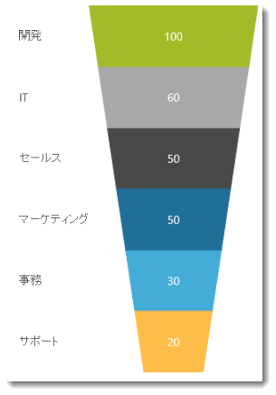

#### 関連トピック

[igFunnelChart の概要](/igfunnelchart-overview)


## igGrid
### 列移動機能 (RTM)

列移動は `igGrid`/`igHierarchicalGrid` の機能であり、グリッド内の列の位置を変更し、事実上グリッドの列の順序を再設定できます。これは、グリッド インターフェイスを介して、または列移動機能の API を介してプログラム的に実行できます。ユーザーはドラッグする、または特別な列移動インターフェイス (列ヘッダー内のボタンで起動) から任意の列の位置を選択することにより列を移動できます。ドラッグは、タッチ対応デバイス上ではサポートされません。

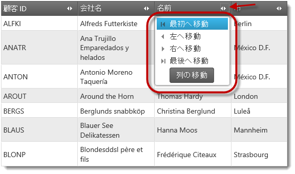

#### 関連トピック

[列移動の概要 (igGrid)](/iggrid-columnmoving-overview)

### セル結合 (RTM)

セル結合は `igGrid`/`igHierarchicalGrid` の機能であり、値が同じであると (表示テキスト)、ユーザーは列内のセルを可視的にに結合できます。

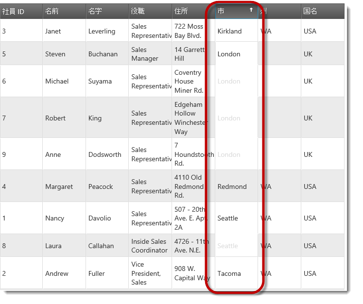

#### 関連トピック

[**セル結合の概要 (igGrid)**](../../02_Controls/igGrid/03_Features/07_Cell Merging/00_igGrid_CellMerging_Overview.mdx)

### レスポンス Web デザイン モード

`igGrid` コントロールの レスポンス Web デザイン (RWD) モード機能は、異なるデバイスにおけるユーザー エクスペリエンスを改善するために[レスポンス Web デザイン](http://alistapart.com/article/responsive-web-design)という概念を採用します。レスポンス Web デザイン モードにより、複数の画面サイズおよびフォーム要素を単一のコード ベースおよび設計でサポートできます。

RWD モードでは、グリッドのデバイス画面への適用は以下のいずれかに構成できます。

-   列の自動非表示

これは、RWD モード機能の列非表示機能を介して構成されます。

-   構造および書式設定の変更は、グリッド テンプレートを介して実装できます。

このために RWD モード機能は、RWD モード機能が有効になると `igGrid` テンプレートを置き換える定義済みグリッド テンプレートのセットをサポートします。テンプレートを使用すると、広範囲の適応において、行の非表示など異なるフォントやフォント サイズを用いて複数の行や列を 1 つの行や列およびその他にマージします。

#### 関連トピック

[**レスポンス Web デザイン (RWD) モードの概要 (igGrid)**](/iggrid-responsive-web-design-mode-overview)

### Knockout サポート (RTM)

&#123;environment:ProductName&#125; `igGrid` エディター コントロールにおけるKnockout ライブラリのサポートは、開発者が Knockout ライブラリとその宣言構文を使用して &#123;environment:ProductName&#125; グリッドを初期化し構成するための簡単な手段を提供することを目的としています。

Knockout のサポートは、Knockout バインディングがページに適用されるときに最初に呼び出される Knockout 拡張機能として、View-Model への外部更新が起こったときにページの存続期間中に実装されます。また、data-bind 属性においてビジネス案件に対して関連度を有するいずれかのエディター コントロール オプションを指定できます。

#### 関連トピック

[**グリッド Knockoutjs の結合**](/iggrid-configuring-knockout-support)

### 列の固定化 (CTP)

`igGrid`™ 列の固定化機能により、グリッドの左または右に列の表示を固定し常に表示されるようにします。

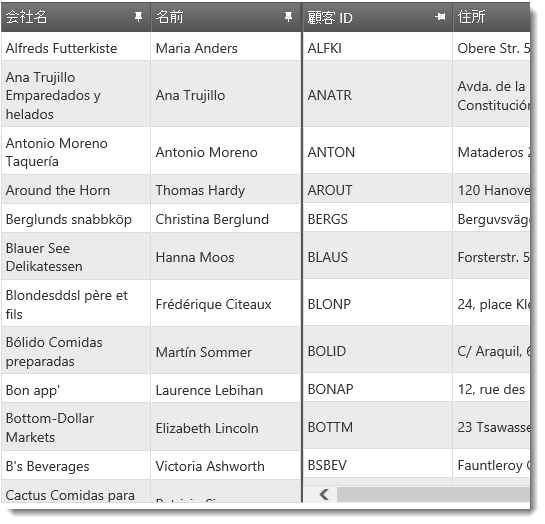

#### 関連サンプル

[**列の固定化 (igGrid)**](&#123;environment:SamplesUrl&#125;/grid/column-fixing)


## igHierarchicalGrid
### 列移動機能 (RTM)

列移動は `igGrid/igHierarchicalGrid` の機能であり、グリッド内の列の位置を変更し、事実上グリッドの列の順序を再設定できます。これは、グリッド インターフェイスを介して、または列移動機能の API を介してプログラム的に実行できます。ユーザーはドラッグする、または特別な列移動インターフェイス (列ヘッダー内のボタンで起動) から任意の列の位置を選択することにより列を移動できます。ドラッグは、タッチ対応デバイス上ではサポートされません。


#### 関連トピック

[列移動の概要 (igGrid)](/iggrid-columnmoving-overview)

### セル結合 (RTM)

セル結合は `igHierarchicalGrid` の機能であり、値が同じであると (表示テキスト)、ユーザーは列内のセルを可視的にに結合できます。


#### 関連トピック

[セル結合の概要 (igGrid)](../../02_Controls/igGrid/03_Features/07_Cell Merging/00_igGrid_CellMerging_Overview.mdx)

### 列の固定化 (CTP)

`igGrid` 列の固定化機能により、グリッドの左または右に列の表示を固定し常に表示されるようにします。


#### 関連サンプル

[**列の固定化 (igGrid)**](&#123;environment:SamplesUrl&#125;/grid/column-fixing)

### Knockout サポート (RTM)

&#123;environment:ProductName&#125; `igHierarchicalGrid` エディター コントロールにおける Knockout ライブラリのサポートは、開発者が Knockout ライブラリとその宣言構文を使用して &#123;environment:ProductName&#125; グリッドを初期化し構成するための簡単な手段を提供することを目的としています。

Knockout のサポートは、Knockout バインディングがページに適用されるときに最初に呼び出される Knockout 拡張機能として、View-Model への外部更新が起こったときにページの存続期間中に実装されます。
また、data-bind 属性においてビジネス案件に対して関連度を有するいずれかのエディター コントロール オプションを指定できます。

#### 関連サンプル

[**階層グリッド Knockoutjs の結合**](&#123;environment:SamplesUrl&#125;/hierarchical-grid/bind-hgrid-with-ko)


## igListView
### 縮小可能なグループ

`igListView` は、このリリースにおいてデフォルトのグループ化機能に縮小可能グループを追加します。ユーザーはグループを展開および縮小して、それらに重要なデータのセクションを表示します。

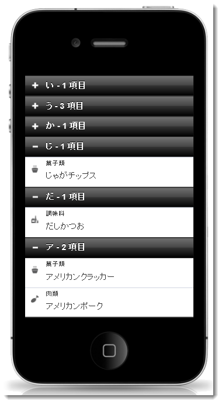

#### 関連サンプル

[カスタム グループ](&#123;environment:SamplesUrl&#125;/mobile-list-view/custom-groups)


## igOlapFlatDataSource
### 新規コンポーネント

`igOlapFlatDataSource` コンポーネントは、フラットなデータ コレクション上で多次元の (OLAP のような) 解析を実施できます。データ収集または [igDataSource](/igdatasource-igdatasource)™ インスタンスが与えられユーザー構成に基づく場合、`igOlapFlatDataSource` は階層およびメジャーの分析コードを作成するため必要なメタデータを抽出します。

#### 関連トピック

[igOlapFlatDataSource の概要](/igolapflatdatasource-overview)


## igOlapXmlaDataSource
### 新規コンポーネント

`igOlapXmlaDataSource` コンポーネントは、JavaScript クライアント アプリケーションと `msmdpump.dll` HTTP データ プロバイダで構成された Microsoft® SQL Server Analysis Services (SSAS) サーバーの間のコミュニケーションを取り扱います。Microsoft SQL Server Analysis Services (MS SASS) からデータを取得するためユーザー フレンドリなやり方を公開します。

#### 関連トピック

[igOlapXmlaDataSource の概要](/igolapxmladatasource-overview)


## igPivotDataSelector
### 新規コントロール

`igPivotDataSelector` は、データが [igPivotGrid](/igpivotgrid)™ で可視化されている場合にユーザーがデータ スライスを選択できるインタラクティブな UI コントロール (jQuery UI ウィジェット) です。

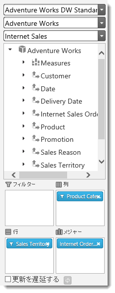

#### 関連トピック

[igPivotDataSelector の概要](/igpivotdataselector-overview)


## igPivotGrid
### 新規コントロール

`igPivotGrid` コントロールは、[ピボット テーブル](http://en.wikipedia.org/wiki/Pivot_table) にデータを表示するためのデータ プレゼンテーション コントロールです。ユーザーは提供されたデータで複雑な解析を実行できます。`igPivotGrid` は、オンライン解析処理 (OLAP) アプローチを使用して、分かりやすい方法で多次元クエリーの結果を表示します。`igPivotGrid` コントロールは、 `igOlapFlatDataSource`™ コンポーネントまたは  `igOlapXmlaDataSource`™ コンポーネントのインスタンスをデータ ソースとして使用します。

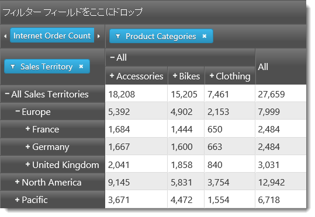

#### 関連トピック

[igPivotGrid の概要](/igpivotgrid-overview)


## igPivotView
### 新規コントロール

`igPivotView` は、ピボット グリッドと、スプリッターで区切られるデータ選択ウィザードを組み合わせる 2 パネル コントロールです。これは、[igPivotGrid](/igpivotgrid)™、[igPivotDataSelector](/igpivotdataselector)™ および [igSplitter](/igsplitter)™ の 3 つの個別コンポーネントのコンストラクションです。まとめてアセンブルし、ピボット グリッドで多次元 (OLAP) データを操作するために必要なすべてのツールを 1 カ所で提供します。

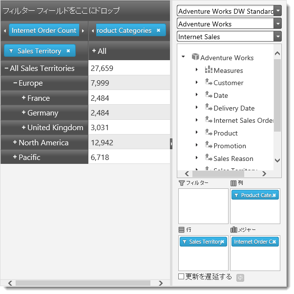

#### 関連トピック

[igPivotView 概要](/igpivotview-overview)


## igSparkline
### 新規コントロール

`igSparkline` は、テキストまたは表形式データでデータの可視化を折れ線チャートに埋め込むために使用される新しいデータ バインド コントロールです。コントロールは、いくつかの異なるチャート タイプ、ツールチップ、標準範囲の可視化、マーカー、傾向線および幅広いビジュアル カスタマイズをサポートします。

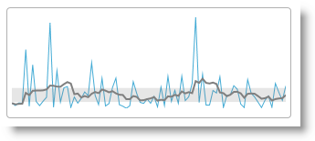

#### 関連トピック

[igSparkline の概要](/igsparkline-overview)


## igSplitter
### 新規コントロール

`igSplitter` は、レイアウトを 2 つの異なるパネルに分けることにより HTML5 Web アプリケーションおよびサイトでレイアウトを管理するためのコンテナー コントロールです。パネルは、サイズ変更、折りたたみ、または展開できます。

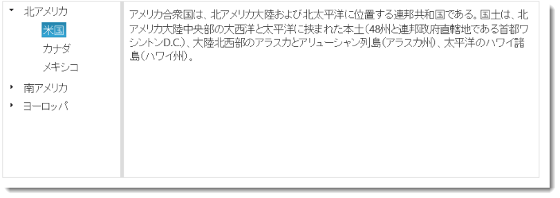

#### 関連トピック

[igSplitter の概要](/igsplitter-overview)


## igTree
### Knockout のサポート

&#123;environment:ProductName&#125; エディター コントロールにおける Knockout ライブラリのサポートは、開発者が Knockout ライブラリとその宣言構文を使用して &#123;environment:ProductName&#125; エディターを初期化し構成するための簡単な手段を提供することを目的としています。

Knockout のサポートは、Knockout バインディングがページに適用されるときに最初に呼び出される Knockout 拡張機能として、View-Model への外部更新が起こったときにページの存続期間中に実装されます。
また、data-bind 属性においてビジネス案件に対して関連度を有するいずれかのエディター コントロール オプションを指定できます。

#### 関連トピック

[Knockout サポートの構成 (igTree)](/igtree-knockoutjs-support)


## igUpload
### 全般的改善

`igUpload` は、 [XMLHttpRequest Level 2](http://www.w3.org/TR/XMLHttpRequest2/) を使用してこの仕様を実装するブラウザ上でアップロードするファイルの状態を取得します。HTTP ハンドラーはこの場合は使用されません。

### ファイルを MemoryStream として保存

新規アプリケーションにおよぶオプション `FileSaveType` は `igUpload` MVC ラッパーに追加されます。このオプションは、filestream と memorystream の 2 つの値を承諾します。デフォルトで、オプションは filestream に設定されます。このモードにより、`igUpload` MVC ラッパーにおいて機能が使用可能になります。

新しい memorystream オプションにより、ファイルをメモリストリーム機能として保存できます。このモードでは、`FileUploading` イベントを取り扱うことにより、アップロードされたファイルを `MemoryStream` として公開できます。

#### 関連トピック

[ファイルをストリームとして保存 (igUpload)](../../02_Controls/igUpload/01_Working with igUpload/04_igUpload_Saving_Files_as_Stream.mdx)

### アップロードする複数ファイルを一度に選択

ユーザーによるファイル選択が可能かどうか、いつファイルを選択するか、また一度に複数のファイルを選択できるかどうかを構成できます。この機能は、`igUpload` のファイル選択モードにより管理されます。ファイル選択モードは、単一ファイル (ユーザーは 1 パスで 1 ファイル選択可能) または複数ファイル (ユーザーは 1 パスで複数ファイル選択可能) です。

複数ファイル選択は、入力要素の [HTML 5 multiple attribute](http://www.w3.org/TR/html-markup/input.file.html#input.file.attrs.multiple) を利用します。

ユーザーは、複数のファイルを 2 通りの方法で `igUpload` に追加できます。

-   「ファイルを開く」ダイアログから
-   `igUpload` コントロールでドラッグ アンド ドロップすることにより

機能は、入力要素の複数の属性をサポートするブラウザでのみ使用可能です。

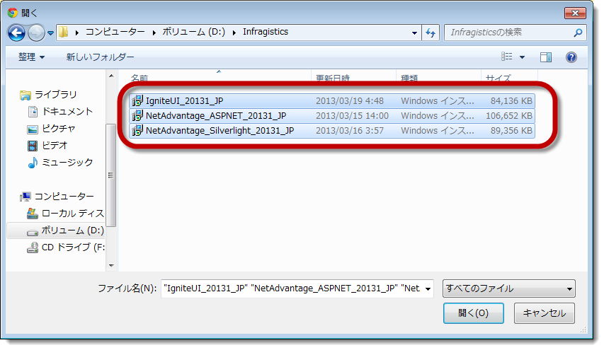

#### 関連トピック

[igUpload の構成](../../02_Controls/igUpload/01_Working with igUpload/00_igUpload_Configuring_igUpload.mdx)


## &#123;environment:ProductNameMVC&#125;
### イベント追加のサポート

ASP.NET MVC ヘルパーへ追加することにより &#123;environment:ProductName&#125; コントロールにイベントを追加できます。`AddClientEvent` メソッドを使用してイベント名およびハンドラー関数名を供給します。ヘルパーは、クライアント上で適切なインスタンス化 JavaScript に描画しイベントを発生します。

**ASPX の場合:**

```csharp
<%= Html.Infragistics().Combo()
    .DataSource(Model)
    .TextKey("DisplayText")
    .ValueKey("Value")
    .AddClientEvent("selectionChanged", "comboSelectionChanged")
    .Render()
%>
```

注: `igUpload`、`igGrid`/`igHierarchicalGrid` およびその機能は、13.1 の最初のサービス リリースでこの機能性を取得します。


## TypeScript 定義ファイル
### 新規機能 (CTP)

TypeScript は、JavaScript アプリケーションの開発で型付きレイヤーを JavaScript に追加する言語です。
&#123;environment:ProductName&#125; は、すべてのコントロールの型定義を提供する `igniteui.d.ts` の TypeScript 定義ファイルを含みます。

定義ファイルは、&#123;environment:ProductName&#125; インストール ディレクトリで `{Installation Directory}typingsigniteui.t.ds` にあります。詳しくは、以下の記事を参照してください。

### 関連の記事

-   [TypeScript のダウンロード](http://www.typescriptlang.org/#Download)
-   [&#123;environment:ProductName&#125; で TypeScript サポートの紹介](http://www.infragistics.com/community/blogs/angel_todorov/archive/2012/10/27/introducing-typescript-support-for-ignite-ui.aspx)
-   [TypeScript チュートリアル](http://www.typescriptlang.org/Tutorial/)
-   [TypeScript: JavaScript アプリケーションへの追加 - パート 2](http://msdn.microsoft.com/ja-jp/magazine/jj983351.aspx)


## igDoughnutChart
### 新規コントロール (CTP)

このバージョンで CTP としてリリースされ、`igDoughnutChart` は円チャートに似たデータを表示し、共通の中心部の周りに複数のデータ セットを表示できます。

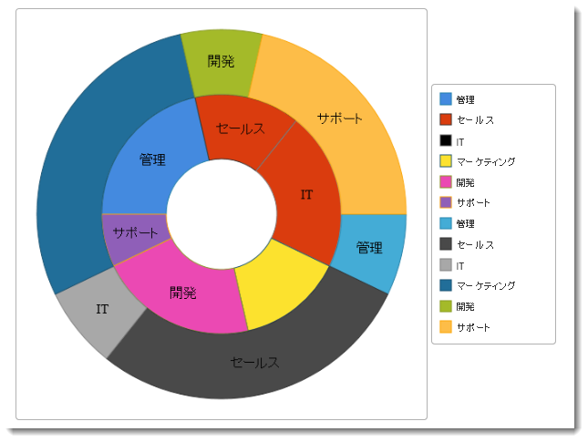

#### 関連サンプル

-   [JSON へのバインド](&#123;environment:SamplesUrl&#125;/doughnut-chart/bind-json)
-   [Collection にバインド](&#123;environment:SamplesUrl&#125;/doughnut-chart/bind-to-collection)


## igLayoutManager
### 新規コントロール (CTP)

`igLayoutManager`™ は、HTML Web アプリケーションで全般的なレイアウトを管理するためのレイアウト コントロールです。コントロールは、グリッド、列、フロー、境界線および垂直のレイアウトをサポートします。コントロールは、任意のレイアウトに従って対応するアプリケーション内にコンテナーを配置します。

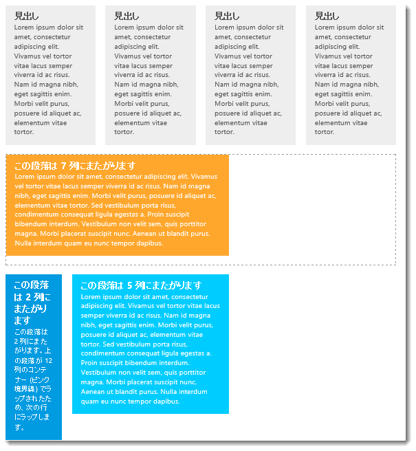

#### 関連サンプル

-   [HTML マークアップからの境界線のレイアウト](&#123;environment:SamplesUrl&#125;/layout-manager/border-layout-markup)
-   [レスポンシブ列レイアウト](&#123;environment:SamplesUrl&#125;/layout-manager/column-layout-markup)
-   [レスポンシブ フロー レイアウト](&#123;environment:SamplesUrl&#125;/layout-manager/flow-layout)
-   [レスポンシブ垂直レイアウト](&#123;environment:SamplesUrl&#125;/layout-manager/vertical-layout)
-   [列および行のスパンがあるグリッド レイアウト](&#123;environment:SamplesUrl&#125;/layout-manager/grid-layout)


## igTileManager
### 新規コントロール (CTP)

`igTileManager` は、データをタイルに描画して管理できるレイアウト コントロールです。タイルはレスポンシブ グリッド レイアウトで表示され、コントロールは各タイルに対応するレイアウト構成を提供します。位置 (行スパンと列スパン) およびディメンション (行位置と列位置) を設定します。

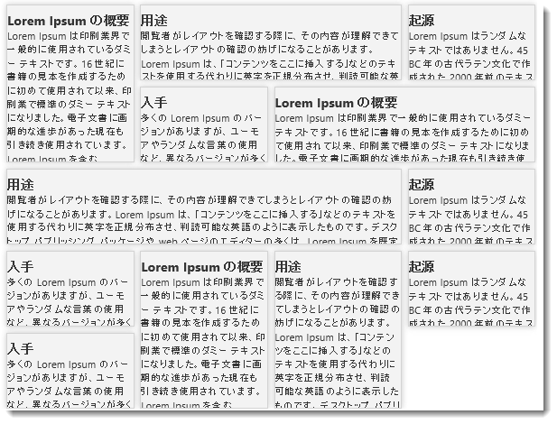

#### 関連サンプル

-   [JSON へのバインド](&#123;environment:SamplesUrl&#125;/tile-manager/bind-json)
-   [ASP.NET MVC の基本的な使用方法](&#123;environment:SamplesUrl&#125;/tile-manager/aspnet-mvc-helper)
-   [項目の構成](&#123;environment:SamplesUrl&#125;/tile-manager/item-configurations)


## igRadialGauge
### 新規コントロール (CTP)

CTP としてリリースされる `igRadialGauge` は、スケールに沿って数値を示すゲージ コントロールです。広範囲におよぶビジュアル カスタマイズがあり、なめらかなアニメーションのコントロールのレンダリングを動的に変更するための運動フレームワークをサポートします。

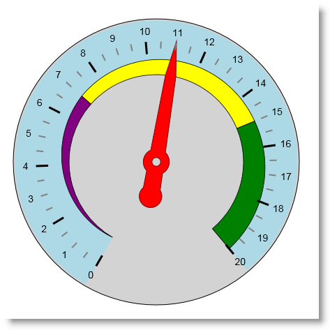

#### 関連サンプル

-   [MVC の初期化](&#123;environment:SamplesUrl&#125;/radial-gauge/mvc-initialization)
-   [ゲージのアニメーション](&#123;environment:SamplesUrl&#125;/radial-gauge/motion-framework)


## 関連コンテンツ

### トピック

このトピックの追加情報については、以下のトピックも合わせてご参照ください。

- [Knockout サポートの構成 (igCombo)](/igcombo-knockoutjs-support): このトピックは、Knockout ライブラリ により管理されるView-Model のオブジェクトをバインドするために `igCombo`™ コントロールを構成する方法について説明します。

- [Knockout サポートの構成 (igEditors)](../../02_Controls/igEditors/Config/02_Configuring Knockout Support (Editors).mdx): このトピックは、Knockout ライブラリを使用して View-Model のオブジェクトをバインドするために &#123;environment:ProductName&#125;® エディター コントロールを構成する方法について説明します。

- [igFunnelChart の概要](/igfunnelchart-overview): このトピックでは、主要機能、最小要件、ユーザー機能性など、`igFunnelChart`™ コントロールに関する概念的な情報を提供します。

- [列移動の概要 (igGrid)](/iggrid-columnmoving-overview): このトピックでは、`igGrid`™ コントロールの列移動機能およびこの機能が提供する機能性について概念的に説明します。

- [セル結合の概要 (igGrid)](../../02_Controls/igGrid/03_Features/07_Cell Merging/00_igGrid_CellMerging_Overview.mdx): このトピックは、`igGrid`™ コントロールのセル結合機能とその機能性について説明します。`igGrid` においてセル結合を有効にし構成する方法のコード例が含まれます。

- [レスポンス Web デザイン (RWD) モードの概要 (igGrid)](/iggrid-responsive-web-design-mode-overview): このトピックは、`igGrid`™ コントロールの レスポンス Web デザイン (RWD) モード機能およびこの機能が提供する機能について概念的に説明します。

- [igOlapFlatDataSource の概要](/igolapflatdatasource-overview): このトピックは、`igFlatDataSource`™ コンポーネントおよびその機能の概要を説明します。

- [igOlapXmlaDataSource の概要](/igolapxmladatasource-overview): このトピックは、`igXmlaDataSource`™ コンポーネントおよびその機能の概要を説明します。

- [igPivotDataSelector の概要](/igpivotdataselector-overview): このトピックは、主要機能、最小要件、ユーザー機能性など、`igPivotDataSelector`™ コントロールに関する概念的な情報を提供します。

- [igPivotGrid の概要](/igpivotgrid-overview): このトピックは、主要機能、最小要件、ユーザー機能性など、`igPivotGrid`™ コントロールに関する概念的な情報を提供します。

- [igPivotView 概要](/igpivotview-overview): このトピックは、主要機能、最小要件、ユーザー機能性など、`igPivotView`™ コントロールに関する概念的な情報を提供します。

- [igSparkline の概要](/igsparkline-overview): このトピックでは、`igSparkline`™ コントロール、そのメリットおよびサポートされるチャート タイプの概要を示します。

- [igSplitter の概要](/igsplitter-overview): このトピックでは、機能、ユーザー機能性など、`igSplitter`™ コントロールに関する概念的な情報を提供します。

- [Knockout サポートの構成 (igTree)](/igtree-knockoutjs-support): このトピックは、Knockout ライブラリにより管理される View-Model オブジェクトをバインドするために `igTree`™ コントロールを構成する方法について説明します。

- [ファイルをストリームとして保存 (igUpload)](../../02_Controls/igUpload/01_Working with igUpload/04_igUpload_Saving_Files_as_Stream.mdx): このトピックは、アップロード ファイルをファイルまたはメモリストリームとして処理し、保存する方法を説明します。詳細な手順は、各プロセスでメモリストリームとしてファイルを保存トピックをご参照ください。

- [igUpload の構成](../../02_Controls/igUpload/01_Working with igUpload/00_igUpload_Configuring_igUpload.mdx): このトピックは、`igUpload`™ コントロールの構成方法をコード例を用いて説明します。


 

 


