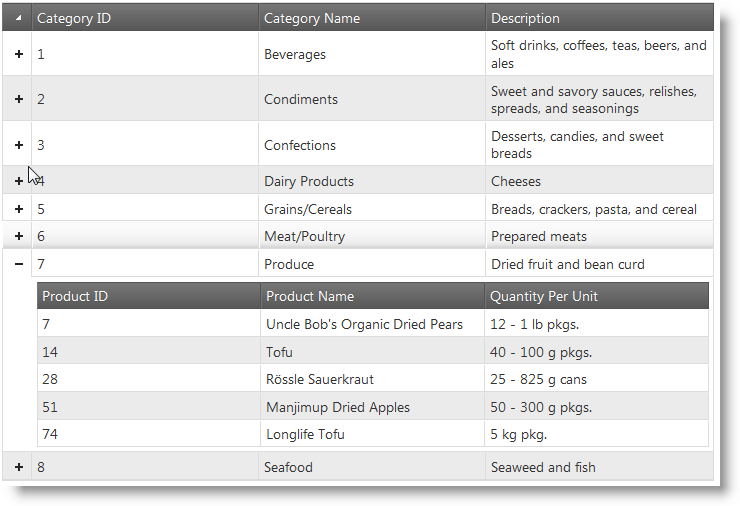
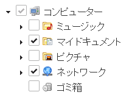
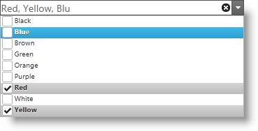
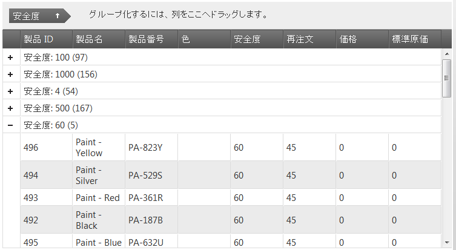
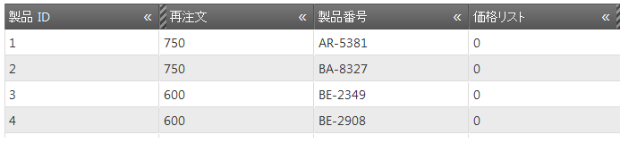
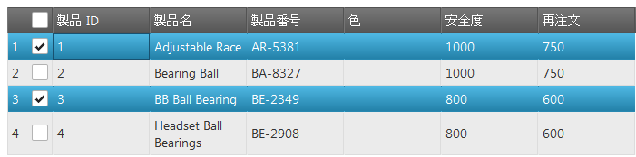
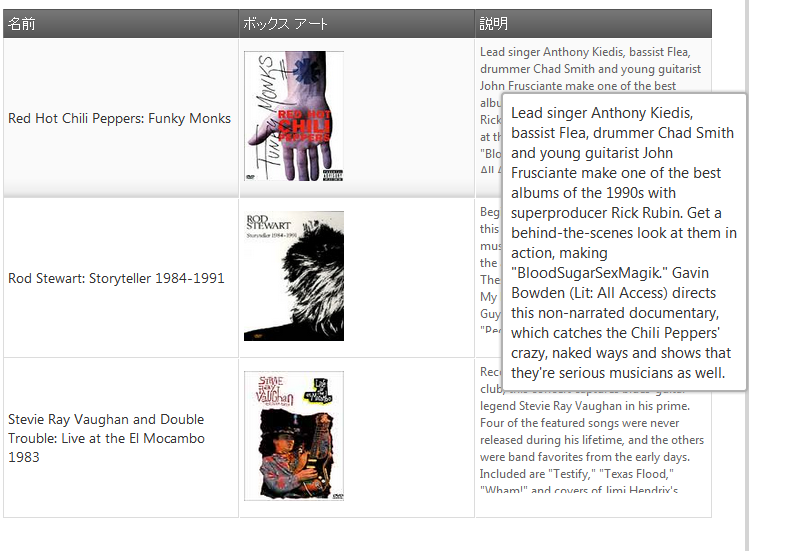
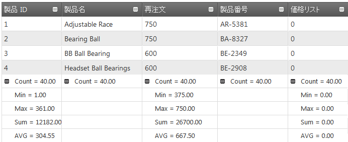

# 2011 Volume 2 の新機能

## トピックの概要
このトピックでは、Infragistics &#123;environment:ProductName&#125;™ 2011 Volume 2 で導入された、新しい機能およびコンポーネントの概要について説明します。

### このトピックの内容
このドキュメントには次のセクションが含まれています:

-   [新機能とコンポーネント](#new-functionalities)
-   [igHierarchicalGrid (新規コントロール)](#ighierarchicalgrid)
-   [igTree (新規コントロール)](#igtree)
-   [igComboBox (新規コントロール)](#igcombobox)
-   igGrid (新機能)
    -   [igGrid - 更新](#updating)
    -   [igGrid - Outlook GroupBy](#groupby)
    -   [igGrid - 列の非表示](#column-hiding)
    -   [igGrid - 列のサイズ変更](#column-resizing)
    -   [igGrid - 行セレクター](#row-selectors)
    -   [igGrid - ツールチップ](#tooltips)
    -   [igGrid - 列集計](#column-summaries)
    -   [igGrid モデル メタデータの拡張](#metadata)

 

##<a id="new-functionalities"></a> 新機能とコンポーネント 
###<a id="ighierarchicalgrid"></a> igHierarchicalGrid™ 
`igHierarchicalGrid` コントロールは、階層データを描画するために使用される新しいグリッド コントロールであり、フラット `igGrid`™ コントロールを内部的に使用します。グリッド行を展開した時に、子レイアウトに `igGrid` が作成される場合のインスタンス。パフォーマンスを最適化するため、`igHierarchicalGrid` コントロールは、行が展開するまで子グリッドのインスタンスを決して作成しません。`igHierarchicalGrid` コントロールの構成方法について理解するには、`igHierarchicalGrid` を使用した作業の開始のトピックを参照してください。



#### 関連トピック
[igHierarchicalGrid の初期化](/ighierarchicalgrid-initializing)

### <a id="igtree"></a>igTree™ 
&#123;environment:ProductName&#125; 2011 Volume 2 リリースの主要機能に、ツリー コントロールがあります。`igTree` コントロールは多数の役立つ機能を備えています。このコントロールは、最適化されたパフォーマンス プロファイルを可能にする、ロード オン デマンドをサポートします。bi-state および tri-state の選択を含む、複数選択がサポートされています。選択機能は、チェックボックス、キーボード入力および個々の選択を含む、構成可能な選択オプションのセットによって実行されます。ノード画像はカスタマイズ可能であり、バインディングによって直接、または明示的な URL パスを画像に提供することによって、CSS を通して画像を構成するオプションがあります。コントロールは、純粋な JavaScript コンテキスト、または ASP.NET MVC ヘルパーを通して作成および管理できます。



#### 関連トピック
[igTree を使用した作業の開始](/igtree-getting-started)

###<a id="igcombobox"></a> igCombo™ 
&#123;environment:ProductName&#125; 2011 Volume 2 リリースの主要機能に、コンボ コントロールがあります。`igCombo` コントロールは多数の役立つ機能を備えています。ユーザー インターフェイスの仮想化サポートには、コントロールの表示可能な領域にあるデータ項目の HTML 要素の作成のみを目的としたコントロールの機能が含まれます。可視のデータ以外の追加データが求められると、コントロールは既存の HTML 要素を再利用し、相対データ位置と同期してスクロールバーの位置を保持します。オートコンプリート機能によって、ユーザーがコンボ ボックスで入力を始めると入力ボックスに一致する選択肢が現れ始め、そこから簡単に選択することができます。自動候補の機能によって、ユーザーが入力ボックスへの入力を始めると、コントロールは、入力されたテキストに基づいて可能性のある一致リストを返し、ユーザーはそこから選択することができます。選択機能によって、ユーザーはチェックボックス、キーボード入力、または標準のクリック選択によって、1 つまたは複数の項目を選択することができます。



#### 関連トピック
[igCombo を使用した作業の開始](/igcombo-getting-started)

###<a id="updating"></a> igGrid™ - 更新 
`igGrid` コントロールの更新機能には、新しい行の更新、追加、および行の削除の、3 種類の動作があります。行全体または個々のセルを編集することができます。行の編集が有効な場合、行のすべてのセルが編集モードに入ります。グリッド データの変更を破棄するには、キャンセル キーを押すと編集モードが終了し、グリッドは更新されません。編集モードを Enter キーで終了するとグリッドは更新され、次の行 (またはセル) が編集モードに入ります。編集モードが「cell」の場合、編集モードは Tab キーで終了できます。Tab キーを使用して編集を終了すると、右側のセルが編集モードに入ります。前に編集したセルが行の最後のセルの場合、次の行の最初のセルが編集モードに入ります。

#### 関連トピック
[igGrid の更新](/iggrid-updating)

### <a id="groupby"></a>igGrid - Outlook GroupBy 
`igGrid` の Group By 機能によって、一連の列をグループ化することができます。このグリッドによって、列をドラッグ アンド ドロップして、グリッドの「group by」領域でグループ化することができます。列がグループ領域でドロップされると、グリッドは、グループ化された列の個々の値と同数の行グループで再配置されます。複数のグループを作成することができます。この場合、入れ子になったグループがプライマリ グループの下に表示されます。カスタムのグループ化メソッドを定義することによって、グループ化機能をカスタマイズすることもできます。グループ化に関する詳細は、Grid の Group By を使用した作業の開始のトピックを参照してください。



#### 関連トピック
[igGrid の Outlook GroupBy を有効にする](/iggrid-enabling-groupby)

### <a id="column-hiding"></a>igGrid 列の非表示 
&#123;environment:ProductName&#125; 2011 Volume 2 リリースには、`igGrid` コントロールの列の非表示機能が含まれています。この機能を使用すると、グリッドの描画の前後に、ユーザーに対して列を非表示にすることができます。さらに、プログラムで、または列ヘッダーの UI 要素を使用して列を非表示にすることができます。以下の画像は、非表示列を持つ `igGrid` コントロールを示しています。赤色の矢印は非表示列のインジケーターを指しています。



#### 関連トピック
[列の非表示を有効にする](/iggrid-column-hiding-enabling-column-hiding)

### <a id="column-resizing"></a>igGrid 列のサイズ変更 
&#123;environment:ProductName&#125; 2011 Volume 2 リリースには、`igGrid` の列のサイズ変更機能が含まれています。列のサイズ変更機能によって、ユーザーはグリッドの列の幅を変更することができます。サイズ変更アクションの効果は、サイズ変更アクションが終了した後、またはこのアクションが発生している時に同時に、グリッドに適用することができます。列のサイズ変更の機能には、コードの構成に利用できる複数の機能があります。これには、グリッド全体および個々の列に対するサイズ変更を許可するレベルがあります。以下の画像は、ユーザーによって Color 列がサイズ変更されているグリッドを示しています。


#### 関連トピック
[igGrid 列のサイズ変更](/iggrid-column-resizing)

### <a id="row-selectors"></a>igGrid 行セレクター 
&#123;environment:ProductName&#125; 2011 Volume 2 リリースには、`igGrid` の行セレクター機能が含まれています。行セレクター機能は、チェックボックス、行の番号付けを有効にし、また `igGrid` コントロールの複数選択機能と結合するためのオプションを公開します (以下の画像を参照)。



#### 関連トピック
[行セレクターを有効にする](../../02_Controls/igGrid/03_Features/02_Row Selectors/00_igGrid_Enabling_Row_Selectors.mdx)

### <a id="tooltips"></a>igGrid のヒント 
&#123;environment:ProductName&#125; 2011 Volume 2 リリースには、`igGrid` のツールチップ機能が含まれています。この機能によって、グリッドのセルにツールチップが表示されます。ツールチップの目的は、セル全体のコンテンツを可視にし、ユーザーがツールチップ コンテナー内のテキストを選択してコピーできるようにすることです。



#### 関連トピック
[igGrid ツールチップの有効化](/iggrid-enabling-tooltips)

### <a id="column-summaries"></a>igGrid 列集計 
&#123;environment:ProductName&#125; 2011 Volume 2 リリースには、`igGrid` の列集計機能が含まれています。列の集計機能は、列のデータに基づいて集計を計算するオプションを公開します。グリッドには多数のデフォルトの集計関数が含まれており、また集計を計算するためのカスタム関数を定義する機能も提供されています。さらに、集計をリモートまたはローカルで計算するかどうかを選択できるオプションもあります。以下の画像は、集計が有効になったグリッドを示しています。



#### 関連トピック
[列集計を有効にする](../../02_Controls/igGrid/03_Features/00_Columns/05_Summaries/00_igGrid_Enabling _Column_Summaries.mdx)

### <a id="metadata"></a>igGrid モデル メタデータの拡張 
&#123;environment:ProductName&#125; 2011 Volume 2 リリースには、`DisplayName` 属性を認識するための `igGrid` MVC ヘルパーの機能が含まれています。`DisplayName` 属性の使用によって、MVC ヘルパーは指定した列の `headerText` としてこの属性を自動的に使用できます。`headerText` がグリッドで明示的に設定されている場合、`DisplayName` の値が上書きされることに留意してください。以下の例は、`headerText` を `DisplayName` 属性の値に自動的にバインドするシンプルなモデルおよび `igGrid` を示しています。

 

**MVC モデル:**

```csharp
class Customer
    {
        [DisplayName("First Name")]
        public string FirstName { get; set; }
        [DisplayName("Family Name")]
        public string FamilyName { get; set; }
    }
```

 

**MVC ASPX ビュー:**

```csharp
<%= Html.Infragistics().Grid(Model).ID("grid").Columns(column => {
         column.For(c => c.FirstName);
         column.For(c => c.FamilyName);
         })
     %>
```

 

 


