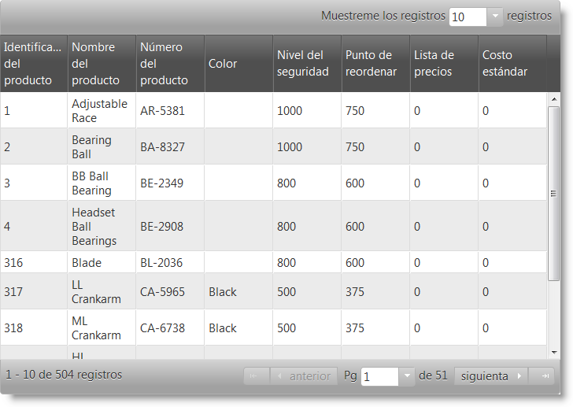
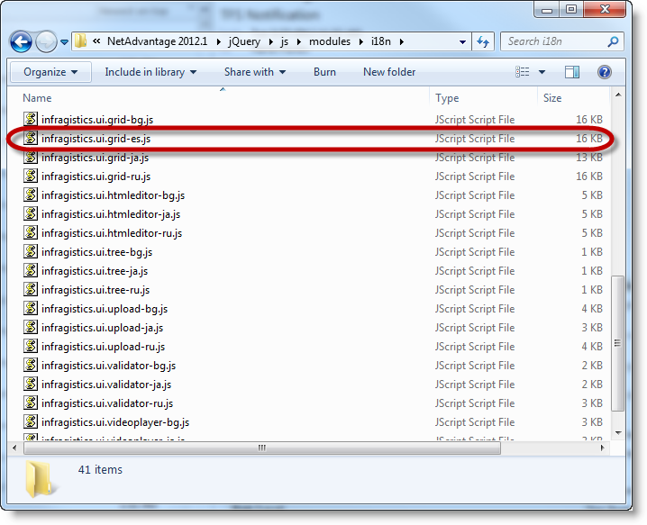

<!--
|metadata|
{
    "fileName": "customizing-the-localization-of-igniteui-for-jquery-controls",
    "controlName": [],
    "tags": []
}
|metadata|
-->

# %%ProductName%% コントロールのローカライズのカスタマイズ

##トピックの概要

#### 目的

このトピックでは、必要な言語での %%ProductName%%™ コントロールのローカライズ方法について説明します。

#### 必要な背景

以下の表は、このトピックを理解するための前提条件として必要なトピックを示しています。

[%%ProductName%% で JavaScript リソースの使用](Deployment-Guide-JavaScript-Resources.html) : このトピックでは、%%ProductName%% のフォルダー構造、Infragistics ローダーの使用方法、およびコントロールの手動での参照方法について説明します。

#### このトピックの内容

このトピックは、以下のセクションで構成されます。

- [%%ProductName%% コントロールのローカライズのカスタマイズ](#productname-コントロールのローカライズのカスタマイズ)
			- [目的](#目的)
			- [必要な背景](#必要な背景)
			- [このトピックの内容](#このトピックの内容)
			- [%%ProductName%% コントロールのローカライズの紹介](#productname-コントロールのローカライズの紹介)
	- [<a id="Localization"></a>コントロールのローカライズ ファイル参照](#コントロールのローカライズ-ファイル参照)
		- [<a id="subIntroduction"></a>概要](#概要)
	- [<a id="set"></a> `language`、`locale`、および `regional` オプションの設定](#-languagelocaleおよび-regional-オプションの設定)
	- [<a id="change"></a> 言語および地域設定の変更](#-言語および地域設定の変更)
		- [<a id="change-locale"></a> 言語の変更](#-言語の変更)
		- [<a id="change-regional"></a> 地域設定の変更](#-地域設定の変更)
	- [<a id="Walkthrough"></a>チュートリアル: igGridPaging をカスタム ロケールでローカライズ](#チュートリアル-iggridpaging-をカスタム-ロケールでローカライズ)
		- [<a id="WalkthroughIntroduction"></a>概要](#概要-1)
			- [<a id="Requirements"></a>要件](#要件)
			- [<a id="Steps"></a>手順](#手順)
	- [<a id="Walkthrough2"></a>チュートリアル: ページのすべてのコントロールの言語および地域設定をランタイムに変更](#チュートリアル-ページのすべてのコントロールの言語および地域設定をランタイムに変更)
		- [<a id="Steps"></a>手順](#手順-1)
		- [トピック](#トピック)


##<a id="Introduction"></a>概要


#### %%ProductName%% コントロールのローカライズの紹介

現在、jQuery コントロールは以下の言語で提供されています。

-   英語
-   日本語
-   ロシア語
-   ブルガリア語
-   ドイツ語
-   フランス語
-   スペイン語 
-   ポルトガル語
-   イタリア語
-   韓国語
-   繁体字中国語
-   簡体字中国語
-   チェコ語
-   ポーランド語
-   ルーマニア語
-   トルコ語
-   デンマーク語
-   ノルウェー語
-   スウェーデン語
-   オランダ語
-   ハンガリー語

コントロールをいずれかの言語にローカライズするには、Infragistics ローダーまたはローカライズ ファイル `infragistics-<locale>.js` を参照する必要があります。`<locale>` は、en、ja、ru、bg、de、fr、es のいずれかになります。17.2 以前は単一のロケール ファイルは一度に読み込めましたが、2 つ以上のロケールを読み込んだ場合、最後に読み込んだロケールによって前のロケールがオーバーライドされました。17.2 以後、複数のロケール ファイルを一度に読み込むことができます。

必要なロケールをすべて読み込んだ後、グローバルに適用するロケールを指定、またはコントロールごとにロケールを設定できます。単一のロケール ファイルのみ読み込んだ場合、グローバルのデフォルト言語が無視され、読み込んだロケールの言語文字列が表示されます。

複数のロケール ファイルを読み込んだ場合、言語をグローバルに設定するには、コントロールを初期化する前に `$.ig.util.language` を設定します。

**JavaScript の場合:**

```js
	$.ig.util.language = language;
```

また、各ローカライズ可能なコントロールに読み込んだときに使用する言語を決定する `language` プロパティがあります。

注: このプロパティを設定した場合、特定のコントロールでグローバルで設定された言語より優先されます。

>**注:** 2 つの再配布可能なパッケージがあります。ひとつは英語、もうひとつは日本語です。英語版では、再配布可能なパッケージ `infragistics-en.js` は利用できません。ローカライズ文字列は、ファイルの最初のコントロール コードに含まれています。日本語版では、再配布可能なパッケージ `infragistics-ja.js` は利用できません。ローカライズ文字列は、ファイルの最初のコントロール コードに含まれています。

>**注:**  英語のロケール リソースを読み込んだ場合は、それがデフォルトで使用されます。英語のロケール リソースがページに読み込まれていない場合、最初に読み込んだリソースがロケール リソースとして使用されます。英語のパッケージで、英語のローカライズ文字列は製品ファイルに含まれているため、このパッケージにに常に読み込まれます。

>**注:**  デフォルトの地域設定は "en-US" ですが、これをページに読み込んでいない場合、最後に読み込んだ地域設定がデフォルトの地域設定として使用されます。

カスタム言語を設定する場合、設定手順は異なります。

-   コントロールをローカライズします
   -   ローカライズ ファイルを見つけます - ローカライズ ファイルは `<Ignite_UI_Install_Folder>\js\modules\i18n` にあります

<IgniteUI_Install_Folder> のデフォルト値は:      

```
%%InstallPath%%
```

-   使用したいコントロールをローカライズするには、ローカライズするコントロールの `*-ru.js` ファイルのコピーを作成し、`*-<language>.js` に名前を変更します。ここでは、<language> は使用する言語の 2 文字のコードです。

-   ローカライズされたファイルをプロジェクトに追加します。作成したファイルをプロジェクトに追加します。このようにして、コントロールは、開発者のファイルからの文字列を使用するようになります。locale プロパティをどのように設定しても、このアプローチは Infragistics ローダーで動作します。

>**注:** このガイドは、英語版の再配布可能なパッケージがインストールされていることを前提としています。この場合、`infragistics-en.js` はありません。このため、`infragistics-ru.js` を使用します。都合が悪い場合は日本語の再配布可能パッケージを入手して、そこから `infragistics-en.js` を入手できます。


## <a id="Localization"></a>コントロールのローカライズ ファイル参照


### <a id="subIntroduction"></a>概要

このセクションでは、%%ProductName%% コントロールの利用可能なローカライズ ファイルについて説明します。これらのファイルは <IgniteUI_Install_Folder>\js\modules\i18n フォルダーにあり、ここで <IgniteUI_Install_Folder> は、%%ProductName%% をインストールしたディレクトリを指します。

####<a id="LocalizationSummary"></a> コントロールのローカライズ参照の概要

以下の表は、%%ProductName%% コントロールのローカライズ ファイルの概要を示しています。

<table class="table">
	<thead>
		<tr>
			<th>コントロール</th>
			<th>スクリプト名</th>
		</tr>
	</thead>
	<tbody>
		<tr>
			<td>igChart</td>
			<td>infragistics.dvcommonwidget-ru.js</td>
		</tr>
		<tr>
			<td>igCombo</td>
			<td>infragistics.ui.combo-ru.js</td>
		</tr>
		<tr>
			<td>igDataSource</td>
			<td>infragistics.dataSource-ru.js</td>
		</tr>
		<tr>
			<td>igDialog</td>
			<td>infragistics.ui.dialog-ru.js</td>
		</tr>
		<tr>
			<td>igEditors</td>
			<td>infragistics.ui.editors-ru.js</td>
		</tr>
	</tbody>
</table>

    
>**注:**  igDatePicker は、jQuery UI Datepicker コントロールに依存しているため、Web サイトの jQuery UI 再配布可能なパッケージに含まれる `jquery.ui.datepicker-*.js` ローカライゼーション ファイルも必要となります。

<table class="table">
	<thead>
		<tr>
			<th>コントロール</th>
			<th>スクリプト名</th>
		</tr>
	</thead>
	<tbody>
		<tr>
			<td>igGrid</td>
			<td>infragistics.ui.grid-ru.js</td>
		</tr>
		<tr>
			<td>igHtmlEditor</td>
			<td>infragistics.ui.tree-ru.js</td>
		</tr>
		<tr>
			<td>igUpload</td>
			<td>infragistics.ui.upload-ru.js</td>
		</tr>
		<tr>
			<td>igValidator</td>
			<td>infragistics.ui.validator-ru.js</td>
		</tr>
		<tr>
			<td>igVideoPlayer</td>
			<td>infragistics.ui.videoplayer-ru.js</td>
		</tr>
	</tbody>
</table>   

## <a id="set"></a> `language`、`locale`、および `regional` オプションの設定

コントロールの `language`、`regional`、および `locale` オプションを JavaScript および ASP.NET MVC で設定できます。

**JavaScript の場合:**

```js
	$("#combo").igCombo({
		language: "en",
		regional:"en-GB",
		locale: {
			dropDownButtonTitle: 'New drop down title'
		}
		dataSource: colors,
		textKey: "Name",
		valueKey: "Name",
		width: "200px"
	});
```

%%ProductNameMVC%% の object 型の `locale` オプションを使用する場合、igGrid、igTreeGrid、および igHierarachicalGrid にラムダ式または文字列によって設定できます。すべてのその他のコントロールの場合、文字列のみを指定できます。

**Razor の場合:**

igTreeGrid - ラムダ式で設定される `locale` オプション

```csharp
@(Html.Infragistics().TreeGrid(Model)
        .ID("treegrid1")
        .Width("100%")
		.Language("en")
		.Regional("en-GB")
		.Locale(l =>l.ExpandTooltipText("New Expand Tooltip").CollapseTooltipText("New Collapse Tooltip"))
        .AutoGenerateColumns(false)
        .PrimaryKey("ID")
        .ChildDataKey("Files")
        .RenderExpansionIndicatorColumn(true)
        .InitialExpandDepth(1)
        .Columns(column =>
            {
                column.For(x => x.ID).Hidden(true);
                column.For(x => x.Name).HeaderText("Name").Width("30%");
                column.For(x => x.DateModified).HeaderText("Date Modified").Width("20%");
                column.For(x => x.Type).HeaderText("Type").Width("20%");
                column.For(x => x.Size).HeaderText("Size in KB").Width("20%");
            })
        .DataBind()
        .Render()
    )
```

igTreeGrid - 文字列で設定される `locale` オプション

```csharp
@(Html.Infragistics().TreeGrid(Model)
        .ID("treegrid1")
        .Width("100%")
		.Language("en")
		.Regional("en-GB")
		.Locale("{expandTooltipText: 'New Expand Tooltip', collapseTooltipText: 'New Collapse Tooltip' }")
        .AutoGenerateColumns(false)
        .PrimaryKey("ID")
        .ChildDataKey("Files")
        .RenderExpansionIndicatorColumn(true)
        .InitialExpandDepth(1)
        .Columns(column =>
            {
                column.For(x => x.ID).Hidden(true);
                column.For(x => x.Name).HeaderText("Name").Width("30%");
                column.For(x => x.DateModified).HeaderText("Date Modified").Width("20%");
                column.For(x => x.Type).HeaderText("Type").Width("20%");
                column.For(x => x.Size).HeaderText("Size in KB").Width("20%");
            })
        .DataBind()
        .Render()
    )
```

## <a id="change"></a> 言語および地域設定の変更

### <a id="change-locale"></a> 言語の変更

コントロールの言語を `language` オプションによって設定できます。ランタイムに変更するには、以下の方法を使用します。
- ページで `language` が明示的に設定されていないすべての %%ProductName%% ウィジェットをグローバルに設定するには、`changeGlobalLanguage` 関数を使用します。

	**JavaScript の場合:**
	
	```js
		$.ig.util.changeGlobalLanguage("ru");
	```
- コントロールの `language` オプションによってコントロールごとに設定します。

	**JavaScript の場合:**
	
	```js
		grid.igGrid("option", "language", "ru");
	```

>**注:** 設定する言語の関連するローカライズ ファイルをページで初期化の前に読み込む必要があります。

>**注:** `language` オプションは、`locale` オプションを使用して設定される文字列をオーバーライドしません。 `locale` オプションがより優先されます。

### <a id="change-regional"></a> 地域設定の変更

コントロールの地域設定を `regional` オプションによって設定できます。設定するには、以下の方法を使用します。

- ページですべての %%ProductName%% ウィジェットをグローバルに設定するには、`changeGlobalRegional` 関数を使用します。

	**JavaScript の場合:**
	
	```js
		$.ig.util.changeGlobalRegional("ru");
	```
	
- コントロールの `language` オプションによってコントロールごとに設定します。

	**JavaScript の場合:**
	
	```js
		grid.igGrid("option", "regional", "ru");
	```
	
>**注:** igGrid コントロールで列ごとに地域設定を変更できます。これにより、データに異なる列で異なる地域書式を設定できます。

**JavaScript の場合:**
		
```js
grid.igGrid({
	columns: [
		{ headerText: "Price", key: "Price", dataType: "number", width: "200px", regional: "en" },
		{ headerText: "Date", key: "Date", dataType: "date", width: "200px", regional: "ru" }
	]
});
```

## <a id="Walkthrough"></a>チュートリアル: igGridPaging をカスタム ロケールでローカライズ

### <a id="WalkthroughIntroduction"></a>概要

この手順では、igGridPaging のローカライズ プロセスを説明します。デモの目的で、スペイン語のローカライズを使用します。

####<a id="Preview"></a> プレビュー

以下のスクリーンショットは最終結果のプレビューです。



#### <a id="Requirements"></a>要件

手順を実行するには、%%ProductName%% %%ProductVersionShort%% (英語版再配布可能パッケージ) のインストールが必要です。

>**注**: インストール パスは `%%InstallPath%%` として仮定します。

####<a id="Overview"></a> 概要

このトピックでは、igGridPaging のローカライズについてステップごとに説明します。以下はプロセスの概念的概要です。

1. [infragistics.ui.grid-ru.js のコピーを作成し、infragistics.ui.grid-es.js に名前を変更](#copy_localization_file)

2. [infragistics.ui.grid-es.js のローカライズ](#localize_file)

3. [ローカライズされたファイルをスクリプト参照と共にプロジェクトに追加](#include_localized_file)

#### <a id="Steps"></a>手順

以下の手順は、x コントロールのローカライズ方法を示します。


1. <a id="copy_localization_file"></a> `infragistics.ui.grid-ru.js` のコピーを作成し、`infragistics.ui.grid-es.js` に名前を変更します。

	`%%InstallPath%%\js\modules\i18n\infragistics.ui.grid-ru.js` を `%%InstallPath%%\js\modules\i18n\infragistics.ui.grid-es.js` にコピーします。

	この結果は、以下のスクリーンショットに示されています。

	

2. <a id="localize_file"></a> infragistics.ui.grid-es.js のローカライズ

	`%%InstallPath%%\js\modules\i18n\infragistics.ui.grid-es.js` をテキスト エディターで開き、`igGridPaging` セクションの文字列を自分の言語に翻訳します。この場合はスペイン語です。

	>**注:** `infragistics.ui.grid-es.js` にはすべての `igGrid` 機能のローカライズ文字列が含まれているため、すべての `igGrid` 機能を使用する必要がなければ、ファイル全体を翻訳する必要はありません。

	**JavaScript の場合:**

	```js
	$.ig.locale.es.GridPaging = {
			optionChangeNotSupported: "{optionName} no se puede editar tras la inicialización. Su valor debe establecerse durante la inicialización.",
			pageSizeDropDownLabel: "Mostrar ",
			pageSizeDropDownTrailingLabel: "registros",
			nextPageLabelText: "siguiente",
			prevPageLabelText: "anterior",
			firstPageLabelText: "",
			lastPageLabelText: "",
			currentPageDropDownLeadingLabel: "Pág",
			currentPageDropDownTrailingLabel: "de ${count}",
			currentPageDropDownTooltip: "Elegir índice de páginas",
			pageSizeDropDownTooltip: "Elegir número de registros por página",
			pagerRecordsLabelTooltip: "Intervalo de registros actuales",
			prevPageTooltip: "ir a la página anterior",
			nextPageTooltip: "ir a la página siguiente",
			firstPageTooltip: "ir a la primera página",
			lastPageTooltip: "ir a la última página",
			pageTooltipFormat: "página ${index}",
			pagerRecordsLabelTemplate: "${startRecord} - ${endRecord} de ${recordCount} registros",
			invalidPageIndex: "Índice de página no válido: debería ser igual o superior a 0 e inferior al número de página"
	};
	```           

3. <a id="include_localized_file"></a> ローカライズされたファイルをスクリプト参照と共にプロジェクトに追加

	HTML ファイルを作成して結果を検証します。以下のスクリーンショットに示すように、HTML ファイルに、`igGridPaging` に必要なファイルを含めます。

	**HTML の場合:**

	```html
	<script src="../scripts/modernizr.min.js"></script>
	<script src="../scripts/jquery.min.js"></script>
	<script src="../scripts/jquery-ui.min.js"></script>
	<script src="../../js/modules/i18n/infragistics.ui.grid-es.js"></script>
	<script src="../../js/infragistics.loader.js"></script>
	```

## <a id="Walkthrough2"></a>チュートリアル: ページのすべてのコントロールの言語および地域設定をランタイムに変更

以下の手順は、ページのすべてのコントロールの言語および地域設定を変更する処理を説明します。

### <a id="Steps"></a>手順

1. すべてのロケールおよび地域リソースを igLoader で読み込みます。

**JavaScript の場合:**
	
```js
	$.ig.loader({
		scriptPath: 'http://localhost/igniteui/js/',
		cssPath: 'http://localhost/igniteui/css/',
		resources: 'igGrid.*, igEditors, igCombo',
		locale: 'en, ja, bg, ru',
		regional: 'en, ja, bg, ru'
	});
```

2. ローカライズ可能なコンポーネントを初期化します - igGrid、igEditors、igCombo。

**JavaScript の場合:**

```js
	$.ig.loader(function () {
		$("#grid1").igGrid({
			dataSource: northwindEmployees,
			primaryKey: "ID",
			width: "100%",
			height: "400px",
			autoCommit: true,
			autoGenerateColumns: false,
			columns: [
					{ headerText: "Employee ID", key: "ID", dataType: "number", hidden: true},					
					{ headerText: "Name", key: "Name", dataType: "string" },
					{ headerText: "Title", key: "Title", dataType: "string" },
					{ headerText: "Phone", key: "Phone", dataType: "string" },
					{ headerText: "HireDate", key: "HireDate", dataType: "date", format: "date" },
					{ headerText: "Value", key: "Value", dataType: "number", format: "currency" }
				],
			features: [
				{
					name: "Updating"
				},
				{
					name: "Filtering",
					mode: "simple"
				},
				{
					name: "Sorting"
				},
				{
					name: "GroupBy"
				},
				{
					name: "Summaries"
				},
				{
					name: "Hiding"
				},
				{
					name: "Paging"
				},
				{ 
					name: "Selection"
				}					
				]
			});
			var colors = [{
                    "Name": "Black"
                  }, {
                    "Name": "Blue"
                  }, {
                    "Name": "Brown"
                  }, {
                    "Name": "Red"
                  }, {
                    "Name": "White"
                  }, {
                    "Name": "Yellow"
                  }];
 
            $("#combo1").igCombo({
                  dataSource: colors,
                  textKey: "Name",
                  valueKey: "Name",
                  width: "200px"
            });
			
			$("#currencyEditor").igCurrencyEditor({
                         width: 200,
						 buttonType: "spin"
            });
			
			$("#numericEditor").igNumericEditor({
                         width: 200
            });

	})
```

3. ロケールおよび地域設定を変更するためのドロップダウンを作成します。ページのすべてのコンポーネントに変更を適用するには、`$.ig.util.changeGlobalRegional` および `$.ig.util.changeGlobalRegional` メソッドを使用します。

**JavaScript の場合:**
	
```js
		$("#globalLanguageSelect").igCombo({
				dataSource:[
				{ Name: "English", Value:"en"},
				{ Name: "Japanesse", Value: "ja"},
				{ Name: "Bulgarian", Value: "bg"},
				{ Name: "Rusian", Value: "ru"}],
					textKey: "Name",
					valueKey: "Value",
					selectionChanged: function(e, ui){					
						$.ig.util.changeGlobalLanguage( ui.items[0].value);
					}
			});

			$("#globalRegionalSelect").igCombo({
				dataSource:[
				{ Name: "US", Value:"en-US"},
				{ Name: "GB", Value: "en-GB"},
				{ Name: "BG", Value: "bg"},
				{ Name: "RU", Value: "ru"}],
				textKey: "Name",
				valueKey: "Value",
				selectionChanged: function(e, ui){					
					$.ig.util.changeGlobalRegional( ui.items[0].value);
				}
			});
```
	
##<a id="RelatedContent"></a>関連コンテンツ

### トピック

このトピックの追加情報については、以下のトピックも合わせてご参照ください。

- [はじめに](Deployment-Guide.html): %%ProductName%% コントロールの配備方法を説明します。

- [%%ProductName%% の JavaScript ファイル](Deployment-Guide-JavaScript-Files.html) : %%ProductName%% のすべての JavaScript ファイルを示します。


 

 


