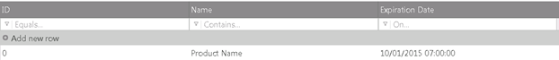
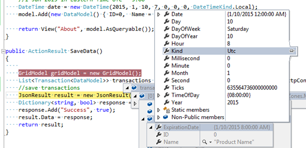

<!--
|metadata|
{
    "fileName": "Using-IgniteUI-controls-in-different-time-zones",
    "controlName": [],
    "tags": []
}
|metadata|
-->

# Ignite UI コントロールを別のタイム ゾーンで使用

##概要
Web アプリケーションのユーザーと web サーバーのタイム ゾーンが異なる場合がよくありますが、クライアントのタイム ゾーンに合わせた日付値を描画することができます。このトピックでは、クライアントのタイム ゾーンに書式設定される日付値を表示し、編集するために `igGrid`、`igDatePicker`、および `igDateEditor` の `enableUTCDates` プロパティをカスタマイズする方法を紹介します。

##クライアント側の日付の構成

有効な場合、`EnableUTCDates` オプションは、クライアント側で日付が UTC 日付として書式設定されます。日付値がサーバーから受信されたとき、日付を表示するための書式設定関数が適用されます。`enableUTCDates` が false に設定される場合、結果は標準の日付オブジェクトメソッド (getFullYear()、getMonth()、getDate()、getHours() など) によって日付値を返します。true に設定される場合、UTC のメソッド (getUTCFullYear()、getUTCMonth()、getUTCDate()、getUTCHours() など) が使用されます。したがって、オプションが有効な場合、サーバーから受信された日付は UTC に変換されます。 
 
特定のコントロールで使用される場合、以下の動作があります。

##igGrid/igHierarchicalGrid
 
enableUTCDates オプションの 2 つのシナリオがあります。

-	日付がクライアントと異なるタイム ゾーンで作成される可能なリモート バックエンドで作成される場合。(この場合、すべてのクライアント マシーンで同じ値を表示するには、`enableUTCDates` オプションを有効にします。)
-	日付がクライアントで作成され (ローカル データ ソース)、ローカル タイム ゾーンで表示する必要がある場合。

igGrid/igHierarchicalGrid は、以下のシナリオでサーバーのタイム ゾーン オフセットを使用して日付を計算します。

-	データ ソースが対応する MVC ラッパーによって処理される (Model で設定される) 場合。
-	 データ ソースがリモートで、`GridDataSourceAction` 属性がリモート メソッドで使用される場合。 
その場合はタイム ゾーン オフセットがメタデータとしてデータ ソースに追加されます。例：

```
"Metadata": {
                "timezoneOffset": 7200000,
                "timezoneOffsets": {
                    "0": {
                        "ExpirationDate": 7200000
                    },
                    "1": {
                        "ExpirationDate": 7200000
                    },
                    ...
                    }

```

日付によって別のタイプ (UTC またはローカル) が設定される可能があるので、各行の日付値のオフセットがメタデータの部分として送信されます。
>**注:** データ ソースがサーバーのタイム ゾーン オフセットについての情報を含む場合、そのオフセットはクライアントで日付の描画時に適用されます。グリッドが MVC ラッパーによってインスタンス化された場合、デフォルトで EnableUTCDates オプションは有効にされます。それ以外の場合、オプションはデフォルトで無効されます。

###詳細例:
以下のシナリオを検討します。

-	ウェブサイトは米国 (東部標準時 UTC - 5:00) でホストされます。そのサイトで日付値の列を持つ igGrid があります。日付値が米国のタイム ゾーンで作成され、書式設定は dd/MM/yyyy HH:mm:ss です。
-	シンガポールからのクライアント (UTC + 8:00) が web サイトを使用しています。
-	EnableUTCDate が有効で、タイム ゾーン オフセットがデータ ソースにあります。

日付がサーバーのローカル時間で作成されます。
```
//10 Jan 2015 7:00 AM in Eastern Time UTC -5:00 
DateTime date = new DateTime(2015, 1, 10, 7, 0, 0, 0, DateTimeKind.Local);  

```
シンガポールでグリッド セルに同じ時間が表示されます。


任意のタイム ゾーンで同じ時間が表示されます。表示される日付はサーバーから送信された同じ日付です。

サーバーのタイム ゾーン オフセットを日付に追加し、日付の UTC 表現になります。 

上の例での計算:

東部標準時の日付「1 Jan 2015」があります。この日付は JSON に解析され、Ticks の書式で送信されます。サーバーの timezoneOffset は - 18000000 ticks (- 5:00 時) です。
 JSON データは:
 
 ```
 {
    "Records": [{
        "ID": 0,
        "Name": "Name0",
        "ExpirationDate": "\/Date(1420866000000)\/"
    }],
    "TotalRecordsCount": 0,
    "Metadata": {
        "timezoneOffset": -18000000,
        "timezoneOffsets": {
            "0": {
                "ExpirationDate": -18000000
            }
        }
    }
}
 ```
クライアントで日付オブジェクトを作成する場合、サーバーのタイム ゾーン オフセットがデータ ソースの元の ticks 値に追加され、新しい日付オブジェクトが作成されます。JavaScript で日付オブジェクトは常にローカル時間で作成されます。EnableUTCDate オプションが有効のため、その値が UTC に書式設定されます。

 ローカル時間に変換されたサーバーから送信された元の日付は「Jan 10 2015 20:00:00」(13 時間の差) です。その値にサーバーのタイム ゾーン オフセット (- 5:00:00) を追加します。結果を UTC (- 8:00:00) に書式設定すると、表示値は「*Jan 10 2015 7:00*」になります。
 
日付を追加/更新する場合、新しい値は UTC で保存されます。たとえば、シンガポールのユーザーが値を「10/01/2015 07:00:00」から「10/01/2015 08:00:00」に変更すると、更新トランザクションで送信される日付値は UTC の値です。送信される値はローカル時間ではなく、UTC の「10/01/2015 08:00:00」になります。
値を変更してサーバーに変更を保存した後、サーバーによって受信された値は UTC の「10/01/2015 08:00:00」です。 



##igDatePicker および igDateEditor

データ バインドされるコントロールではないため、エディターの動作は異なります。サーバーのオフセットを適用しません。MVC ラッパーによって設定される値を直接にクライアントへ渡します。

`EnableUTCDates` が使用される場合、サーバーのタイム ゾーン オフセットに関係なしで値を UTC に変換します。エディターがデータ バインドされたコントロールではないため、igGrid のように適用された値にデータ変換を適用しません。

以下のシナリオを検討します。

-	データが UTC + 2:00 のバックエンドから来ます。
-	クライアントは UTC - 5:00 です。 
-	`EnableUTCDate` が有効されます。 

値がモデルによって設定されます。

```
@Html.Infragistics().DatePickerFor(m => m.ExpirationDate).EnableUTCDates(true)...
```
「11:00」の日付がクライアントに設定される場合、生成された JavaScript によってコントロールの値は直接 11:00 に設定されます。

```
value: new Date(x, x, x, 11, x, x, x );
```
新しい日付がクライアントで作成される場合、常にローカル時間で作成されます。ただし、enableUTCDates が true に設定される場合、その日付は UTC に変換されます。結果は 11:00 + 5:00 (クライアントのタイム ゾーン オフセット) = 16:00。

値の一貫性を確保するには、サーバーのタイム ゾーン オフセットが適用されないため、サーバーから送信される日付は常に UTC に設定する必要があります。クライアントからサーバーに値を投稿する場合、UTC の日付を受信し、サーバーのローカル時間に変換できます。
