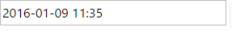

<!--
|metadata|
{
    "fileName": "Using-IgniteUI-controls-in-different-time-zones",
    "controlName": [],
    "tags": []
}
|metadata|
-->

# %%ProductName%% コントロールを別のタイム ゾーンで使用

## 概要
Users of a web application are often in a different time zone than the web server and in some circumstances you may want to render the server-based date values adjusted to the client's time zone or with specific time offset. It also important to properly format dates while transferring them between server and client. In this topic you learn to customize properties of the `igGrid`, `igDatePicker` and `igDateEditor` to control the display and edit of date values for clients  in different time zones.

## クライアント側の日付の構成

`igGrid` で有効な場合、`EnableUTCDates` オプションは、クライアント側で日付が UTC 日付として書式設定されます。日付値がサーバーから受信されたとき、日付を表示するための書式設定関数が適用されます。`enableUTCDates` が false に設定される場合、結果は標準の日付オブジェクトメソッド (getFullYear()、getMonth()、getDate()、getHours() など) によって日付値を返します。true に設定される場合、UTC のメソッド (getUTCFullYear()、getUTCMonth()、getUTCDate()、getUTCHours() など) が使用されます。したがって、オプションが有効な場合、サーバーから受信された日付は UTC に変換されます。 
 
The `igDateEditor` and `igDatePicker` rely primarily on `displayTimeOffset` to format dates on the client while `enableUTCDates` affects the serialization format for stand-alone editors.

##　igGrid/igHierarchicalGrid
 
enableUTCDates オプションの 2 つのシナリオがあります。

-	日付がクライアントと異なるタイム ゾーンで作成される可能なリモート バックエンドで作成される場合。(この場合、すべてのクライアント マシーンで同じ値を表示するには、[`enableUTCDates`](%%jQueryApiUrl%%/ui.igdateeditor#options:enableUTCDates) オプションを有効にします。)
-	日付がクライアントで作成され (ローカル データ ソース)、ローカル タイム ゾーンで表示する必要がある場合。

igGrid/igHierarchicalGrid は、以下のシナリオでサーバーのタイム ゾーン オフセットを使用して日付を計算します。

-	データ ソースが対応する MVC ラッパーによって処理される (Model で設定される) 場合。
-	データ ソースがリモートで、`GridDataSourceAction` 属性がリモート メソッドで使用される場合。 
その場合はタイム ゾーン オフセットがメタデータとしてデータ ソースに追加されます。例：

```js
"Metadata": {
                "timezoneOffset": 7200000,
                "timezoneOffsets": {
                    "0": {
                        "ExpirationDate": 7200000
                    },
                    "1": {
                        "ExpirationDate": 7200000
                    },
                    ...
                    }

```

日付によって別のタイプ (UTC またはローカル) が設定される可能があるので、各行の日付値のオフセットがメタデータの部分として送信されます。
>**注:** データ ソースがサーバーのタイム ゾーン オフセットについての情報を含む場合、そのオフセットはクライアントで日付の描画時に適用されます。グリッドが MVC ラッパーによってインスタンス化された場合、デフォルトで EnableUTCDates オプションは有効にされます。それ以外の場合、オプションはデフォルトで無効されます。

### 詳細例:
以下のシナリオを検討します。

-	ウェブサイトは米国 (東部標準時 UTC - 5:00) でホストされます。そのサイトで日付値の列を持つ igGrid があります。日付値が米国のタイム ゾーンで作成され、書式設定は dd/MM/yyyy HH:mm:ss です。
-	シンガポールからのクライアント (UTC + 8:00) が web サイトを使用しています。
-	EnableUTCDate が有効で、タイム ゾーン オフセットがデータ ソースにあります。

日付がサーバーのローカル時間で作成されます。
```csharp
//10 Jan 2015 7:00 AM in Eastern Time UTC -5:00 
DateTime date = new DateTime(2015, 1, 10, 7, 0, 0, 0, DateTimeKind.Local);  

```
シンガポールでグリッド セルに同じ時間が表示されます。


任意のタイム ゾーンで同じ時間が表示されます。表示される日付はサーバーから送信された同じ日付です。

サーバーのタイム ゾーン オフセットを日付に追加し、日付の UTC 表現になります。 

上の例での計算:

東部標準時の日付「1 Jan 2015」があります。この日付は JSON に解析され、Ticks の書式で送信されます。サーバーの timezoneOffset は - 18000000 ticks (- 5:00 時) です。
 JSON データは:
 
 ```js
 {
    "Records": [{
        "ID": 0,
        "Name": "Name0",
        "ExpirationDate": "\/Date(1420866000000)\/"
    }],
    "TotalRecordsCount": 0,
    "Metadata": {
        "timezoneOffset": -18000000,
        "timezoneOffsets": {
            "0": {
                "ExpirationDate": -18000000
            }
        }
    }
}
 ```
クライアントで日付オブジェクトを作成する場合、サーバーのタイム ゾーン オフセットがデータ ソースの元の ticks 値に追加され、新しい日付オブジェクトが作成されます。JavaScript で日付オブジェクトは常にローカル時間で作成されます。EnableUTCDate オプションが有効のため、その値が UTC に書式設定されます。

 ローカル時間に変換されたサーバーから送信された元の日付は「Jan 10 2015 20:00:00」(13 時間の差) です。その値にサーバーのタイム ゾーン オフセット (- 5:00:00) を追加します。結果を UTC (- 8:00:00) に書式設定すると、表示値は「*Jan 10 2015 7:00*」になります。
 
日付を追加/更新する場合、新しい値は UTC で保存されます。たとえば、シンガポールのユーザーが値を「10/01/2015 07:00:00」から「10/01/2015 08:00:00」に変更すると、更新トランザクションで送信される日付値は UTC の値です。送信される値はローカル時間ではなく、UTC の「10/01/2015 08:00:00」になります。
値を変更してサーバーに変更を保存した後、サーバーによって受信された値は UTC の「10/01/2015 08:00:00」です。 


## igDatePicker および igDateEditor

The `igDateEditor` and `igDatePicker` offer several options to properly handle dates in the different time zones. The properties below describe how both editors show dates and how they serialize them, in order to be transferred correctly.
-	[`displayTimeOffset`](%%jQueryApiUrl%%/ui.igdateeditor#options:displayTimeOffset) - Gets/sets time zone offset from UTC, in minutes. The client date values are displayed with this offset instead of the local one, which are automatically transformed by the client browser. If you want to display UTC dates, then the value needs to be set to 0.
-	[`enableUTCDates`](%%jQueryApiUrl%%/ui.igdateeditor#options:enableUTCDates) -  Enables/Disables serializing client date as UTC ISO 8061 string instead of using the local time and zone values. The option is only applied in "date" [`dataMode`](%%jQueryApiUrl%%/ui.igdateeditor#options:dataMode).

For example 10:00 AM from a client with local offset of 5 hours ahead of GMT will be serialized as: "2016-11-11T10:00:00+05:00" with the option default 'false' value. If set to "true" the date will use the ISO UTC format: "2016-11-11T05:00:00Z".

> **Note:** The functionality of the `enableUTCDates` has changed since 17.1.
> 
> For more information of how you can migrate editors, configured with enableUTCDates option, from 16.2 to 17.1 follow the [Migrate enableUTCDates option in 17.1](Migrating-enableUTCDates-option-in-17-1.html) document.

Client `igDateEditor`/`igDatePicker` widgets can serialize the date either in UTC format or containing local time and offset based on the `enableUTCDates` option. Both values refer to the same point in time, however one also carries additional information for the client and depending on the server platform it can make a difference when parsing submitted values. For example in .NET [`DateTimeOffset`](https://msdn.microsoft.com/en-us/library/system.datetimeoffset(v=vs.110).aspx) allows handling the client offset separately.

Since the JavaScript `Date` always converts the initial value to local time discarding any time zone offset in the process, it is always recommended to set UTC standard values for the `igDateEditor` and `igDatePicker`, especially when [`displayTimeOffset`](%%jQueryApiUrl%%/ui.igdateeditor#options:displayTimeOffset) option is defined, otherwise values with specific or ambiguous time zone could map to unpredictable times depending on the user agent local zone. 

If the ASP.NET MVC wrapper of the date editor and date picker is used, then it sends the date serialized only using the UTC format. In addition to the UTC serialized date, set as a value to the client widget, the MVC wrapper also sets the [`displayTimeOffset`](%%jQueryApiUrl%%/ui.igdateeditor#options:displayTimeOffset) option by default. This is true even if no value is provided as the offset is extracted form the server local time. If the value provided has an offset (of `DateTimeOffset` type) or the `DisplayTimeOffset` is set as MVC wrapper option, then that value is sent to the client instead.

The following examples will demonstrate how MVC wrapper and client widget works, when [`displayTimeOffset`](%%jQueryApiUrl%%/ui.igdateeditor#options:displayTimeOffset) and [`enableUTCDates`](%%jQueryApiUrl%%/ui.igdateeditor#options:enableUTCDates) options are used.

### Default Behavior

Let's define in MVC a date editor, with the following configuration and set the value in the server in "Central Europe Standard Time", which is GMT+01:00. Let's assume the client browser is in the "FLE Standard Time", which is GMT+02:00. The same result will be valid for the date picker.

```csharp
@(Html.Infragistics()
	.DateEditor()
	.Value(new DateTime(2016, 1, 9, 10, 55, 55))
	.ID("StartHour")
	.EnableUTCDates(true)
	.DateInputFormat("dd/MM/yyyy HH:mm")
	.DateDisplayFormat("yyyy-MM-dd HH:mm")
	.PlaceHolder("Select start hour")
	.Width(280)
	.Render())
```

In that case the hour is 10 AM, and because the time zone is GMT+01:00, then the MVC wrapper will transform that value to UTC, in the following format: 2016-01-09T09:35:55.0000000Z. In addition it will add displayTimeOffset of 60 minutes. This is what will be rendered by the wrapper in the response:

```js
$('#StartHour').igDateEditor({
	value: '2016-01-09T09:35:55.0000000Z',
	displayTimeOffset: 60,
	enableUTCDates: true,
	dateInputFormat: 'dd/MM/yyyy HH:mm',
	dateDisplayFormat: 'yyyy-MM-dd HH:mm',
	placeHolder: 'Select start hour',
	width: '280' });
```

The above configuration will render the following value in the editor:


### Ignoring server offset and displaying the specific client one

From the example above, it can be seen that when we define a server hour in the editor MVC wrapper, in the client we will always see that server hour, ignoring the client time zone offset. This is the default behavior, if we want each of the clients to display the time in their time zones, then we need to set the [`displayTimeOffset`](%%jQueryApiUrl%%/ui.igdateeditor#options:displayTimeOffset) wrapper option to `null`. Using the previous example and setting the option, on the client the `displayTimeOffset` option will be ignored and the time will show according the specific time zone:

```csharp
@(Html.Infragistics()
	.DateEditor()
	.Value(new DateTime(2016, 1, 9, 10, 55, 55))
	.ID("StartHour")
	.EnableUTCDates(true)
	.DisplayTimeOffset(null)
	.DateInputFormat("dd/MM/yyyy HH:mm")
	.DateDisplayFormat("yyyy-MM-dd HH:mm")
	.PlaceHolder("Select start hour")
	.Width(280)
	.Render())
```

```js
$('#StartHour').igDateEditor({
	value: '2016-01-09T09:35:55.0000000Z',
	displayTimeOffset: null,
	enableUTCDates: true,
	dateInputFormat: 'dd/MM/yyyy HH:mm',
	dateDisplayFormat: 'yyyy-MM-dd HH:mm',
	placeHolder: 'Select start hour',
	width: '280' });
```

The above configuration will render the following value in the editor, if our time is "FLE Standard Time", which is GMT+02:00:



### Configuring EnableUTCDates option

As mentioned earlier setting the `EnableUTCDates` in the wrapper only affects the way the client-widget serializes the date. When enabled like the previous example, the value the editor would submit will be '2016-01-09T09:35:55.000Z', which is the same the MVC wrapper has sent to the client. This allows for a standardized communication between client and server.

If we decide to change the MVC wrapper setting:

```csharp
@(Html.Infragistics()
	.DateEditor()
	.Value(new DateTime(2016, 1, 9, 10, 55, 55))
	.ID("StartHour")
	.EnableUTCDates(false)
	.DisplayTimeOffset(null)
	.DateInputFormat("dd/MM/yyyy HH:mm")
	.DateDisplayFormat("yyyy-MM-dd HH:mm")
	.PlaceHolder("Select start hour")
	.Width(280)
	.Render())
```

Then the submitted value will be formatted as local time and offset. And because our client is GMT+02:00, then the result will be: '2016-01-09T11:35:55+02:00'.

### Configuring DisplayTimeOffset option

If we decide to display a date in "Russian Standard Time", GMT+03:00, then what we need is to define the appropriate offset from UTC time, in minutes:

```js
@(Html.Infragistics()
	.DateEditor()
	.Value(new DateTime(2016, 1, 9, 10, 55, 55))
	.ID("StartHour")
	.EnableUTCDates(true)
	.DisplayTimeOffset(180)
	.DateInputFormat("dd/MM/yyyy HH:mm")
	.DateDisplayFormat("yyyy-MM-dd HH:mm")
	.PlaceHolder("Select start hour")
	.Width(280)
	.Render())
```

The MVC wrapper will render the following `igDateEditor` widget configuration:

```js
$('#StartHour').igDateEditor({
	value: '2016-01-09T09:35:55.0000000Z',
	displayTimeOffset: 180,
	enableUTCDates: true,
	dateInputFormat: 'dd/MM/yyyy HH:mm',
	dateDisplayFormat: 'yyyy-MM-dd HH:mm',
	placeHolder: 'Select start hour',
	width: '280' });
```

The result on the browser will be:


> **Note:** Keep in mind that the `displayTimeOffset` is a static value that can't account for Daylight Saving. For that reason, if targeting a specific zone rather than just offset, the back end logic should check if the target date falls under DST to provide the correct offset value for the specific date. With .NET the `DisplayTimeOffset` type can be used and can also be handled automatically by the MVC editor wrappers.
